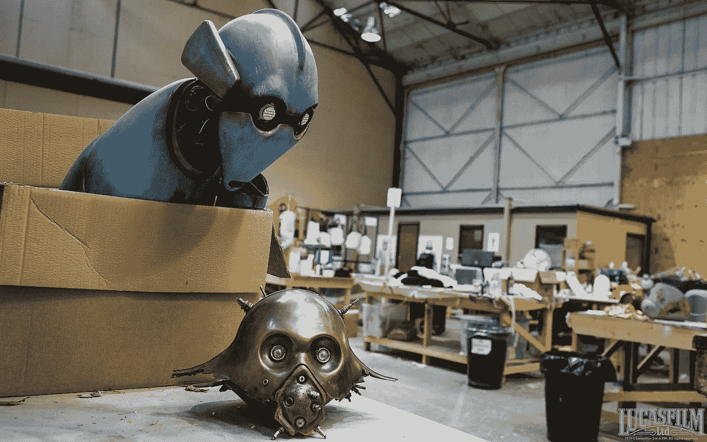

# 我从 2017 年创建聊天机器人中学到了什么

> 原文：<https://medium.com/swlh/what-i-learnt-from-building-a-chatbot-in-2017-28c0f8a11469>

Image: John Willson, [johnstills.com](https://johnstills.com/star-wars-the-force-awakens/)

令人惊讶，出乎意料，令人困惑——这是我建造聊天机器人的一年。是的，除了[搬到硅谷](/@piotrbakker/a-thousand-small-steps-dc10685b4ee)之外，制作[问候机器人](https://slack.com/apps/A2LJCT3GR-greetbot)对我来说是 2017 年迄今为止最新奇的部分。我学到了很多:从代码测试的本质到设计对话树。我有生以来第一次经历了[病毒式传播](https://chatbotslife.com/how-our-slack-chatbot-came-back-from-the-dead-510d12baa669)。我想分享一些意想不到的，尽管事后看来完全显而易见的，我学到的关于建立聊天机器人的事情。

## 1.自然病毒

第一批 100 个团队与绝对零度营销签约。我花了一段时间才明白这一点，但现在原因很明显了:聊天机器人天生就是病毒。毕竟，他们就在那里，和其他人一起参与对话。这创造了与人类的持续接触，而人类又将他们遇到的聊天机器人带到与他们的朋友和同事的新对话中。它有助于机器人在其社交网络中自我复制，而无需为其制造者付出太多额外的努力。

## **2。对话会变得混乱**

我们的机器人只有两个特征，但是对话树很快变得难以理解。起初看起来合理的小变化会导致不断增加的分支。不用说，添加更多的功能会给设计、开发和最终使用我们的机器人带来一场噩梦。因此，在首次发布 6 个月后，我们决定重新开始。我很高兴我们做到了。尽管新功能的开发暂停了几个月，但我们现在的进展比以往任何时候都快。

## 3.测试需要时间

我一开始也没把测试当回事。“这只是聊天”，我想，“能有什么错呢？”。我很快发现——很多。即使您将对话分支的数量保持在最低限度，它们可能发生的不同条件的绝对数量也会导致测试场景数量的膨胀。当你达到一定规模时，最初看起来微不足道的情况开始变成重要的数字。测试测试测试。

## 4.头像设计很重要

机器人头像不仅仅是应用程序图标。他们是你产品的代言人。我们认为我们已经在最初的设计中解决了这个问题，它表现出了友好、平易近人的性格。但是这个图标太详细了，作为一个小小的 32x32px 像素的聊天头像不够清晰。因为这是用户最常遇到的时候，所以我们不得不进行修正。在飞行途中，我们完全重启了这个图标，从那以后再也没有回头看。

## 5.并非所有聊天都是移动的

知道大量的聊天活动发生在智能手机上，我们预计移动流量将主导谷歌分析。事实上，事实正好相反:我们网站 80%的访问量来自桌面。事后看来，这是有道理的——当人们在办公桌前工作时，他们会在空闲时使用 GreetBot。我们必须“抛弃”移动优先的教条，将桌面功能和网站放在首位(至少目前是这样)。

## 惊喜

现在看来，这一切都是不可避免的:固有的病毒式传播、随意对话设计的危险、测试的需要、机器人化身的重要性以及桌面流量的主导地位(以防 Slack)。但就像科技领域的其他事物一样，这一切不过是一个不断变化的行业的快照。在接下来的 12 个月里，这个行业必将发生更大的变化。所以我很期待 2018 年有更多的 chatbot 惊喜。毕竟，这是乐趣的一部分。

## 这篇文章发表在[《创业](https://medium.com/swlh)》上，这是 Medium 最大的创业刊物，有 286，184+人关注。

## 订阅接收[我们的头条新闻](http://growthsupply.com/the-startup-newsletter/)。

