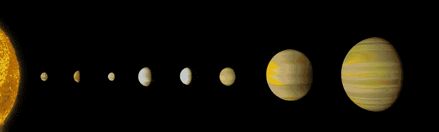
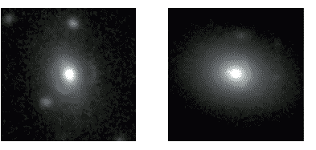

# 如果人工智能发现了新的行星会怎样

> 原文：<https://medium.com/swlh/what-if-ai-discovers-new-planets-b0295bd57987>

The Milky Way

2017 年 12 月 14 日，美国宇航局召开会议，宣布其[开普勒](https://www.nasa.gov/mission_pages/kepler/overview/index.html)太空望远镜的最新发现。后者旨在寻找类似地球的行星。它于 2009 年 3 月 9 日发射，从那以后，它已经获得了大量的数据，被认为是一项统计任务。这些测量需要自动过程进行调整，并与天体物理学家实际认为的“类地行星”进行比较。

Google Brain 的软件工程师 Christopher J. Shallue 和德克萨斯大学天文系的物理学家 Andrew Vanderburg 使用一类机器学习算法和深度学习来区分行星的开普勒信号和假阳性信号。首先，他们用来自已知天体的数据训练深度神经网络，然后他们让它在剩余的原始数据上工作，找到了两个新的行星，它们被他们的模型以很高的可信度识别出来。

Artistic representation of the system of the new planets. Credits: NASA, Wendy Stenzel

*机器学习*可以识别确定的情况，但首先需要指导，并且在运行时不会进化。另一方面，*深度学习*是一种可以在分析数据的同时学习特征的模型。它从有限的一组例子中提取一般特征，然后用它们来解释其他情况。由于这个原因，当有大量原始数据需要处理时，深度学习特别有用，超过了科学家实际可以研究的范围。

这并不是计算机科学第一次帮助新发现:格罗宁根大学的物理学家 Carlo Enrico Petrillo 和他的团队在皇家天文学会月刊上发表了他们关于使用神经网络识别 56 个新引力透镜的工作。

Two gravitational lenses discovered. Credits: Carlo Enrico Petrillo / University of Groningen

毫无疑问，一种新的研究方式展示出来了:计算机正以前所未有的方式进入分析过程，帮助科学家处理他们原本根本无法处理的大量数据。

## 这篇文章发表在 [The Startup](https://medium.com/swlh) 上，这是 Medium 最大的创业刊物，拥有 275，365+人关注。

## 在此订阅接收[我们的头条新闻](http://growthsupply.com/the-startup-newsletter/)。

