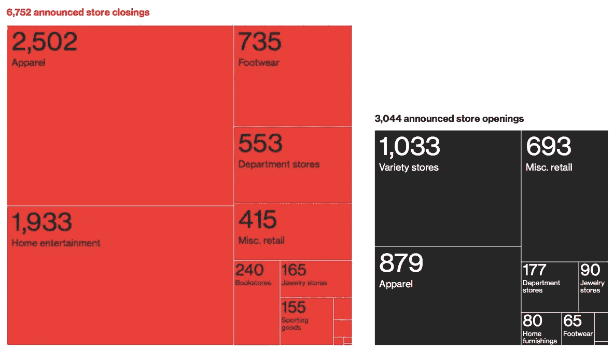
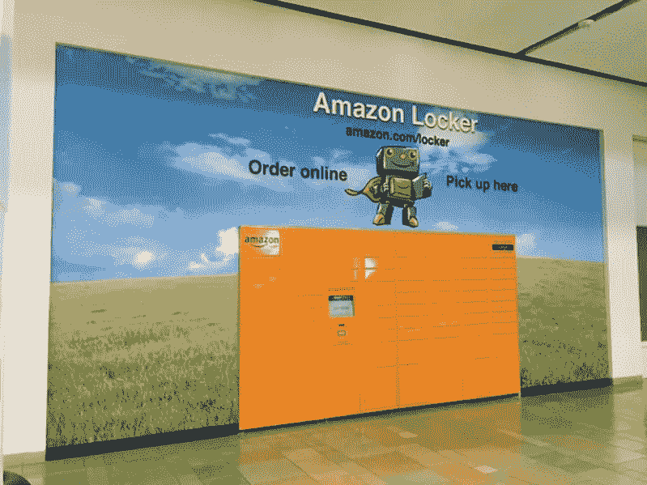
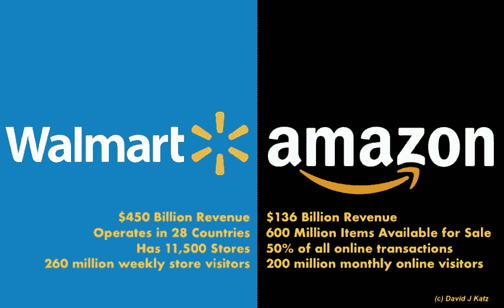

# 如果亚马逊是零售业的唯一希望呢？

> 原文：<https://medium.com/swlh/what-if-amazon-is-retails-only-hope-c3004c9d19f5>

## 如果亚马逊不是实体商店杀手呢？如果亚马逊是零售业的冠军呢？

Image © Lucas Films / Disney

《零售启示录》这个术语在维基百科中有自己的词条。这种“圣经式”的转变经常被归咎于亚马逊。

套用马克·吐温的话，关于零售之死的报道被大大夸大了。零售业并没有处于可怕的境地，而是处于一种不同的状态。改变是必不可少的:这不容易，也不会没有痛苦。

而且，相关性和因果性之间有一个重要的区别。亚马逊的成功和传统零售市场的颠覆肯定是相关的，这并不意味着一个导致了另一个。亚马逊没有颠覆传统零售模式:宏观经济推动了这种颠覆。

亚马逊正在对实体零售进行战略性的重大投资。此外，该公司向第三方零售商提供有价值的工具，帮助他们取得成功。而且，亚马逊*需要其他零售商繁荣发展，这对其自身的成功至关重要。*

# 当前零售业转型不可避免的 6 个原因

1.我们有太多的商店，太多的大众媒体，太多的商品化产品通过高效的全球供应链输送。

2.诱人且容易获得的资本导致了商店、品牌、供应链和广告的过度扩张，以及巨额的债务偿还。这种债务和扩张迫使零售员工和商店改善方面的成本节约削减。店内体验差的公式。

3.在 2008 年的“大衰退”期间，美国消费者加速了从百货商店向折扣零售商的转移。这些消费者发现这个渠道是一个“可接受的”选择。

4.将大规模的“快速时尚”加入到这个等式中，这个压倒性的价值链导致了商品的过度供应。产品供应过剩加上平庸的店内体验是价格压缩的一个公式。其结果是大幅折扣、低价商店和折扣店的激增，以及网站在“竞相杀价”

5.消费者厌倦了这种过剩的“堆积如山”的产品。他们辛辛苦苦挣来的钱流向了与他们独特兴趣更相关的东西。这些不满意的消费者选择“个性化的体验”而不是“标准化的东西”。这种向体验的转移进一步侵蚀了对“东西”的需求，从而加速了零售商和品牌的瓦解。

6.大众品牌、大众生产、大众零售商和大众广告服务于大众市场。广告、零售和供应这些行业是高度相互依赖的。他们一起面对今天的颠覆，这些行业一起努力寻找新的模式和新的相关性。

这些因素不可避免地导致大规模失败。而且，这一切都不是亚马逊造成的。

# 互联网催化了一个“供需”拐点:

当数十亿人通过谷歌搜索，并在脸书上分享他们的兴趣和爱好时，他们创造了大量独特的社区。这些社区是容易进入的利基市场，具有独特的属性、态度和期望。

在这种环境下，“需求”，而不是“供应”，是控制；商业宏观经济模式的彻底改变。

在新的模式中，控制用户访问的公司通过客户忠诚度和无价的数据来控制需求。(无论如何，你都无法从谷歌、脸书或亚马逊买到客户数据。)这些门户公司现在是世界上最有价值的公司。零售商、品牌商、制造商和广告商排队付钱来接触这些顾客。(苹果是独一无二的供应商；证明规则的例外。)

# 亚马逊认识到并利用了 4 个重要趋势:

1.宏观经济和人口趋势

2.客户购买途径的变化

3.新兴技术、数据分析、个性化、人工智能和机器人

4.客户对更多品种、更高价值、更快交货和更少摩擦的持续需求

通过向消费者提供 6 亿种产品选择、最相关的推荐、无痛的支付方式、近乎即时的交付和毫不费力的无疑问退货，亚马逊已经成为世界上领先的消费者需求守门人之一。

随时随地为顾客提供物超所值的个性化商品组合，并提供顺畅的购物体验，这并不新鲜。新的是零售商有能力以惊人的速度大规模提供这些好处。这个以消费者为中心的教训在网上和实体店都是无价的。

# 零售业正在经历“达尔文效应”。

只有那些最适合在新环境中生存的公司才能成功。

*Source: ICSC Research Team and PNC Real Estate Research*

随着消费者的购买途径演变为全渠道、实体、数字和虚拟市场，商店关闭不一定是痛苦的迹象，而是变化的迹象。

这个进化过程不是学术性的。颠覆影响生活，不仅仅是商业模式。2017 年关闭了 6800 家商店，新开了 3000 家商店，失去了 30 多万个零售工作岗位。2018 年，亚马逊预计将雇用超过 50 万名工人，大多数在配送中心，一些在人工智能、运输、数据科学、人力资源、物流和其他职能部门。此外，第三方正在创造新的就业机会，为亚马逊及其合作伙伴和分支机构提供产品和服务。

# 实体零售店成为亚马逊满足客户需求战略的重要组成部分的 7 个原因:

**1。亚马逊 Go**

这是一笔不小的投资，“Amazon Go”是一种不需要结账的新型商店。世界上最先进的购物技术，让你永远不用排队。使用 Amazon Go 应用程序进入商店，拿走你想要的产品，然后出发！不用排队，不用结账。(不，说真的。)"

这种**免结账的购物体验是由自动驾驶汽车中使用的相同类型的技术实现的:计算机视觉、传感器融合和深度学习。**

**预计这一举措不仅会推广到亚马逊所有和经营的商店，还会推广到其他寻求满足客户对无摩擦商务需求的零售商。**

****2。亚马逊书店****

> **“亚马逊致力于与顾客建立持久的、甚至是终身的联系，也许书籍在某种程度上是一个诱饵。你可以进来与品牌互动，让他们下次更有可能做这种事情。”——[纽约杂志](http://nymag.com/selectall/2017/06/why-is-amazon-building-bookstores.html)**

****3。超过 2000 个地点的亚马逊储物柜，** *包括 100 个大型购物中心内的储物柜……***

****亚马逊储物柜是什么？**亚马逊储物柜是安全的自助服务亭，顾客可以在方便的时间和地点领取 Amazon.com 包裹。**

****

****4。美国柯尔百货公司百货公司内的亚马逊商店****

**据美国柯尔百货公司首席执行官米歇尔·盖斯称，**

> **“我们正在经历零售业最具变革性的时代之一，我们必须真正以不同的方式思考，”Gass 说。“零售市场很大，因此亚马逊和美国柯尔百货公司有足够的空间共存。”**

**美国柯尔百货公司不是唯一得出这一结论的零售商。西尔斯最近表示，它将在亚马逊上销售肯莫尔电器，而百思买也在其商店中为亚马逊产品提供空间。**

**[《财富》杂志](http://fortune.com/2017/10/18/kohls-amazon-2/):“为什么美国柯尔百货公司下一任首席执行官不害怕将亚马逊带入其商店”**

****5。亚马逊支付 137 亿美元收购全食超市****

**根据哈曼·西蒙在《哈佛商业评论》上的文章，**

> **亚马逊“购买了一个由 456 个用户友好型测试设施组成的网络，每周接待大约 800 万名“志愿者”。亚马逊在网络世界无情的价格测试奠定了它的竞争优势。其无与伦比的知识基础使其能够将价格作为沟通工具、招募工具、心理武器和价值驱动力，超越基本的供求和盈亏机制。现在，亚马逊可以用关于线下零售世界的直接、专有见解来补充这种知识。”**

**亚马逊现在将在实体世界中研究什么——它学到什么以及它如何应用这些见解——可以进一步改变消费者零售。**

**6。亚马逊市场**

**亚马逊市场是数字时代的本地购物中心，使新时代的专业零售商成为在线超级明星。**

****

**下次你在亚马逊上购买产品时，注意“出售者”框。通常它会声明，“由[X]出售，由亚马逊履行。”其中[X]是第三方供应商，即亚马逊以外的零售商，利用亚马逊生态系统接触亚马逊的消费者，利用亚马逊的营销、支付和物流系统，收取一系列相关费用。**

**这不仅仅是“如果你不能打败他们，就加入他们。”**

**亚马逊是零售商的孵化器和弹射器:测试环境、发射台和目的地。**

**2017 年，亚马逊市场使超过 200 万卖家成为在线零售商。Marketplace 向数亿亚马逊消费者提供服务，并向 8，000 个城市和城镇提供当天送达服务。通过 Marketplace，亚马逊允许这些第三方零售商提供一流的在线体验，销售超过 20 亿件产品，并产生数十亿美元的零售收入。**

**Marketplace 不是利他主义的行为，它增加了亚马逊的市场份额和客户忠诚度。通过 Marketplace，亚马逊获得了产品和消费者数据，这些数据将被用于公司的优势。此外，上市、推荐、履行和营销费用是供应商的一项成本，也是亚马逊的一项重要收入来源。**

> **“虽然这肯定有利于亚马逊，但也有利于小型零售商和他们雇用的工人。事实上，电子商务可能会让一些零售商在挣扎中的社区保持开放，否则他们无法支持他们。”— *杰弗里·曼宁&詹妮弗·麦克林* [*《连线》杂志*](https://www.wired.com/2017/03/sorry-amazon-isnt-actually-annihilating-retail-jobs/)**

****7。亚马逊*需要*其他成功的零售商****

**亚马逊是购买目的地，不是购物目的地。亚马逊的繁荣来自搜索，而不是发现。**

**在可预见的未来，亚马逊将努力推出新的生活方式品牌或新产品。(尽管有自有品牌、Echo 和其他亚马逊设备，“手工制作”和“Launchpad”。)**

**亚马逊依赖于一个强大而多样的外部零售市场，消费者在这里发现新产品，找到适合的、时尚的和喜欢的……然后，如果有的话，在亚马逊上购买。**

# **总而言之:**

**亚马逊没有创造今天的商品“供应过剩”和由此导致的价格压缩。他们没有发明互联网或电子商务。亚马逊不是第一个在网上卖书的，他们也没有向世界介绍数字图书下载。传统零售模式的崩溃不是亚马逊的错。以前的模式并不是新世界秩序中的“适者生存”。**

**亚马逊是零售业发展的一部分。公司让顾客满意和高兴，这是所有成功零售商的目标。亚马逊拥有数百家实体零售店，它创造了零售销售工具、目的地商店和储物柜、强大的第三方市场和响亮的行动号召。你也可以成为这种进化的一部分。**

**作为一家“盈利”公司，亚马逊的目标是增加市场份额和赚钱。他们没有创建这个强大的零售价值链来纯粹让第三方受益。他们是一个激烈的竞争对手。**

**无论你是传统零售商、全球品牌、新兴供应商、初创企业，还是从事零售业，你都必须适应不断变化的商业格局。一只眼睛盯着你的客户，另一只眼睛盯着亚马逊:两者都不会静止不动，你也不能。**

****然后，还有沃尔玛** …在不同的熔炉中锻造，沃尔玛在共享的生态系统中与亚马逊竞争有限的资源。**

****

**© David J Katz**

**食物链的顶端是一个充满挑战的地方。没有人会永远呆在那里。**

> ***“幸存下来的不是最强壮的物种，也不是最聪明的物种。是最能适应变化的一种。”—查尔斯·达尔文***

***2018 年，大卫·卡茨—纽约市***

**David J. Katz 是行业领先的跨国消费品公司 Randa Accessories 的首席营销官，也是世界上最大的男士配饰公司。**

**他的专长是与零售商、品牌和供应商合作，在不断发展的市场中创新并取得成功。**

**大卫被 *LinkedIn* 选为 2017 年“[顶级声音。](https://www.linkedin.com/pulse/linkedin-top-voices-2017-must-know-people-inspiring-todays-roth)“他被*女装日报*评为[引领时尚产业](https://www.google.com/url?sa=i&rct=j&q=&esrc=s&source=images&cd=&ved=0ahUKEwjO-M2y7ITYAhUHKiYKHcheAlkQjRwIBw&url=http%3A%2F%2Fwwd.com%2Fwwd-publications%2Fdigital-daily%2Fmondays-digital-daily-april-3-2017%2F&psig=AOvVaw1UUxt9X_VP2djw_y76zFzB&ust=1513180933315355)，被*先生杂志评为[男装推动者](http://www.mr-mag.com/menswear-movers-of-2016/)。***

**他是一名公共演说家，也是畅销书《设计应对:有效的创意直接营销》的合著者。他被《纽约时报》、《华尔街日报》、《纽约杂志》、《赫芬顿邮报》、《先生杂志》、《WWD》。**

**大卫毕业于塔夫茨大学和 T2 哈佛商学院。**

**他是神经科学、消费者行为和“刺激与反应”的学生巴甫洛夫这个名字听起来很耳熟。**

**— — — — — — — — — — — -**

****

## **这篇文章发表在[《创业](https://medium.com/swlh)》上，这是 Medium 最大的创业刊物，有 295，232+人关注。**

## **在这里订阅接收[我们的头条新闻](http://growthsupply.com/the-startup-newsletter/)。**

****