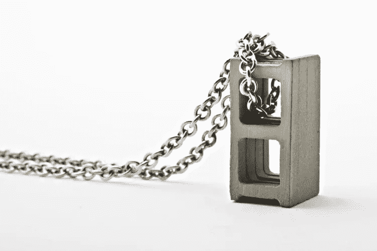

# 如果一切都在区块链运行会怎样？

> 原文：<https://medium.com/swlh/what-if-everything-was-run-on-blockchain-7bfd0405c148>

This is exactly how blockchain works

当我思考像区块链这样具有革命性的东西时，我总是会把这个想法在我的大脑中尽可能地运行。

这也是我对这个问题产生疑惑的原因。区块链在许多不同的行业都有潜在的应用，但是如果 T2 的一切都在区块链运行会怎么样呢？

简而言之，这将是一场灾难。

区块链在我眼里对于大部分金融功能来说是完美的。银行和投资将受益于改进的验证和安全模式。

任何信誉比速度更重要的环境都可以使用区块链。它的安全性是前所未有的，但是随着人们进行越来越多的交易，网络不可避免地会变慢。

我还认为，用一个区块链来管理我们和即将到来的无人驾驶车队之间的所有交易，将会非常有用。

想象一下区块链的杂货店。

除非有一个提前订购你的杂货的系统，或者你的智能冰箱自动跟踪并订购你需要多少食物，否则这将是可怕的。

如果人们只是去商店买牛奶和鸡蛋，你不能让他们等 78 分钟来处理他们的交易。

想象一下和区块链一起报名参加大学课程。

你必须在每次注册的时候输入你的私人密码，很可能每次上课的时候都要输入。

分散的自我监管注册系统也会让寻求帮助成为一场噩梦。在我们现有的系统中，很多学生很难得到足够的指导。

一切都是区块链的社会含义也有些令人恐惧。

有一个名为 Civic 的区块链项目，它希望将自己确立为个人验证的新标准。

如果我们进入一个只能信任通过区块链跟踪和验证的人的社会，那么我们的关系质量将会下降。

人们已经开始使用社交网络跟踪他人，并关注彼此的生活。个人验证区块链将不得不管理你的每一次社交活动。这将使下一级跟踪成为可能。

一些人看到了区块链在社交媒体广告方面的有用应用，但用它来规范用户对用户的社交互动并不好。

如果社交区块链必须管理脸书规模的社交交易，现在困扰比特币交易的缓慢也可能会搞乱我们的社交网络。

区块链可以帮助很多行业，但不是每一个行业。

最近每个人都在谈论区块链、比特币和加密货币的原因是因为赚钱潜力已经飙升。

特别是比特币，由于其剧烈的波动性，最近一直充斥着新闻。这一天，它是继黄金之后最有价值的东西，第二天，每家甚至在谷歌上搜索过区块链的公司都发现其股票下跌。

对于任何新型大宗商品而言，这都是典型的繁荣-萧条行为。互联网发生了这种情况，铁路发生了这种情况，现在区块链也发生了这种情况。不过，事情通常会在一段时间后平静下来。

随着越来越多的人涌入公司赚钱，不同的公司需要彼此区分。一种方法是将你的区块链作为不同行业的一场革命来营销。

到目前为止，我已经看到有人在营销密码来解决社交媒体、物联网、社交媒体、新闻、执法和许多其他领域的问题。他们中的一些人有超过 60 页长的白皮书，而一份白皮书是在媒体上 3 分钟阅读的。

很难判断一种加密技术是否会发展壮大，但一家公司白皮书的质量是我关注的重要因素之一。三分钟阅读的白皮书并没有让我对这个特定的密码的成功充满信心。

在投机狂热消退、网络稳定之前，围绕区块链重建社会是不明智的。

也就是说，区块链是一项革命性的技术，任何人投资正确的技术都会受益。从长远来看，我认为 IOTA 和 Etherium 是最成功的两个。

**免责声明:**不要接受我的财务建议，因为我只是一个有新闻学位的人。但是，如果你是那种根据陌生人的道听途说来做财务决定的人，那就发疯吧，想投资多少就投资多少。

比特币在未来可能仍然是标准的加密货币，但我认为它也可能在明年流行起来，并逐渐成为遥远的记忆。

我们会看到会发生什么。

## 这篇文章发表在[《创业](https://medium.com/swlh)》上，这是 Medium 最大的创业刊物，有 277，446+人关注。

## 在这里订阅接收[我们的头条新闻](http://growthsupply.com/the-startup-newsletter/)。

