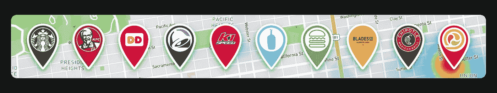

# 如果 Snapchat 在地图上放置地点会怎样？

> 原文：<https://medium.com/swlh/what-if-snapchat-put-places-on-the-map-a7debde6628c>

## “地点”是一个产品创意，旨在重塑人们发现、回顾和分享让他们的时刻变得特别的地方的方式。

对地点的更强支持可能会让 Snapchat 离拥有地图更近一步。该提案主张将本地商业搜索和 T2 消费者评论作为 Snap Maps 中的一种新的社交工具。我们的目标是通过让用户和企业更容易找到和使用公共内容来提高公共内容的质量。当与 Snap 的全面位置数据相结合时，Places 为创新的本地化广告产品带来了新的机会。

# 今天它是如何存在的…

每天，数百万 Snapchat 用户通过地理过滤器和 Snapchat 地图了解他们朋友的最新行踪。它在很大程度上是 Foursquare 或 Swarm 的替代品。使用地理过滤器标记快照相当于“检入”,而快照地图是一种新格式，有助于这些以位置为中心的状态更新。

Snap Maps 的目标是向你展示**现在正在发生什么**，**在哪里**正在发生，以及**你可能和谁**在一起。它鼓励你和附近的朋友见面，或者加入已经玩得很开心的朋友。也就是说，地图上的位置不仅仅是随机的坐标点。在 SnapMaps 的上下文中，这些地方最好被描述为常去的地方。

那么，为什么在 Snapchat 里找地方这么难呢？在当前的实现中，位置是不可见的。要查看特定地点的快照，你要么需要在上下文卡上滑动，到地图上并在黑暗中投掷飞镖，要么搜索并获得真正的运气。如果地方不好找，说明**商家**和他们的故事不好找。作为一个成长中的广告平台，这显然是一个向前发展的问题。

# 本地搜索

Places 将本地搜索引入到快照地图中。这是你的商业指南和分享他们故事的经验。无论您是在寻找夜生活、时尚咖啡店，还是在海滩边放松身心，本地搜索都能让您轻松找到与朋友聚会的地方。

> **目标:**创建一个工具，在你的位置和你相处的人的位置的上下文中显示地点。

**这不是实际的 Snap 产品——草图中设计的实体模型*

“I’m looking for a dessert place to grab a snack with my friend”

在这次 SnapMaps 搜索重新设计中，搜索结果与您的当前位置相关。用户可以使用标准文本进行搜索，或者使用类别来探索他们周围的各种地方。“附近受欢迎的”甚至会在搜索视图中显示你周围的地方。

地点由品牌位置大头针表示，并填充在快照地图上，与您朋友的位置并排，因此您可以找到见面的最佳地点。Snap Maps 的社交方面是它的独特之处。您可以通过缩放或平移地图来调整搜索区域。这有助于找到一个离你可能遇到的特定的人或团体更近的地方。这不仅仅是“在 Snapchat 上大喊大叫”除了你朋友的位置之外，没有其他的本地指南会出现。

# 本地评论

本地搜索使在 Snapchat 上查找地点变得很容易。因此，用户需要一种方法来比较和评估不同的企业。当前的*背景卡片*以来自 Foursquare 和猫途鹰的基于文本的评论为特色，但这种格式有些过时。Snap 已经表明照片和视频是更好的交流和讲述故事的方式，那么为什么不使用相同的格式来描述您的体验呢？

Review any place with a GeoFilter

> **目标:**增加企业及其位置的公共标签内容。
> 
> **解决方案:**为商业故事创建一个高度可视化、低摩擦、值得信赖的消费者评论格式。

在此解决方案中，您可以快速查看地点。评级贴纸可通过 GeoFilters 获得。只需在该地点拍摄照片或视频，选择地理过滤器，并添加您的**评级贴纸**。您可以对着摄像机说话，或者使用文本/标签工具为您的评论添加标题。

**我们的故事**是默认选择的，但你可以随时选择退出公开分享。既然这还是抓拍的，可以发给你的故事或者朋友。此外，“+ Review”按钮并不局限于默认的 places 过滤器，它可以应用于任何企业付费的 geofilter。

迅速发布评论使得他们很难被机器人伪造。评级贴纸以您的 bitmoji 为特色，在不暴露您身份的情况下添加个人风格。这是保持评论荣誉的简单方法，因为没有人会相信匿名的观点。照片/视频不仅比纯文本更具描述性，它还是另一层光线。它是可移动的，通过 GPS 验证的(不是真的但是肯定的)，而且有创意。

# Snapchat 为什么要投资地方？

有了 Places，Snap 就有机会为本地化广告建立一个强大的平台。他们有用户、内容，最重要的是位置数据。当潜在客户在附近时，广告商可以通过投放广告来锁定他们业务周围的人。此外，Snap 可以使用他们现有的名为“Snap To Store”的广告测量技术，向广告商展示任何广告可能带来的直接客流量提升

## 捕捉商店-步行交通测量

这里的主要价值是 *Snap 跟踪地理转换的独特能力*。位置是许多社交平台的一个基本方面，但 Snapchat 最有条件利用这一点。从 Geofilters 到 Snapchat，每当用户打开 Snapchat 时，他们的位置数据就会被发送出去。根据 2017 年 SNAP IPO 招股书，用户平均每天打开该应用 18 次。假设在 16 小时的一天中均匀分布，位置数据应该至少每小时更新一次(每 53 分钟)。

> 广告商已经过了为点击和印象付费的日子，他们想购买的是转化，而不是可能有助于销售但无法明确证明营销支出合理性的在线静态广告牌。

2017 年，Snap 收购了广告测量初创公司 Placed，以传达 GeoFilters 营销的积极商业意义。他们比较了地理过滤器的用户数量(通过摄像头观看、直接分享、通过故事观看等)和一周内实际访问广告位置的用户数量。此外，考虑到用户访问广告位置时没有查看 GeoFilter，可以对 geo filter 如何合法增加升力进行全面分析。这种客流量测量现在被称为“Snap to Store”，并有可能将 Snap 置于本地化广告市场的顶端。

> “我们餐厅的客流量是衡量任何项目短期销售成功的最佳指标——我们需要更多这样的广告技术，”—温迪快餐广告、数字、社交和媒体主管布兰登·罗滕说

# 货币化和新的广告形式

将任何地点数据库货币化的第一步是让企业所有者在企业仪表板上实际声明他们的位置。

> **目标:**鼓励企业主在 Snapchat 上申报他们的业务。

品牌定位针不仅仅是一种有趣的方式来设计地图，它们也是当地广告平台面临的一个巨大问题的答案:让企业注册并认领他们的业务。这不像建立一个地点数据库(或者付费使用别人的)那么简单。第一步是 SnapForBusiness 仪表板上的帐户。没有这一点，企业就无法管理与他们在 Snapchat 中的存在方式相关的任何事情。此外，它还是付费商业地理过滤器和其他本地化广告产品的门户。

存在于 places 数据库中但尚未在 Snapchat 上声明其业务的企业将拥有一个**默认**，普通外观的位置 pin。声称你的企业和品牌你的 pin 只是使你的企业更突出，并在地图上的潜在客户可见。

# 快照广告 **+地图视图**

店面零售商不得不在 Snap 广告中宣传他们的移动应用程序，这有点可笑。这就好像数字基础设施是在 Snapchat 上做广告的先决条件。是的，广告商想这么做是有原因的。一些特殊的促销活动可能需要应用程序或网络视图，特别是如果广告商想要收集电子邮件或吸引客户到奖励系统。但是为什么他们不能公布一个地点呢？

> “我绝对不想‘下载炸鸡柳应用程序’，但如果我知道街上有一家，也许我会去那里吃午饭。”

Snap Ads **+地图视图**让商家向附近的顾客宣传他们的位置。Snap 目前为 Snap 广告的“向上滑动”机制提供了 3 个基本附件:+网络视图、+应用安装和+长格式视频。

+MapView 将是第一个在运行时提供独特结果的 Snap 广告。由于地图视图包含了您当前的位置和朋友在 SnapMaps 上的位置，这是一种非常个性化和超针对性的广告体验。添加+地图视图后，零售商可以通过快照广告更有效地传达他们的位置。

# 赞助搜索结果

这是一种经过时间考验的广告形式，几乎被所有主要的广告平台所采用。企业可以为搜索结果中的优先位置付费。在许多情况下，这些广告对用户非常有帮助，甚至看起来不像广告。多亏了定位功能，它们才具有相关性，即使你拼错了名字，它们也能帮你找到你要找的东西。

# 结束语

SnapMaps 很好地向你展示了朋友们的位置。它能让你在可能看不到他们的时候遇到他们。但是需要更多的关注那些让这些时刻变得特别的地方。

商业故事很难找到，在许多情况下，内容是缺乏的。用户应该能够轻松地展示他们周围的地方，从公共快照中获得共鸣，并无缝地分享他们自己的体验。

众所周知，Yelp 高管对 Snapchat 上发送的食物照片数量垂涎三尺。那是因为分享地点和经历已经是平台上存在的行为了。同时，这种行为没有被充分利用。从本地搜索到新的广告形式，Snapchat 在公共内容和本地业务方面有明显的机会。

留下评论，告诉我你的想法。感谢您的反馈！

## 这个故事发表在[的创业](https://medium.com/swlh)上，这是 Medium 最大的创业刊物，有 333，253+人关注。

## 订阅接收[我们的头条新闻](http://growthsupply.com/the-startup-newsletter/)。

