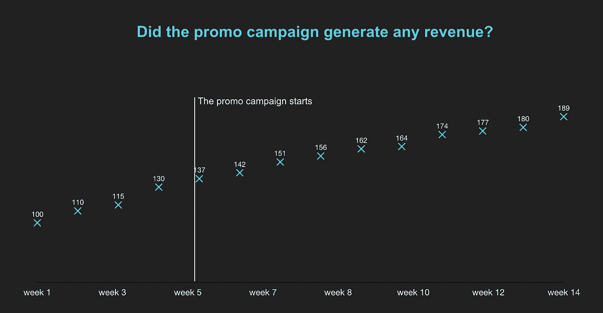

# 如果你弄错了呢？为什么企业需要理解统计学-第 1 部分

> 原文：<https://medium.com/swlh/what-if-you-are-mistaken-why-business-needs-to-understand-statistics-part-1-29608e096bd2>

Picture credit [here](http://nashh-blog.pvp101.net/2010/05/meme-statistics.html)

我叫 Anastasia，是 ManyChat 的产品经理，我想分享一下我对产品经理和其他商业决策者如何从统计中获益的想法。

# 为什么没人使用统计学

数理统计通常被认为是非常复杂和难以理解的东西。我从自己的经历中了解到这一点，因为在产品管理会议上谈论统计数据时，我总是会问听众两个问题:

1.  你们谁学过统计学？
2.  你们谁能给我解释一下 p 值和 CLT 是什么？

结果呢？嗯，几乎每个人都在一生中的某个时候学习过统计学，但几乎没有人准备好给什么是 [p 值](https://www.dummies.com/education/math/statistics/what-a-p-value-tells-you-about-statistical-data/)和[中心极限定理](https://vimeo.com/75089338)(这就像是整个统计学中最重要的两件事)一个清晰的解释。对你来说可能也是如此:)

# 我的艰难统计之路

尽管我毕业于俄罗斯排名前三的技术大学之一([莫斯科物理技术学院，又名 MIPT](https://en.wikipedia.org/wiki/Moscow_Institute_of_Physics_and_Technology#Scientists) )，并且至少学了 4 个学期的概率论和数理统计，但毕业后我对统计学一无所知，不知道如何使用它，更重要的是，不知道用它做什么。在 Acronis 担任产品分析师/产品经理时，我曾经认为我的工作就是客户、销售预测、定价策略和市场调查。统计测试？不，谢谢，应该有一些数学家来考虑这个问题。对吗？

但是有一天，我在分析我们正在进行的一项昂贵的促销活动的结果。目标是了解它是否产生了任何利润——因为如果没有，我们最好马上停止它。但是当我看着情节的时候，我意识到我有一个大问题

我们的销售在促销前就已经增长了，在促销开始后继续增长，然而，没有明显的超级增长。仅从图表来看，真的很难说这场运动是否对收入有任何影响。然而，我们真的需要知道，因为这场运动花了我们很多钱。

因此，我开始寻找如何评估这场运动效果的方法，并很快发现统计数据可能会有所帮助。我开始研究这个课题，并意识到统计学不仅可以澄清这个问题，还可以澄清许多其他与商业相关的情况。

# 商业统计

统计数据对回答以下问题(以及许多其他问题)非常有帮助

*   我的新登录页面真的更好吗？
*   **在最近发布之后，我的关键指标真的提高了吗？**
*   **一年后我会有多少客户？**
*   我的 NPS 是怎么回事？为什么突然下降了？
*   我们在新项目上赔钱的风险有多大？
*   **考虑到我们经理的差异，我们的销售团队有什么最佳销售技巧吗？**

下面我将试着用统计学来回答这些和类似的问题，以及在不丧失头脑的情况下学习这门学科的最好方法是什么。

> **重要提示:
> 我试图尽可能准确地描述想法，然而，这篇文章的主要目标是说明什么样的问题可以用统计学来回答，而不是替代该领域的适当教育。**

我把整个故事分成两部分

*   **第一部分，你现在正在阅读的部分:**如果没有错误的迹象，你为什么不应该相信你的情节，以及在比较两组时如何不做出错误的决定——例如，旧的*对新的*产品版本。
*   [**第二部分**](/swlh/what-if-you-are-mistaken-why-business-needs-to-understand-statistics-part-2-f75ccd66102c) **:** 正确进行销售和任何其他种类的预测，一些其他有用的统计测试以及如何轻松地学习统计

所以让我们从第 1 部分开始。

# 不要相信没有错误迹象的情节

如果我能让你从这篇文章中记住至少一件事，那就是**“永远不要相信没有错误迹象的阴谋”。为什么？**

假设您最近推出了一项新功能，并想知道有多少用户知道它的存在，因此您开展了一项调查。调查显示，33%的用户听说过该功能。但是您可能知道，只要有足够数量的用户提供了他们的答案(通常不只是 5 或 10 个)，调查的结果就有意义

这是真的，因为根据参与调查的人数(以及其他一些因素)的不同，对该功能的真实认知度可能在 32%到 34%之间，或者在 8%到 58%之间，或者说实话，在其他任何地方

如果一个人基于这些数据做出任何决策，或者仅仅是发展自己对产品的理解，那么了解认知范围是 32–34%还是 8–58%是至关重要的

因此，请考虑使用左图，而不是右图

对于好奇的学习者:我试图用简单的语言解释的正确名称是*置信区间。*在这里了解更多

# 比较两个或多个组

另一个常见的业务问题是两种状态之间是否存在差异，例如，旧的*对*新产品版本或旧用户入职流程*对*新用户入职流程。

让我们想象一下，你的老入职流程不太好，所以你决定创建一个新的，当然，你真的希望用户喜欢它。当您检查指标时，您会发现旧版本导致 25%的新用户被激活，而新版本给了您 30%的激活率。而有些团队只会说“激活增加了 20%，哇！我们做得真的很好！”继续下一个任务，当你读这篇文章的时候，你记得你不能相信没有错误迹象的情节。所以你把它们加到情节里:

但是当你看着你的图，每一列都有误差线，你就明白了，因为这些愚蠢的误差线，现在真的无法分辨是右边还是左边的列更高。

但好消息是，你不需要通过相信你的眼睛来判断新的 onboarding 版本是否表现得更好——因为一些非常酷的人发明了统计测试来为你做这件事。这些测试被称为 [**方差分析**](https://www.dummies.com/education/science/biology/the-basic-idea-of-an-analysis-of-variance-anova/) **，** [**T 检验**](http://blog.minitab.com/blog/statistics-and-quality-data-analysis/what-is-a-t-test-and-why-is-it-like-telling-a-kid-to-clean-up-that-mess-in-the-kitchen) **和** [**卡方检验**](https://www.mathsisfun.com/data/chi-square-test.html) **d 检验**

这些测试向您展示了两组之间存在差异的可能性，即您的新入职员工比旧员工表现更好的可能性

这里有一些关于这种测试何时有用的其他想法:

## [T 检验](http://blog.minitab.com/blog/statistics-and-quality-data-analysis/what-is-a-t-test-and-why-is-it-like-telling-a-kid-to-clean-up-that-mess-in-the-kitchen)和[卡方检验](http://blog.minitab.com/blog/statistics-and-quality-data-analysis/what-is-a-t-test-and-why-is-it-like-telling-a-kid-to-clean-up-that-mess-in-the-kitchen)

*   新的入职培训是否提高了用户的激活率？
*   新产品版本是否改进了平均会话长度指标？
*   新功能对免费用户还是付费用户更有意义？
*   潜在客户的请求是否在 24 小时内得到处理？
*   点击这里阅读更多关于两者区别的

## [方差分析](https://www.dummies.com/education/science/biology/the-basic-idea-of-an-analysis-of-variance-anova/) (3+组)

*   我们支持团队的所有成员都同样高效地工作吗？
*   我们服务的哪个行业的平均支票最大？
*   考虑到我们经理的差异，我们的销售团队有什么最佳销售技巧吗？

这同样适用于流行的 [NPS](http://www.netpromotersystem.com/about/measuring-your-net-promoter-score.aspx) 指标(基本上就是忠实用户的比例减去不满意用户的比例)。人们倾向于相信他们的 NPS 下降或上升，而不确定这种变化在统计上是显著的。你可以在这里阅读更多关于准确处理 NPS [的内容](https://www.genroe.com/blog/how-to-calculate-margin-of-error-and-other-stats-for-nps/5994)

## 现实生活中的例子:为什么客户不使用该功能？

当我在 Acronis 工作的时候，我曾经分析过我们确实希望我们的客户使用的特性的采用情况——但是由于某种原因，他们就是不使用。我们的假设是，这可能是因为有太多保守的顾客，而该功能是针对更现代的人。如果这个假设被证明是真的，我们可以尝试吸引更多的现代消费者，或者教育保守的消费者，或者做些别的事情。

乍一看，数据似乎证实了假设:保守用户对功能的采用确实低于现代用户。但当我进行统计测试时，结果发现两组之间没有统计学上的显著差异，也就是说，没有一组人真正使用这一功能——所以教育保守派或吸引更多现代人是没有意义的。

> 这就是统计学的特别之处。它可能无法解释为什么你的客户不使用你的产品，但它至少会为你在修理从未损坏的东西时节省大量的时间和金钱。

所以，现在你已经知道了关于比较组和研究图的棘手细节，是时候了解另一个非常重要的用例了——如何预测你的销售/数据/随时间推移的任何增长，以及如何轻松地学习统计数据——欢迎来到[第二部分](/swlh/what-if-you-are-mistaken-why-business-needs-to-understand-statistics-part-2-f75ccd66102c)。

**附注**如果你对统计或产品管理有任何疑问，一般来说，请随时通过[脸书](https://www.facebook.com/anastasia.blazhenova)或 [Linkedin](https://www.linkedin.com/in/anastasia-blazhenova/) 联系我。

此外，我将写另一篇关于金融模型和使用蒙特卡罗模拟来估计损失风险的帖子，所以请继续关注✌️
(或者，[点击这里](https://m.me/351985042005614?ref=w3848734)，如果你不想在帖子准备好时收到通知的话)

## 这篇文章发表在 [The Startup](https://medium.com/swlh) 上，这是 Medium 最大的创业刊物，拥有+396，714 名读者。

## 在此订阅接收[我们的头条新闻](http://growthsupply.com/the-startup-newsletter/)。

