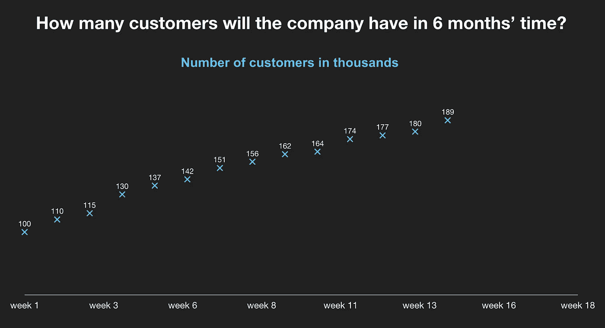
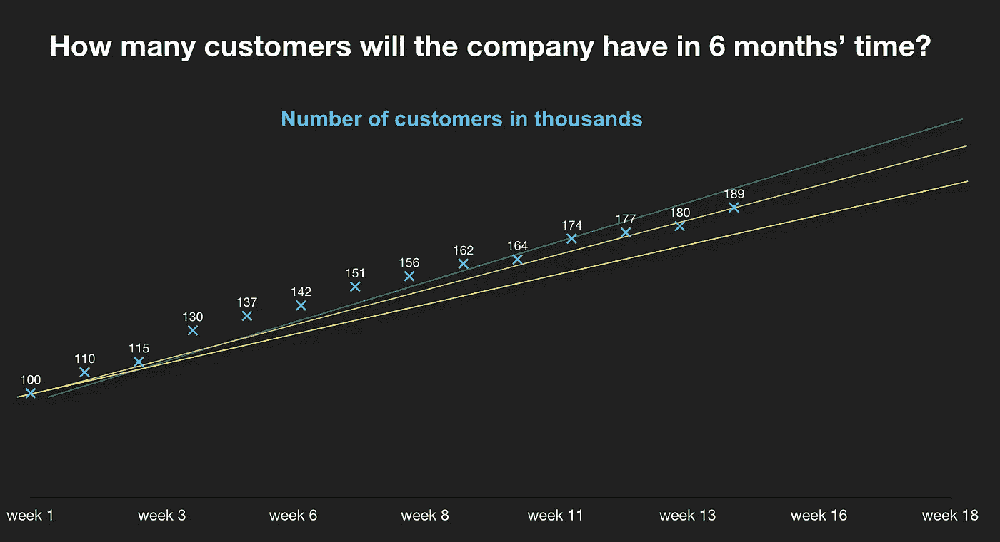
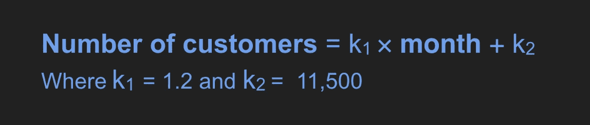
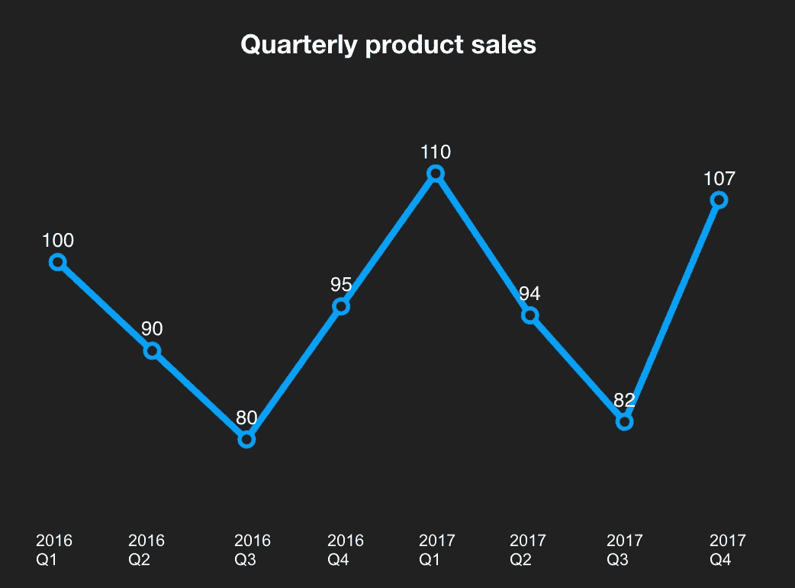
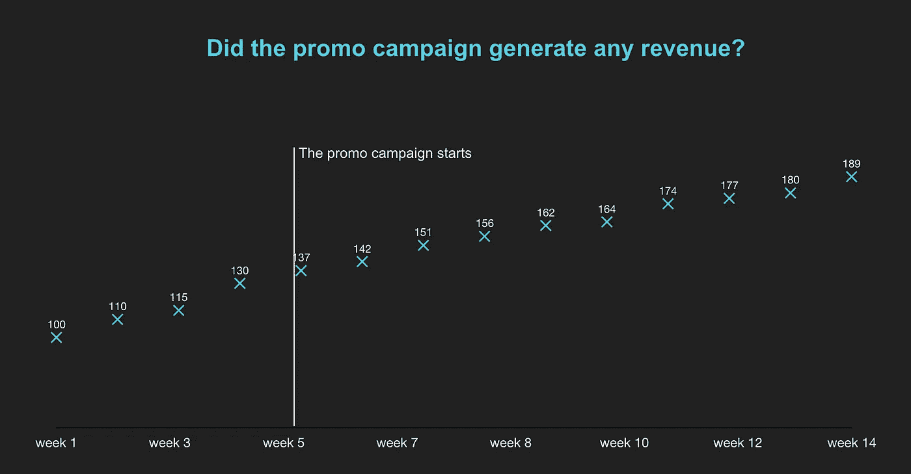
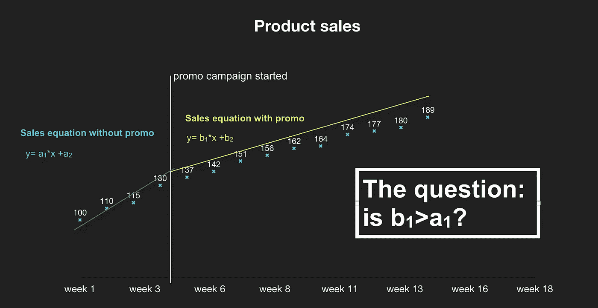
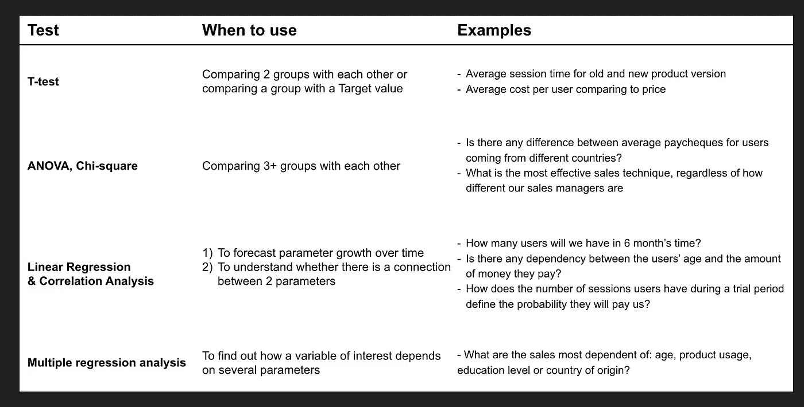

# 如果你弄错了呢？为什么企业需要理解统计学-第 2 部分

> 原文：<https://medium.com/swlh/what-if-you-are-mistaken-why-business-needs-to-understand-statistics-part-2-f75ccd66102c>

Picture credit [here](http://explosm.net/)

这是关于统计学在商业中的应用的系列文章的第 2 部分。

**阅读** [**第一部分**](/swlh/what-if-you-are-mistaken-why-business-needs-to-understand-statistics-part-1-29608e096bd2) **:** 如果没有错误的迹象，为什么你不应该相信你的情节，以及在比较两组时如何不做出糟糕的决定——例如，旧的*对新的*产品版本。

# 做预测

当统计数据可能有用时，预测是一种重要而频繁的商业情况。

比方说，你有一张销售或客户数量或云存储随时间增长的图表。最有可能的是，它看起来像下面的一个，你的目标是了解你的销售/客户群/云存储在未来可能是什么样子。

当一个人看到类似直线的情节时，脑海中出现的第一个想法当然只是延长这条线，看看它会通向哪里。问题是，即使你可能有足够多的数据点，也有很多方法可以画一条直线——每种方法都会给你不同的数字。那么如何决定直线应该在哪里呢？

绘制一条与所有可用数据点最精确对齐的直线的最佳方法是使用统计测试—例如， [**线性回归**](https://www.statisticssolutions.com/what-is-linear-regression/) **。**

这个测试返回一个你的销售/客户/存储如何依赖于时间的等式。该等式如下所示:

要使用这个等式，你需要输入想要的月份数——这将告诉你在这段时间内你可能有多少客户。

这个测试还有一个方便的修改，允许您处理季节性数据。季节性意味着您的数据遵循一种模式，例如，销售额总是在冬季高，在夏季低。在这种情况下，人们通常可以从曲线图中看出有一种趋势——销售肯定会随着时间的推移而增长，但因为数据点上下跳动，所以很难说出你在 2018 年第四季度会有多少销售——但测试可以帮助你做到这一点。

Seasonal data example

## 现实生活中的例子:我们应该停止促销活动吗？

正如我在文章开头提到的，有一次我在研究我们正在进行的促销活动的结果。这个促销活动相当昂贵，但我们的想法是，我们将能够获得新的忠实客户，它最终会得到回报。不幸的是，很快我们就发现，我们吸引的新用户类型不太可能留下来，所以我们最初的想法行不通。

我们本可以就此打住，但随后营销团队提出了抗议，因为他们认为，尽管促销活动可能不会给我们带来真正的客户，但至少会增加我们的销售额。这听起来很有意义:我们的活动是在一个人购买主要产品时免费提供一个很酷的选项，人们喜欢免费赠品，所以可能有更多的人在促销期间购买主要产品。对吗？

数据图并没有真正有助于澄清这一点:我们的销售在促销之前和期间都有增长，所以不清楚这场活动是否导致了任何额外的销售增长。

所以我决定做一个快速测试，看看我们的销售额是否有所增长。我选择使用线性回归，将销售数据分成促销活动之前和之后的两部分。对于每个数据集，我使用了线性回归，它为我提供了两个方程，其中一个描述了促销开始前的销售增长，另一个描述了促销开始后的销售增长。

用数学术语来说，增长被描述为线的倾斜度，所以简单地说，我的目标是了解促销活动期间销售线的倾斜度是否大于没有促销的销售线的倾斜度。

不是的。因此，我们决定停止宣传，并在不久的将来不运行类似的宣传活动。

> 有时你或你的团队会变得非常依赖某个项目。不幸的是，如果我们想要相信某件事，我们的大脑会寻找证据(并找到它们),忽略矛盾的事实。但是统计数据有助于客观看待形势，并做出更慎重的决定。

(当然，这并没有废除战略决策和其他类型的决策，因为数据可能只起很小的作用)

# 如何把一切都搞砸

线性回归测试是一个众所周知的工具，每当人们看到看起来像线性趋势的东西时，他们往往会使用它。

> 重要的是要记住，线性回归和其他统计测试只是工具。就像其他工具一样，只有当一个人知道如何使用它们时，它们才是有用的，否则它们可能是有害的。
> 
> 当你的数据是错误的时候，相信你有可信的信息可能比没有任何信息更有害。

当谈到线性回归(和所有其他测试)时，人们应该知道测试假设，因为如果数据违反了它们，[测试根本不适用，人们不能相信它的结果](https://www.statisticssolutions.com/the-importance-of-assumption-testing/)。需要记住的另一件重要事情是，线性回归输出不仅包含方程，还包含一大堆其他基本指标。如果一个人不去研究这些指标，他可能永远也不会知道这个等式对于他的特定数据集是没有意义的，因此不能用来预测任何事情。

# 还有哪些有用的测试？

如果读完这篇文章后，你觉得你真的想尝试使用统计数据来做出更好的决策，下面是一个最流行的测试和它们可能有用的例子的快速汇总表

另外 [XLStat](https://www.xlstat.com/en/) ，我最喜欢的 Excel 统计插件，有很多关于如何运行和解释统计测试的材料，包括[这个非常有用的表格](https://help.xlstat.com/customer/en/portal/articles/2062457-which-statistical-test-should-you-use-?b_id=9283)，有测试、使用示例和有效性测试条件——一定要看看。

同样，如果你不熟悉这个理论，请不要尝试应用这些测试——你不仅会得到错误的结果，而且你会相信它们并据此做出决定。查看这篇文章的末尾，用简单的英语列出了非常好的统计学书籍。

# 结束语

如果有人告诉我，我会写帖子，做讲座，讲述统计学是多么有趣和令人兴奋——我会大笑。统计(以及编程)是我决定永远不想处理的事情之一。我花了 6 个月的时间才明白这个简单的事实——如果我想开发伟大的产品，我需要做出好的决策，而**用统计数据做出好的决策要容易得多。**

你可以预测你需要的资源，你可以了解你的新产品版本是否真的更好，你甚至可以确定真正让人们留在你的产品中的事件(就像脸书和他著名的“[10 天 7 个朋友](https://www.quora.com/How-do-you-find-insights-like-Facebooks-7-friends-in-10-days-to-grow-your-product-faster)”)，或者至少你可以明白你不能根据提供的数据做出决定。所有这些都将为您的团队节省大量的时间和精力。

再说一次，这真的很有趣！就像编程一样:)

所以，就这样了。如果你碰巧对统计或产品管理有任何问题，一般来说，我很乐意在脸书或 Linkedin 上讨论。

此外，我将写另一篇关于金融模型和使用蒙特卡罗模拟来估计损失风险的帖子，所以请继续关注✌️
(或者，[点击这里](https://m.me/351985042005614?ref=w3848734)，如果你不想在帖子准备好时收到通知的话)

# 附注:如何轻松地学习理论

我确信有很多很棒的资源致力于统计学，但这里是我最喜欢的三个。我建议按照列出的顺序阅读它们。

1.  [**到底什么是 p 值？安德鲁·j·维克斯的《T2》**](https://www.amazon.com/p-value-Stories-Actually-Understand-Statistics/dp/0321629302)用通俗易懂的英语写的一本短小精悍的书，解释了统计学的问题。这将有助于你获得主体的感觉和注意力！它不包含单一的公式。
2.  [**赤裸裸的统计**](https://www.amazon.com/Naked-Statistics-Stripping-Dread-Data/dp/039334777X/ref=sr_1_1?s=books&ie=UTF8&qid=1541750915&sr=1-1&keywords=naked+statistics) **由查尔斯·惠兰** 稍微详细一点的解释，仍然用非常简单的语言写成并附有大量的例子。读完这本书后，你会明白什么是中心极限定理，为什么它如此重要，以及统计学家如何使用这个定理做他们黑暗的统计魔术。包含 1 或 2 个简单的公式。
3.  詹姆斯·t·麦克拉夫的《商业和经济中的统计技术》这本书从“什么是比例”这样的基本话题开始，但不要怀疑:几章之后，它将转向概率、分布，然后是统计学本身。我喜欢这本书的一点是，它写得非常慢，而且循序渐进，提供了如此多的商业例子和如此浅显易懂的解释，让你不得不去理解它。对我来说，这也是了解考试之间的区别以及如何解读考试的最佳场所。

## 这篇文章发表在[的《创业》(The Startup](https://medium.com/swlh) )上，这是 Medium 最大的创业刊物，拥有+396，714 名读者。

## 在这里订阅接收[我们的头条新闻](http://growthsupply.com/the-startup-newsletter/)。

