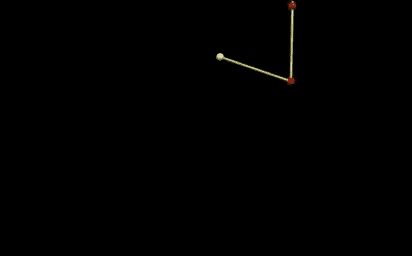

# 什么是混沌力学中的分岔图？

> 原文：<https://medium.com/swlh/what-is-a-bifurcation-diagram-in-chaos-mechanics-c5d12da82e3e>

什么是混沌系统？真的，这就是问题所在，不是吗？还有双摆的经典例子[。](https://www.wired.com/story/fidget-spinners-the-serious-physics-behind-a-double-pendulum-spinner/)[这里是双摆的一些代码。](https://trinket.io/glowscript/717bedba81https://trinket.io/glowscript/717bedba81)这就是它的样子。

但这不是最好的系统。问题是有两个坐标——顶栏的角度和底栏的角度。当然，这很酷-但如果你想绘制角度…