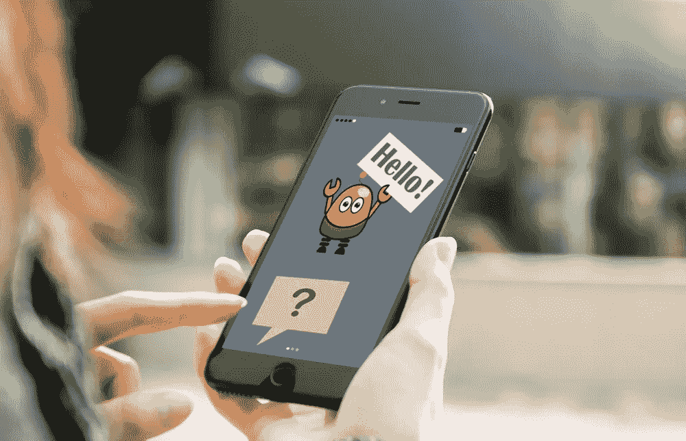

# 什么是聊天机器人，如何在你的业务中使用它

> 原文：<https://medium.com/swlh/what-is-a-chatbot-and-how-to-use-it-for-your-business-976ec2e0a99f>

人工智能的发展现在正如火如荼，聊天机器人只是巨大进步浪潮中的一个微弱亮点。如今，WhatsApp、Slack、Skype 等即时通讯应用的用户数量正在飙升，仅 Facebook Messenger 就拥有超过[12 亿](https://www.statista.com/statistics/417295/facebook-messenger-monthly-active-users/)月用户。随着信使的传播，模仿人类对话来解决各种任务的虚拟聊天机器人变得越来越受欢迎。中国的微信机器人已经可以预约医疗、叫出租车、给朋友汇款、办理航班登机等等。

在线聊天机器人通过自动化客户支持来节省时间和精力。Gartner 预测，到 2020 年，超过 85%的客户互动将在无人参与的情况下进行。然而，聊天机器人系统提供的机会远不止是对顾客的询问做出回应。它们还用于其他业务任务，如收集用户信息、帮助组织会议和降低管理费用。难怪聊天机器人市场的[规模呈指数级增长。](https://www.statista.com/statistics/656596/worldwide-chatbot-market/)

当然，创建一个用户真正信任的交互代理并不那么简单。这就是为什么 IM 机器人没有取代所有的快递员、医生和这些台词的作者。在这篇文章中，我们不会谈论聊天机器人的未来，而是让你简短地了解一下聊天机器人的主题，它们是如何工作的，它们是如何被使用的，以及自己创建一个聊天机器人有多困难。

# 聊天机器人是什么，有什么用？

根据[牛津词典](https://en.oxforddictionaries.com/definition/chatbot)，聊天机器人是

> 设计用来模拟与人类用户对话的计算机程序，尤其是在互联网上 

它是一个通过短信与我们交流的助手，是一个集成到网站、应用或即时通讯工具中的虚拟伴侣，帮助创业者拉近与客户的距离。这样的机器人是一个与用户交流的自动化系统。

为什么企业需要聊天机器人？这是有原因的，比如摆脱常规任务和同时处理来自用户的多个请求。此外，聊天机器人处理用户请求的惊人速度有助于赢得客户的忠诚度。

消费者也从聊天机器人中受益，他们对这项技术越来越感兴趣。2017 年 11 月在第四届国际互联网科学大会上发表的一项[研究](https://www.researchgate.net/publication/318776998_Why_people_use_chatbots_Paper_accepted_for_presentation_at_the_4th_International_Conference_on_Internet_Science_22-24_November_2017_Thessaloniki_Greece)确定了人们选择与聊天机器人互动的原因。根据这项研究，促使人们使用聊天机器人的主要因素有:

*   **生产力。**聊天机器人能够快速有效地提供帮助或获取信息。
*   **娱乐。聊天机器人通过给人们有趣的提示来娱乐人们，当用户无事可做时，它们也帮助消磨时间。**
*   **社会和关系因素。**聊天机器人燃料转换，增强社交体验。与机器人聊天也有助于避免孤独，提供一个不被评判的谈话机会，并提高谈话技巧。
*   **好奇心。聊天机器人的新奇引发了好奇心。人们想探索自己的能力，尝试新事物。**

# 看看聊天机器人的历史

我们会发现第一个会说话的机器人是 1966 年在美国写的。它是由麻省理工学院的计算机科学家 Joseph Weizenbaum 实现的，并被命名为 [Eliza](https://en.wikipedia.org/wiki/ELIZA) 。聊天机器人误导了人们，与它的交流是如此真实。

在 90 年代早期，图灵测试被开发出来，它允许确定计算机思考的可能性。它包括以下内容。一个人既可以对人说话，也可以对电脑说话。目标是找出他的对话者是谁——一个人还是一台机器。这个测试是在我们的时代进行的，许多对话程序都成功地应对了它。

# 至于聊天机器人的类型

根据特定机器人的编程方式，我们可以将它们分为两大类:根据预先准备的命令工作(简单的聊天机器人)和经过训练的(智能或高级聊天机器人)。

**简单的聊天机器人**基于它们理解的预写关键词工作。这些命令中的每一个都必须由开发人员使用正则表达式或其他形式的字符串分析单独编写。如果用户没有使用一个单独的关键字就问了一个问题，机器人就不能理解它，通常会用“对不起，我不明白”这样的信息来回应。

**智能聊天机器人**在与用户交流时依靠[人工智能](https://anadea.info/blog/artificial-intelligence-pandoras-box-or-the-holy-grail)。代替预先准备好的答案，机器人会对这个话题给出适当的建议。此外，顾客所说的话都被记录下来，以备后处理。然而，Forrester [的报告](https://www.forrester.com/report/The+State+Of+Chatbots/-/E-RES136207)“聊天机器人的状态”指出，人工智能不是一种魔法，还没有准备好独自为用户带来奇妙的体验。相反，这需要一项巨大的工作:

> 聊天开发者和设计者是园丁:他们必须照料聊天机器人，并通过持续而温和的纠正来指导它们的成长。在这个过程中，这些设计师还必须恳求、强迫和激励顾客忍受低劣的体验:学习真的很慢。”

# 最受欢迎的聊天机器人

有各种各样的机器人搜索引擎，例如[聊天瓶](https://chatbottle.co/)、[机器人列表](https://botlist.co/)和[聊天机器人](https://thereisabotforthat.com/)，帮助开发者通知用户新的聊天机器人的推出。这些网站还通过各种参数对机器人进行排名:投票数、用户统计、平台、类别(旅行、生产力、社交、电子商务、娱乐、新闻等。).它们为 Facebook Messenger、Slack、Skype 和 Kik 提供了超过 3500 个机器人。

通过聊天机器人搜索引擎，你可以在每个类别中找到一个有趣的应用程序，例如 Facebook Messenger 的最佳聊天机器人是 Poncho。它给你发送带有笑话或有趣的迷因的个人天气预报，因此，看起来更像一个气象学家的朋友，而不是一个没有灵魂的天气预报服务。

# 聊天机器人能做什么？

> “我认为聊天机器人是粉丝和品牌或名人之间互动的未来。”~克里斯蒂娜·米兰

无论是初创公司还是精明的公司，现在都在将交互式代理融入到他们的日常运营、与客户的沟通以及销售过程中。聊天机器人可以帮助:

改善客户服务。对于那些不想让客户:

*   等接线员的回答——“别挂电话，你的电话对我们很重要”总是很烦人，不是吗？
*   在 FAQ 中寻找答案——通常用户没有时间滚动几十页的说明。

简化购物流程。只需向聊天机器人写下你想要的东西，机器人就会把信息发送给销售部门。你不需要重复几次“我需要一样的，但是用金属按钮”。此外，聊天机器人会记住您的偏好，并在您返回时使用这些信息。

**个性化交流。聊天机器人会回答访问者的具体问题，而不是显示一长串信息。顾客得到的关注越多，他买东西的欲望就越大。**

**提高回复率。**脸书商业页面发出的约 90%的问题仍未得到答复。聊天机器人 100%回复消息，将更多访客转化为买家。

自动化重复的任务。大多数客户都想得到相同问题的答案——你什么时候工作？你的位置在哪里？你送货吗？为了不每次都写一样的答案，做一个聊天机器人。它减少了你的员工的工作量。

# 如何构建聊天机器人

如果我们设法启发你创建自己的聊天机器人，这里有一些提示可以帮助你开始。有 4 个主要阶段:

**1。定义目标。你的聊天机器人应该做什么？清楚地指出您的聊天机器人需要执行的功能列表。
**2。选择与客户互动的渠道。**成为你的客户喜欢交流的地方——你的网站、手机应用程序、Facebook Messenger、WhatsApp 或其他信息平台。
**3。选择创作的方式。**有两种:使用现成的聊天机器人软件或者从头开始构建一个定制的机器人。
**4。创建、定制和启动。描述其动作的算法，开发一个答案数据库，并测试聊天机器人的工作。在向潜在客户展示你的作品之前，仔细检查所有的东西。****

现在让我们仔细看看构建聊天机器人的两种方法:

**从零开始创造。如果你自己不是程序员，你需要雇佣一家[软件开发公司](https://anadea.info/),因为这种方法需要代码、人工集成信使和定制。这种方法的优点包括:**

*   完全符合您的需求，
*   控制机器人接收的数据，
*   容易进行校正的可能性，
*   最适合面向客户的聊天机器人。

这种方法可能需要大量的资金和时间投入。

**使用聊天机器人构建器平台。**您可以借助提供所有必要功能和集成的服务来创建聊天机器人。对于为您的团队服务的内部聊天机器人来说，这可能是一个不错的选择。这个选项有一些缺点，包括有限的配置和对服务的依赖。一些流行的聊天机器人平台有:

*   [聊天燃料](https://chatfuel.com/)，
*   [哔哔](https://beepboophq.com/)，
*   [聊天者](https://www.chattypeople.com/)，
*   [Botsify](https://botsify.com/) ，
*   [Smooch.io](https://smooch.io/) 。

# 创建聊天机器人的挑战

主要的挑战是教聊天机器人理解你的客户的语言。在每项业务中，客户表达自己的方式各不相同，每个目标受众群体都有自己的表达方式。这种语言受到市场广告宣传、国家政治局势、谷歌、苹果和百事可乐等公司新服务和产品发布的影响。人们说话的方式取决于他们的城市、心情、天气和月相。例如，电影《星球大战》的发行可能在企业与客户的交流中起到重要作用。这就是为什么训练聊天机器人正确理解用户输入的所有内容需要付出大量努力。

# 请记住:

*   有简单的，也有高级的机器人。
*   高级聊天机器人是一种人工智能，可以与人交流。
*   对话机器人对企业和客户都很有用。
*   理解目标受众的语言是必要的。

# 结论。怎么办？

许多企业主刚刚开始了解聊天机器人能给他们带来什么好处。这项技术仍处于早期阶段，其功能仍在不断增强，最好的聊天机器人尚未诞生。

投资为您的企业构建聊天机器人，走在创新的最前沿！

*最初发布于*[*anadea . info*](https://anadea.info/blog/what-is-a-chatbot-and-how-to-use-it-for-business)*。*

## 这篇文章发表在 [The Startup](https://medium.com/swlh) 上，这是 Medium 最大的创业刊物，拥有 281，454+读者。

## 在这里订阅接收[我们的头条新闻](http://growthsupply.com/the-startup-newsletter/)。

