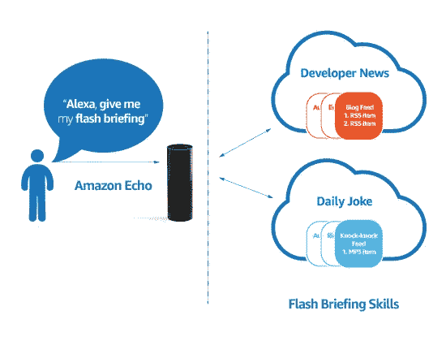
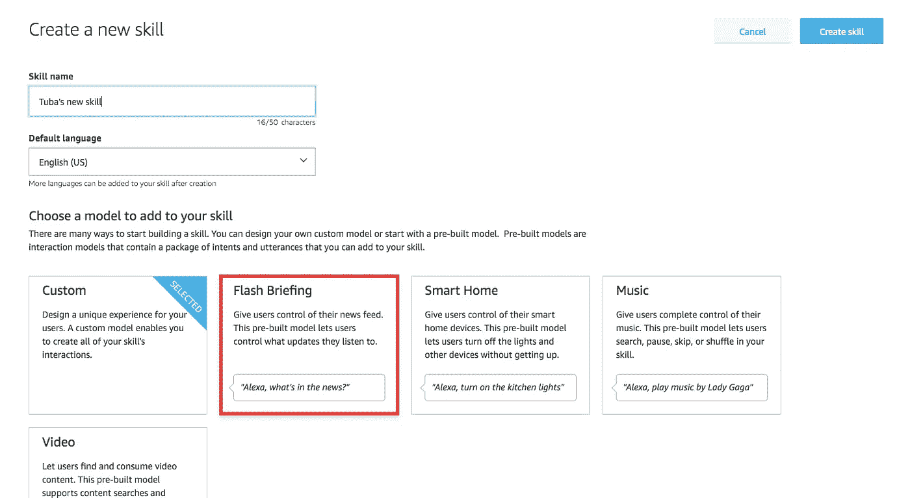
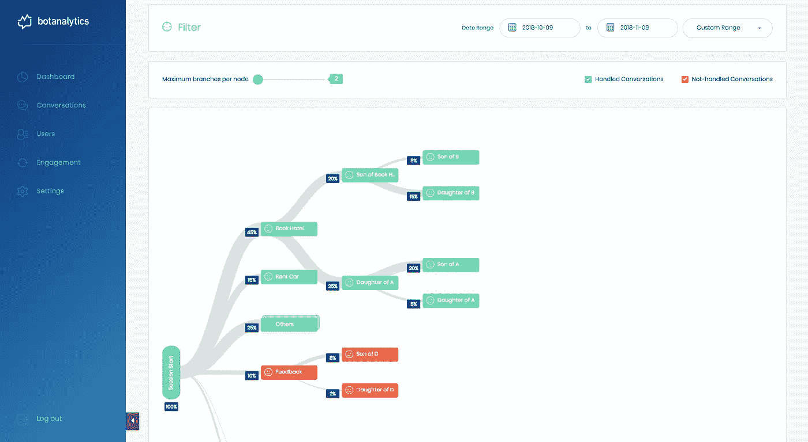

# 什么是快速简报，如何制作简报？

> 原文：<https://medium.com/swlh/what-is-a-flash-briefing-and-how-do-you-make-one-b45af5cf9c4c>

制作一个 Alexa 技能听起来可能很难——需要考虑这么多的查询和响应！但许多品牌正在采用一种更简单的方法来实现对话式语音界面:Alexa flash 简报。

Source: developer.amazon.com

首先，什么是快速简报？快速简报是预先录制的简短、信息丰富的音频片段——有点像播客或广播节目。

> “Alexa flash 简报可以持续长达 10 分钟，通常每天或每周发布一次。”

因为它们很短并且定期播放，Alexa flash 简报是品牌的一个很好的内容渠道。你可以用 Alexa flash 简报做一些事情，包括通知你的粉丝关于你的品牌的产品、服务或新闻的更新。

> 提示 1:你也可以提供简短的生活方式内容，如每日星座运势或每日单词。

> 提示 2:有影响力的人也可以建立一个 Alexa 或 Google Home 新闻简报，为他们的观众提供专业建议或日常提示。

把 flash 简报想象成播客和 Alexa 技能的交叉。它们不像 skills 那样具有交互性，但允许 Alexa 用户在一个对话界面中接收他们最关心的所有新闻。

# **Alexa Flash 简报教程**

建立一个 Alexa flash 简报是一个相对简单的过程。首先，你需要一个存放音频内容的地方。虽然你可以自己托管，但托管音频内容的流行服务包括 [Libsyn](https://www.libsyn.com/) 和[effect](https://effct.co/)，后者是免费的。

无论您选择在哪里主持，您都需要复制为您的 flash 简报生成的 RSS 提要。如果你选择开发一个 Google Home 新闻简报，你需要对你的 RSS 提要做一些额外的工作——但是我们将在下面讨论。如果你正在为亚马逊做简报，继续吧。

我们的 Alexa flash 简报教程的下一步是设置一个 Alexa 技能来进行简报。首先，访问亚马逊开发者控制台创建一个新技能。首先为其命名，然后单击“下一步”你会得到一系列的 Alexa 技能模型供你选择。从列表中选择“flash briefing”，然后你会看到一系列的 Alexa flash briefing 选项。

Amazon Developer Console

Alexa flash 简报的第一个选项是一条错误消息。如果你的简报不可用，Alexa 会把这个读给你的听众听。接下来，您将被要求粘贴您的音频主机提供的 RSS 提要。“序言”字段是一个简短的介绍性提示，Alexa 会在提交您的简报之前阅读。最后，填写任何剩余的 Alexa flash 简报选项——频率、简报名称、类别/流派等——很快您就可以开始发布了。

一旦你填好了页面，就该为你的 flash 简报制作一个列表或个人资料页面了。这一过程与任何 Alexa 技能相同:给你的简报一个简短的描述，一个长的和一个侧面图像使用。之后，提交你的技能并开始记录你的内容！当您将新内容上传到您的音频主机时，它会通过 RSS 自动推送至您的 flash 简报。

# **发布 Google Home 新闻简报**

谷歌助手没有 Alexa 意义上的 flash 简报——相反，你将把你的音频内容作为播客发布。这个比 Alexa 的流程技术含量高一点。首先，你的简报需要有自己的主页。第二，你需要编辑简报的 RSS 提要，以包含谷歌助手在其目录中识别它所需的代码片段——查看所有要求[这里](https://developers.google.com/actions/content-actions/podcasts#rss-feed-requirements)。谷歌不要求设置助理动作。一旦你在你的 RSS 源中包含了必要的代码，你的播客将会自动出现在搜索结果中。

# **下一步:设置互动技能**

Flash 简报对于快速通知你的观众来说是很棒的，但是一个完全互动的 Alexa 技能或 Google Assistant 动作将允许更多的自由。有了精心设计的技能，你可以随时向你的观众提供个性化的服务和内容，而不仅仅是一天或一周一次。使用我们提供的语音聊天机器人分析工具,你还可以收到有用的使用数据，从而更好地了解你的受众。

Botanalytics session flow for voice apps

快速简报是一种很好的、简单的方法，可以让你接触到对话平台。一旦你在这个平台上有了一席之地，接下来就试着实现一个功能全面的技能吧！

## 这篇文章发表在 [The Startup](https://medium.com/swlh) 上，这是 Medium 最大的创业刊物，拥有+388，268 名读者。

## 在这里订阅接收[我们的头条新闻](http://growthsupply.com/the-startup-newsletter/)。

