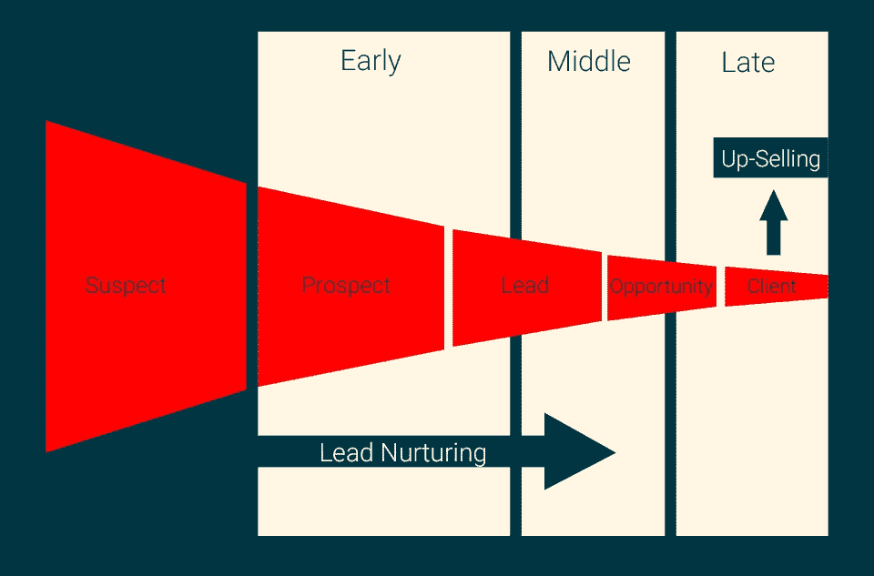

# 什么是营销漏斗，为什么要关注它？

> 原文：<https://medium.com/swlh/what-is-a-marketing-funnel-and-why-should-you-care-c3a6243088ff>

Image by [Samuel J. Woods](https://samueljwoods.com/5-steps-first-high-growth-marketing-funnel/) — Growth Marketer

> 提示:因为这是成功的在线业务的基本要求。

营销漏斗是带领潜在客户从发现你的业务，一直到定期购买你的产品的整个旅程。

目标是创建一个高度自动化的系统，可以在客户旅程的任何一点进行测量。

**假设你销售四种主要产品:**

1.  一本书
2.  在线课程
3.  研讨会
4.  一对一的辅导计划

不太可能有人看到你的名字，研究你能提供的一切，然后立即决定购买你最昂贵的一对一教练计划。

事实上，这种情况很少发生。

要让顾客购买你的产品，他们首先需要确信他们正在做一笔好的投资。他们需要信任你。他们需要感觉风险相对较低。

简而言之，他们需要通过一个过程来“了解你”。随着时间的推移，他们需要与你有不同的接触点。他们需要看到你始终如一的价值。

这就是营销漏斗的作用。

它让你的客户从第一次听说你开始(例如，通过你的博客或你在 Youtube 上的采访),并让他们经历所有的步骤，直到他们成为你产品的常客。

# 营销漏斗的三个层次。

## 1.勘探系统。

潜在客户创造系统基本上是一种让潜在客户了解你并让他们定期收到你的更新信息的方式(例如，通过订阅你的电子邮件列表或关注你的媒体账户)。

这是大多数人本能地建立起来的，并把大部分精力集中在这上面。

为什么？

因为它是三者中最明显的。

当我们试着看看在我们的领域里其他“成功”的企业在做什么时，我们马上就能看到他们的潜在客户系统。这是他们在博客、社交媒体、他们正在做的公关工作等等上做的所有事情。

让潜在客户定期与他们的业务保持联系的一切，真的。

这一阶段的金杯是让你的潜在客户成为你的电子邮件列表的订户。为什么？因为你可以完全控制这个渠道，你可以清楚地衡量你的电子邮件订户的结果。

**一旦你让人们通过了这个阶段，你就可以:**

*   随时联系他们
*   跟踪他们对你的提议的反应
*   相应地调整你的营销

## **2。销售转换系统。**

> 销售转化系统基本上就是一旦你让某人订阅了你的一个渠道后所发生的一切。你要做的是慢慢地与你的潜在客户建立信任，然后最终让他或她购买你的产品。

你不断地通过免费的每周时事通讯、播客、免费报告等等提供价值，然后你偶尔与你的目标客户分享你的产品。

你的系统会自动记录谁买了谁没买。

如果有人没有购买，你可以向他们发送跟进电子邮件，询问他们为什么没有购买以及他们的异议是什么。你可以将这些作为数据点，告诉你将来应该如何营销你的产品。

显然，顾客有时只是不准备购买。

他们可能真的想加入你的教练计划，但他们没有钱支付。一个好的系统可以让你跟踪这些事情，然后在以后反馈给你的潜在客户。

或者，你可能会发现你的一个客户根本不知道你的低价产品。

所以你可以提供给他们。

大多数情况下，第一个销售点将是您的入门级产品之一。在上述商业模式的情况下，那就是你的书(这是你能提供的最便宜的产品)。

你必须找到微妙的方式，定期提醒你的潜在客户，你的书仍然可以购买。

你第一次提供给他们时，他们可能不会买。

但是第七次他们可能会买。

> 同样，一个好的系统会跟踪你的客户在生命周期中的位置，然后相应地调整你的产品。

## 3.顾客终身价值最大化系统。

已经向你购买过产品的人也是对你的企业最有潜在价值的人。从你这里购买过一次并对体验感到满意的人，更有可能再次购买。

所以你需要一个系统来迎合那些已经从你这里购买了一个或多个产品的人。

你需要跟踪谁购买了什么产品。

你可以向这些人提供他们还没有购买的产品。

假设彼得刚买了你的书。在这本书的结尾，Peter 找到了一份你可以提供的其他产品的清单。在这一点上，他只是还没有做好购买的准备。

也许他目前有资金问题。也许他目前正在经历生活中的其他问题。也许他只是想读一本好书，目前并没有试图解决你的课程所解决的问题。

这都没关系。

但是彼得的情况可能会改变。也许六个月后，他迫切需要你提供的解决方案。然而，他可能已经完全忘记了。

这就是你的系统发挥作用的地方。

偶尔，它会向彼得传递一个微妙的信息，提醒他你的产品还在那里，他随时都可以购买。

很明显，你不能独自为你的每一个客户跟踪这些事情。这就是为什么一个好的营销漏斗会自动完成这个过程，并自动跟踪数据。

# 结论:

> 营销漏斗是一个在顾客旅程的每一步都提供正确解决方案的系统。它对客户数据的跟踪越好，自动化程度越高，它在推动业绩方面就越成功。

**基本上，您需要一个系统:**

*   让人们了解你
*   把那些发现你的人变成电子邮件订阅者
*   与您的电子邮件订户保持联系，为他们提供价值并建立信任
*   把他们从免费商品的消费者转变成买家
*   为他们提供出色的客户体验
*   追加销售您的产品，最大化客户终身价值

营销漏斗是特意设计的，以符合你的整体商业模式。它跟踪结果，自动化过程，并减少您自己需要投入到过程中的时间。

这个系统可以让你准确地知道你的数据库中的每个人在客户旅程的哪个时间点。

你现在需要做的就是相应地定制你的营销信息，制作有吸引力的文案，你就会得到你想要的结果。

# 行动号召:

我整理了一份免费的逐步指南，教你如何将博客变成一项有利可图的业务。你可以通过[点击这里](https://mailchi.mp/b25ad9dbbbeb/blog-to-business)获得指南。

## 这篇文章发表在《T4》杂志《创业》(The Startup)上，这是 Medium 最大的创业刊物，拥有 344，974+读者。

## 在这里订阅接收[我们的头条新闻](http://growthsupply.com/the-startup-newsletter/)。

