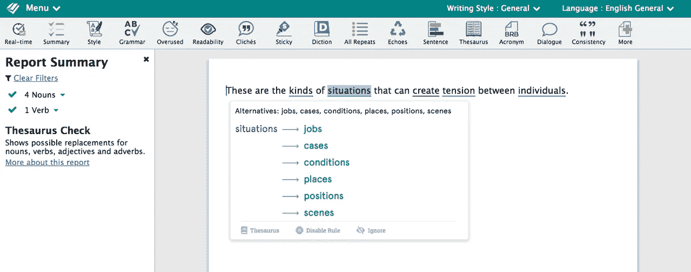

# 什么是增强写作平台？

> 原文：<https://medium.com/swlh/what-is-an-augmented-writing-platform-b28fa588a1c5>

在这个世界上，谷歌已经在很大程度上消除了文章旋转和关键字填充等黑帽营销技术，公司很快就意识到了一个重要的问题:在 SEO 方面取得进展的最佳方式是制作引人入胜、有趣且写得很好的内容，人们实际上希望阅读，最重要的是，希望分享。

对我们大多数人来说，这是个好消息。每个人——除了暴君和独裁者——都受益于充满免费有用内容的互联网。[不幸的是，一些人——可能是前面提到的暴君和独裁者——已经决定散布假新闻是另一种选择，但是一些聪明人已经在解决这个问题。]

虽然关注有用的内容对我们来说是好消息，但这也是大多数公司的问题。这是一个问题，因为制作写得好又有趣的内容并不容易。通常，公司里最有用的知识都集中在那些几乎没有制作引人入胜的内容经验的人的脑袋里。这些人通常是各自领域的专家，拥有天体物理学或语言学或工程学的博士学位，但几乎没有在学术界之外写作的经验——你的平均论文不是一篇引人入胜的作品。

此外，对于拥有多个作者的大公司来说，一个主要问题是保持作者之间一致的风格和语气。新的团队成员通常不知道既定的风格指南，需要快速熟悉，为众多出版物撰稿的自由撰稿人可能需要提醒您的具体要求。

那么企业如何解决这些问题呢？

# 增强的写作平台有助于解决这些问题

增强的写作平台通过以下方式帮助节省资金并吸引更多读者:

*   提高你写作的整体质量，消除不必要的单词和语法错误。
*   避免有偏见的语言，以免影响你的写作。
*   使用更积极的语言，更有可能实现你的目标。
*   坚持特定的房子风格和术语。
*   保持写作的一致性。

一个专业的文案编辑也能胜任许多这样的角色，但是他们花费更多，反馈循环更慢。我总是建议让文字编辑在你的作品出版前阅读它，但是如果他们不需要花时间去纠正那些可以被自动化系统发现的简单错误，你会从他们那里得到更多。

一个增强的写作平台是你自己的个人写作教练。它帮助你提高写作水平，分享你的想法。增强写作平台为你创造了一个积极的反馈循环来提高写作水平。它们不是为了取代人类而设计的，而是为了与人类合作，使人类的工作更容易，并提高写作过程的产出。一个好的写作平台应该激发人们对你正在写的东西、你正在使用的词语的思考，并通过反馈帮助你写出更好的作品。你也会注意到，随着时间的推移，你开始写出更好的初稿。

# 我们的世界塑造了我们的话语——也就是说，男人来自火星，女人来自金星

我们的话语往往是由我们特定的人生观形成的。这太好了，因为我们都有故事要讲。独特的声音使得写作读起来很有趣。不是让所有的作品听起来都一样，而是让所有的作品听起来都很棒。

你有没有想过，为什么有的人会说:“我明白你的意思”，而有的人会说“我听到你在说什么”甚至“我感觉到你了”？人们的话语是由他们的经历塑造的。我老婆是整骨师，这是一个特别有触觉的职业。触摸(行业中的“触诊”)是整骨医生的重要组成部分，也是他们在训练中积极发展的东西——他们通过多层纸练习感觉一根头发。对于不喜欢被触碰的人来说，一屋子的整骨医生会让他精神受创。类似地，一篇写满触觉词汇的文章可能会让那些受视觉或听觉等不同感觉驱动的人感到不快。同样，一篇充满阳刚之气的文章也会让女人感到不快。

像 [Textio](https://textio.com/) 和 [TapRecruit](https://taprecruit.co/) 这样的公司正在寻求解决职位描述领域无意中性别偏见写作的问题。他们测量了特定单词和短语对职位描述申请率的影响。哪些词会促使更多人申请某个工作，它们如何影响申请人的性别平衡？写工作描述时，男性比女性更倾向于使用男性词汇，这是很自然的。Textio 和 TapRecruit 所做的就是试图指出这一点。一旦你发现你使用的语言有偏见，就很容易改正。在这里，增强写作平台正在帮助你从不同的角度看你的写作。不是说一个视角更好或者更差，只是说他们不一样。逻辑表明，如果你能吸引更多不同的读者群，你的受众会更多。

在 ProWritingAid，我们正在采取一种更通用的方法来提高写作水平。ProWritingAid 旨在成为你的个人写作教练。该产品帮助你看到你写作的优势和劣势——它超越了语法检查，让你深入了解你的写作。例如，你是否意识到你的句子长度变化不够多？你意识到不同的句子长度很重要吗？有一份关于 T1 的报告。不同的句子有助于创造一篇文章的音乐。它们确立了文章的基调和节奏，引导读者阅读你的作品。一旦你意识到这一点，你就会开始自然而然地去做。

此外，您还可以使用 ProWritingAid 来开发您的个性化增强写作平台。和你一起工作的人会使用不恰当的语言吗？您可以为此创建一个规则。你有没有在公司里改了一个产品的名字但是大家一直用旧名字？您也可以在那里创建一个规则。你的初级销售人员在电子邮件中总是犯同样的措辞错误吗？创建一个规则！用途只受你想象力的限制。

# 正反馈同样重要

经常被忽视的是，积极的反馈在写作过程中也很重要。当你使用了吸引人的语言时，这是值得的。它甚至可以是一个目标——你必须在每封电子邮件中至少使用吸引人的短语，或者每篇营销帖子必须使用“你”或“你的”至少 5 次，并且不得包含“我们”或“我们”或“我们的”超过两次。

增强写作平台有数百种应用和潜在功能——我们只是刚刚开始触及表面。你已经可以看到谷歌在 Gmail 中的自动完成功能和谷歌文档中新的人工智能驱动的语法检查功能上紧跟潮流。

书面内容将在我们的生活中变得越来越重要。对写得好的内容的需求将呈指数增长。随着时间的推移，写作将成为我们学校中一个更重要的科目，增强的写作平台将成为我们制作杀手级内容的秘密武器。

以下是增强写作增长最大的一些领域(以及这些领域中的一些现有公司):

*   人力资源和招聘:职位描述，申请和审查。 [Textio](https://textio.com/) 和 [TapRecruit](https://taprecruit.co/)
*   法律写作:帮助撰写/审查合同。[字耙](http://wordrake.com)
*   销售邮件:语言如何影响邮件打开率。珀萨多和 T2 短语。
*   商务邮件:改进邮件。[回旋镖](https://www.boomeranggmail.com/)
*   语言学习:对语言学习者的实时反馈
*   一般/内容写作:[语法](https://grammarly.com)和 [ProWritingAid](http://prowritingaid.com/) (美国)

使用 ProWritingAid，您可以创建自己的强大规则来匹配任何文本。您可以使用我们的[文本分析 API](https://prowritingaid.com/en/App/API) 和[文本高亮组件](https://prowritingaid.com/en/App/BeyondGrammar)将其集成到您自己的软件中。如果你想讨论一个增强的写作平台如何帮助你的公司，那么请[联系](https://prowritingaid.com/en/Home/Contact)。

## 这篇文章发表在 [The Startup](https://medium.com/swlh) 上，这是 Medium 最大的创业刊物，拥有+385，320 名读者。

## 在这里订阅接收[我们的头条新闻](http://growthsupply.com/the-startup-newsletter/)。

