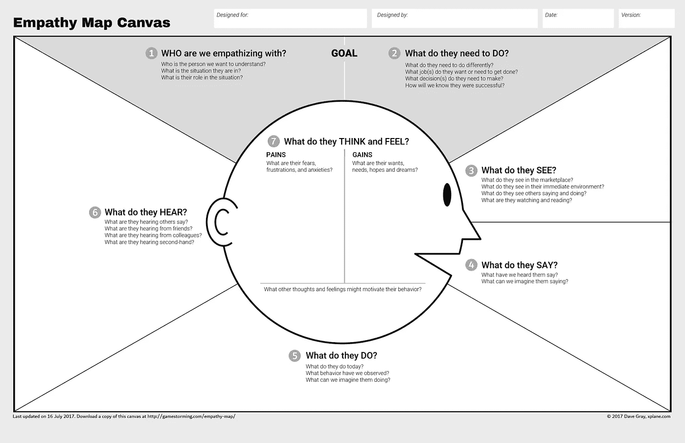
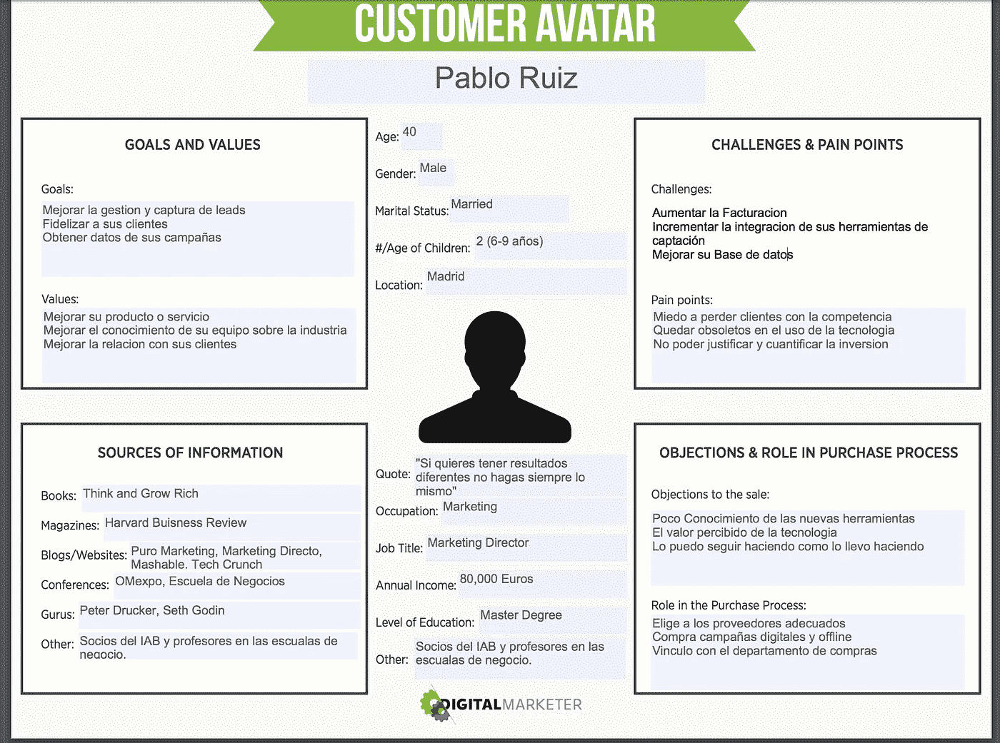
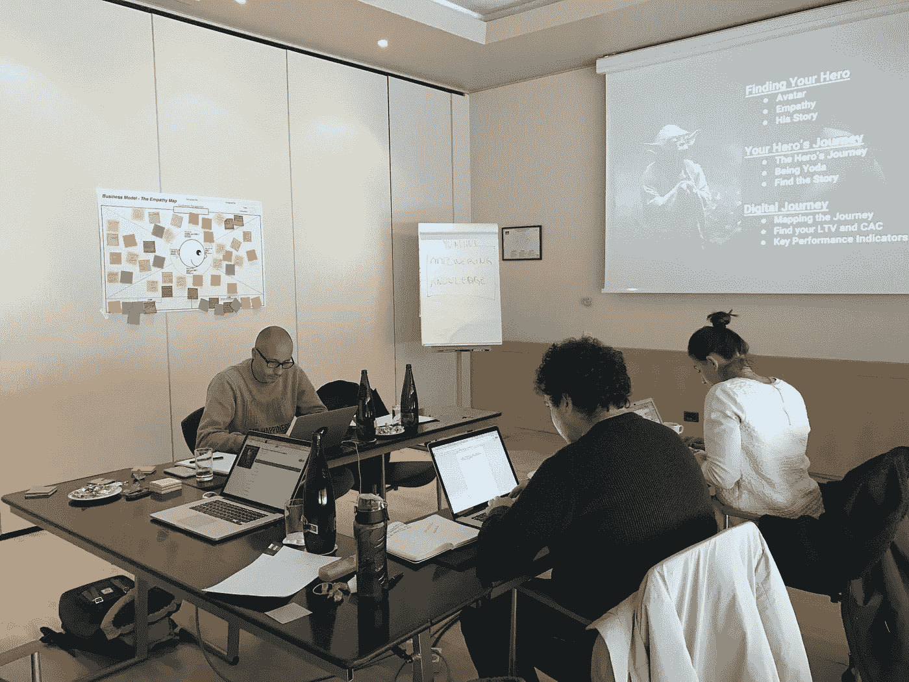
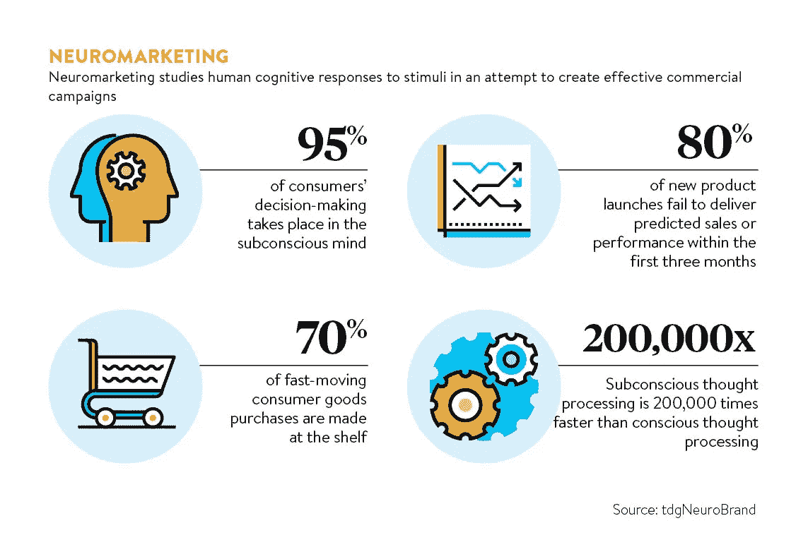

# 什么是移情图，为什么它对你的业务有价值？

> 原文：<https://medium.com/swlh/what-is-an-empathy-map-and-why-is-it-valuable-for-your-business-14236be4fdf4>

移情图是一种协作工具，可以帮助团队更好地理解他们的角色。如果你不熟悉某个头像，可以查看我的 [**上一篇文章**](/swlh/choose-wisely-your-target-audience-is-out-there-somewhere-456414dc4360) **中讨论了制作一个头像的过程。**

在我们开始这个过程之前，让我带你了解一下移情心理学，它是一个多么强大的工具，不仅在商业上，而且在我们的个人生活中。

下面是来自[今日心理学](https://www.psychologytoday.com/basics/empathy)的共情定义。

*“同理心是从他人的角度理解另一个人的状况的体验。你站在他们的立场上，感受他们的感受。众所周知，同理心会增加亲社会(帮助)行为。虽然美国文化可能会使人们变得更加个人主义而不是移情，但研究发现了“镜像神经元”的存在，这种神经元对他人表达的情绪做出反应，然后复制这些情绪。*

同理心是推动决策和企业对外部市场因素做出反应的力量。当我们变得对客户感同身受时，我们就开始为他们提供更好的服务和产品，增强他们对我们品牌和服务的认知。

同理心让我们能够理解我们的客户、家人或朋友的需求。当你有机会销售“必备产品”，变得更有利可图并赢得更高的市场份额时，就没有必要制造“有就好”的产品。

## 为什么有些产品会失败？

大多数公司都过于专注于解决对他们来说很重要，但对他们的客户来说可能不重要的特定问题。做粘人的产品！(顺便说一句，这是一本值得一读的好书，作者是奇普·希斯和丹·希斯

一些公司需要取悦他们的股东，他们往往会忘记他们的客户，其他公司缺乏市场验证来确定产品是否有必要，甚至认为创意可以通过创造一个新的概念、产品或服务来传播。

根据我的经验，大多数产品失败的原因是他们缺乏对目标受众的了解和认知，他们缺乏同理心。

要么他们搞不清楚谁是他们的观众(他们的虚拟形象)，要么即使他们知道谁是他们的虚拟形象，他们也无法在情感上与他们交流。**这就是为什么在设计或推出新产品时，移情图如此重要。你将能够发现你以前不知道的潜在客户。**

**你可以选择，互相交谈，或者倾听并探索各种可能性。**

因此，让我们直接投入进来，着手制定移情图。这是最好的活动之一，尤其是在团队中，因为他们能够更好地了解你的顾客。

你的团队会发现一些小的触发点，这些触发点在与你的观众交流时会很有用，你会对你的营销策略感到更舒服，并在这个过程中节省时间和金钱。

移情图是由戴夫·格雷创建的，最近已经更新，变得更加精确和高效。

Download [full resolution here](http://gamestorming.com/wp-content/uploads/2017/07/Empathy-Map-Canvas-006.pdf)

你可以做的一件事是把移情图打印在一张大纸上，放在你办公室的某个地方。让您的团队使用便利贴写下每个象限的答案，并将其贴在地图上。这将允许你的团队协作，并直观地看到同理心地图如何开始填充关于你的客户的新见解。

**共情地图有六个象限:
1-目标(我们与谁共情？他们需要做什么？)
2-他们看到了什么？他们说了什么？他们是做什么的？他们听到了什么？
6-他们的想法和感受是什么(痛苦/收获)**

# **象限一:从目标部分的顶部开始。**

1-我们在同情谁？
在这里简单定义一下你的头像，一定要确定这个人，他们的情况是什么，他们的作用等。[看看这篇关于制作你的虚拟形象的文章。](/swlh/choose-wisely-your-target-audience-is-out-there-somewhere-456414dc4360)

2-他们需要做什么？
记住我们在目标部分，他们需要做什么改变才能达到目标，他们需要做什么决定？什么会促使他们成功，我们如何才能找到答案？

**举例:** 在我们的案例中，我们有一个现场活动行业的营销平台( [Yumiwi](https://www.yumiwi.com/) )。

我们将我们的化身定义为一名 40 岁的男性营销总监，他在测量和获取有价值的事件数据方面有严重的问题。他通常希望通过使用新技术不屈服于竞争。他经常试图收集大量关于客户的信息，以便更好地了解他们。他使用过业内的其他平台，但发现自己被在活动中收集的大量不相关的数据淹没了。他不知道自己能有什么解决方案，并对活动行业缺乏软件集成感到沮丧。

Our Avatar — in Spanish, sorry English speakers :)

因此，我们已经确定了他是谁，从这些信息中，我们可以了解他需要做些什么来达到在事件中获得可操作的数据点的目标。他的目标是拥有一个集成的系统，在这个系统中，他可以收集线索，激活它们，记录它们的体验，并访问一个实时仪表板，所有信息都在一个地方。

他担心的是:竞争中失去客户，没有将他们的活动空间数字化，甚至因为一个更年轻、更懂技术的人而丢掉工作。

我们的团队会在便利贴上写下所有这些属性，并将它们放在目标象限中。

Product Development Team [Yumiwi](https://www.yumiwi.com/) at an Empathy Map session.

# 象限二:他们看到了什么？

他们在市场上看到了什么？其他和他们类似的公司在做什么？他们看到了行业的变化吗？这些头像的杂志、博客或者文章在业内都在谈论什么？

所有这些信息对于理解他们的外部刺激，这是如何影响他们的，或者这将如何影响他们的决策过程是有价值的。

如果我们能感同身受，我们就能与他们交谈，并向他们提出缓解变化的解决方案。我们必须积极主动地了解我们如何能够产生更多的信任，并让我们的产品成为他们预见的紧迫问题的解决方案。

# 象限三:他们说什么？

他们的反应是什么？他们在对我们或其他人谈论什么？我们想象他们在说什么？

这里要小心，不是所有人说的都是真的，可能是受周围环境的影响，或者是说一套做一套。所以请仔细阅读这一部分，因为在这里你可以发现他们所说的和他们所做的和所听到的之间的差异。

通常，我们一起分析象限三、象限四和象限五，因为我们开始意识到，在我们进行移情图的最终分析之前，有几个不一致的地方我们想要控制和理解。

人们经常说一套做一套，特别是如果他们没有被准确告知这个行业的话。所以我们的工作是适当地教育他们我们产品和服务的重要性。了解事实，并与你的受众分享，让他们基于确定性而非品牌流言做出最终决定。

# **象限四:他们做什么？**

那么他们的实际行为是什么呢？他们表现如何，为什么？我们能想到他们会做什么？

为了更好地理解他们，我们必须足够舒适地察觉他们言行之间的微妙变化。

他们使用特定的软件吗？他们是在购买某个特定的品牌吗？他们为什么倾向于这样做。也许他们不知道比他们使用的产品更好的新产品，或者他们甚至不知道你的品牌的存在。

你应该能够理解这些行为，并制定出明确的策略来改变他们的表现。教育和帮助他们购买特定的产品或服务，增加价值。

顾客和品牌之间应该一直有价值交换。假装拥有客户而不增加价值应该被抛弃，重新制定为:**内容、意义和信任。**

# 象限五:他们听到了什么？

推荐永远是最好的销售方式。您的客户从同事或朋友那里听到了什么？尽管听觉很吸引人，但有一种更强有力的方法可以让你的潜在客户选择你的产品。

回到我在佛罗里达州劳德代尔堡(诺瓦东南大学)上大学的时候，我竞选我们学生会的主席，当我们赢得选举时，我们制作了一些衬衫，上面有一句很有说服力的话，直到今天，这句话还出现在我关于我客户的所有决定中。

[约翰·盖伊](https://www.brainyquote.com/authors/john_gay)，17 世纪的一位英国诗人写道:

***“告诉我，我忘了，展示给我，我记住，让我参与，我理解。”***

你想听的都能听到，你可能会被别人说的话影响，但是你参与进来就服气了。如果你需要买一辆车，你需要试一试这辆车，参与其中，开着车到处逛逛再做决定。买房子、买电话、买衣服、在超市品尝食物、在摊位上买免费的帽子和 t 恤等等，也是如此。

品牌需要与他们的顾客接触。但是，为了让顾客参与进来，品牌需要与他们的受众产生无缝、无摩擦的体验。**换位思考是关键！**

你可以在实体上做到这一点，这将使你的品牌不得不投资于贸易展览、活动或人们见面和联系的地方，或者你可以数字化。

现场活动通常更自然，一个引人入胜的故事，一个很好的体验会让你的观众参与进来，并被你所提供的东西所激励。

如果你真的要数字化，你需要通过一个故事，一些能让他们参与并沉浸在你试图销售的东西中的东西，来建立情感上的联系。

试着让你的头像在你的信息中感到迷失，如此投入，以至于每个人都会购买和推荐你的产品，甚至让它成为病毒，谁知道呢，问题是，你了解你的客户吗？

因为下一个象限可能更复杂。

# 象限六:他们的想法和感受是什么？

他们最怕什么？他们是否对自己的现状感到沮丧、焦虑，甚至是担忧？找出他们的痛点。

然后，确定他们的收获，他们的梦想，和希望，他们想要什么！

理解你的虚拟形象的大脑可能比你想象的更具挑战性，但是不要担心，总有一个解释可以解释为什么我们的大脑会这样工作。如果你有兴趣了解更多关于神经营销的知识，你应该看看这本书:[神经营销:理解顾客大脑中的购买按钮](https://www.amazon.com/dp/B004VF62OI/ref=dp-kindle-redirect?_encoding=UTF8&btkr=1)

你需要通过他们的渴望和恐惧来理解他们的行为；这将决定他们是否购买或绕过你的产品。

# **我思故我买。**

对我们来说，制作虚拟形象和应用移情图开始让我们清楚地了解我们的客户是如何表现的，以及我们的营销实践有多错误。

这让我的团队能够调整信息，找到正确的语气，并使用正确的技术来更有效地接触我们的观众。

你可能需要几个疗程来确定移情图的某些部分。但是，只要你对你的顾客感同身受，你就会明白许多秘密，让你更接近他们。

记住客户不是数字，是人；他们有感情，有家庭，有情感，就像你我一样。他们应该受到最大的尊重。他们也有爱好，有空闲时间，可以上网，你打算在哪里花费你的营销努力来瞄准他们？

继续推进你的舒适区，看看这个同理心地图练习会带来什么。

**情感交流的艺术触手可及，请明智使用！**

[*下一篇文章我将带你走完英雄之旅，我将教你如何识别英雄之旅中你的头像在哪里，以及如何改进你的信息让你的客户成为英雄！*](/swlh/grow-your-business-know-thy-hero-5107d28dd23f)

祝你生活愉快！

## 这个故事发表在 [The Startup](https://medium.com/swlh) 上，这里有 266，600 多人聚集在一起阅读 Medium 关于创业的主要故事。

## 订阅接收[我们的头条](http://growthsupply.com/the-startup-newsletter/)。

