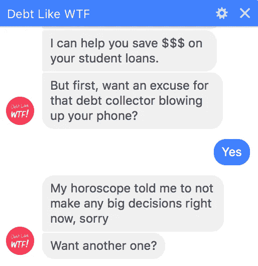

# 什么是对话设计，如何设计你的聊天机器人

> 原文：<https://medium.com/swlh/what-is-conversation-design-and-how-to-design-your-chatbot-3754f04ab1e7>

## 对话设计师将是数字营销的下一波工作。以下是他们的做法，以及如何创建一个战略聊天机器人。(另外—免费资源！)

[@needcoffeebot](http://twitter.com/neecoffeebot) is one of my earliest bots. It’s a bit over caffeinated…

当社交媒体工作在 2010 年左右首次成为“一件事”时，没有任何具体的描述。没有社交媒体机构、社交战略家、社交媒体编辑，当然也没有对这些工作的描述。作为最早的社区管理者之一，我是行业发展的一部分，并有幸参与其中。我从社区经理到社交媒体专家，到社交媒体作家，到高级社区经理，社交媒体经理，最近又成为社交媒体顾问。现在，有了聊天机器人，感觉我们又回到了那个时候。谁来写呢？谁决定机器人应该走哪条路？谁创造了人格？当他们失败时会发生什么？我们如何营销和宣传它们？

进入*对话设计者* ***。***

到目前为止，人们使用聊天机器人，比如“对话式用户界面”[聊天机器人作家](https://uxwriterscollective.com/chatbot-writing/)“人工智能作家”“人工智能交互设计师”我就叫它什么吧——对话设计师*。就业市场总得从某个地方开始，对吧？*

# 那么什么是对话设计呢？

**人格建设。区分一个令人难忘的机器人和一个无效的机器人的关键是个性。我注意到许多 bot-first 公司的一个特点是它们听起来都一样。这是为什么呢？它们是由开发者而不是作者写的。对话，虽然功能性的，是非常线性的，没有一个有创意的作家可能包括的惊喜。当很多机器人失败时，他们会说“对不起，我没听懂你的话。”用户会感到沮丧。**

**像 WTF** (我设计的一个机器人)这样的债务在构建他们的机器人时都投入了个性，结果，他们的参与度大大提高，他们降低了客户获取成本。

下面这个来自 [Mav](http://hiremav.com) 客户[天堂生活](http://m.me/havenlifeinsurance/)的例子，当对话设计正确的时候，个性就会闪耀。许多品牌花了几个月的时间开发他们的数字个性，看到这转化成聊天机器人会让用户高兴**和**帮助他们回到正轨，而不是让他们沮丧。

**文案。**捕捉个性是创建一个令人愉快并能改变他人的机器人的关键，但在对话设计中，成为一名能在狭小空间工作的文案是必不可少的。类似于社交媒体文案，每个字都很重要。显示屏只有这么大，在聊天机器人中，按钮甚至更小，但仍然有机会用 gif，表情符号，当然还有复制来发挥创意。

**UX。**我们将何去何从？在设计聊天机器人时，对话设计者必须创建和构建用户*可能*采取的所有路径，以达到最终目标(比如获取报价、拨打电话号码、购买某物)。一些用户可能需要更多的手握，一些用户可能会尽力让机器人“失败”。这就像选择你自己的冒险书籍或电子游戏，而不是电视节目。它是非线性的，你设计的机器人越灵活，它就越吸引人。机器人的故事情节越多，用户就越有可能想再次使用它，就像当一个玩家打败了一个视频游戏一样。

When UX and Conversation Strategy get a bit…complicated

**对话策略——就目前而言。我认为对话策略师将是聊天机器人的下一阶段工作(就像我们看到的社交策略师脱离社交媒体经理一样)。写剧本是难题的第二部分。首先，你需要知道你想写什么。提出概念，它们如何随着品牌计划的发展而演变，以及机器人的具体、可衡量的目标是什么，从而区分成功和失败。一个战略家建立主要的对话流程，为观众确定特征集(我们是否有集成，用户是否能够打字，等等)，并确定我们如何通过流程最好地达到我们的机器人的目标。此外，一旦机器人在野外，战略家可以根据 KPI 跟踪性能反馈，并计划未来的发展。现在，设计师和战略家很容易合二为一，但我希望看到人才在这两个领域分别发展。**

# 你到底是如何设计一个对话的？

你知道什么是对话设计者，现在你想开始为机器人写作。现在，有一些工具可以用来创建非线性脚本(就像视频游戏设计师会使用的)，但由于我们仍处于该领域的早期，这些工具还没有完全开发出来。我将把重点放在基础上，把执行工作留给你，未来的对话设计者。

> ***嘿，是我，未来的希拉里，插一句*** 几年前我写了这篇博客，我完全被你们对对话设计的兴趣打动了！**因此，我** [**开发了一个在线课程**](https://uxwriterscollective.com/chatbot-writing/) **，给你编写&设计聊天机器人的准确工具和深入过程，并成功成为一名对话设计师。如果你喜欢到目前为止已经读过的东西，那就继续读下去吧！而如果你想继续学习，[**在这里报名参加课程**](https://uxwriterscollective.com/chatbot-writing/) **。**现在，回到岗位上！ *******

# 以下是我设计对话的方法

1.  **概述。**像大多数故事和论文一样，以提纲开始会让你对需要写的东西有一个清晰的了解。一旦你为你的机器人创建了策略，概述你将需要达到你的最终目标的所有流程。知道你需要一个切入点，但也知道有多种方法可以解决一个问题。这将是机器人的“骨骼”，当您开始为每个流程起草副本时，您可能会发现需要添加到流程中的新路径，以便以自然的方式继续对话。
2.  **流程图。除了提纲，创建流程图是查看对话如何连接的最佳方式。你的机器人中有没有可以再次提问的点，或者用户会被重定向到另一个流程中的另一个点？你的信息流越多，你的地图就越复杂，但这是一个向你的客户传达你的谈话策略的好方法，也是你写剧本的指南。我经常使用像 [Draw.io](http://draw.io) 或 [Lucidchart](http://lucidchart.com) 这样的线框工具来创建流程图。您还可以使用对话设计专用工具，如 [Botmock](http://botmock.com) 、 [Voiceflow](http://voiceflow.com) 和 [BotSociety](http://botsociety.io) 。这些将让你从一个流程图开始，并让你测试你的体验(甚至发布它！)**
3.  **剧本。一旦你有了大纲和地图，你就可以开始扩展脚本了。我发现最简单的方法是从你知道的机器人内部的具体流程(你应该已经概述过了)开始，当你写的时候，跟踪用户可能会感到困惑的任何点，或者想得到一个不同于你的线性故事的答案。这些最终将扩大到额外的流量。我已经在[的 Google Sheets](http://bit.ly/chatbotscripttemplate) 中创建了自己的脚本模板，并提供给任何人使用。这是我用来写每一个剧本的！**

Here’s a tutorial for using [my script template](http://bit.ly/chatbotscripttemplate)

4.**主要流向。**主要流程是 1-3 条主要“路线”,用户可以沿着这些路线完成机器人的目标。这些将是你的脚本中最健壮的部分，并且可能在某些点上相交。在构建你的大纲时，一种思考方式是，主要流程代表脚本的章节。

5.**你好，再见。看似简单，但你对机器人的第一印象至关重要。尤其是如果你是通过广告获取用户，当他们发起机器人，体验应该从广告延伸。此外，你还需要创造退出体验。也许没有，也许你提供联系信息或交给一个人，无论哪种方式，这需要草拟出来。**

6.**捕捉所有状态。**这就是我之前说的那个性格戏。无论你写得多么完美，它都会失败。可能是技术上的缺陷，可能是你没有想到的用例，或者最有可能是有人故意试图破坏你的机器人。拥有一个创造性的解决方案来说“哎呀，我们搞砸了，让我们再试一次”是谈话设计者能做的最有力的事情之一。考虑机器人回复什么，它如何试图将用户拉回正轨，它会将用户放在流程中的什么位置，以及如果机器人失败不止一次会发生什么(因为它会失败，相信我)。

要查看这个工作流程的摘要，并了解更多关于这个过程的信息，请下载我的电子书 [**如何从头开始设计聊天机器人脚本**](http://gum.co/conversationdesign) **。**

# 谁会成为优秀的对话设计师？

根据我作为谈话设计师的经验，以及作为雇佣他们的人，我认为这些人会成为出色的谈话设计师。在社交媒体对话流、B2B 用户体验和创意写作方面:

*   社交媒体经理
*   文案，尤其是在数字和社交领域
*   剧本作者
*   即兴喜剧演员
*   视频游戏设计者和爱好者

# 准备好开始了吗？

你兴奋了吗？你认为你会在对话设计方面取得成功，并希望成为构建未来对话的一部分吗？**这里还有一些工具可以帮助你快速提高技能:**

 [## 如何设计聊天机器人脚本电子书

### 你是否迷失在如何为你的聊天机器人写文案的思考中？被缺乏工具和…

hillaryblack.gumroad.com](https://hillaryblack.gumroad.com/l/conversationdesign) 

[**我的电子书**](http://gum.co/conversationdesign) : *如何从零开始设计聊天机器人脚本*。这是编写聊天机器人脚本的基本步骤指南，包括我使用的工具、开始的流程以及我的最佳实践。包括免费工具！

[**日常对话设计挑战**](https://duxw.co/dcdc) **:** 为期 14 天的免费挑战，练习你的对话设计技巧，来自广受欢迎的《每日 UX 写作挑战》的乡亲们。每天一个新鲜的提示，还有一个 Linkedin 群可以发帖获取反馈！

[**【我的脸书群，聊天机器人设计师互联网俱乐部**](http://facebook.com/groups/conversationdesigners) 】:加入社区，提出问题，分享你的作品，从真正的对话设计师那里了解更多关于这个领域的知识——他们中有 2000 多人！

[**我的 Youtube 频道:**](https://www.youtube.com/channel/UCrG8jdRRYHAEK58kaUwuAFQ) 在这里你可以找到我所有的网上研讨会和研讨会录像、对话设计 Q & As、教程以及我作为对话设计师的生活。

[**我的在线课程，聊天机器人写作&设计**](https://uxwriterscollective.com/chatbot-writing/) **:** 最深入地增长你的技能，开始你的对话设计师生涯！学习基础知识和创建策略的确切过程，编写对话，为你的投资组合创建原型。你还将获得 UX 作家协会的认证。在此**[**免费查看课程前两节课的预习。**](https://uxwriterscollective.com/write-and-design-chatbots/)**

****

**嘿，我是希拉里，你的网友好友。我是 [Mav](http://hiremav.com) 的营销和对话设计主管，是销售&增长型营销的人工智能短信助理。**

**想谈论机器人、对话设计还是社交媒体？在 Twitter 上点击我**，在*[*Linkedin*](http://linkedin.com/in/hillaryblack)*[*上联系我加入我的 2000+对话设计师脸书群*](http://facebook.com/groups/conversationdesigners) *！*****

********

## ****这篇文章发表在 [The Startup](https://medium.com/swlh) 上，这是 Medium 最大的创业刊物，拥有 285，454+人关注。****

## ****在这里订阅接收[我们的头条新闻](http://growthsupply.com/the-startup-newsletter/)。****

********