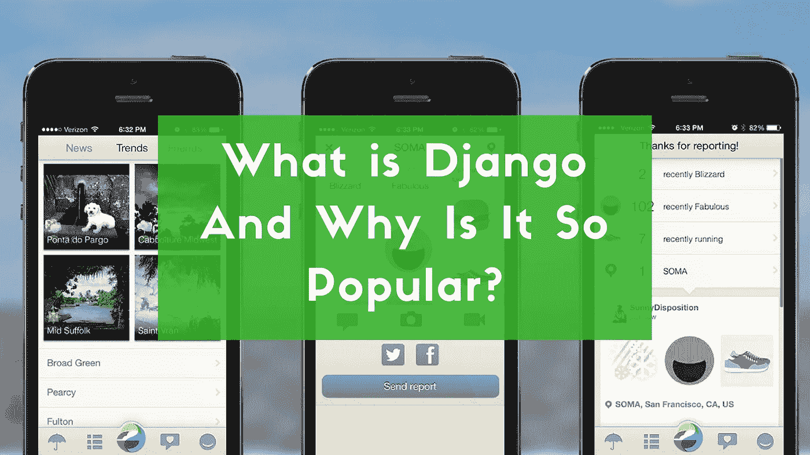
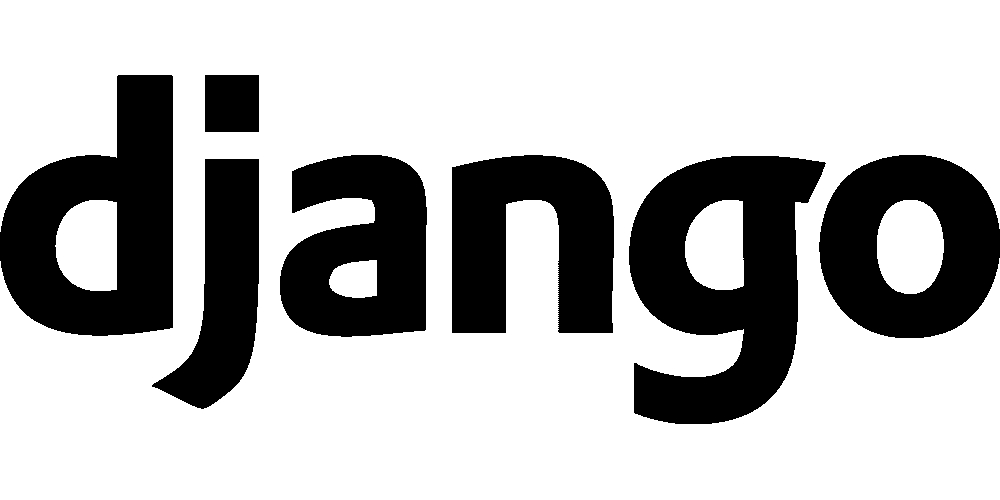

# Django 是什么，为什么这么受欢迎？

> 原文：<https://medium.com/swlh/what-is-django-and-why-is-it-so-popular-2b225620cca0>

jango 在 Rails 的第一波热潮兴起时出现，因此它立即被定位为 Python 对 Rails 的回应，因此几乎从一开始就吸引了眼球。如今，学习 Python 的最大优势之一是它赋予了您使用 Django 的能力。随着科技创业公司现在如此热门，构建自己的 web 应用程序从未如此简单或有趣。姜戈可能就是你的答案。它因其实用的设计和易用性而迅速受到欢迎。

Django 是一个高级 Python Web 框架，鼓励快速开发和实用、简洁的设计。web 应用程序框架是所有 web 应用程序需要的组件的工具箱。这里的目标是让开发人员不用一遍又一遍地实现相同的解决方案，而是专注于他们的项目中新的和独特的应用程序部分。事实上，Django 比其他框架功能更加全面。它解决了 Web 开发的许多麻烦，让您专注于编写应用程序，而无需重新发明轮子。它是免费和开源的。此外，Django 框架使您能够对您的域和代码类进行建模，在您知道之前，您已经有了一个 ORM。让我们仔细看看，更好地理解它的好评。

# 它经受住了时间的考验

通常，您会注意到 Django 是对新漏洞做出反应的第一批框架之一。它的核心团队通常提醒其他框架他们应该制作补丁。关于 Django 的稳定性有很多要说的。虽然没有人声称每个小错误都被修复了，但是很多错误都被修复了。今天，很多 Django 版本都关注于边缘案例和新特性。也许软件不会随着年龄增长而变得更聪明，但它通常会做出更好的决策。

# 你有足够的 Django 包

Django 社区和 Python 社区一样，贡献了大量有用的包和实用程序供世界各地的人们使用。在 PyPI 上输入“Django ”,你会看到超过 4000 个可用的软件包，这是 Django“包括电池”的心态的顶部。这个框架很可能包含你想要的所有东西。

# 它已经过大众测试

与 Rails 和 Node 相比，Python 和 Django 更安静一些，这两者都从他们的大用户那里得到了大量的[宣传](https://www.datadab.com)。当然，这并不意味着某些大牌不用 Django。Django 为 Instagram 和 Pinterest 等许多最常用的网站提供支持，甚至脸书也使用 Django 的许多幕后工具。Django 来自出版业，所以像华盛顿邮报和史密森尼杂志这样的网站使用 Django 也就不足为奇了。

# 姜戈有很棒的文档

Django 带着远远超过开源项目通常标准的文档走进了这个世界，并且随着时间的推移，它变得越来越好。当它最初问世时，优秀的文档是 Django 与众不同的特性之一。当时的大多数其他框架仅仅使用了按字母顺序排列的模块列表以及所有的方法和属性。这对于快速参考很有用，但是当您第一次在框架中找到自己的脚时，却没有帮助。Django 的文档质量不再是独一无二的，但它仍然是开源文档领域的最佳范例之一。维护文档的质量一直是 Django 开发人员关心的问题。你看，医生是姜戈世界的一等公民。

# Django 社区非常支持

人们常说社区是 Python 世界最好的方面之一，对于 Django 世界来说更是如此。Django 由 Django 软件基金会或 DSF 管理。涉及 Django 的每个事件都有行为准则。事实上，DSF 已经发布了关于多样性的声明，对他们设想的社区类型采取了官方立场。在许多社区中，像 IRC 和邮件列表这样的地方是不受欢迎的，有时甚至是有害的。在这里，你会发现它们非常令人愉快。当然，偶尔会有烂苹果，但它们会被迅速处理。多亏了这些政策，很多像姜戈女孩这样的团体蓬勃发展。

# Django 提倡搜索引擎优化的最佳实践

Web 开发人员和 SEO 并不总是友好相处。开发人员的工作和搜索引擎的优化，经常看起来是相互矛盾的。有了姜戈，你会发现这不是问题。不为别的，Python 的 Django 框架提倡使用人类可读的网站 URL，这有助于搜索引擎，不仅从实际用户的角度来看有帮助，而且在对网站进行排名时使用 URL 中的关键字。你的搜索引擎优化团队会非常感激。此外，确保 URL 不仅仅是一系列随机的数字和字母，而是有意义的。

# 可量测性

Django 当然非常适合入门，而且令人惊讶的是，它在扩展方面也非常棒。Django 的核心是一系列组件，默认情况下已经连接好，随时可用。现在，由于这些组件是解耦的，彼此不依赖，当您的启动需要更具体的解决方案时，它们可以被拔掉并替换。

# 安全性

默认情况下，Django 比 PHP 更好地防止了许多常见的安全错误。首先，Django 通过动态生成网页和通过模板向网络浏览器发送信息来伪装或隐藏您站点的源代码，避免在互联网上直接查看。

> 最后，对于 Django 的营销方式，还有一些要说的。或者说，长期缺乏营销。至少在某种程度上不是，比如说，Rails 被市场化了。不久前，[的营销工作](https://www.datadab.com)主要包括在 PyCon 上的演讲，人们的博客，然后主要是在框架上工作，用它构建惊人的东西，让结果自己营销。现在，当然，有 DjangoCon 和 DSF 和以商业为导向的顾问做培训课程和许多书籍等等，但这一切都还很新。最后，上面列出的因素是 Django 自发行以来受欢迎程度稳步上升背后的一些主要因素。

*原载于* [***产品洞察***](https://www.cognitiveclouds.com/insights/what-is-django-and-why-is-it-so-popular/)**来自 cognitive clouds:Top*[*Web App 开发公司*](https://www.cognitiveclouds.com/custom-software-development-services/web-application-development-company)*

**

## *这篇文章发表在 [The Startup](https://medium.com/swlh) 上，这是媒体最大的创业刊物，拥有 292，582+人关注。*

## *在这里订阅接收[我们的头条新闻](http://growthsupply.com/the-startup-newsletter/)。*

**