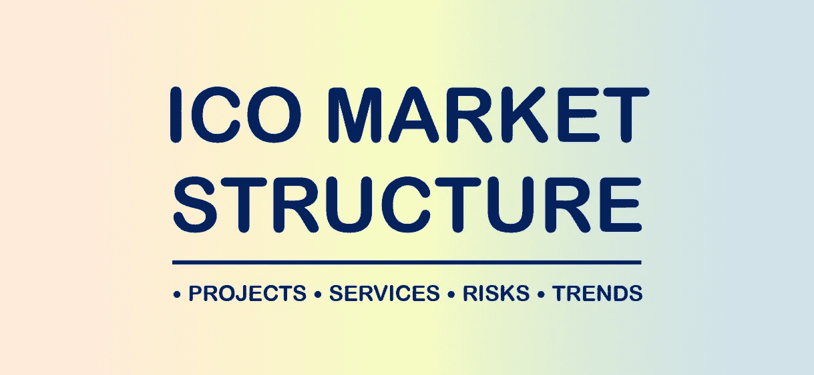
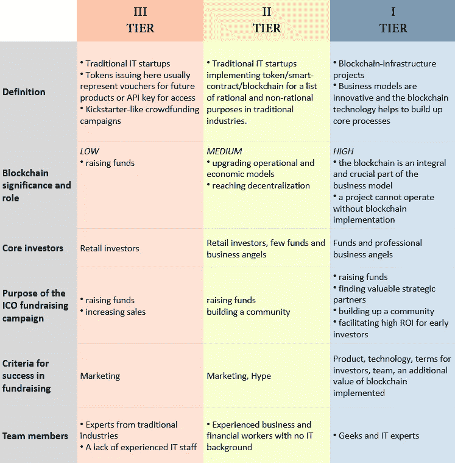
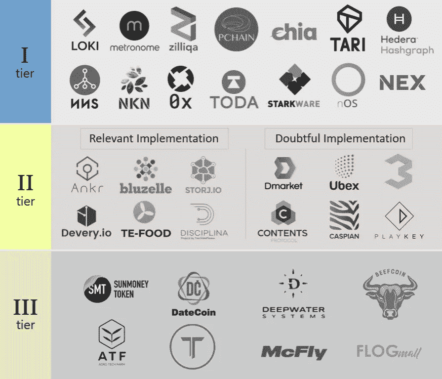
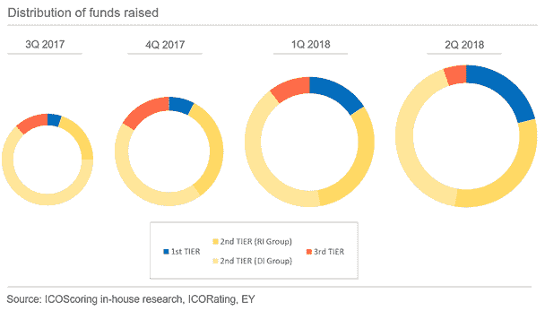
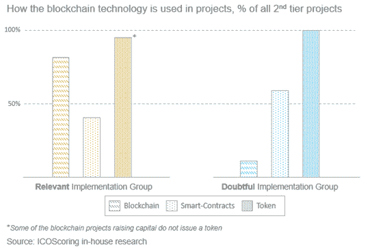
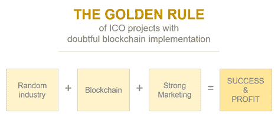

# ICO 市场发生了什么变化？三类项目

> 原文：<https://medium.com/swlh/what-is-happening-on-the-ico-market-three-types-of-projects-332d3783a65>

# [1]启动 ico 的三级项目

最近，我们发现区块链创业公司周围的市场戏剧性地出现，并变得更加系统化透明。然而，ICO 市场仍然模糊不清，缺乏政府监管。一方面——它纠缠着任何系统化；另一方面，这个市场正在为寻找高回报机会的风险投资者提供一个新的利基市场。本文旨在让您更好地了解 ICO 市场，概述主要参与者，强调主要趋势，并了解发起 ICO 活动的主要原因。

在我们的分析中，关键的一步是将所有区块链初创公司的融资分为三个主要层次。

请注意，等级并不代表项目的质量。引入这种分类是为了更好地描述市场，而不是选择最佳投资领域。

这些层的特性可能不适用于特定层中的每个项目。区分项目正确等级的优先标准是 1)其行业和 2)实施的区块链技术是否有合理的基础。

下表将有助于更好地理解这种分类。请注意，上表中的所有特性并不完全适合下面的项目，但展示了它们的核心差异。

Three tiers of ICO projects

# [2]第三层—不需要 ICO 的人

我们将从最不吸引人的第三层开始介绍这种结构。这些项目推出 ico 的目的只有一个——筹款。区块链整合并没有给他们的商业模式增加价值，这里的代币发行似乎是最简单最便宜的融资方式。这里的代币通常只是简单的代币或者风险极高的安全代币。

有时，投资者的目标不是获得高投资回报——他们可能想要支持一个项目。在这种情况下，ICO 活动基本上类似于众筹活动，就像 Kickstarter 上发生的那样。

需要注意的是，这些项目的风险最高。以下只是其中的一部分:

*   *三级项目容易受到非区块链竞争者的攻击，这些竞争者更喜欢积极的业务发展，而不是无用的代币发行和筹资活动*
*   *代币很可能是无用的，这可能导致其价值崩溃*
*   *不考虑投资者意见的戏剧性转折*
*   *团队可能没有动力提高代币价格*
*   *最终产品价格可能会明显低于最初的预期*
*   *公司业绩与股票价格没有直接关系*

第三梯队项目经常指责银行和其他金融机构对他们不公平。人们必须考虑并记住，银行、风投、天使等的无知。通常有一个基本原理，表明项目的投资吸引力较低。同样清楚的是，第三层项目极有可能变成骗局。此外，第三层项目往往被证明是庞氏骗局。幸运的是，随着加密社区成员金融素养的提高，我们看到了这类项目数量减少的总体趋势。

我们希望在未来看到的积极的事情是更严格的政府监管和更多的股票代币发行——小投资者将有机会参与类似 IPO 的活动，进入门槛更低，受到政府的保护，免受欺诈。

# [3]第二层——市场的核心

ICO 项目的第二层可能代表市场的核心部分。主要原因是，根据 ICOSCORING 最近的内部研究，这类项目占了市场上筹集的总资金的大部分——约 80%。我们将这一层分成**两个组**，这两个组与业务模型中涉及的区块链技术相关:“相关实现”和“可疑实现”，这将在后面描述。

ICO 募集资金的美元表示不能作为精确计算的对象，因为汇率波动和团队为操纵需求而显示的一些人为数字。因此，这张幻灯片旨在展示我们在这一年的活动中所见证的趋势和比例。二线市场份额仍占主导地位，但略有下降。

4Q 2017 面临着筹集资金的三线项目急剧增加。这是投资者和发行者对新来者的 ICO 炒作的顶峰。第二类人受到在 ICO 市场筹集资金的成功故事的启发，这使他们渴望重复这种想法，因为他们经常有疯狂的想法，但对 ICO 本身没有理性的依据。

另一个趋势是一级项目的比例更高。我们认为原因在于 1)投资者更高的金融素养，以及 2)将炒作转移到这一层。投资者学会了识别潜在有害的项目和潜在有前途的项目，这些项目在过去已经证明了高回报。底线是第二层仍然占主导地位，“ICO”作为一种现象通常与这一层相关联。

正如您在文章开头的表格中注意到的，我们将二级项目定义为那些在现有行业中获得创意并找到区块链技术的实现的项目。这个故事看起来很容易被投资者理解，也解释了它为何如此受欢迎。区块链的实施可能是一个很好的选择，也可能会变成一个糟糕的选择。这也是我们构建这一层的原因。

区块链技术(在其一般定义中)可以以 3 种主要形式使用:

1.  *代币*
2.  *智能合约*
3.  *高级区块链功能(分布式分类账，“区块链”等。).*

例如，一个项目可能会发行一个令牌并将其集成到其业务模型中，但避免应用智能合同和全套区块链功能(如经过验证和值得信赖的交易历史)。

**在继续之前，让我们来看看这些功能以及它们是如何在我们的两组二级项目中使用的。**

**【3.1】“相关实施”组**

这个小组的项目仍然在传统行业中实施区块链技术，但做得很好。由于这种结构，他们广泛使用区块链技术在其所有功能。以下是一些热门行业:物流、文档流、云计算、云存储、能源分配、金融科技和其他一些行业。但必须指出的是，让区块链申请并不能保证对竞争对手有任何明显的优势。

最近几个月，我们看到了一些明显的趋势，许多云计算项目承诺采用高 TPS 的分散式云计算。其中有 [Ankr 网络](https://ankr.network)、 [Solana](https://solana.com) 、 [DeepCloud AI](https://www.deepcloudai.com/) 、 [HyperNet](https://hypernetwork.io/) 、[天王星](http://uranus.io/)、[共价](http://covalent.ai)、[强子](https://hadron.cloud/)、 [Perlin](https://perlin.net/) 、 [Oasis Labs](https://www.oasislabs.com/) 、 [Cartesi](https://cartesi.io/) 、 [Dfinity](https://dfinity.org/) 、【T33

如果一个项目以相关的方式实现了区块链技术，它很可能在筹资过程中吸引大量资金。此外，在这种情况下，完成筹资不需要大量的营销成本。因此，此类项目在筹款过程和围绕活动的宣传方面可能与一级项目非常相似，但我们的正式方法使它们在特定群体中有所区别。

**【3.2】“可疑执行”组**

这里的项目使用区块链，但这是不合理的。必须指出的是，与“相关实施”组的项目相比，他们在应用智能合同方面相当出色。原因是智能合同使流程自动化，与避免区块链的类似项目相比，这看起来改变了游戏规则。它通常会吸引投资者，成为营销活动的前沿阵地。

传统的 IT 基础架构允许在不应用区块链的情况下实现相同的效果。同样的问题与区块链有关，自己的代币在这里问:所有的代币都可以更换，没有问题。这样的工作人员只是为了提高一个项目的知名度，并在传统行业的类似项目列表中突出它。

这组项目很可能面临强大的象征性价值恶化。原因是项目或其生态系统使得 token 无用。这可能是糟糕的初始生态系统设计或失败的团队表现的结果。

让我们以 [Rentberry](https://rentberry.com/) 为例来看看。他们在 2018 年 3 月筹集了 3000 万美元，拥有一支经验丰富的团队、正在开发的产品和良好的营销活动。但是[贝里](https://coinmarketcap.com/currencies/rentberry/)发放的代币似乎没有用，团队也没有让代币在租房住宿时被接受。此外，如果贝里代币被允许用于房屋租赁，它们的价格将很难接近 ICO 的价格。

即使 BERRY token 等于 0 美元，Rentberry 业务也不会停止运营，因为核心流程不会受到损害。因此，参与 Rentberry ICO 带来了 0.03 倍美元的投资回报。这种逻辑对于第一层项目来说是不可接受的——没有区块链技术，他们就无法生存，因此他们的令牌完全崩溃将导致整体业务失败。

通常，这个群体中的 token 没有价值，不会给业务本身增加价值溢价。在分析这种情况下的代币功能时，我们的一些分析师说“项目 A 中的代币功能是为了轻松赚钱”。

读者可能会问“为什么 DI 组的项目存在并开展 ICO 活动？”。

这里我们可以概括出**产生这类项目的三个**根本原因:

1.  团队的商业意识差

*   不了解其行业和市场
*   未能遵循区块链技术
*   高估了成为游戏规则改变者的期望

2.为当前业务吸引轻松资金的直接意图—“*我们当前的平台将能够接受我们的令牌，由于智能合同，一切都将是真诚的！只要给我们 2000 万美元。在这种情况下，一个团队很难理性地花钱。*

3.骗局——一个项目最初旨在窃取投资者的投资

因此，人们必须记住，这些项目不应该只是骗局——贪婪和欺诈只是可能的情况之一。

直接投资项目是投资机会，远没有吸引力，但他们的 ICO 活动往往是成功的，所以它看起来很奇怪，违反直觉。但是有一个解释，我们用下面的公式来表达。

“可疑执行”项目组的公式如下。

正如您所注意到的，我们已经触及了上述等式的所有组成部分，只遗漏了一个部分——营销，这将在下一段中与其他员工讨论。

**【3.3】围绕“执行可疑”群体的市场**

“执行存疑”组的项目有想法，但无法接触到投资人。在这里，一个新的市场从这些项目中产生。马克·吐温曾经说过*“在淘金热期间，这是做扒手生意的好时机”，*这是对 ico 的 B2B 服务行业的完美解释。

这个市场的核心是营销服务，这里必须提到以下公司:AmaZix、Coinzilla、MarketAcross、TokenMarket、Sparkchain 和其他公司。由于“可疑执行”团体项目代表了最大数量的 ICO 项目，并且所有这些项目都愿意筹集数百万美元的资金，因此它们面临着与投资者账户上有限资金的极端竞争。营销机构有助于防止落后于竞争对手，并筹集大量资金。

此外，ICO 可能会吸引公司开展所有 ICO 活动或其特定流程。这种类型的知名公司有 [ICO](https://icobox.io/) Box。

其他令人兴奋的服务包括智能合同开发、法律支持、技术支持、白皮书起草(和其他材料)、社区管理、品牌、顾问委员会组装、活动/会议/路演。

我们想强调一下“分析和评级机构”这个群体，因为 ICOscoring 显然是其中之一。ICO 评级机构面临利益冲突的问题——在竞争激烈的市场中，它们必须从两个相互排斥的选项中做出选择:是创收还是建立声誉。不幸的是，ICO 项目不愿意为无偏见的评级买单，尤其是如果结果很低的话。正如投资者可能注意到的，分数相差不大——即使是糟糕的项目，分数也可能很高。以下是几个原因:

1.  *评级机构缺乏风险投资和估值专业知识*
2.  *追随和抄袭他人的方法和标志*
3.  *ICO 市场整体估值过高*
4.  *在竞争激烈的评级机构市场上，差评无利可图。*

当前发生的情况是新评级机构难以进入市场的原因，这个市场正变得越来越集中——新参与者无法从他们的评级中赚取可观的钱。

通过与投资者和合作伙伴建立长期关系，以及在选择投资区块链项目时将积累的专业知识和经验转化为现金，ICOscoring 团队找到了解决这一利益冲突的出路。

# [4]第一层——新趋势

一级项目是提升区块链工业本身的基础设施项目。跟踪市场并对 ico 有所贡献的投资者可能会注意到，一级项目可能会表现出高 ROI。原因是令牌的良好用例、围绕项目的大肆宣传以及对分配的竞争(自然的或人为的)。

一级项目是 ICOscoring 投资的重点，我们可以声称这些项目在关闭硬资本方面没有遇到任何障碍——它们通常被风投基金、个人投资者、flippers、资金池等超额认购。对他们来说，融资的首要障碍是选择对项目具有战略价值的**合适的**投资者。

因此，面向小投资者的主要销售回合旨在

1.  建设社区
2.  为了实现目标令牌分发
3.  通过特殊条款和宣传为早期投资者提供高回报。

# [5]底线

我们见证了一个强大的趋势，一级项目越来越多，投资也越来越多。这似乎是合理的，因为这些项目更精通他们的技术，很难驾驭围绕区块链和加密资产的炒作。

混乱和充满欺诈的 ICO 市场正在转向更加专业的东西，政府监管更加积极，大玩家也在身边。由于我们的经验主要涵盖风险投资，我们希望区块链项目的交易结构将变得像风险投资一样，没有欺诈的可能。好消息是，这种情况已经发生，而且趋势很明显。

> 欲知未来，请订阅 [ICOscoring Telegram](http://t.me/icoscoring) 频道，并访问我们的[网站](http://icoscoring.com)。

## 这篇文章发表在 [The Startup](https://medium.com/swlh) 上，这是 Medium 最大的创业刊物，拥有+ 372，020 名读者。

## 在这里订阅接收[我们的头条新闻](http://growthsupply.com/the-startup-newsletter/)。

