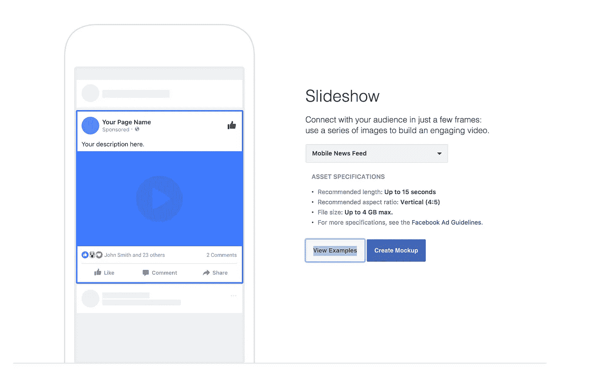
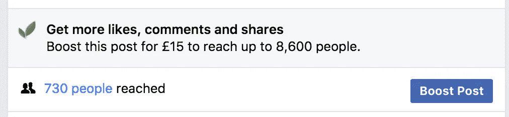

# 脸书到底怎么了？

> 原文：<https://medium.com/swlh/what-is-happening-with-facebook-6c508dfc060a>

## 本周的新闻充满了关于脸书即将发生的变化及其对商业版面的影响的恐怖故事。

简而言之，这个平台的转变是让用户在他们的新闻订阅中看到更多朋友的帖子，而不是商业和媒体的帖子。从寻找相关内容转移到在平台上与你的朋友和家人进行更多的交流。

## 这是从哪里来的？

马克·扎克伯格在他的[页面](https://www.facebook.com/zuck/posts/10104413015393571)上发布了一份声明，强调了用户的反馈如何表明当涉及到内容时，需要回到朋友和家人，而不是商业。

*“最近我们从我们的社区得到反馈，公共内容——来自企业、品牌和媒体的帖子——正在挤掉让我们彼此联系更多的个人时刻。”*

他继续说道

*“你将看到的第一个变化是新闻订阅，你可以从你的朋友、家人和群中看到更多。*

*随着我们的推出，你会看到更少的公开内容，如来自企业、品牌和媒体的帖子。你看到更多的公共内容也将遵循同样的标准——它应该鼓励人们之间有意义的互动。”*

## 这对我的生意不好吗？

脸书发生这种变化并不罕见。最近，为了摆脱假新闻和点击诱饵，一些网页在参与度上受到了打击。

就我个人而言，我不认为这是一件坏事，如果你是那些盲目分享信息希望引起注意的人之一，那么希望这是一个警钟。

当我和许多小企业一起工作时，我的感觉是，他们有一种直接的恐惧，那就是他们没有大企业那样的预算。让他们坐在黑暗的站台上。事实并非如此。

## 我能怎么做呢？

这里的关键信息是质量。脸书想要摆脱不好的东西，庆祝好的东西。这对一般生活来说是相当好的规则。作为一家企业，如果你能制作出有趣且相关的内容，你应该继续在脸书做得很好。

这里有几件事需要考虑。

## 1.停止数数

我一直在说这个，但这不是关于数字或喜欢。这是关于建立一个真正对你的产品和服务感兴趣的人的社区。

作为一个小型的本地企业，你有机会创造真正的本地内容，可以“感觉良好”,并可以在社区内展开对话。毕竟，如果你是实体店，他们就是你的顾客。

如果你不是本地企业，同样的规则适用，但规模稍大。考虑接触对你的产品感兴趣的群体和同行。什么是对他们有用的和相关的，并可能引发对话或得到反应？

## 2.尝试分组

最近，我一直在谈论在脸书的商业中如何利用群体。为你的一批关键观众建立一个封闭的团体将有助于加深你们的关系，并让那些忠实的粉丝感到有一点特别。

像任何其他功能一样，你需要花时间确保它对所有成员保持活跃和有用——所以确保你先做一些思考和计划。

## 3.尝试新内容，尤其是视频

如果你总是坚持只发布图片或文本，尝试其他媒体。我们知道视频是个大生意。脸书此刻似乎很喜欢它，所以落后可能是一件好事。

视频并不总是需要预先录制或精心润色。Live 等功能可以让你把你的社区放在前排。如果你要举办一个活动，发布一个新产品，或者在幕后窥视你的商业魔力，那么为什么不让视频成为其中的一部分呢？

Facebook Creative Hub

制作一小段视频，测试一下直播功能，让它成为你今年社交策略的一部分。看看利率和利息是如何与你平常的东西相比较的。

## 4.送信人；通信员

我们看到增长的另一个领域是机器人的使用。除此之外，有相当多的研究表明，私人聊天应用的使用正在上升。

如果你使用其他社交渠道提供客户服务，那么也不要害怕使用脸书的 messenger 功能。拓宽你的页面的用途，关注机器人场景，了解这些过程是如何自动化的。

## 4.考虑广告预算

虽然这对小企业来说非常困难，而且看起来有点吓人，但考虑在脸书上使用一些广告支出是值得的。

Facebook boost option

我们知道，脸书的有机 reach 相当令人震惊，最近的更新很可能会使情况变得更糟。如果您管理一个页面，您可能会看到 boost post 选项出现。即使你在一个表现良好的岗位上投了 10 分，这也是值得尝试的。

试着聪明地使用你的广告支出。与其推销一个普通的广告，不如考虑把它建立在你一年来的关键营销活动的基础上。

如果你想制造一个大的噪音，并且你让所有的频道都在努力工作，那么为什么不增加脸书的支持内容来获得最大的曝光率呢？

最后，不要忘记脸书并不是你的全部营销策略。还有其他渠道、平台和方式让客户了解你。

花些时间去创造，但是要把你的公司和价值观放在核心位置。创建适应新变化的内容，并将质量放在核心位置。

## 这个故事发表在 [The Startup](https://medium.com/swlh) 上，这是 Medium 最大的创业刊物，有 287，184+人关注。

## 订阅接收[我们的头条](http://growthsupply.com/the-startup-newsletter/)。

