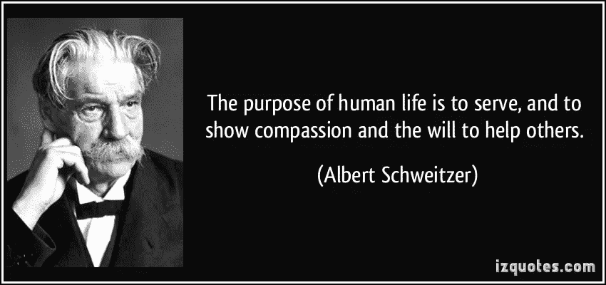

# 人的目的是什么？

> 原文：<https://medium.com/swlh/what-is-human-purpose-5a0a86b93cbf>

人类目的是大学哲学辩论的一个奇妙主题。这是我们大多数人在全神贯注于现实的、直接的生活挑战之前所想知道的事情。我们不重视这个问题，因为这个想法既有趣又奇妙。对一些人来说，这是一种挥之不去的痒，永远需要挠，但永远不会停止痒。如果我们存在是有原因的，背后的一些思想可以统一并帮助推动我们作为一个物种？