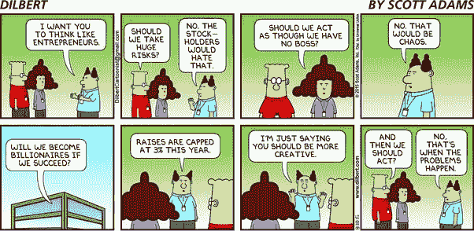

# 在谷歌这样的大公司担任高级产品经理是什么感觉？

> 原文：<https://medium.com/swlh/what-is-it-like-to-be-a-senior-product-manager-at-a-large-company-like-google-a55217c47fa5>

*“在谷歌担任高级产品经理是什么感觉，与在较小的公司和初创公司担任产品经理相比如何？”*

因为这个问题我被问了很多次，我决定试着从多个角度用 10 个观察结果来回答它:

1.  **我最喜欢的悖论:如果不是不可能——也不值得做**——那么非常大和成功的公司所面临的挑战是极其复杂的。它们在由用户、合作伙伴和监管者组成的非常复杂的生态系统中运行，并对数十亿人的生活产生真正的影响。无论从用户角度还是从收入角度来看，成功的门槛都高得离谱。如果您的想法在可预见的未来不能增长到 10 亿用户和/或 xB 美元，那么它就不会动，也不清楚它是否值得做。不幸的是，您所拥有的工具和资源无法线性扩展以应对这些挑战。所以你花了很多时间试图想出令人信服的想法、策略和计划，如何让不可能的事情发生。挑战和挫折之间有一条细线。
2.  **规模不同**——你的思维和运作方式与大多数其他公司不同。在某个时候，规模达到了一个转折点，不再是“大同小异”，而是一个新的类别。它会影响您需要解决的问题的复杂性、可用的技术解决方案(许多常见工具和算法会超大规模中断)、影响您需要考虑的产品决策，以及解决其他在正常世界中不是问题的问题(对生态系统、合作伙伴、社会等的影响)。这个列表上的许多其他点实际上是如此大规模的人工产物。最后，当你达到超大规模时，你的直觉和经验往往是不相关或误导的。
3.  **想大——从小处开始，启动并重复**——与前面几点有所关联。你可能会想出一个大得离谱的愿景，但这些很容易导致拖延和瘫痪。我们不想花费数年时间在一个有远见的象牙塔中设计畸形的项目，而是快速启动一个 MVP，并开始在循环中获得用户反馈。矛盾之处在于，与大胆的愿景相比，这些首次发布总是小得可笑，但你也必须尽快将它们发布出去，并获得用户反馈，因为很有可能你最初的愿景是有缺陷的(记住——直觉很难衡量……)。因此，平衡大胆的宏大愿景与快速执行、不断适应北极星的艺术——可能会让你发疯。
4.  **财大气粗和战略思维**——也许我应该把它放在其他观点之前，因为这是杨的大思维的一面。这些公司并不按季度甚至年度来运营，或者至少不是一直如此……它们有着眼于未来几年的战略大赌注，而且这些公司有雄厚的财力和耐心来支持这些赌注。这使得工作和挑战变得更加有趣和有益。
5.  **许多资源，许多限制，通常与你无关** —一方面，你被其他公司只能梦想的资源宠坏了:在 pm、工程师、设计师、市场营销、律师、BD、PR、研究等领域，你可以买到最好的人才。你的品牌毫不犹豫地打开了大门，当这不起作用时——你的钱起作用了。另一方面，你不能只优化和做对你的产品最有利的事情，而忽略世界的其他地方。隐私、用户信任、品牌考量、安全、账户管理、与公司其他领域的冲突、公司层面的分销/合作战略……所有这些约束都通过审查和流程得以实施，这让你感觉像是……在一家大公司。伴随着巨大的力量而来的是巨大的责任，伴随着巨大的质量而来的是沉重和缓慢。
6.  **没有边缘案例**——还是和规模有关。但是当你接触到数亿甚至更多的用户时，你不能允许自己忽略“边缘案例”。你能想到的每一个“边缘情况”都会出现，还有很多你没有想到的情况。这不仅涉及到受支持的功能集，还涉及到法律、隐私、安全性、可访问性、平台和设备支持等等。
7.  **背上一个目标启动——作为一家匿名的小型初创公司，你可以将某些问题推迟到以后，并专注于关键的事情——无论是创造最佳和最无摩擦的用户体验，还是相反——走捷径以快速前进。作为一家知名的大公司，你没有那个闲心。众多的记者、博客、政治家、学者、竞争者和其他爱好者——都在等着捕捉你的失误，并通过在媒体和互联网的头版突出它们来为自己命名。看着你最近的产品被拆开，或者你的产品/安全/隐私决定在所有人面前被审查，这不是一个有趣的经历。**
8.  **分销和金融超级大国的诅咒** —作为一个巨头，你经常可以奢侈地利用现有的产品、合作伙伴和分销渠道作为新计划的跳板或兴奋剂。当然，这是一个很大的竞争优势，也是对你优势的聪明运用。但它也可能导致平庸的产品被强大的分销漏斗所携带，如果你不够严谨(和诚实)——你可能会把成功与一个非常大而有效的漏桶混淆。有时候，当你意识到/承认这一点的时候，改变方向已经太晚了。概括一下**——有时，你可以通过向他们投入资金来解决某些挑战——无论是运营、营销、分销、广告等。但是这些解决方案会让你走得太远，成功会成为你最大的敌人。资源的稀缺性导致了产品的创造性和创新，在项目的早期阶段，当它仍然是一个小问题并且足够早来解决时，这样做要比以后容易得多。**
9.  ****外表光鲜，内心默默无闻——在这些公司中获得高级职位的人通常都有出色的履历。也就是说，这些人中的许多人在他们以前的组织中有“超级明星”的名声。那些非常成功的大型科技公司通常会提供令人耳目一新的谦卑体验。不仅你经常被拥有至少和你一样优秀的记录和技能的人所包围，而且还有很多这样的人。以至于每个人都是匿名的。谷歌很少有人能说出 Gmail、地图、YouTube、AdWords、Chrome 等的产品负责人。更别说那些向他们汇报的天才巨星了。应对这种情况需要改变心态，并为此进行一些斗争。幸运的是，从外部来看正好相反——你正在开发一个数十亿人都在使用的产品，而且每个人都很熟悉。因此，你可以在行业活动和家庭聚会中恢复一点受伤的自尊。****
10.  **你可以坐在镇上最好的产品展示会的前排座位上——最后，这份工作带来的一个额外好处是可以接触到公司的其他一切。这些公司在产品和技术的前沿运营，跨越广泛的战略领域。再加上重视企业透明度和共享的文化——你就有了产品经理的天堂——让内部人士直接从高管和团队那里看到最迷人领域的未来**

****

**Just like a Start-up…**

****

## **这篇文章发表在 [The Startup](https://medium.com/swlh) 上，这是 Medium 最大的创业刊物，拥有+388，268 名读者。**

## **在这里订阅接收[我们的头条新闻](http://growthsupply.com/the-startup-newsletter/)。**

****