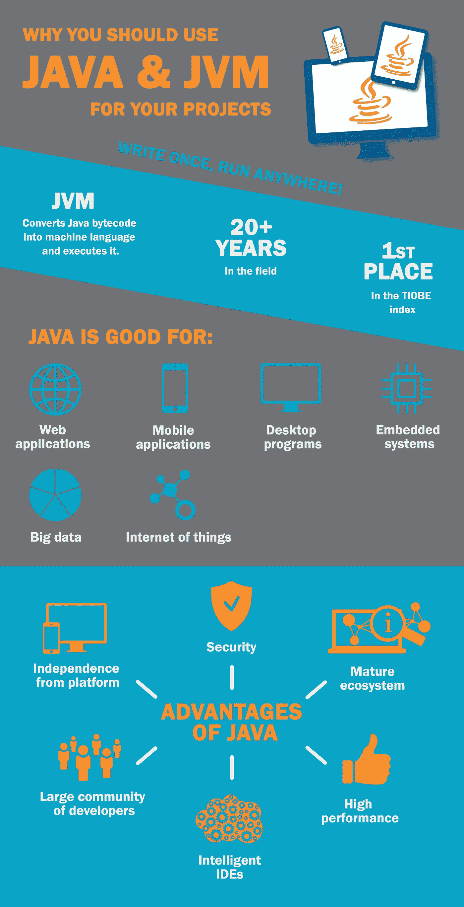

# 什么是 JVM，为什么它值得在 Java 平台上开发应用程序

> 原文：<https://medium.com/swlh/what-is-jvm-and-why-it-is-worth-to-develop-apps-on-java-platform-37663cc4c7c1>

Java 的历史始于 1995 年，当时这种编程语言的第一个版本发布了。“写一次，随处运行”(WORA)是这种新语言的口号。这意味着 Java 不仅仅是另一种编程语言，而是一个完整的平台，你可以用它来为任何东西构建应用程序，从数据中心的强大服务器到厨房里的咖啡机。

# 它是如何工作的？

用 Java、C、Go 或任何其他编程语言编写的程序必须被翻译成机器代码才能让计算机理解。然而，不同类型的硬件和不同的计算机使用不同方言的机器代码。对于大多数语言，你必须将程序分别翻译成不同的方言。不是 Java 的问题！

关键是 Java 编译器不是把程序翻译成机器码，而是把它转换成一种叫做字节码的中间语言。这个字节码是秘密成分。它不是在硬件本身上执行，而是在 JVM (Java 虚拟机)上执行。JVM 是什么，为什么需要它？JVM 是一种特殊的软件，充当从字节码到机器代码语言的翻译器。在你的手机上安装一个 JVM 这是一个移动应用程序。想要一个 web 应用程序？没问题，在服务器上安装 Java 虚拟机，用宠物的照片运行你的网站。

Java 平台的兴起已经超过 20 年了，你知道吗？它仍在蓬勃发展。多年来，Java 一直占据着编程语言流行指数的第一名，只是有时会让位于编程世界的古老巨人——C 语言。那么，为 JVM 构建应用程序有什么好处，为什么要为您的项目选择 Java 呢？

# Java 虚拟机的优势

# 独立于平台

如上所述，用 Java 编写的应用程序可以在 Windows、Linux 甚至冰箱上运行。最重要的是在设备上安装一个 JVM。

# 安全性

因为用 Java 编写的程序运行在虚拟机内部，所以它与操作系统是隔离的。如果虚拟机不允许，任何外部进程都不能访问应用程序数据。顺便说一下，JVM 中的安全设置可以灵活地配置，所以允许的边界完全在我们的控制之下。

# 一个成熟的生态系统和一个庞大的开发者社区

经过 20 年的不断发展，Java 拥有了适合各种口味的库和框架。一个程序员不需要重新发明轮子，只需要获得一组现有的解决方案，并从中组装出所需的功能就足够了。对于企业主来说，这意味着节省应用程序开发的时间和金钱。也保证了不会缺少 Java 开发者。

# 现代多功能 IDEs

虽然这一点对于开发人员来说更重要，但是提高了他们的生产力。反过来，这也减少了开发时间。一个高质量和良好调优的 IDE 是开发人员双手的延续，它允许开发人员专注于编码，而不用担心其他事情。

IntelliJ Idea、Eclipse 和 NetBeans 是当今最流行的三种 Java 应用程序开发 ide。ide 为开发人员提供了许多工具。他们可以集成库、框架、构建系统，做很多其他的事情，除了他们还没有学会煮咖啡。IntelliJ Idea 是我选择的 IDE，直到现在，甚至在使用了 4 年之后，它仍然不断给我带来意想不到的有用特性。

# 表演

Java 已经存在了 20 多年了。一直以来，它都在发展、改进和优化。今天的 Java 不仅在性能上与其他现代编程语言(如 Ruby 或 JavaScript)不相上下，甚至在速度上超过了它们。Java 还完美地支持多处理器系统，并允许最大限度地利用它们的资源。实际上，这不仅适用于网络应用，因为现在智能手机上有四核、六核甚至八核处理器。

如果您的 web 应用程序在用户数量方面超出了您最大的期望，Java 会处理好的。一组丰富的库和框架将有助于您的应用程序更好地扩展，同时使用几个服务器和云技术。这将允许成千上万，甚至上百万的人使用你的应用程序，没有丝毫的延迟。

# 不仅是 Java

有人说 Java 过于啰嗦，缺乏表现力。事实是，Java 长期以来一直是一种纯粹面向对象的编程语言，随着时间的推移，纯粹面向对象的范式已经过时了。正在开发的系统的复杂性大大增加了，而 OOP 本身不再能够处理这样的复杂性。

幸运的是，上个世纪中期出现的函数式编程范式帮了大忙。Java 没有很快采用函数式编程的思想，所以开始出现其他语言，它们使用函数式编程来对抗系统的复杂性，并给语言一个更具表达力的语法。

这些语言包括:核心 Clojure 的函数式、动态 Groovy、实用 Kotlin 和 Ceylon、反应式和可扩展 Scala。其他编程语言如 Ruby、JavaScript、Pascal、PHP 和 Python 的 JVM 也有许多改编。每个人都可以选择最适合自己的语言来快速有效地解决任务。

# 成功案例

为了支持上述观点，我想举几个我们在 Java 平台上实施的项目的例子。

## 对于教育行业:

[**STAV 在线**](https://anadea.info/projects/stav-online) —丹麦学校教与学国语的在线平台。训练是使用游戏化技术进行的:对勤奋学生的奖励将是游戏世界和奖励点数，而不是书本。教师可以跟踪整个班级和单个学生的进度。由于学生和教师主要通过平板电脑使用该应用程序，因此该应用程序也适用于移动设备。目前，该应用程序为超过 10，000 名学生和超过 1，000 名教师提供服务。

## 为了增强软件开发过程:

没有人喜欢应用程序中的错误，有一些 [QA 测试人员](https://anadea.info/services/quality-assurance)，他们的任务是发现小故障和错误。检测到错误后，测试人员必须描述它的症状和重现错误的步骤。当然，他们可以在纸上这样做，但我们生活在数字技术时代。因此，我们为我们的测试人员开发了 **QA 助手** app，它为描述 bug、创建测试场景、报告和其他 QA 活动提供了一个方便的界面。你可以在我们的[作品集](https://anadea.info/projects/qa-assistant)中找到更多关于这个项目的信息。

## 对于游戏开发:

每个人都喜欢玩游戏，我们的开发者也不例外。然而，由于我们不仅是玩家，还是软件开发者，我们的投资组合中也有一些用 Java 编写的游戏。这里举个例子，我们为我们的一个客户开发的一款翻拍的电子游戏经典——[**贪吃蛇**](https://anadea.info/projects/snake-game-app) 。这款游戏可以在 [Google Play](https://play.google.com/store/apps/details?id=com.gnsdm.snake) 上下载。这里是 [**水管工**](https://anadea.info/projects/bulb-fiction) 谜题的克隆，实现有点不寻常。代替管道的是电线，代替起重机的是灯泡。这款游戏可以在 [Google Play](https://play.google.com/store/apps/details?id=com.anahoret.bulbfiction) 和 [App Store](https://itunes.apple.com/app/bulb-fiction/id973146040?mt=8) 买到。

# 结果

JVM 是一个现代的、成熟的、可靠的和稳定的平台，允许开发任何复杂性和用途的应用程序。在 JVM 上开发为企业主节省了时间和金钱，也给开发人员带来了乐趣。一个满意的开发者是一个有效的开发者。为 JVM 编写的应用程序是安全、高效和可靠的，它们可以很容易地转移到各种硬件平台上。

用 Java 开发你的产品值得吗？绝对是！至少尝试一下，你会喜欢的。

*最初发表于* [*anadea.info*](https://anadea.info/blog/what-is-jvm-and-why-develop-apps-on-java)

## 这篇文章发表在 [The Startup](https://medium.com/swlh) 上，这是 Medium 最大的创业刊物，拥有 276，798+人。

## 订阅接收[我们的头条新闻](http://growthsupply.com/the-startup-newsletter/)。

