# 什么是 SaaS 软件？利用云应用发展业务的终极指南

> 原文：<https://medium.com/swlh/what-is-saas-software-d4e0a7c3caf1>

# 让我们回到没有 SaaS 的世界

我们来闪回 15 年前。让我们回到没有 SaaS 的世界。

你想为你的企业购买一个软件。假设你想在一个地方跟踪员工的工作时间或者管理公司的联系人(CRM——客户关系管理软件)。

很可能，你打电话给你的同事。他会向你推荐一两家可以为你安装软件的 IT 公司。

你和他们见面，他们研究你的需求。他们会寄给你一些草稿和价格。

如果你是小公司，你负担不起。如果你足够幸运的话，你可以购买这个软件。

实施需要几周甚至几个月。你得到软件，接受一些培训，然后开始使用它。

你在使用它的时候会有一些问题，所以你必须阅读相当复杂的说明书。

在严重的情况下，你最终不使用该软件，因为你发现它太难用了。

# SaaS 的世界

现在让我们回到今天的世界，回到 SaaS 的世界。

你想从 Excel 电子表格切换到 CRM 软件，你可以在谷歌中输入 CRM 软件。你点击。你注册了免费试用。

您可以按照屏幕上的教程来操作，该教程向您展示了如何使用该软件。你给你的员工发邀请，你培训他们。

你开始**支付月订费**，取决于用户数量。

很可能，你把你的软件和你已经在使用的其他应用程序连接起来。

SaaS 的世界更加令人愉快、舒适和容易接近，所以为什么不利用它呢？

# 什么是 SaaS？

SaaS(软件即服务)是分发和销售软件的新方式。它基于云，所以不需要软件的物理分布。

过去，你需要在电脑上下载软件，要么下载文件，要么插入物理光盘。现在，没有必要下载任何东西到你的电脑上。

在 SaaS 模型中，软件运行在远程服务器上(稍后，我们将描述这种解决方案的优点和风险)。这意味着**你只需使用你的网络浏览器**就能访问该软件。

*例如，如果您需要 CRM 软件，您可以在 Pipedrive 的网站上注册- >您登录- >您和您的员工可以在 Pipedrive 的网站或移动应用程序上使用该软件。*

在过去，你需要下载 Word 或 PowerPoint 文件。虽然我们中的大部分人仍然使用 PowerPoint 和 Excel 的安装版本，但在线版本的软件(Office 365 或替代软件——谷歌文档)在云中变得越来越受欢迎。

除了 SaaS 之外，还有其他类型的云分布结构，如 [PaaS、IaaS](http://www.bmc.com/blogs/saas-vs-paas-vs-iaas-whats-the-difference-and-how-to-choose/) ，它们更面向开发人员和 IT 专家。

*“无论你选择哪个选项，正如我们所知，迁移到云是业务和技术的未来，并且有必要被正确告知。”斯蒂芬·沃茨，BMC*

# 为什么 SaaS 变得如此受欢迎？

那么，归根结底，为什么 SaaS 变得如此受欢迎？在线应用如此受欢迎有几个主要原因:

*   它们很容易访问，你可以在任何浏览器上使用它们
*   它们可能更便宜，因为它们的定价取决于用户数量
*   你可以很容易地选择最适合你的需求，自己在网上搜索或者通过 picksaas
*   您可以轻松连接您使用的 SaaS 应用程序，以便同步它们收集的信息(例如，如果您使用项目管理应用程序，您希望相同的项目也出现在您的时间跟踪应用程序中)
*   通常，你可以在付费前测试它们

过去，你的选择有限。只有少数软件可用，即使您购买了它们，也需要花费时间和精力在您的组织中实施。

现在，你可以**从众多可用的软件应用**中进行选择，而无需向任何人寻求帮助。你所需要做的就是使用谷歌或者我们的 picksaas 软件浏览器来找到你需要的。

找到几个选项后，您仍然可以尝试每一个选项，通过免费试用来找到适合您组织的选项。

关于 SaaS 软件的另一个重要的事情是，它们之间的连接非常容易。

假设你找到了一个很好的软件来跟踪员工按项目划分的时间，例如 [TimeCamp](https://picksaas.com/human-resources/timecamp?utm_source=WhatIsSaaS) 。然后，你找到一个像 Monday.com 那样的项目管理软件，让你管理和协调项目。

但是您希望这两个应用程序能够协同工作。您希望您的项目自动出现在时间跟踪应用程序中，以便您可以报告在特定任务上花费的时间。这正是 SaaS 应用程序的工作方式。

很有可能，你可以使用本地集成(如果两个 SaaS 应用程序彼此“神奇地连接”——这要归功于 SaaS 软件生产商之间的合作)。

然而，如果集成不可用，你仍然可以很容易地将它们连接起来(是的，你可以将几乎任何 SaaS 软件相互连接)，使用一个可用的连接器，如 Zapier 或 Integromat。

# SaaS 应用的优点

使用 SaaS 应用程序的主要优点包括:

*   您可以使用电脑或智能手机，在任何可以访问互联网的地方访问您的应用程序/数据
*   在你开始支付软件费用之前，你可以使用应用程序的试用版，有时也可以是免费的基本版
*   定价通常取决于用户数量(因此它实际上取决于您组织的规模)。您还可以从不同的定价方案(基本/高级产品版本)中进行选择，以满足您组织的需求
*   您得到的不仅仅是工具，还有支持、关怀和实施。这意味着你没有一本书本大小的技术手册，但至少有组织良好的基于问题的帮助网站和电子邮件/聊天支持。
*   非常高质量的客户支持。多亏了一个名叫林肯·墨菲的人，一个被定义为“客户成功”的客户服务新领域出现了。这种类型的护理远远超出了标准支持。它应该给你最大的经验和商业价值。
*   由于 SaaS 应用程序的市场竞争非常激烈(大量资本投资于这些公司)，软件的质量通常非常高
*   与软件提供商没有长期合同。你只需支付月费或年费，所以如果你想放弃使用该软件，你可以随时这样做
*   你可以**比较各种竞争应用**来精确满足你的需求。
*   SaaS 应用程序通常在手机和桌面上都可用
*   不同的**应用程序可以轻松地相互连接**，创造一个顺畅的环境来管理您的公司
*   实施时间快。无需安装，因为一切都在云中运行。

# SaaS 应用的缺点/风险

使用 SaaS 应用程序的主要缺点和风险包括:

*   所有数据都存储在云中，在第三方服务器上存储数据存在**特殊风险，这既与[法律/GDPR 合规性](https://picksaas.com/blog/gdpr-compliance-checklist?utm_source=WhatIsSaaS)有关，也与云安全有关。[然而，云安全](https://en.wikipedia.org/wiki/Cloud_computing_security)迅速增加，采取了更多的技术和法律措施来确保数据的安全。**
*   如果您无法访问互联网，您可能无法访问您的软件/数据。
*   尽管您可以连接您的 SaaS 应用程序(以同步所有数据)，但每次您开始使用新的应用程序时，您都需要添加一个新的连接，这有时可能会非常麻烦和耗时。
*   管理 SaaS 应用程序的密码/访问是有问题的(每个应用程序都需要自己的应用程序/登录设置)。
*   每个应用程序都是单独计费的，这意味着如果您使用多个 SaaS 应用程序，您需要单独支付费用。这意味着多张发票，有时使用不同的货币。有时你可能会忘记你不再使用某个特定的工具，但仍然会为它付费。

# SaaS 应用的类型

您可以使用许多应用程序来改进您组织的流程和工作流。[我们分析了 150 多种不同的 SaaS 应用程序](https://picksaas.com/blog/saas-products-usability)，它们有助于全球业务的发展。下面，我们介绍几个类别和 SaaS 产品，它们可能有助于您更好地经营业务:

## 公司管理层

公司管理是最有趣的挑战之一。对于您组织管理中的大多数问题，您将能够找到特定的 SaaS 应用程序，帮助您更好地管理您的公司。

*   **跟踪和规划员工的时间**

监控在特定任务上花费的确切时间可能不是最好的主意，但特定的 SaaS 应用程序可以帮助您的团队更好地组织时间(例如，查看整个团队在特定项目上花费的时间)并更有效地相互沟通(例如，创建工作时间表或报告假期/病假)。

**TimeCamp**

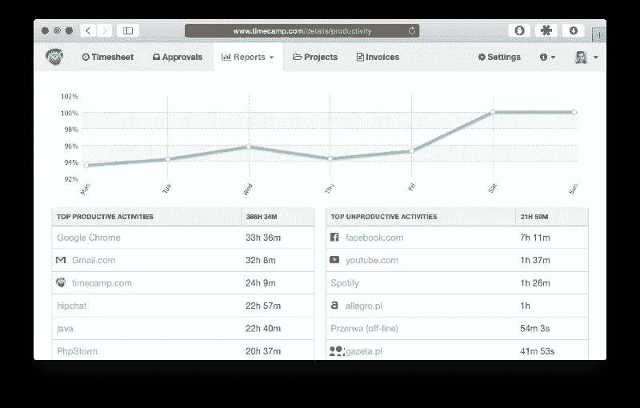

*time camp——跟踪花费在特定任务和项目上的时间*

TimeCamp 是一个非常简单的应用程序，专注于一项活动——追踪时间。它能让你监控花在特定活动、项目上的时间，并能自动检测你花在访问特定网站上的时间。

**计划日**

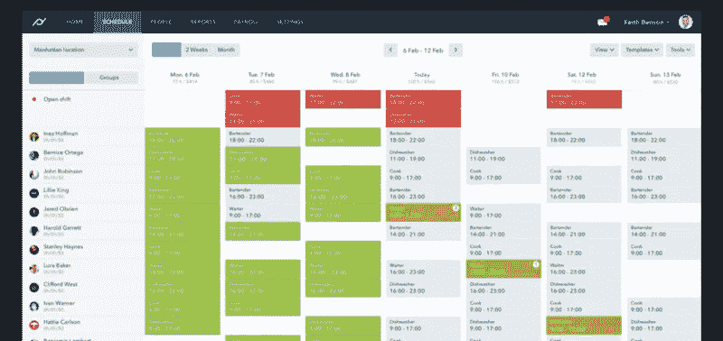

[计划日](https://picksaas.com/human-resources/planday?utm_source=blog&utm_campaign=What%20is%20SaaS)是安排员工或团队成员工作时间的最终场所。您可以使用桌面或移动应用程序来跟踪在特定任务上花费的时间，并与您的团队进行交流。更重要的是，您可以使用它来管理和报告病假和假期计划。

*   **构建和可视化项目工作**

当你独自工作时，管理项目是很容易的。当你开始在团队中合作完成更复杂的任务和工作流程时，问题就出现了。借助项目管理工具，您可以轻松处理团队中的多项任务和职责。他们还帮助您确保您的团队跟上项目的进展。

**星期一**

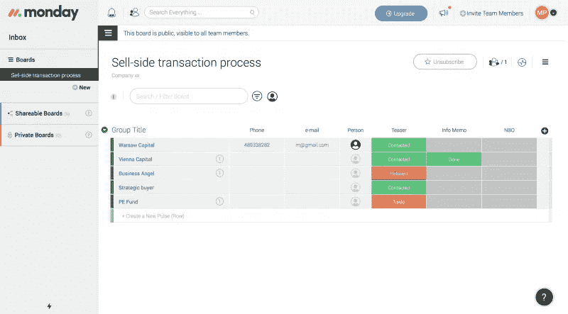

【Monday.com —根据您的需求定制项目

[周一](https://picksaas.com/project-management/monday.com?utm_source=WhatIsSaaS)是一个先进的项目管理应用程序，让它的用户计划和监控项目的进展。这是一个易于定制的应用程序，让您个性化您的项目，取决于它的类型。周一是可视化项目演示的好时机，让你用甘特图来可视化你的工作流程计划。

**团队合作项目**

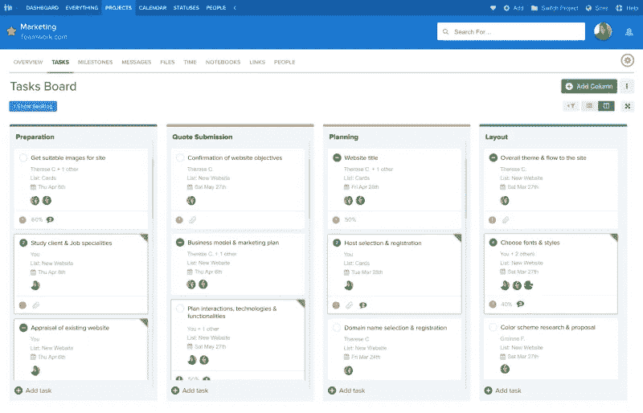

*团队项目——管理项目、里程碑、职责*

[团队合作](https://picksaas.com/project-management/teamwork-projects?utm_source=WhatIsSaaS)是另一个更复杂的项目管理工具，用来处理你的任务和职责。它让你计划和划分具体的活动，与团队分享进展，并设定截止日期。通过详细的图表和报告，您可以轻松地分析项目的统计数据。

**特雷罗**

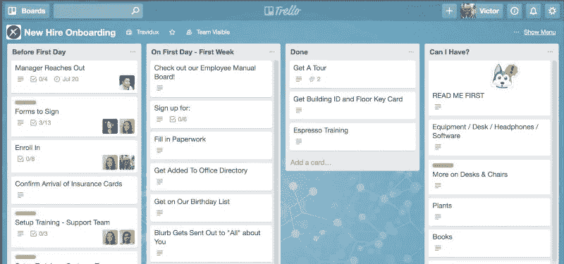

Trello 是一个非常受欢迎的免费增值应用程序，用来处理你的项目。它注重简单性，让你用一个固定的、不可定制的布局来规划你的工作和项目。您还可以轻松地将 Trello 与 Google Drive 或 Slack 等其他云应用程序连接起来。然而，大多数连接都需要付费版本的应用程序。

*   **与您的团队分享联系人/客户信息**

你们公司的两个人接触过同一个人多少次？如果这种事情发生了不止一次，你可能会理解联系人分享的重要性。在今天的 SaaS 世界，商业应用程序提供的不仅仅是纯粹的联系人共享，还有自动联系人检测和简单的电子邮件集成功能。

**Salesflare**

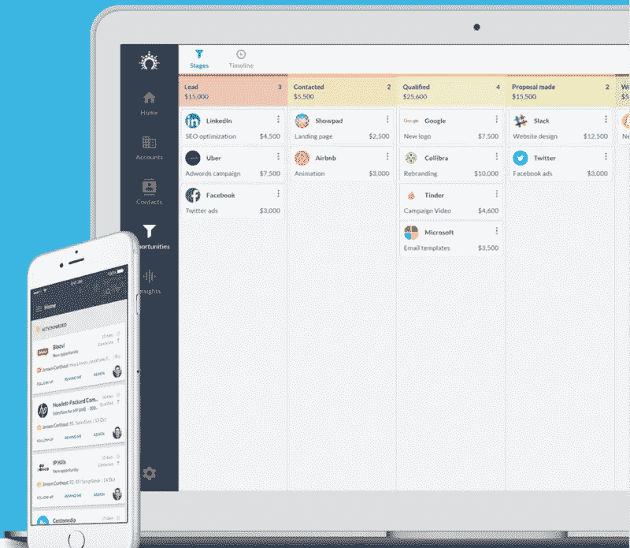

*Salesflare —管理您客户的数据和销售渠道*

[Salesflare](https://picksaas.com/crm/salesflare?utm_source=WhatIsSaaS) 是一款智能、自动化的在线 CRM 应用程序，让您可以在一个地方共享团队中的联系人。它会自动检测您已经在邮箱中联系过的人，并将其组织在一个简单的帐户/联系人列表中。借助可视化管道，您可以管理销售交易/阶段的流程和进度。

**管道驱动**

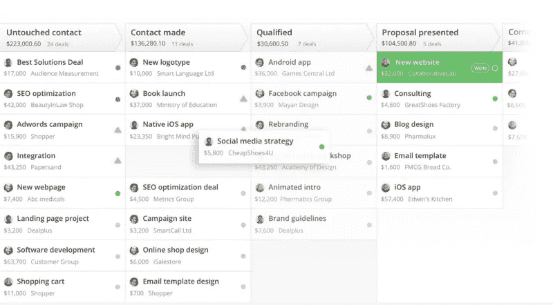

[Pipedrive](https://picksaas.com/crm/pipedrive?utm_source=WhatIsSaaS) 是一款在线 CRM 应用，专注于详细的销售规划。它很容易与任何邮箱集成，让您直接从应用程序向您的潜在客户和客户发送电子邮件。使用 Pipedrive，您可以轻松地计划要与潜在客户一起执行的特定活动，并将它们与您的 Google 日历集成在一起。

*   **与你的团队快速沟通**

沟通和透明度是任何项目或业务成功的关键。虽然当团队很小的时候，通过 iMessage 或 FB Messanger 聊天可能有意义，但在一个单独的容易访问的地方保持和组织沟通是值得的。

**松弛**

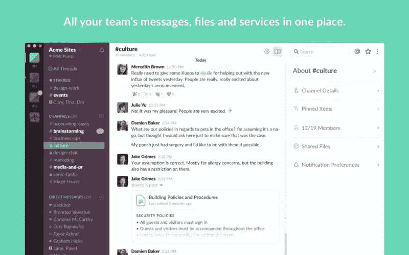

*Slack——团队沟通、对话渠道*

[Slack](https://picksaas.com/communication-tools/slack?utm_source=WhatIsSaaS) 是最受欢迎的通讯应用，让你在一个地方组织你的商务沟通。使用 Slack，您可以轻松设置特定的频道，轻松创建特定项目或部门的聊天。Slack 因其与其他应用程序的集成而闻名，让您可以轻松地从其他应用程序(如项目管理应用程序)同步设置通知。Slack 应用程序的最大优势是能够快速搜索对话。

**出镜**

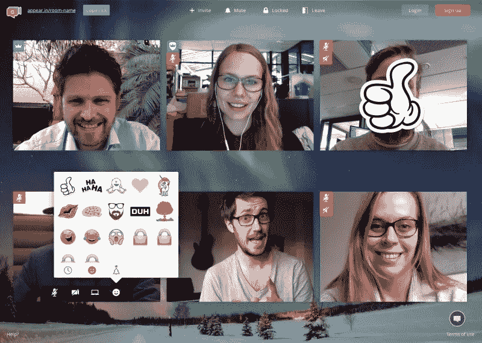

[出现。in](https://picksaas.com/communication-tools/appear.in?utm_source=WhatIsSaaS) 是您进行 Skype 视频对话的在线选择。要开始视频聊天，您只需向您的参与者发送一个链接，他们可以通过任何互联网浏览器加入聊天。然后，您可以使用表情符号在大型群组中轻松交流，参与文本聊天，甚至活跃对话。

*   **开具发票、财务会计管理**

管理财务、预算和支付很可能由会计师或首席财务官负责。然而，如果你负担不起，你可以考虑使用云应用来管理你的财务、会计和在线发票。

**新书**

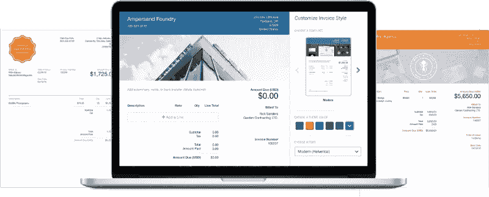

*新书—会计和财务在线软件*

[Freshbooks](https://picksaas.com/accounting-finance-tools/freshbooks?utm_source=WhatIsSaaS) 是一款众所周知的处理进销存和账务的工具。它允许您设置自己的发票设计和布局。此外，它可以连接到支付系统，自动检测发票付款，并提高财务管理的有效性。

**发票**

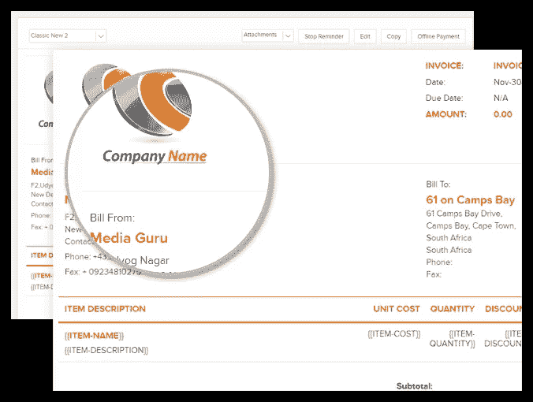

[Invoicera](https://picksaas.com/accounting-finance-tools/invoicera?utm_source=WhatIsSaaS) 是一款免费的发票软件，它的免费版本可以让你为最多 3 个客户开具发票。此外，它还提供了简单的项目管理功能，以防您希望在一个工具中处理所有事情。

您可以在以下网址找到有关 better company 管理的完整资料:

[改善贵公司管理的 5 个应用](https://picksaas.com/blog/5-best-business-apps?utm_source=WhatIsSaaS)

## 营销

作为一门独立的商业学科，市场营销需要大量的努力和灵活性。自动化而不是过度自动化特定的任务似乎是营销人员工作中最重要的部分。在内容营销的日子里，像关键字研究这样的额外任务对于成功是非常重要的，没有 SaaS 工具完成它是不可能的。

*   **没有任何设计知识的设计图形**

当你需要快速设计任何图形或视觉海报时，你并不总是希望等待几周或几个月才能实现。但是在今天的 SaaS 世界，你可以很容易地设计出漂亮的视觉项目，而不需要先进的设计知识，使用已经预先定义好的模板。

**模版**

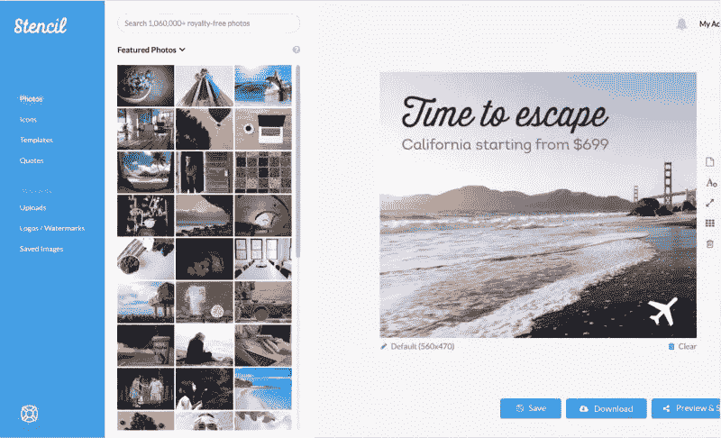

*模板——使用简单的拖放编辑器&设计你的社交媒体帖子*

Stencil 是一个在线设计应用程序，它允许用户通过简单地拖放特定的元素来创建图形帖子。它专注于创建社交媒体帖子，具有可定制的预定义图形大小。有了 Stencil，你还可以使用许多模板作为你设计的灵感。通过这个应用程序，你还可以访问大量的库存照片库，以便在你的设计中使用。

**Canva**

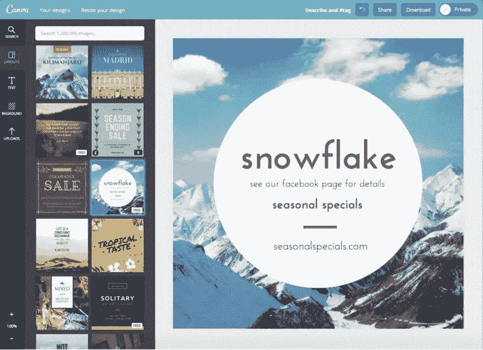

Canva 是一个非常受欢迎的首批设计应用程序，拥有大量预定义的可定制设计，包括名片、海报或信息图。它通过一个有效的拖放编辑器简单地工作，并且是免费使用的，但是它的定价是基于每个对象的模型，所以你可能每次都要为你的图形添加一个新的优质元素。

**PromoRepublic**

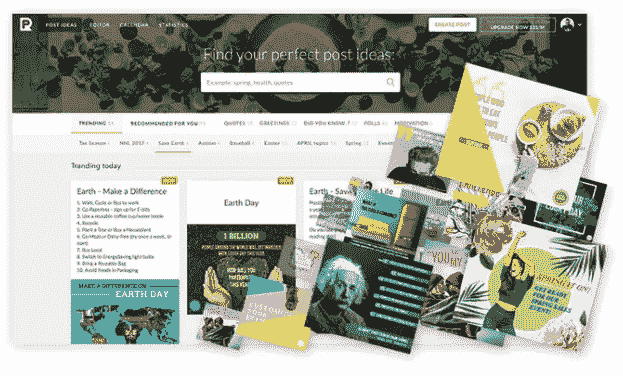

[PromoRepublic](https://picksaas.com/design-platforms/promorepublic?utm_source=WhatIsSaaS) 是另一个设计应用替代方案，它可以通过预定义的模板帮助您创建演示文稿和其他类型的漂亮设计。它的功能提供有趣的社交媒体功能，自动建议社交媒体帖子。

*   **安排并自动发布社交媒体帖子**

在社交媒体上发布是相当耗时的，尤其是如果你是手动发布的话。然而，现代应用程序让你提前计划和自动化你的工作，并衡量你的工作效率。

**萌芽社交**

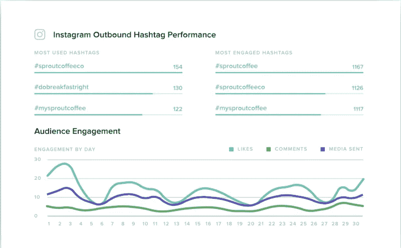

*萌芽社交——社交媒体调度和分析。*

[Sprout Social](https://picksaas.com/social-media-management/sprout-social?utm_source=WhatIsSaaS) 让你可以安排在社交媒体网络上发布帖子，包括 Twitter、脸书、LinkedIn 或 Instagram。更重要的是，它提供了在你的文章中使用的图形，所以它也可以作为一个基本的文章设计工具。Sprout Social 是一款高度专注于分析你的社交媒体表现的工具。这可以为你提供很多关于社交媒体策略效率的见解。

**缓冲器**

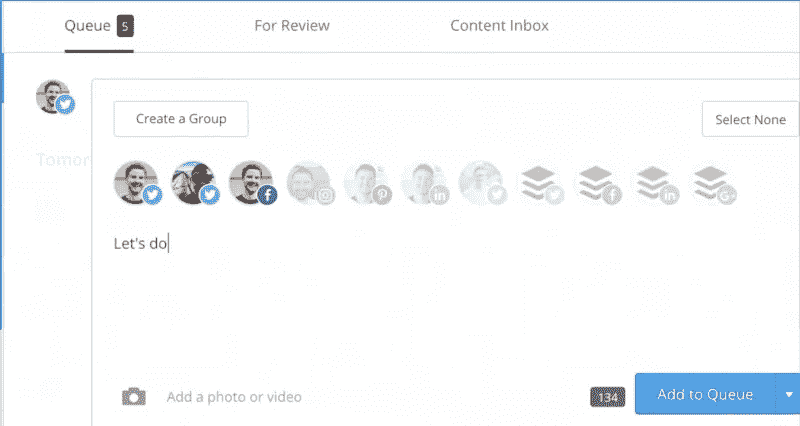

Buffer 是一款 SaaS 社交媒体工具，专注于一个简单的功能——安排帖子。它可以让你为每个社交媒体网络详细计划你的社交媒体活动。有了 Buffer，如果你想保持稳定的发布时间表，你还可以为发布文章设置预定义的时间框架。有了 Safari/Chrome 扩展，当你在网上浏览任何相关内容时，它可以让你快速安排/重新发布文章。

*   **通过邮件应用程序自动发送电子邮件**

发送电子邮件是一项非常个人化的活动。毕竟，你是在向特定的人发送信息，所以信息应该是个性化的。然而，在某些情况下，当你有一群订阅者向他们发送一些普通的、低级的个性化消息时(例如，通过只改变接收者的名字)。为了自动化这项工作，你可以使用在线邮件应用程序，让你设计，规划和自动化你的邮件活动。

啄木鸟

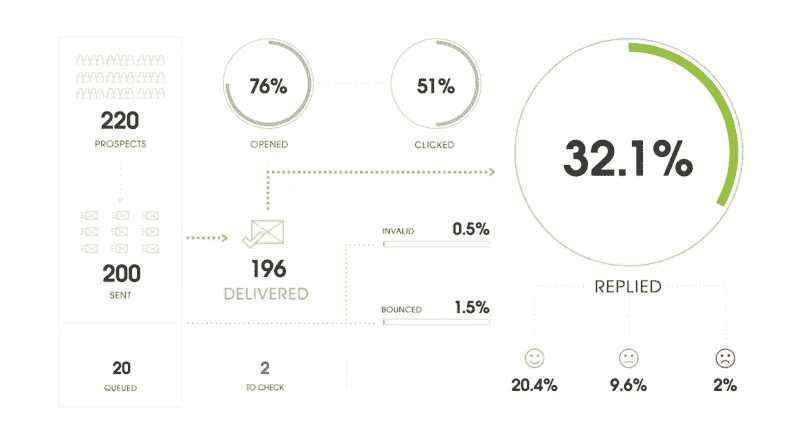

*啄木鸟——自动邮寄/跟进活动*

[啄木鸟](https://picksaas.com/cold-mailing/woodpecker?utm_source=WhatIsSaaS)是一个在线邮件应用，专注于个性化的大规模电子邮件。它可以让您轻松地用收件人的个人信息替换邮件中的特定字段。更重要的是，它可以让你计划你的后续行动，以防你的收件人没有回复你的信息。

**MailChimp**

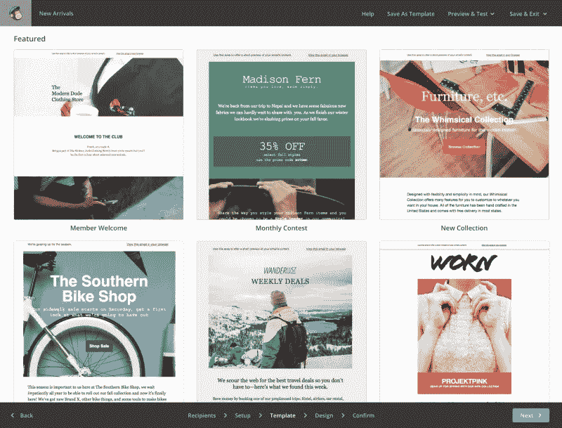

MailChimp 是一个免费的邮件自动化应用程序，它可以让你为你的订阅者建立可视化的邮件/时事通讯活动。它还允许创建更加自动化的邮件工作流，例如，基于用户的活动(例如，当有人点击链接时触发特定动作)。

*   **研究主题用关键词写研究应用**

写关于我们所想的一切的帖子并不总是最好的选择。你宁愿写一些其他人正在寻找的东西，因为这可能会让他们对你的文章感兴趣。即使你可以搜索人们在谷歌中寻找的特定关键词，通过谷歌浏览器的建议，获得更有见地的数据，使用关键词研究/SEO 定位 SaaS 应用程序可能是值得的。

**芒果汁**

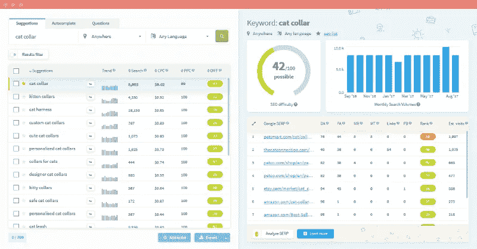

Mangools 提供了一套搜索引擎优化工具来提高你在谷歌搜索中的定位。它可以帮助你检查关键词搜索量，监控你网站的反向链接或者观察你网站的定位。它提供了关于关键词研究的非常直观、容易理解的信息。

**SE 排名**

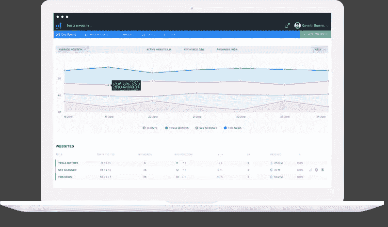

SE 排名——监控网站 SEO 的在线工具。

SE Ranking 是一个在线 SEO 应用程序，有一个非常用户友好的 SEO 审计工具，让你检查与谷歌搜索相关的网站优化。它专注于非常早期的 SEO 用户，提供使用该应用程序的一步一步的教程。

*   **自己设计登陆页面**

创建视觉和文本内容是营销策略的一个方面，但如今，为更大的营销活动建立登录页面变得越来越流行。这有助于以一种更直观的方式接触客户，并能提高你的网站的整体定位。

**兰丁吉**

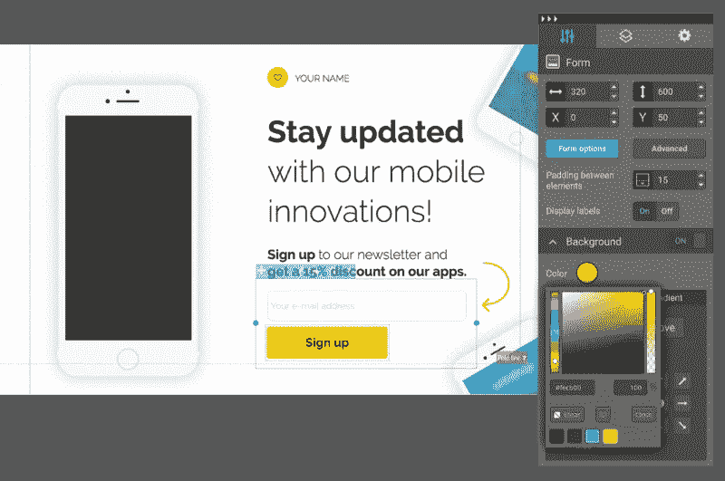

Landingi 是一个简单的在线登陆页面创建器，让你自己建立一个网站/登陆页面，仅仅使用一个简单的拖放编辑器。它侧重于用户友好的方法，也可以连接到其他 SaaS 应用程序，这是非常有用的安装在网站上，如 LiveChat 或 CallPage 工具。

**Instapage**

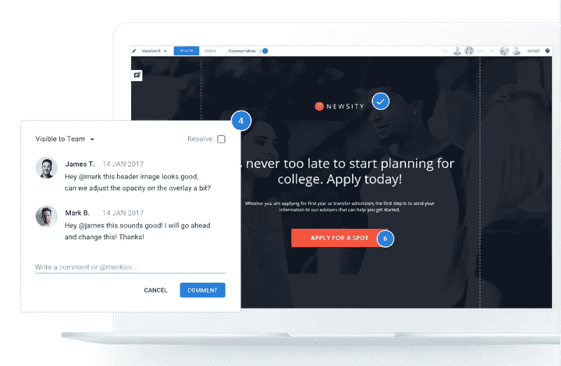

[Instapage](https://picksaas.com/landing-page-builders/instapage?utm_source=WhatIsSaaS) 是一款更高级、更昂贵的登陆页面应用，专注于团队协作。它为您的登录页面提供了多个模板，以便在您的设计中使用，并提供了额外的通信功能，使您可以在登录页面的设计中与您的团队合作。

你可以通过[了解更多关于 SaaS 应用程序的信息，以提高你的营销效率](https://picksaas.com/blog/best-marketing-apps?utm_source=WhatIsSaaS)

# 其他类型的 SaaS 应用程序

还有许多其他类型的 SaaS 应用程序，总数有几千种，并且还在不断增加。您可以使用 Google、picksaas 浏览它们，或者在我们的博客文章中探索更多内容:

# 如何将 SaaS 应用程序相互连接

使用单独的 SaaS 应用程序，您可以解决组织中的许多问题。但是，只有当你开始把它们相互连接起来，创造出更复杂、自动化的解决方案时，你才能看到 SaaS 软件的真正价值。

# 登录页面上收集的电子邮件 CRM 系统中的线索

为新的营销活动设置登录页面时，您可能希望在一个地方管理您收集的所有电子邮件和线索。如果你需要手动添加新的联系人，那么拥有 CRM 系统有什么意义呢？

通过 Landingi & Pipedrive 集成，您可以建立连接，让您自动将电子邮件上传到 CRM 系统中的销售渠道。

# 在弹出窗口收集订户->自动邮寄活动

使用 Sumo 这样的应用程序，你可以通过一个独立的弹出窗口来收集访问者的电子邮件地址。但是，您可能希望在收集电子邮件地址后执行一些操作，而不是简单地将它存储在数据库中。

通过 Sumo & MailChimp 集成，您可以轻松地将收集到的电子邮件地址上传到自动电子邮件活动中，每周向您的订户发送一篇博客文章。

# 收件人点击您电子邮件中的链接->销售线索将添加到您的 CRM 中

在发送自动邮件活动时，例如使用啄木鸟，您可能希望监控收件人的活动。您可以在以后使用这些信息，例如，查看哪些收件人对您的材料感兴趣，并联系他们提供个性化服务。

通过 Zapier 使用啄木鸟和 Salesflare 集成，您可以在 CRM 中自动创建一个线索，无论何时有人决定点击您电子邮件中的链接。

您可以使用 Zapier、Integromat 或 Automate.io 等软件，以数千种不同方式连接不同的 SaaS 应用程序，实现工作流程自动化

# 选择 SaaS 应用程序时需要考虑什么？

找到最好的应用程序来发展您的业务并不是一件容易的事情，因为有太多的工具可供使用。选择 SaaS 应用程序时，有几个因素需要考虑:

*   它有助于你自动化日常工作吗？
*   它对用户友好吗？
*   它提供客户支持吗？
*   它能与我使用的其他应用程序集成吗？

虽然定价和用户评论可能也很重要，但从我们用户的经验来看，有时为更好、更适合的软件支付额外的价格是值得的。

尽管用户评论是一件需要考虑的重要事情，但在当今世界，获得虚假评论并不困难，所以在网上浏览他人的意见时，值得考虑这一点。

# 我们能帮你找到合适的 SaaS 软件吗？

在[picks as](https://picksaas.com/?utm_source=WhatIsSaaS)，我们帮助我们的用户找到最好的 saas 应用来发展他们的业务。在分析了数百种在线产品后，我们非常乐意在您发展业务的过程中为您提供支持。你可以在 picksaas.com 的聊天室找到我们。

填写我们的 SaaS 软件咨询表，我们将为您量身定制推荐的解决方案，帮助您发展业务:-> [SaaS 软件咨询表](https://picksaas.typeform.com/to/I59wz6)

*在* [*picksaas*](https://picksaas.com/?utm_source=WhatIsSaaS) *，我们帮你找到 saas 软件，发展你的业务。*

*与我们聊天，关注*[*Twitter*](https://twitter.com/picksaas)*或* [*订阅*](https://picksaas.us16.list-manage.com/subscribe/post?u=0a811ad254e7cd14718599e3a&id=bdf0cfd955) *我们每周的 SaaS 软件更新。*

## 这篇文章发表在 [The Startup](https://medium.com/swlh) 上，这是 Medium 最大的创业刊物，拥有 335，210 多名读者。

## 在这里订阅接收[我们的头条新闻](http://growthsupply.com/the-startup-newsletter/)。

