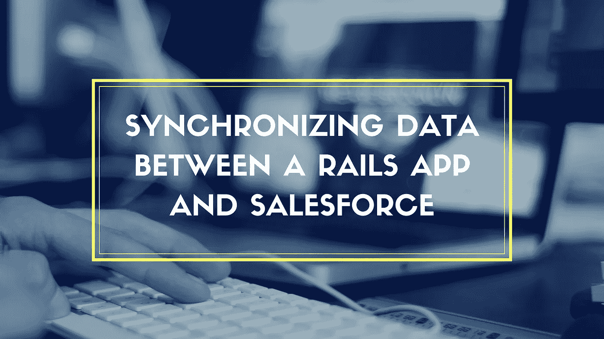

# 在 Ruby on Rails 应用程序和 Salesforce 之间同步数据的最佳实践是什么？

> 原文：<https://medium.com/swlh/what-is-the-best-practice-for-synchronizing-data-between-a-ruby-on-rails-app-and-salesforce-5bdcecdd3c57>

无论企业规模如何，成功的企业结构中最关键的要素之一是一个强大的销售部门。Salesforce 软件平台是一个领先的客户关系管理(CRM)工具，是当今大多数公司销售流程的基础，以确保他们在销售团队中保持高水平的 CRM 生产力。现在，在我们进入同步部分之前，让我们看看集成。

**记住什么:**

*   当涉及到 Salesforce 集成时，大多数公司犯的主要错误是假定在两个系统之间传递的数据是一致的和存在的。现在，当有人在 Salesforce 中添加新帐户，而没有填写外部标识符字段时，问题就出现了。另一个问题是当一个人没有填写系统 a 中存在的相应标识符字段时，这两种情况都会导致两个系统之间的同步失败。此外，某个系统中的标识符可能允许某些特殊的大小或字符限制，而第二个系统不允许，这也可能导致一些问题。
*   如果您正在进行 Salesforce 集成，在将数据导入 Salesforce 之前，请花时间清理数据。尽可能合并帐户，以避免重复的联系人和帐户。然后，当您将数据组织到电子表格中时，导入一个大约五到十条记录的小测试。现在登录到 Salesforce 并仔细检查以确保所有字段都映射到正确的位置。如果导入不按预期进行，您只需删除少数记录，而不是潜在的数千条记录。

# **同步数据**

作为一个优秀的 web 开发框架和 Salesforce，一个大型的 CRM 工具，Ruby on Rails 看起来是不太可能的一对。当你想到 Rails 时，你会想到什么呢？它是优雅、精简的，是专为使 web 开发过程更加顺畅而设计的，而 Salesforce 是一个庞大的、经常令人困惑的工具，是为了处理许多不同的工作。他们实际上合作得非常好，尽管他们有很大的不同。

Rails 到由 Salesforce 管理的数据的连接适配器 Active Salesforce 允许您使用这一不太可能的配对。这个 RubyGem 将使用 Salesforce 数据的工作转变为像 Rails-MySQL 对一样流畅的工作。现在，在使用 Rails-Salesforce 应用程序时，您必须将任何本地 MySQL 数据库与 Salesforce 同步。这是必要的，因为应用程序的几个部分是时间敏感的，并且与 Salesforce 的连接不如使用本地数据库时快。

现在，要设计应用程序以在本地数据库和 Salesforce 之间同步数据，首先将特定于 Salesforce 类的行为抽象为 SalesforceRecord 类。然后，将行为抽象到 Acts::As::Syncable 模块，用于 Salesforce 类的本地表示。使用元编程将该模块的功能添加到本地类中。最后，添加向 Salesforce 发送本地更新的方法。然后更新 Salesforce 和本地数据库。现在，您只需向克隆的 Salesforce ActiveRecord 类添加一行代码，即可从本地数据库更新并同步到 Salesforce。

*A*[ruby on rails 开发公司 ](https://www.cognitiveclouds.com/custom-software-development-services/ruby-on-rails-development-company)

## 这篇文章发表在 [The Startup](https://medium.com/swlh) 上，这是 Medium 最大的创业刊物，有 292，582+人关注。

## 订阅接收[我们的头条新闻](http://growthsupply.com/the-startup-newsletter/)。

