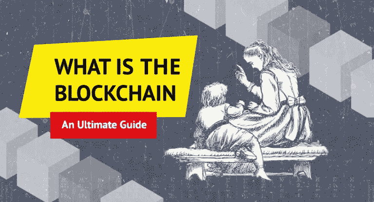
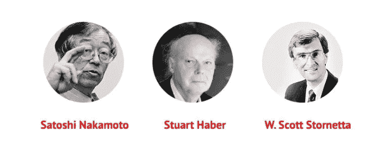
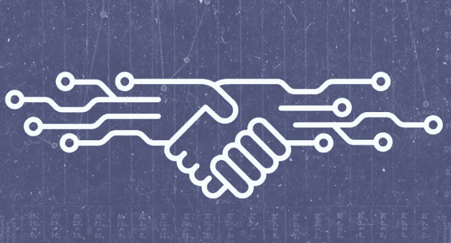

# 区块链是什么？终极指南

> 原文：<https://medium.com/swlh/what-is-the-blockchain-an-ultimate-guide-ba26b069751>

source: [howtotoken.com](https://howtotoken.com)

如果您渴望了解什么是区块链，并找出它的基本原理是什么，或者该技术如何发展，本指南正是为您准备的！此外，您将能够获得构建自己的基于区块链的分散式应用程序(DApp)的实践经验。你所需要做的就是按照我们为你准备的初学者的一步一步的指导去做。

# 区块链是什么？

区块链是一个分散的、不断扩展的记录或数据块列表，每个记录或数据块都是加密的。每个块包含关于一些或所有最近事务的信息、事务计数器以及关于块大小、块头和“幻数”的信息，幻数是前一个块的加密哈希(在添加新块时由计算机解决的数学难题的答案)。它对每个块都是唯一的)。

由于每个块都具有前一个块的加密散列、时间戳和交易数据，因此区块链上的信息很容易被验证并且不可能被删除。当数据被记录在块上时，在不修改所有后续块中的数据的情况下，不能对其进行追溯编辑，这几乎是不可能的，因为区块链是分散的，并且通常由遵守用于验证新块的协议的对等网络来管理。

简单来说，区块链与谷歌文档非常相似。有权访问共享文档的每个人都可以修改它，并且每个人都能立即看到更改。然而，区块链有两个主要特点使其与谷歌文档有所不同:

*   在区块链上，不能追溯删除或编辑信息，因此，您可以添加新信息，但不能删除或更改任何已添加到系统中的信息。
*   区块链是分散的，没有单一的权力机构控制它——它由系统中的每个人所有，而谷歌文档存储在谷歌的服务器上，原则上，谷歌是管理所有这些文档的中央权力机构。

为了让您更好地了解区块链，我们将解释区块链的主要组成部分是什么，区块链有哪些类型，以及这个系统最初是如何产生的。

# 区块链的关键组成部分

所有区块链系统的[包括](https://www.linkedin.com/pulse/blockchain-technology-types-components-dr-anita-gupta/)以下组件:

## 节点应用程序

每个区块链生态系统都有自己的节点应用程序，用户需要安装该应用程序才能访问区块链。比特币钱包就是一个节点应用的例子。

请记住，有两种不同类型的节点应用程序—轻型节点和完整节点。对于那些只想访问区块链并在系统内进行交易的人来说，轻型节点是必要的，而对于挖掘来说，则需要完整的节点。两者的主要区别在于，完整节点[下载](https://en.bitcoin.it/wiki/Full_node)完整的区块链，而轻量级节点[只下载](https://en.bitcoin.it/wiki/Lightweight_node)验证事务真实性所需的块头。区块链上的大多数节点都是轻节点。满节点会占用更多的存储空间，消耗更多的互联网流量。然而，与此同时，与轻型节点相比，它们[保证了用户更多的隐私和安全。](https://en.bitcoin.it/wiki/Clearing_Up_Misconceptions_About_Full_Nodes)

## 共享分类帐

它是在节点应用程序内部管理的数据结构。当用户安装了节点应用程序时，他们可以查看分类帐的内容；那个区块链的所有交易。

每个区块链生态系统只存在[一个](/@neocapita/the-logical-components-of-blockchain-870d781a4a3a)共享账本，无论您使用哪个节点应用程序来访问该账本。例如，有不同的客户端(节点应用程序)允许访问以太坊，您可以同时运行不同的客户端，但是您访问的以太坊分类帐对于每个应用程序都是相同的。

## 一致性算法

这个组件[为区块链生态系统提供了通用的“规则”,并作为节点应用程序的一部分来实现。共识算法确定了区块链系统获取所有节点的共享分类帐的单一视图的方式。区块链生态系统根据其需求和目标，对共识算法使用不同的方法。对于比特币来说，](/@neocapita/the-logical-components-of-blockchain-870d781a4a3a)[需要](/@neocapita/the-logical-components-of-blockchain-870d781a4a3a)几分钟来达成分类账的共识(而完整节点会验证分类账)，而 [Ripple](https://howtotoken.com/explained/ripple-different-cryptocurrencies-ultimate-guide/) 则保证在几秒钟内达成共识。

验证分类账的主要[方式](/@neocapita/the-logical-components-of-blockchain-870d781a4a3a)是耗时证明、工作证明和利害关系证明。在允许节点参与共识建立过程之前，这些方案中的每一个都使用不同的方法来验证节点。根据建立共识的算法，建立共识的时间和交易费用可能会有所不同。

# 区块链系统的类型

区块链的生态系统主要有两种类型——公共生态系统和私人生态系统。

在公共区块链，任何安装了相关区块链节点应用程序的人都可以访问该系统并在其中进行交易。公共区块链的著名例子是比特币和以太坊。

在私人区块链，用户在网络上的参与应该由网络启动者或他们制定的一套规则进行[验证](https://www.ibm.com/blogs/blockchain/2017/05/the-difference-between-public-and-private-blockchain/)。例如，网络启动器可能允许网络上的所有参与者验证新用户。因此，只有经过“验证”或“邀请”的用户才能访问系统。私人区块链通常由企业经营，用于他们自己的商业运作。可以说，构建私有区块链最流行的平台是 Hyperledger Fabric。IBM 的网站展示了基于 Hyperledger Fabric 的私有区块链解决方案的例子。

公共区块链更适合普通受众使用，例如，如果您想要创建一个加密货币或基于区块链的应用程序供公共使用，而私有区块链则供公司内部使用。

# 区块链的演变

中本聪于 2008 年首次推出比特币。当然，中本聪并不是第一个想到数字现金或允许人们直接交易的去中心化系统的人(或一群人)。比特币基本上是建立在密码学领域先前成就的基础上的。Stuart Haber 和 W. Scott Stornetta 在 1991 年描述了一个密码安全的区块链，它与区块链的一些基本方面有相似之处。1997 年， [Hashcash 工作证明函数](https://en.bitcoin.it/wiki/Hashcash)被引入，目前它是比特币挖掘系统的核心。早在 1998 年，[就提出了一个名为 B-Money 的“匿名、分布式电子现金系统”的提案](https://en.bitcoin.it/wiki/B-money)，该提案基于“创造”货币的工作证明功能。中本聪在关于比特币的文章中引用了 B-Money。然而，Nakamoto 是第一个将这些先前的成就整合在一起并实现分布式对等系统(现在称为区块链)的人，从而实现了数字货币交易。

自 2008 年以来，区块链生态系统经历了一些重大变化。这些系统可以分为几代区块链技术。每一代都试图解决不同的问题，并为区块链技术增加新的功能，根据这些问题，项目被分成四代。我们将更详细地介绍它们，让您了解这些代之间有什么不同，以及每一代都带来了什么样的新功能。

## 第一代

例子:[比特币](https://bitcoin.org/)、[莱特币](https://litecoin.org/)、 [Monero](https://monero.org/) 、 [Dash](https://www.dash.org/) 。

这些系统是第一个实现点对点分布式网络的系统，这将允许双方直接使用“电子现金”进行交易，而不需要通过第三方金融机构，正如中本聪在比特币的 w [hitepaper](https://bitcoin.org/bitcoin.pdf) 中所说。第一代区块链作为[完美的开源支付系统](https://steemit.com/bitshares/@heiditravels/blockchain-generations-from-bitcoin-to-smart-contracts-and-graphene)，不需要集中的第三方参与。

## 第二代

例子:[以太坊](https://www.ethereum.org/)、 [NEO](https://neo.org/) 、 [Qtum](https://qtum.org/en/) 。

这些系统为区块链上的可定制交易增加了智能合约的实现。他们还扩展了在区块链上记录交易的想法，以便结合编程语言。以太坊已经[为](https://github.com/ethereum/wiki/wiki/White-Paper)用户提供了一个创建“[智能合约](https://en.wikipedia.org/wiki/Smart_contract)的机会，只需使用 [Solidity](https://solidity.readthedocs.io/en/v0.4.21/) 中的几行代码，就可以在区块链生态系统内设定关于可定制交易的监管规则，Solidity 是一种专门为以太坊智能合约设计的编程语言。

## 第三代

例子: [Bitshares](https://bitshares.org/) ， [Lisk](https://lisk.io/) ， [ARK](https://ark.io/) 。

第三代区块链解决的主要问题是可伸缩性。随着比特币和其他系统的扩张，并经历了大量的交易，他们在就系统达成共识时面临着效率问题。

为了解决扩展问题，第三代区块链[引入了](https://steemit.com/bitshares/@heiditravels/blockchain-generations-from-bitcoin-to-smart-contracts-and-graphene)[委托利益证明](https://themerkle.com/what-is-delegated-proof-of-stake/)方法用于共识建立流程，这比传统的利益证明或价值证明方法更加高效和轻量级。简单地说，它是这样工作的:系统中的所有节点都被赋予平等的投票权，然后它们行使投票权来“选举”少数“见证人”。这些证人是那些开采区块和监控网络的人。采矿机会是他们参与监测和建立共识的动力。在少数见证人之间建立共识的过程比在网络上的所有节点之间进行更快和更有效，从而解决了可扩展性的问题。

## 第四代

例子: [IOTA](https://iota.org/) ， [EOS](https://eos.io/) 。

这些项目也解决了可伸缩性的问题，但是与上一代项目的方式不同。

EOS 试图通过构建一个[“类似操作系统”的网络](https://github.com/EOSIO/Documentation/blob/master/TechnicalWhitePaper.md#background)来解决可扩展性问题，该网络将允许水平和垂直的可扩展性以及授权的利益证明。IOTA 通过引入一个与现有系统完全不同的区块链系统来解决这个问题——它建立在一个[纠结](https://iota.org/IOTA_Whitepaper.pdf)之上，一个*无块、*可扩展、轻量级的分布式账本，它使网络能够自我调节，因为系统上的共识不是解耦的，而是纠结本身的固有部分。

请注意，对于第四代区块链仍然没有达成共识——一些人声称它已经实现，而其他人[说](https://github.com/EOSIO/Documentation/blob/master/TechnicalWhitePaper.md#background)像 EOS 和 IOTA 这样的项目不是新一代区块链技术，因为它们基本上解决了与第三代相同的问题——可扩展性。

你应该记住的另一个项目是[闪电网络](https://lightning.network/)。2018 年 3 月 19 日公测上线。闪电网正在引入链外交易。基本上，目前所有基于区块链的项目都使用链上交易:用户之间的任何交易都被写入“链”——区块链网络的公共分类账。将交易写入分类账需要时间，并且需要完整节点的所有者来验证每笔交易；这就是为什么交易处理时间相对较长(在比特币的网络上最长可达 10 分钟)以及交易费用高的原因。

闪电网络是一个“第二层”，它将在基于链外交易的区块链(最常见的是比特币)之上运行。它将是这样工作的:两个愿意在他们之间进行交易的用户将通过特别保护的支付渠道直接相互交流(这些是中本聪在比特币发展初期设想的)。这两个用户将把一些加密货币放入一个[多重签名地址](https://en.bitcoin.it/wiki/Multisignature)，然后改变每一方能够从这个地址兑换的金额。每一方都可以随时关闭这个支付通道，最后签署的交易以及双方用户的最新余额将被写入公共分类账。这项技术将允许用户几乎立即进行支付，减少交易费用，并增加用户隐私，因为不是所有的小额交易都将被写入公共总账，只有最后一笔交易有最终余额。虽然闪电网络仍处于测试阶段，但这个项目非常有希望以[的潜力](https://www.forbes.com/sites/ktorpey/2017/12/28/will-bitcoins-lightning-network-kill-off-altcoins-focused-on-cheap-transactions/#48cfb7ac7dab)来“杀死”替代币的主要优势，即提供比比特币更便宜、更快的交易，你绝对应该关注它。

# 区块链开发简介

现在我们已经对区块链有了一个大致的了解，让我们更近距离地了解一下区块链的发展情况。区块链技术最受欢迎的应用之一是 [Dapps](https://blockgeeks.com/guides/dapps) (分散应用)。基本上，这些都是在区块链上运行的应用程序。听起来很酷，对吧？

那么你可能会想，既然对这项技术有如此大的兴趣，为什么 DApps 仍然如此之少。答案很简单:成功开发复杂的 DApps 所需的所有组件还没有准备好。

# DApp 发展的主要问题

DApp 开发需要类似于 web 应用程序开发所必需的工具:计算、文件存储、外部数据、货币化和支付。在 2017 年底，大约 70% 的堆栈已经准备就绪——货币化和支付工具已经完全开发并可运行，但计算、文件存储和外部数据组件仍在开发中。

然而，与栈开发相关的问题仅在许多人使用的 DApps 方面是重要的，因此需要良好的可伸缩性。所以这些问题并没有阻止人们创造一个 DApp，只是很难去扩展它。此外，由于该行业发展非常迅速，该堆栈可能最早在今年完全完成，然后我们很可能会看到 DApps 的数量激增。如果你想加入未来的 DApp 热潮，你可能想现在就开始开发简单的 dapp。我们很乐意帮助你。

正如您将在下面看到的，创建一个简单的 DApp 是可能的，而且一点也不困难。我们将指导您完成这一过程，以便您能够亲身体验区块链。该指南是一步一步的指导，即使你以前没有任何编程经验，你也能够理解每一步。然而，如果你已经有了 Solidity 的经验，或者尝试过编写一些智能合约，那肯定会非常有帮助。

# 区块链 DApp 发展工具

首先，让我们看看 DApp 开发需要的主要工具:

*   [Geth](https://github.com/ethereum/go-ethereum/wiki/geth) 。这是一个运行完整以太坊节点的命令行界面。简单地说，这是一个连接到以太坊区块链所必需的应用程序。以太坊为所有操作系统提供安装说明[这里](https://geth.ethereum.org/install/)。你将需要它，因为以太坊区块链是开发 DApps 的主要平台。
*   [坚实度](https://github.com/ethereum/solidity)。这是一种用于在以太坊中编写智能合同的编程语言。你可以在它的[网站](https://solidity.readthedocs.io/en/v0.4.15/installing-solidity.html)找到安装说明。你还需要安装一个 [Solidity 编译器](http://solidity.readthedocs.io/en/v0.4.21/installing-solidity.html)来运行这种语言的代码。
*   [松露](http://truffleframework.com/)。这是 DApps 的开发环境。您将需要创建、运行和测试所有分散的应用程序。这里看如何安装[。](http://truffleframework.com/docs/getting_started/installation)
*   [加纳切](http://truffleframework.com/ganache/)。这是一个内存中的区块链，或区块链模拟器。你可以用它来测试你的 DApps，而不用连接到真正的以太坊区块链。Ganache 可以在这里下载[。](http://truffleframework.com/ganache/)

# 如何开发 DApp

现在，让我们来了解一下开发 DApp 需要采取的主要步骤。我们不会进入太多关于编码的细节，我们的目的是给你一个 DApp 开发的概观。但是如果您想真正遵循编码的所有步骤，您可以通过使用每个步骤的链接中的示例来做到这一点。

1.  安装[Geth。如上所述，你需要它来连接以太坊的区块链。](https://geth.ethereum.org/install/)
2.  启动以太坊节点，连接到其他对等节点，并开始下载区块链。当你已经安装了 Geth，这可以通过命令行来完成。然后你将不得不等待大约 10-15 分钟，而区块链正在下载，确切的时间取决于你的互联网连接。在控制台的输出中，您会看到块号。下载完成后，输出中的块号应该接近此[页面](https://ropsten.etherscan.io/)上的块号。
3.  现在[安装](http://truffleframework.com/docs/getting_started/installation)松露框架，如果你还没有这样做的话。
4.  然后[创建](http://truffleframework.com/docs/getting_started/project)一个松露项目。Truffle 将创建运行完整堆栈 DApp 所需的文件和目录。它还将创建一个示例应用程序，您可以使用它进行试验。
5.  下一步是在 Solidity 中创建一个智能合同代码。你可以在这里找到一个关于如何创建一个简单的“投票”智能合同[的例子。](http://solidity.readthedocs.io/en/develop/solidity-by-example.html)
6.  您需要将代码添加到 Truffle 项目中。如果你坚持这样做，你可以在这里找到详细的解释。
7.  继续部署您的智能合同。为此，你需要一个测试帐户和一些乙醚。你可以开采一些乙醚或从这个 reddit [线程](https://www.reddit.com/r/ethdev/)中获取。点击查看更多关于建立账户和获得乙醚[的细节。](/@mvmurthy/full-stack-hello-world-voting-ethereum-dapp-tutorial-part-2-30b3d335aa1f)
8.  当您拥有帐户和以太网时，您就可以部署您的合同并在区块链上运行它了。在测试网上部署合同的指南是[这里是](/@bleev.in.tech/how-to-deploy-a-smart-contract-to-ethereum-testnet-e34fa5b10dd6)。这个过程需要几分钟，具体时间取决于您的合同的复杂程度和您的机器的容量。
9.  尝试[通过松露与你的合同](http://truffleframework.com/docs/getting_started/contracts)互动。如果一切正常(意味着程序没有给你任何错误)，那么你的合同是完全有效的，你可以继续下一步。
10.  [启动](/@mvmurthy/full-stack-hello-world-voting-ethereum-dapp-tutorial-part-2-30b3d335aa1f)服务器。如果一切都正确，您将看到一个反映您在合同中编程内容的网页(如果您实现了上面示例中的代码，您将看到一个简单的“投票”应用程序)。就是这样。现在，您应该已经运行了您的 DApp，因为它部署在公共区块链上，您甚至可以通过在此处输入您的帐户地址[来跟踪交易。](https://testnet.etherscan.io/)

如果您已经遵循了教程中的所有步骤，那么现在您应该已经创建了一个本地运行的 DApp，它与以太坊的 testnet 上的一个合同绑定在一起。

希望本教程能让您体验一下区块链上的应用程序开发是什么样子的。您可以找到其他资源，在下一节中您可以获得关于这方面的更多细节。

# 深入一点

如果您想更深入地了解区块链开发，我们为您提供了以下有用资源:

*   查看专家推荐的[区块链开发商十大球场](https://howtotoken.com/career/top-10-courses-for-blockchain-developers-recommended-by-experts/)。
*   浏览我们的 100 个最好的区块链球场列表。
*   通过在区块链上问答的[挑战](https://hackernoon.com/the-10-000-question-challenge-your-blockchain-journey-starts-here-98829f6b3cbc)来教育自己。
*   从专家那里获得实用的[建议](https://howtotoken.com/career/blockchain-developer-practical-advice-from-experts/)如何开始区块链开发者的职业生涯。
*   浏览[指南](https://howtotoken.com/career/start-ethereum-development-career/)开始以太坊开发生涯。
*   阅读 Humaniq 首席技术官推荐的关于区块链的书籍。
*   参加黑客马拉松，像这个[家伙](https://howtotoken.com/career/use-your-knowledge-from-developer-courses-to-launch-your-project/)一样开始你的职业生涯。
*   阅读 [Reddit](https://www.reddit.com/r/ethdev/) 上的相关线程。
*   浏览 Blockgeeks 的[指南](https://blockgeeks.com/guides/ethereum-developer/)开始为以太坊开发编码。
*   浏览介质上的相关信息，如本[指南](/@davekaj/how-hard-is-it-to-become-a-smart-contract-developer-f159bafd8018)。
*   跟随 DApp 开发[新手教程](https://dappsforbeginners.wordpress.com/)。
*   2018 区块链趋势[这里](https://blog.g2crowd.com/blog/trends/cybersecurity/2018-cs/blockchain/)

我们希望我们的入门指南对您有用，并能帮助您开始在区块链发展的职业生涯。

## 关于作者:

Howtotoken.com 和 Geekforge.io 的创始人基里尔·希洛夫。采访全球 10，000 名顶尖专家，他们揭示了通往技术奇点的道路上最大的问题。加入我的**# 10k QA challenge:**[geek forge 公式](https://formula.geekforge.io/)。

*原载于 2018 年 3 月 19 日*[*howtotoken.com*](https://howtotoken.com/career/what-is-the-blockchain-ultimate-guide/)*。*

## 这篇文章发表在《初创企业》杂志上，这是 Medium 最大的创业刊物，拥有 312，596 名读者。

## 订阅接收[我们的头条](http://growthsupply.com/the-startup-newsletter/)。

