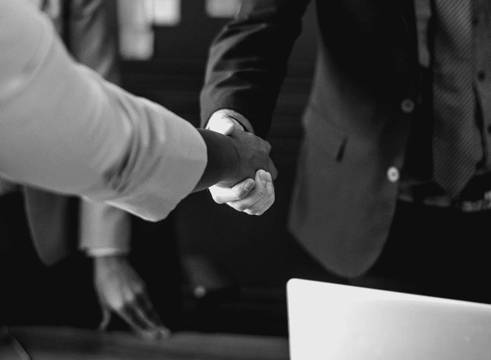
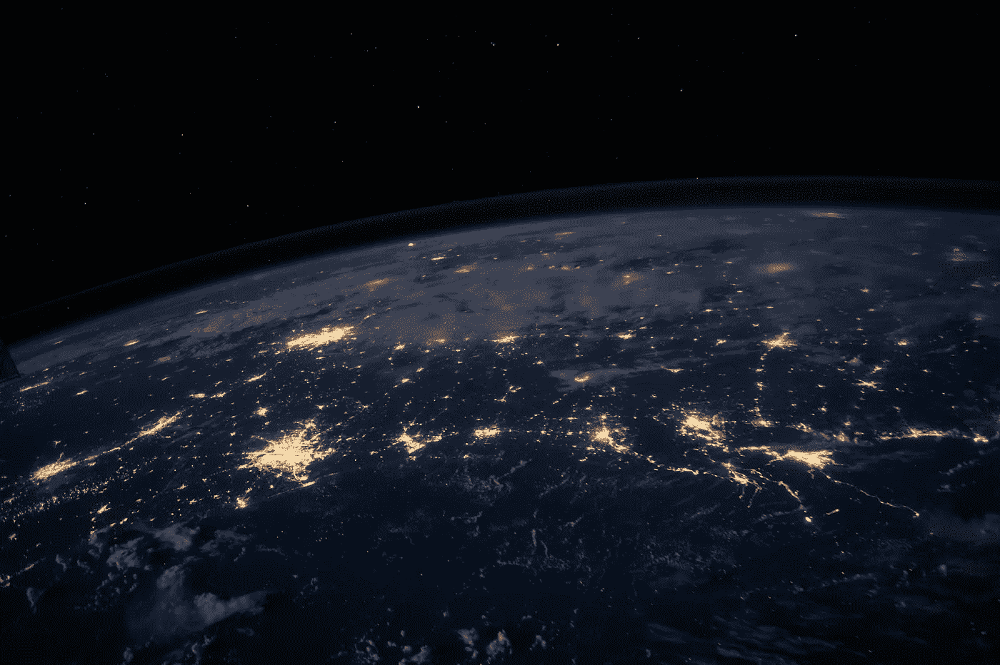

# 网络的契约是什么？

> 原文：<https://medium.com/swlh/what-is-the-contract-for-the-web-7ae382e294a1>

蒂姆·伯纳斯·李提议。谁要握手？

[source](https://unsplash.com/photos/7uGUFCyH3GY)

11 月 5 日，万维网和第一个网络浏览器的发明者蒂姆·伯纳斯·李提出了一份网络合同。这可能是里斯本 2018 年网络峰会最有意义的宣布。

蒂姆·伯纳斯·李目前是牛津大学和麻省理工学院的计算机科学教授，开放数据研究所的创始人和总裁，以及万维网基金会的创始人。他一生中的大部分时间都在积极参与各种旨在提高网络质量的努力。

> 我把网络想象成一个开放的平台，让任何地方的任何人都可以分享信息，获取机会，跨越地理和文化的界限进行合作。(蒂姆·伯纳斯·李，[公开信](https://webfoundation.org/2017/03/web-turns-28-letter/))

首先，他把他的想法——网络——免费提供，没有专利，也没有版税，这样每个人都可以从中受益。他帮助英国政府使数据更加开放，更易于在线获取。他还创立了万维网基金会，旨在“通过启动变革性项目，建设当地能力，以利用网络作为积极变革的媒介，从而推进网络，赋予人类权力”( [来源](https://webfoundation.org/faq/))。

[source](https://unsplash.com/photos/Q1p7bh3SHj8)

根据目前的预测，明年有史以来第一次超过 50%的世界人口将连接到互联网。这是一个伟大的成就，但前面仍有挑战，我们这些已经在线的人应该提出两个基本问题。首先，面对网络威胁、错误信息和隐私问题，我们需要问一问互联网的未来。第二，关于那些还没有被连接的人，我们应该质疑我们在使它发生中的作用。

## 网络合同的目标是什么？

合同的主要目的是拯救互联网。它为所有参与者制定了合乎道德和透明地使用互联网的规则。它将互联网视为一种公共产品和每个人的基本权利。伯纳斯·李正在招募政府、公司和公民加入他的事业。

## 能做些什么？

**政府** 参与谈判的各方都有三项基本任务。政府要确保每个人都能连接到 T4，不管他们是谁，也不管他们在哪里。第二个假设是**保持所有的互联网可用**。应该允许所有人不受限制地获取信息。最后，当局应该对我们的隐私保护负责。这是每个人安全放心地使用互联网之前需要满足的基本要求。

> 政府应该保护公民的数字隐私和安全(……)。(网络基金会政策主任克莱格·费根)

**公司**
公司的首要任务是**让互联网变得可访问、可负担**。这是对网络基金会最近研究的一个回答，该研究显示，有 20 亿人生活在负担不起互联网费用的国家，这仍然将太多的人排除在网上参与和塑造网络之外。尊重用户的隐私并让消费者选择他们想要的网上生活方式也是商家的职责。这也意味着投资设备安全和数据加密。最后，由公司来开发技术，支持人性中最好的一面，挑战最坏的一面。在实践中意味着什么？将重点从财务利润转移到公共利益，以人为本，努力实现社会发展和共同利益。

公民们
最后是我们，网络用户。我们也有事情要做。首先要**创作相关内容，协作**。是蒂姆·伯纳斯·李发明了互联网，但是是使用互联网的人塑造了互联网。这也意味着我们有责任建立基于尊重和人类尊严的社区。它可以归结为一些简单的事情，如网络话语中的礼貌，参与促进强烈道德价值观的项目，或在我们的交流中传播开放的意识。最后但同样重要的是，公民需要为网络而战，表明立场，大声疾呼。许多重要的社会变革之所以发生，仅仅是因为个人为他们关心的事业大声疾呼。我们可以为互联网做同样的事情，让它对每个人都保持中立和真实。

## 下一步是什么？

迄今为止，包括谷歌和脸书在内的 50 多家知名公司签署了合同。该基金会仍在研究这份合同的完整版本，预计将于 2019 年 5 月完成。上述原则虽然雄心勃勃，用意良好，但仍然模糊不清。为了应对互联网今天面临的巨大挑战，我们需要一个结构良好的计划——希望这就是我们明年将得到的。但现在最重要的是提高意识并问自己:‘我能做些什么来让网络变得更好？’不管我们是政策制定者、企业主还是互联网的普通用户。

[source](https://unsplash.com/photos/ZqtrEEOH0X8/)

蒂姆·伯纳斯·李很久以前就预见到，当他的发明落入坏人之手时，它可能会成为世界的破坏者。这个预言开始成真了。像俄罗斯黑客影响美国 2016 年总统大选或政治研究公司剑桥分析公司(Cambridge Analytica)获得超过 8000 万脸书用户数据的新闻变得越来越常见。但是我们仍然可以改变潮流，让网络成为赋权、减少贫困和冲突、改善教育和解决全球环境问题的工具。每个人都可以在这里交流、合作，并通过访问公开信息来改善自己和社区成员的生活。这需要许多共同努力，但并非所有的希望都已破灭。

[加入战斗！](https://fortheweb.webfoundation.org/principles-1)

## 这篇文章发表在[的创业](https://medium.com/swlh)上，这是 Medium 最大的创业刊物，有+390，426 人关注。

## 在这里订阅接收[我们的头条新闻](http://growthsupply.com/the-startup-newsletter/)。

