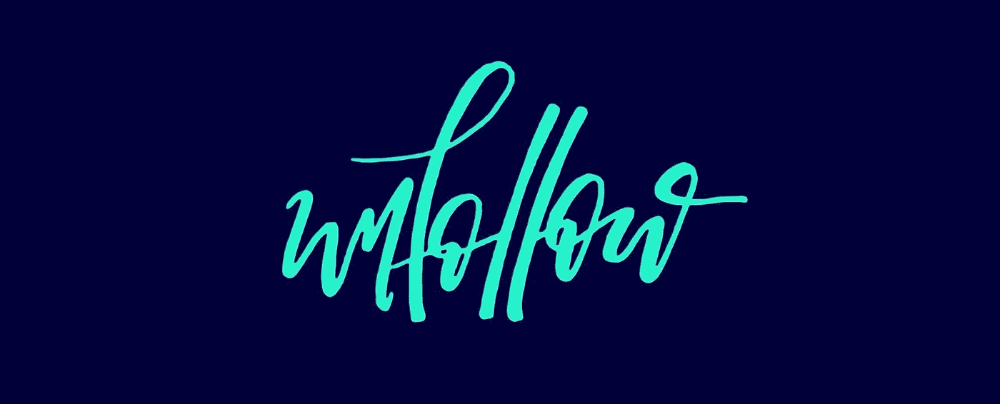
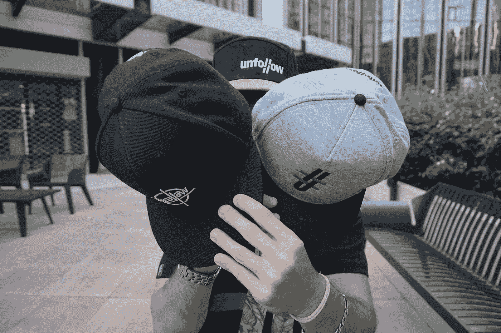

# 什么是无信仰革命？

> 原文：<https://medium.com/swlh/what-is-the-unfollow-revolution-b02f9201b19a>

## 除了是一场无信仰革命

[Unfollow](https://www.facebook.com/groups/unfollowcorp/?fb_dtsg_ag=Ady3Lp8QXgst4GUevmtssRqPSGsmriAuRG9M1scFTC8FVQ%3AAdxQQSAZCBvGNpx99fgnl5Ez7zMh4e_enx_6Gu2ptFU_Bw) 革命是一个概念。

这是一个你创造自己的一套规则的概念。

**创造你自己的道路。**

你分享你的社区之路。

这样做，你打开了另一个充满机会的世界。

当[我第一次完成我的 50 万欧元销售额](/@nicolasserial/5-things-ive-learned-making-half-millions-euros-in-sales-4a451567f6ef)并谈论它的时候，**我周围的每个人**都问我如何做同样的事情。

我知道他们从哪里来。

但是我不接受。

适合我的不一定适合你。

我喜欢辛辣的食物，你呢？

在商业上，也是一样。

成功的唯一途径是从与你的价值观和抱负相符的人那里获得灵感。

然后让它适应你的个性。

看看地球上最富有的人。

他们做的事情各不相同。

[比尔盖茨](https://www.gatesnotes.com/)，[托尼罗宾斯](https://www.tonyrobbins.com/)，[理查德布兰森](https://en.wikipedia.org/wiki/Richard_Branson)。

三个亿万富翁，三个不同的成功故事。

这就是为什么我创造了无信仰革命。

我希望人们跳出框框思考。

要有勇气，要有行动。

**分享他们的经验并传递下去。**

为了支持这些价值观，我创建了 Unfollowear。

代表会员的品牌。

而这个牌子是**免费**。

The Hat collection

不是免费的，从某种意义上说，每个人都可以穿它。

从某种意义上说，**它是不出售的。**

它更像是一个奖励系统，人们将获得并值得成为旗舰。

这听起来可能很势利。这不是我的本意。

其意图是，你**希望**穿上这个品牌，因为它代表了什么。

因为你是谁。

意图？

## “激发灵感的欲望”

## 加入革命-

 [## Unfollow:激发灵感的愿望

### 在无信仰的世界里。在这个世界里，人们以不同的方式思考和行动来创造自己的成功。的…

www.facebook.com](https://www.facebook.com/groups/unfollowcorp/?fb_dtsg_ag=AdwSbM3abHeAhXXb2BaKOxvSu2872WvJNem9IhzL2mc_rg%3AAdxZplzWJy2ql_lNegi8jDTQ_QU0zhpKF82fxfrFrl7m2Q) 

## 三二一…开拍！

[CONTACT ME HERE](https://nickbnns.com)

 [## 你可能从未听说过的关于我的 10 个小秘密

### 好吧，我想该轮到我了。一个月前，当萨丕尔·拉拉提名我的时候，我想知道我的人生有什么价值…

medium.com](/@nicolasserial/10-little-secrets-you-probably-never-heard-about-me-2ff80f167f71)  [## 为什么我不接受每日一帖的挑战

### 以及为什么这可能是个错误

medium.com](/swlh/why-i-wont-take-the-one-post-a-day-challenge-13b8abaf9e6b)  [## 我学到的东西在 5 个月内实现 50 万欧元的销售额(部分。2)

### 为什么我停止了直运？

theascent.pub](https://theascent.pub/things-ive-learned-making-half-millions-euros-in-sales-within-5-months-part-2-eba2add04f3f)  [## 我从严肃嘲笑我的朋友那里学到的教训

### 你是否也觉得人们不把你当回事？

medium.com](/swlh/lessons-i-learned-from-my-friends-seriously-laughing-at-me-10dd5313de6a)  [## 被疯狂解雇如何让我的生活变得最好

### 一个你可以利用的人生教训。

theascent.pub](https://theascent.pub/why-being-fired-might-be-the-best-thing-that-ever-happened-to-you-360e028d2dec)  [## 我在管理我的六位数业务时学到的重要经验

### 领导和管理是成功的关键

medium.com](/swlh/delegating-is-the-most-important-part-of-a-viable-business-48e2f17baf63)  [## 不要把自己藏在动机后面

### 你实际上不需要

theascent.pub](https://theascent.pub/dont-bullshit-yourself-with-motivation-f38d1dd4b61e)  [## 你将如何用神经科学提升你的自信和自尊

### 这实际上比你想象的要容易

medium.com](/swlh/boost-your-confidence-and-self-esteem-using-neuroscience-techniques-3ea06ee36c43)  [## 我学到的 5 件事在 5 个月内实现 50 万欧元的销售额

### 这是一个直运反馈

medium.com](/@nicolasserial/5-things-ive-learned-making-half-millions-euros-in-sales-4a451567f6ef)  [## 癌症杀死了我爸爸

### 我怎么能原谅它呢？

medium.com](/@nicolasserial/have-you-lost-a-close-one-to-cancer-too-df46fe67557c)  [## 你相信奇迹吗？

### 什么是奇迹？

medium.com](/@nicolasserial/do-you-believe-in-miracles-a08c7842ee11)  [## 为什么我会免费蔻驰你？

### 当正常价格是 1497 美元。

medium.com](/@nicolasserial/why-do-i-coach-for-free-2073574d383d)  [## 世界在扼杀你的野心？

### 这篇文章可能会帮助你

medium.com](/@nicolasserial/the-world-is-killing-your-ambition-6d68a36eb9c0)  [## 从服务员到赢家

### 我的第一篇媒体文章，献给某个特别的人

medium.com](/@nicolasserial/from-waiter-to-winner-d9d14a7b125f)  [## 变得更快乐的 5 个步骤

### 说到底，幸福是你做出的选择。

theascent.pub](https://theascent.pub/5-steps-to-become-more-happy-f31328b0ef47)  [## 为什么要成为一个成功的企业家需要冒险？

### 做一个梦想家很好，但做一个规划者和工作者更好。

theascent.pub](https://theascent.pub/why-do-you-need-to-take-risks-to-be-a-successful-entrepreneur-7b62d26bcc6e) 

## 这篇文章发表在 [The Startup](https://medium.com/swlh) 上，这是 Medium 最大的创业刊物，有+ 380，756 人关注。

## 订阅接收[我们的头条](http://growthsupply.com/the-startup-newsletter/)。

