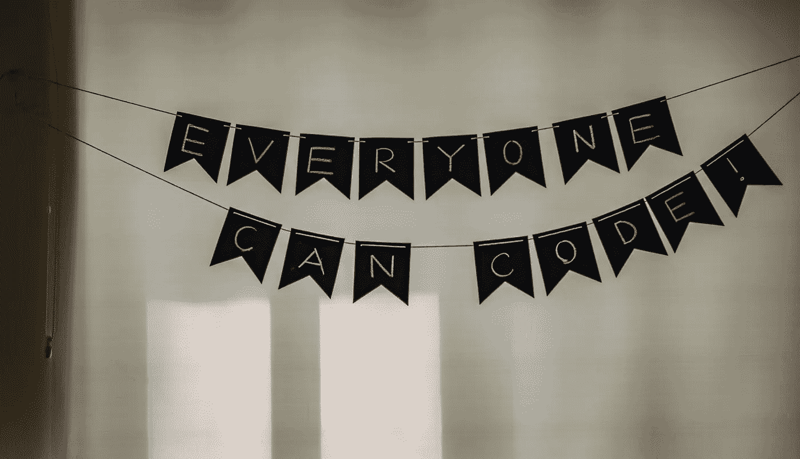

# 这整个编码训练营是怎么回事？

> 原文：<https://medium.com/swlh/what-is-this-whole-coding-bootcamp-thing-594774accb39>

你想知道的一切(但不好意思问)

近年来，编码训练营越来越多。也许你听说过他们，但不太清楚的想法？简而言之，编码训练营是一个密集的、加速的技术培训项目，教授编程技能。

## 谁可以报名？

简单的回答是:基本上每个人都可以参加训练营。

先决条件因训练营而异。有一些公司即使你没有经验或技术背景也会让你报名，还有一些公司有极其苛刻的筛选程序。两者各有利弊。

你可能认为要求越高，以后就越容易找到工作。虽然它可能部分是对的，但它确实取决于程序准备得有多充分，你投入了多少努力，以及你的大脑在短时间内处理大量新知识的能力有多强。

## 是给大家的吗？

这就给我们带来了第二个问题:如果每个人都可以报名，是不是意味着它适合所有人？虽然我知道你想听一些不同的东西，但我相信事实是**编码训练营并不适合所有人**。

为什么？因为每个人都不同，*学习*的方式也不同。虽然我确实相信每个人都可以学习如何编码(尤其是当一个人还是孩子的时候)，但是我们的学习和思维模式会随着年龄的增长而使这个过程变得更加困难，这取决于以前的经验。

另一个要考虑的因素是强度:大多数训练营都是全日制项目，节奏非常快。连续三个月每天工作 10 个小时，每周工作 5 次(周末可能还会复习)，这是一个很大的工作量，而且不是每个人都能处理好。

## 这要花多少钱？

说到身临其境，全日制课程的价格**起价** [**€0**](https://foundersandcoders.com/) (是的，你可以在那里找到一些免费的训练营)，而**的价格可以高达** [**€16.000**](https://www.galvanize.com/san-francisco/web-development) 。这取决于你选择的地点以及学校的声誉。许多训练营提供折扣和奖学金，所以不要因为价格而气馁。

## 这个节目有多长？

大多数沉浸式项目持续 9-14 周。

## 到底有多激烈？

如前所述:是 ***非常*激烈**。注册后，您将会看到:

*   被迫挑战你的精神和身体极限
*   极度疲惫
*   强调
*   沮丧和自我怀疑

但这都是过程的一部分。

## 编码训练营结束后，你能直接被聘为网页开发员吗？

**是的**，这是最有可能的。在我的训练营中，已经有一名学生在项目期间被*雇佣了。值得一提的是，她之前有一些技术经验和编程知识。*

肯定不是每个人都准备好在训练营之后成为初级开发人员。然而，它确实能让你在相对较短的时间内涵盖大量的材料。此外，它还为你提供了以后继续学习的工具和技巧。

在项目完成时，许多人意识到成为一名开发人员甚至不是他们真正想做的事情(这也没关系，因为许多领域都非常需要技术技能)。但对于那些确实想从事这一职业的人来说，一个人多快被录用将取决于多种因素(地点、运气、知识水平，仅举几例)——这是一个单独职位的材料。

## 值得吗？

从我自己的经验来说:绝对是。如果你有决心并且努力工作，一个编码训练营将会让你在教育和职业方面有一个巨大的飞跃。这也是一个结识志趣相投、雄心勃勃的人和建立关系网的好地方。最后但同样重要的是，你可能会惊讶于你在这么短的时间里能学到多少东西，只要你用心去学——对我来说，这可能是最重要和最有力量的收获。

## 这篇文章发表在 [The Startup](https://medium.com/swlh) 上，这是 Medium 最大的创业刊物，有+388，856 人关注。

## 订阅接收[我们的头条新闻](http://growthsupply.com/the-startup-newsletter/)。

