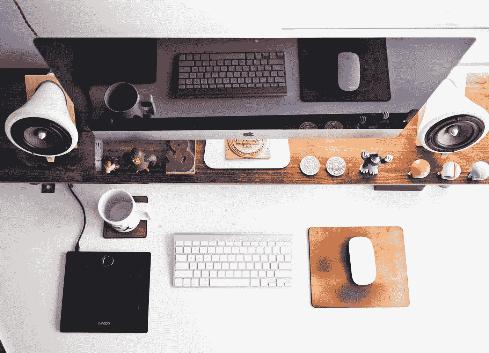
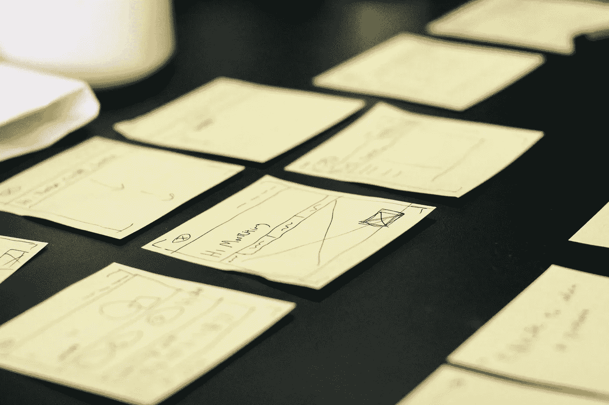

# 什么是 UX 设计？

> 原文：<https://medium.com/swlh/what-is-ux-design-6f1b04e22ec0>

UX 这个术语还需要吗？这些术语到底是什么意思？

# 测验:

1.  **什么是设计？**

在为数字应用做设计的 12 年多时间里，我遇到过许多设计师，他们认为他们的工作是(a)——让事物变得漂亮。他们非常擅长这个。他们磨练自己的技艺，痴迷于 Photoshop 或 Sketch 中的阴影，创造美丽的像素完美图标，让按钮积极地从屏幕上弹出。

想到设计师不就是想到这个吗？Pantone 色卡，大量充满彩色条纹的素描本，手势手写的语句，如“梦想”和“相信”，情绪板，以及 Helvetica 的一个上面有东西的杯子？

我也认识很多出色的设计师，他们很少打开 Photoshop，也不在乎你在背景中使用什么颜色渐变。这些人通常(b)——对他们来说，设计意味着计划、头脑风暴、组织、研究和策略。

你可能经常会发现它们被马克笔、便利贴和索引卡包围着。他们总是与人交谈，进行头脑风暴或研讨会，并围绕“设计思维”创造一种普遍的兴奋感

# 什么是 UX？

今年，我开始指导 UX 设计学院的学生。当然，许多想进入这个领域的人都读过这个主题，但仍然觉得术语令人困惑。“这是我在网络和技术领域的第一次经历，很难了解，”我的一个新学生本周说。" UX 和网页设计的其他部分有什么不同？"

我曾经相信一个 UX 设计师就是一个既做了(a)又做了(b)应用于数字应用的人。

> "只有两个行业称他们的顾客为“用户”:计算机设计和毒品交易."—爱德华·塔夫特

所以“U”表示这与计算机和技术有关，而“X”代表一个人在用计算机和技术做事情时的体验。

## UX 是一种心态。

在过去，在 UX 出现之前，我们开始做一些网页设计。有些人做了好的设计，但很多人做了糟糕的设计，我的意思是他们没有真正考虑他们的东西将如何被使用，由谁使用，以及用于什么目的，所以东西变得非常复杂和难以使用。

一些行业领导者开始写博客和发表想法(顺便说一句，我想这也是我们开始使用 thoughtleader 这个术语的时候),有人提出了 UX 这个术语，事情就这样爆发了。

现在你可以看着一个设计说，而不是“它好吗？”询问“使用这个的人体验好吗？”现在你有了一大堆可以测量的东西。使用这个的人是谁？他们认为什么是好的经历？我们去问问他们吧！让我们同情他们。让我们记录他们的经历，这样我们就可以分析整个旅程。我们希望他们的体验是什么样的？

这就是 UX 设计的现状。一种主动为一组特定用户创建良好体验的方式，由特定目标定义。

有人可能会说这就是好的设计。

换句话说，这是一个为特定受众创造满足特定目标的体验的过程。

剧院布景设计师创造了一种满足情绪、情感、场所感等目标的体验。对于一场演出的观众来说。

品牌识别设计师创造一种满足识别、情感等目标的体验。对于一个品牌的受众来说。

工业设计师创造了满足实用性、美观性等目标的体验。对于特定产品的用户。

软件设计师创造一种满足可用性、有用性、美学、情感等目标的体验。对于数字产品的用户来说。

设计就是设计。

当我们看不到预期的受众或目标，或者我们无法验证我们已经与受众达成了这些目标，我们往往会得到糟糕的设计。

当我们定义我们的目标和我们的观众，我们验证我们的设计，我们往往会得到好的设计。

*我培训和指导产品专业人士，他们希望获得技能和信心，以提升他们的职业生涯，并作为 UX 的领导者建立他们的个人品牌。*

[*了解更多*](https://www.sarahharrison.co/ux-mentorship)

*发表于* **创业、旅游癖和生活黑客**

-