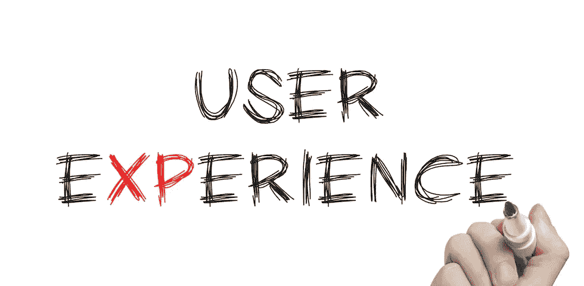
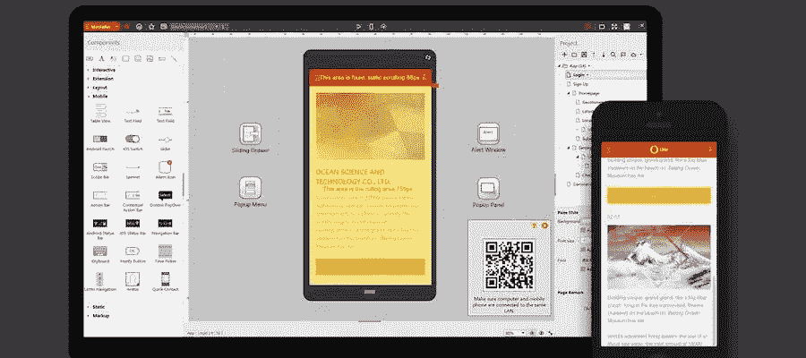

# 什么是 UX 设计？起源、实践和工具

> 原文：<https://medium.com/swlh/what-is-ux-design-origin-practice-and-tools-8341ae10e3db>

什么是 UX 设计？什么是好的用户体验？本文解释了 UX 设计的定义，介绍了用户体验的起源、实践和 UX 工具。

什么是 UX 设计？用户体验设计远远超出了产品或服务的可用性和交互设计。特别是在使用阶段，还应该考虑客户的接触点，在使用前、使用中、使用后与产品或在线服务一起设计。UX 设计师应该非常仔细地考虑每一点和每一个细节，因为客户或用户在使用产品的任何时候的负面体验都会导致对产品的信心丧失和公司的不良声誉。对一个品牌的产品或服务的积极体验会产生忠诚的顾客，他们可能会转向该品牌的品牌大使。

# 1.可验证的可用性

自从 1999 年“[线索宣言](https://www.amazon.com/Cluetrain-Manifesto-10th-Anniversary/dp/0465024092/ref=sr_1_1?ie=UTF8&qid=1500885224&sr=8-1&keywords=Cluetrain+Manifesto)”发表以来，我们就知道市场是转化的。当时，网络思想家 Rick Levine、Christopher Locke、Doc Searls 和 David Weinberger 假设“市场是对话”,并因此提到了新的互动媒体对传统营销的重要性。《宣言》作者的理论被证明是明智的预测:自 2004 年以来，用户生成内容的现象已被归类为维基、博客和社交网络，其关键词为 Web 2.0。这也意味着客户在网上交换产品。一个产品或服务的糟糕体验在社交媒体上越来越独立，不再能被一个公司的营销部门控制。另一方面，只有诚实可信的交流才有帮助，而这种交流的前提是好的产品和服务。

国际标准化组织(ISO)在其系列标准 9241 中为[人机交互](https://www.iso.org/standard/63500.html)制定了标准，定义了可用性，可用性可以通过三个因素来量化:“在特定的使用环境中，特定用户使用产品来实现特定目标的有效性、效率和满意度的程度。”因此，与之前的版本相比，产品的改进是可以衡量的，不再取决于设计师或产品经理的主观品味。

# 2.什么是用户体验设计？

与设计相关的职业领域，建设性地处理可用性问题，是多样的，从用户研究和可用性工程到交互设计，屏幕设计和用户界面设计到图形设计，视觉设计和运动设计等等。[用户体验 vs 用户界面](https://www.mockplus.com/blog/post/ux-is-not-ui/?r=vincent-yfy)也是一个常见的问题。它们都是为某些用户和他们的任务设计和改进产品或服务。

产品设计的能力现在已经不足以成功地将新产品投放市场并赢得客户和用户。苹果认为它是第一批公司之一，早在 1993 年，唐纳德·诺曼就被任命为世界上第一位[用户体验设计师](https://www.mockplus.com/blog/post/ux-architect/?r=vincent)。Norman 之前是加州大学圣地亚哥分校的心理学和认知科学教授，在他的书“[日常事物的设计](https://www.amazon.com/Design-Everyday-Things-Revised-Expanded/dp/0465050654/ref=sr_1_1?s=books&ie=UTF8&qid=1500885382&sr=1-1&keywords=The+Design+of+Everyday+Things)”(1988)中讨论了人类和日常事物之间的心理关系，这些事物会导致沮丧或快乐。

# 3.用户体验设计从整体上考虑客户的生命周期

不仅仅是苹果，越来越多的人已经意识到用户体验设计要整体考虑客户生命周期。这意味着客户在购买前或创建用户账户前很久就会评估预期产品或服务的价值。他们想知道他们把钱花在了什么地方，或者把时间投资在了什么地方。他们想知道产品有什么特点，硬件是在什么条件下生产的，已经使用该系统的朋友或同事，以及产品所有权或网络成员的状态。所有这些都与可用性无关，因为潜在客户甚至没有尝试过产品或服务。然而，所有这些方面都对产品或服务的 UX 设计有重要贡献。

在这种情况下， [UX 设计师](https://www.mockplus.com/blog/post/what-is-an-ux-designer/?r=vincent-zjj)的整体观点也包括实际使用后的阶段。缺陷设备的保修和服务条件如何？有哪些升级选项？用户能否将其照片、电影或联系人迁移到其他平台？使用后，客户会决定是再次成为付费客户，还是放弃公司。

# 4.用户体验是个性化的

直到 2010 年，在 ISO 标准 9241–210“可用系统设计流程”的框架内，首次定义了“用户体验”的概念。因此，用户体验包括用户的认知和情感感受，以及他们在使用过程中对产品或服务的生理和心理反应，以及实际应用前的预期。所有这些体验都会影响顾客对系统的整体印象，进而影响品牌、产品和公司。该定义明确地将服务考虑在内，因此近年来出现的服务设计原则也有助于提供良好的用户体验。

与[可用性测试](https://www.mockplus.com/blog/post/how-to-conduct-usability-testing/?r=vincent-zl)相反，“什么是 UX 设计”是不可测量的，因为它主要是心理和精神过程。换句话说，没有用户体验设计，因为用户体验的许多方面是主观的，设计师不能直接影响这些主观方面。每个人都是不同的，因此体验他/她自己的用户体验设计定义。为了间接地影响这些个人用户体验，数字界面和服务的设计使得用户体验设计更具吸引力。

正如唐纳德·诺曼在 20 世纪 90 年代初对苹果公司的要求，用户体验设计师应该以用户的整体视角设计交互系统，从而为积极的客户体验创造条件。这显然满足了不少设计师的需求，因为 UX 设计师的头衔越来越受欢迎。

单纯的产品设计能力不再足以成功地将新产品和服务投放市场，并赢得客户和用户。

# 5.了解用户

他们的用户研究结果使得越来越多的 UX 设计师加入所谓的人物角色，这些人物角色在进一步的设计和开发过程中代表潜在用户作为范例。有了这些客户或用户模型，他们使用 UX 设计中的场景和[故事板来快速迭代地开发新产品。快速原型工具和线框有助于可视化和理解未来的系统行为。对比大量的原型工具，我个人认为 Mockplus 是最好的一个。](https://www.mockplus.com/blog/post/storyboarding-in-ux-design/?r=vincent)

有了 [Mockplus](http://www.mockplus.com/?r=vincent) ，你可以轻松地为移动和桌面应用创建模型。没有任何编程知识，也可以掌握这个简单易用的工具。通过简单的拖放&你可以创建交互。它预先设计的元素，像弹出式菜单、滑动抽屉和图片传送带，也值得在这里强调。此外，Mockplus 支持团队协作。

在这个过程中获得的见解会进入下一轮的设计，直到这个概念对人物角色和业务环境的前景有说服力。这些步骤只是 UX 设计师工具箱中众多技巧的一部分，还包括设计思维、以人为本的设计、用户体验旅程映射、跨媒体[讲故事来提高你的 UX。](https://www.mockplus.com/blog/post/6-storytelling-principles-to-improve-your-ux/?r=vincent)

这些方法确保 UX 设计师对用户以及产品或服务的使用环境有一个整体的看法。这是创建一个充分和一致的产品的唯一方法，因为各种渠道、平台和用户界面的一致性是 UX 设计的核心关注点之一。为了确保一家公司的长期成功，为了开发新的和创新的在线服务，甚至为初创企业产生想法，需要一种涵盖客户体验所有方面的整体方法。这包括品牌，现实生活中可能的旗舰店，社交媒体的存在，以及导航，手势控制，动画或语音和聊天机器人等互动元素，以及屏幕设计，布局和排版。通过这种方式，UX 设计师为产品和服务创建了一个框架，在客户中带来积极的用户体验，加强他们对品牌的信任，并将他们转变为忠诚的大使。

总之，我们把“什么是 UX 设计”这个问题弄清楚了。用户体验设计是一个不断发展的行业，因为客户的生命周期总是与时俱进。如果你愿意在团队中进行跨学科的工作，将你的心理兴趣与你自己的创作冲动结合起来，并喜欢让自己周围都是思考产品和商业模式的人，你会有一个很好的 UX 设计师的前景。如果一个人还具备面向未来的研究员精神，专业选择是正确的。

**阅读更多:**

[最佳 UI/UX 设计书籍&设计师资源](https://www.mockplus.com/blog/post/the-best-uiux-design-books-resources-for-designers/?r=vincent-j)

[用户体验第一:用原型工具创造最佳产品](https://www.mockplus.com/blog/post/user-experience-first-creating-optimal-product-with-prototyping-tools/?r=vincent)

[对于 UI/UX 设计师来说——UX 在网页设计中意味着什么？](https://www.mockplus.com/blog/post/what-does-ux-mean-in-web-design/?r=vincent)

【www.mockplus.com】最初发表于**。**

**

## *这个故事发表在 [The Startup](https://medium.com/swlh) 上，这是 Medium 最大的创业刊物，拥有 325，521+人关注。*

## *在此订阅接收[我们的头条新闻](http://growthsupply.com/the-startup-newsletter/)。*

**