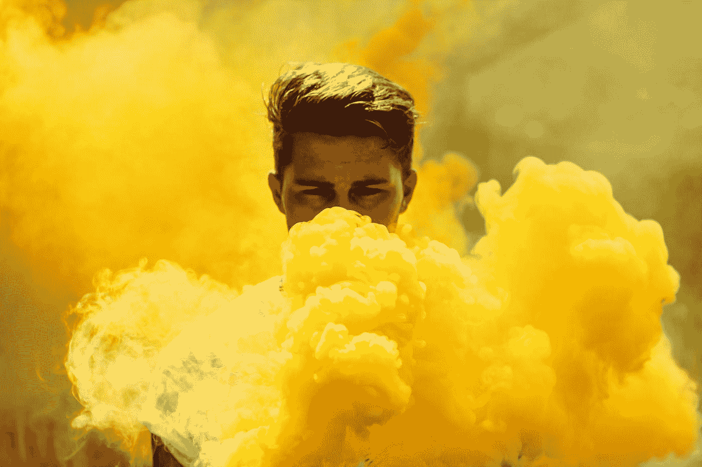
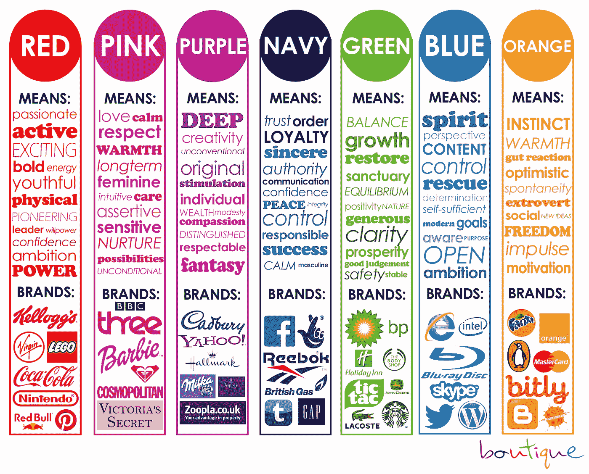
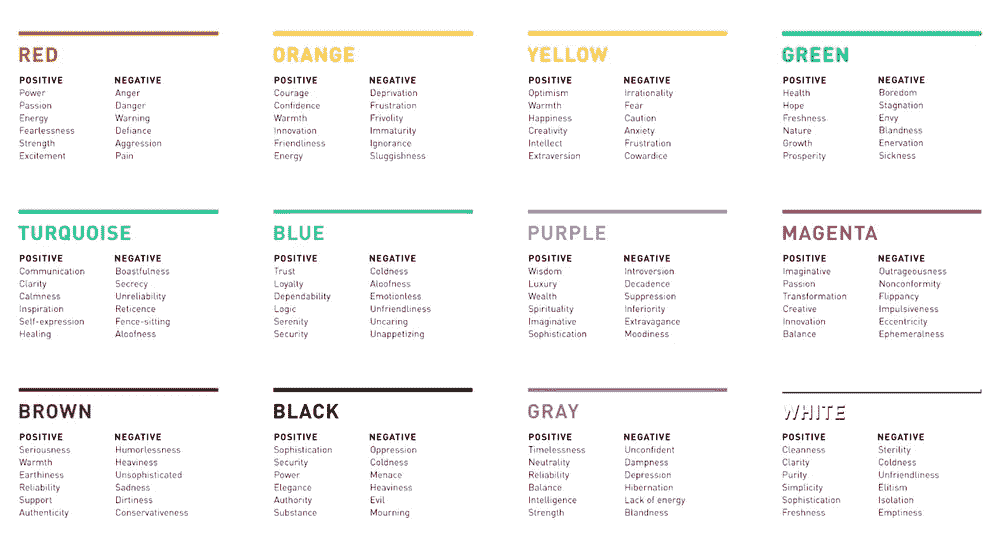
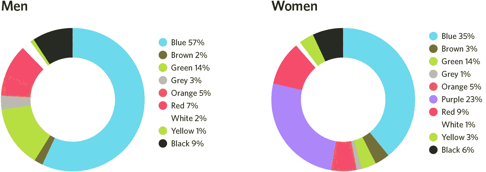
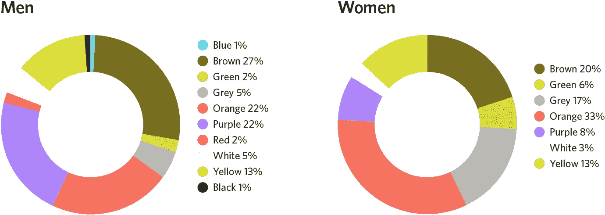

# 你的灵魂颜色是什么？

> 原文：<https://medium.com/swlh/what-is-your-soul-color-48cb568395fd>

为什么当你认为自己是黄色的时候，人们却认为你是蓝色的

Photo by [Christian Sterk](https://unsplash.com/@christiansterk?utm_source=medium&utm_medium=referral) on [Unsplash](https://unsplash.com?utm_source=medium&utm_medium=referral)

几天前，当我和一位招聘经理面试下一个工作机会时，当他问到最后一个问题时，他问我

> 如果你可以选择一种颜色来描述你自己，你会选择哪一种，为什么？

我完全失去了知觉，因为我甚至不知道除了红色、蓝色、黄色、绿色之外还有什么颜色。以及每种颜色背后的含义。你们中的一些人可能急于知道我的答案。其实我说的是**黄色。虽然看起来不太时髦，但我确实认为黄色是最适合描述我性格的颜色。因为当我们看到颜色时，我们往往会感到温暖、有动力、容易接近和有吸引力，我就是这种人。我认为毫无疑问，我选择了一个非常适合我的颜色。**

当我把这个故事告诉我的朋友后，她震惊地说:**怎么可能，你是蓝色的！黄色永远不可能是你！**

为了找出谁是正确的，并挖掘出颜色背后的故事，我决定用**颜色心理学**做一些研究，这实际上已经发展了相当长的时间，许多学者都专注于**找出人类性格和颜色之间的联系**。

# 什么是色彩心理学

> **色彩心理学**是将色彩作为人类行为决定因素的研究。**颜色**影响不明显的感知，比如食物的味道。…许多营销人员将**颜色**视为营销的重要组成部分，因为**颜色**可以用来影响消费者的情绪以及对商品和服务的感知。

谷歌告诉我们的是，人类的性格和你喜欢的颜色或你做测试时选择的颜色之间存在相关性。

众所周知**基本的三种颜色是红色、黄色和蓝色。其他颜色都是这些原色的组合。例如，黄色+蓝色=绿色。**

然后我在网上找到了一个图表，显示了与每种颜色相关的情绪。

显然，这些都是一般性的描述，但它为领导者提供了一个评估团队中不同性格类型的起点。即使在日常生活中，这也有助于我们更好地理解他人。

# 男性和女性对颜色的偏好

男人和女人在选择颜色时往往有明显的不同。

## 男人和女人最喜欢的颜色

Credit to Joe Hallock

## 男女最不喜欢的颜色

Credit to Joe Hallock

许多品牌试图挖掘不同性别、年龄和其他人口统计因素的颜色背后的模式，以改善促销和产品设计的营销策略。

# 找出你个人的颜色和意义

毕竟，最重要的是找到它的意义，并试着更多地了解自己。这里有一些常见的颜色和它所显示的。

## **黑色。**

选择黑色作为自己喜欢的颜色的人，往往很有艺术感，也很敏感。虽然这些人并不内向，但他们对生活细节很小心，不轻易与他人分享。

## **白色。**

喜欢白色的人通常是有条理和逻辑性的，他们的生活中没有太多杂乱。

## **红色。**

那些热爱红色的人尽情享受生活，并且坚韧不拔，矢志不渝。

## **蓝色。**

如果蓝色是你最喜欢的颜色，你喜欢和谐，可靠，敏感，总是努力为他人着想。你喜欢保持东西干净整洁，觉得稳定是生活中最重要的方面。

## **绿色。**

喜欢绿色的人通常是深情、忠诚和坦率的。绿色爱好者也知道别人对他们的看法，认为他们的声誉非常重要。

## **黄色。**

你喜欢学习和与他人分享你的知识。找到幸福对你来说很容易，别人会把你比作阳光。

## **紫色。**

你很有艺术感，很独特。你非常尊重他人，但有时也会傲慢自大。

## **棕色。**

你是一个好朋友，尽最大努力让自己变得可靠和可依赖。华而不实的东西不是你想要的；你只是想要一个稳定的生活。

# 在这里找到更多我的故事！

## 这个故事发表在 [The Startup](https://medium.com/swlh) 上，这是 Medium 最大的创业刊物，拥有 314，551+人关注。

## 在这里订阅接收[我们的头条新闻](http://growthsupply.com/the-startup-newsletter/)。

