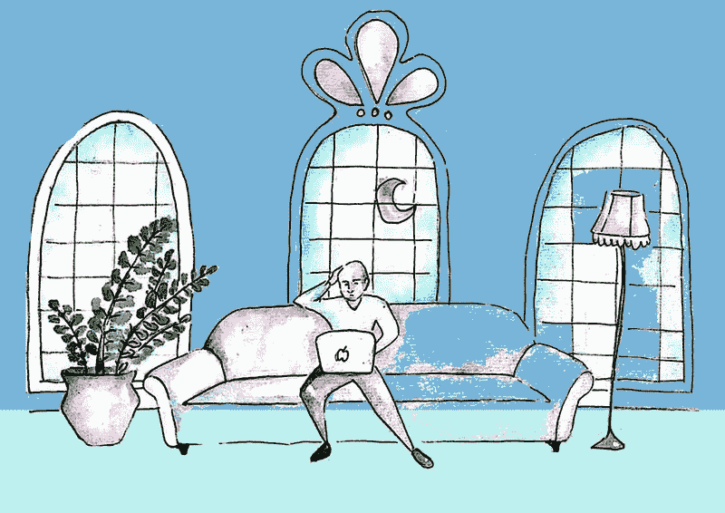
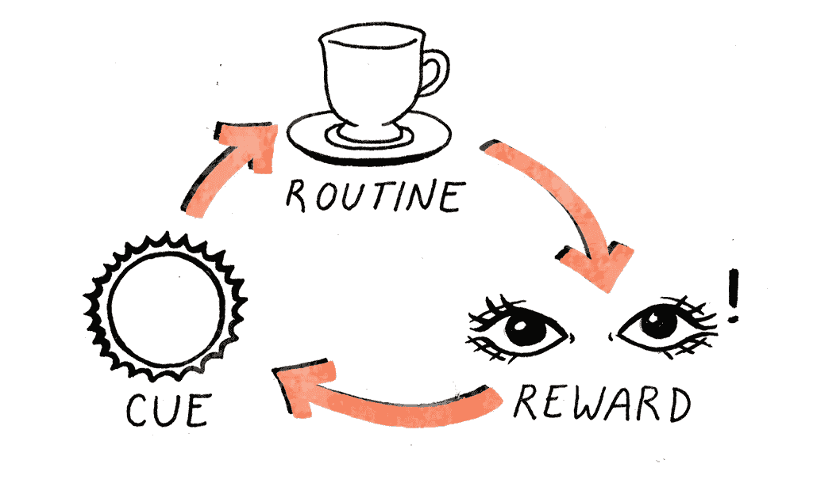
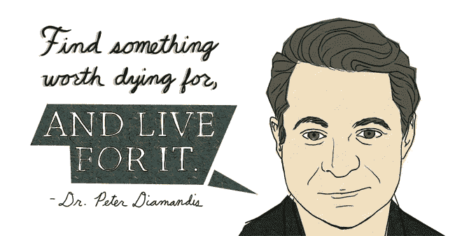

# 一天工作 16 小时到底意味着什么，以及为什么我们都必须这样做

> 原文：<https://medium.com/swlh/what-it-actually-means-to-work-16-hours-a-day-and-why-we-all-must-do-it-2edbb687b497>

> “活得最久的人不是数得最多的人，而是最能感受生活的人。”—让-雅克·卢梭

为了不每天工作 16 个小时(并获得成功)，你必须做一些你不介意每天工作 16 个小时的事情。矛盾的是，如果你习惯了每天工作 16 个小时，不管你做什么，你可能不会每天工作 16 个小时。然而，在那个时候，你会非常擅长你所做的事情(和其他事情),以至于你不想停止工作

虽然这不是关于一天工作 16 个小时本身，而是关于一个人在醒着的所有时间里行动的目的和意义——从而能够改善他们在工作之外的其他事情上的时间品味。

需要明确的是，没有人能够也应该尝试一天连续工作 16 个小时，这不是这篇文章的目的。然而，这是利用你必须投入的全部 16 个小时，优化你剩余的生活来做一件事——并在这个过程中让其他事情变得更好吃。

正如每一个努力工作的人都知道的那样，你如何做任何事情就是你如何做每一件事情——要掌握一个领域并超越竞争对手——超越他人就是一种方法。

然而这件作品不是关于那个的。这是承诺的力量。来自愿意为一件事奉献一切的人的承诺。

在这篇文章中，我将解释努力工作的细微差别，这样你就可以选择不努力工作，在工作和其他事情上取得成功。

# 承诺的力量

***“一个人的生活质量与他们对卓越的承诺成正比，不管他们选择的努力领域是什么。”文斯·伦巴第***

如果你致力于工作，并且知道如果你的家庭生活不好，你就不能很好地工作，你实际上也会致力于你的家庭生活。

如果你致力于工作，并且知道如果你的健康状况不好，你就不能很好地工作，你实际上也会致力于你的健康。

这并不是说你真的要做 16 个小时的假期活动，而是说你起床的每一刻都很重要——有足够的意义去认真对待，这当然包括休息和恢复的时间。

这就是为什么最努力工作的人实际上往往是最快乐的，很难抽出时间。不是因为他们花大部分时间在工作上，而是因为他们对某件事的承诺，这使得这件事之外的其他事情也很重要，如果不是更重要的话。

更不用说，人类适应性很强，甚至可以让艰苦的工作变得轻松。这就是我们是否在谈论艰苦的体力劳动或白领工作。但是我跑题了。

正如博客 Brainpickings.org 的创始人 Maria Popova 在[与记者](http://blogs.reuters.com/felix-salmon/2013/02/13/blogonomics-maria-popova-edition/)的电子邮件交流中谈到她是如何通过博客赚钱的:

> **“关于时间，实际上——对任何了解我的人来说，质疑我投入了多少时间在我所做的事情上会很可笑。集思广益不是我谋生的方式，而是我的生活，费利克斯。每一个醒着的时刻都会以这样或那样的方式进入其中——阅读书籍、研究、与人见面、采访，甚至现在就做这些都要花费大量的时间，当然从周一到周五每天写 3 篇文章，每篇 300 到 3000 字。(再加上我的校对和任何时间的实习生的时间，以及需要时的设计师和开发人员。)事情是这样的——我这样做不是为了“建立一个观众群”或者“创造收入”或者其他什么，而是因为它给了我巨大的快乐和刺激。它让我兴奋地醒来，满足地上床睡觉。”**

在某种程度上，她甚至不得不去做其他事情，因为她太喜欢集思广益了。我感同身受，因为我也必须努力工作，不去阅读或写作，以安排社交活动和休息时间。

正是这种程度的承诺让生活变得甜蜜，那些因为承诺某事而享受每一秒钟的人能够全心全意地承诺他们所做的一切，而不仅仅是工作。

因为他们知道如何承诺。

显然，连续工作 16 个小时什么也不做(至少对白领来说)是工作狂所做的，通常是因为精神状态不佳，缺乏对重要事情的某种逃避。

不管怎样，这些人中的大多数并没有有效地每天工作接近 16 个小时，他们只是在“工作”。

# 工作狂——这不是什么

在这种强有力的承诺和有时被认为是工作狂之间有一条纤细而深刻的线，工作狂有能力为自己和你爱的人创造天堂或地狱。

意图很重要。

通过感恩沉浸，而不是通过工作逃避。

根据哈佛的这项研究，前者最快乐，最有品味，而后者通常不健康，会错过幸福生活中最重要的部分。

卓越*是因为*的工作，而不是疲惫。

韧性*是因为*的工作，而不是腐烂。

永远不要“错过”,但要做出足够的牺牲，这样工作之外的时间才会变得甜蜜、被欣赏、被优雅地度过。

我不会一天工作 16 个小时(我不相信这对大多数白领工作来说是可能的)，但我把一天中的每一个小时都视为神圣，无论是从突发写作中恢复还是过渡到另一个时间承诺。

主要的区别在于我们如何看待我们的时间，以及我们赋予时间的价值。我说的一天 16 个小时“工作”就是这个意思。

# 如果你不同意，也有一线希望

> “企业家会像大多数人一样度过他们生命中的几年，因此他们可以像大多数人一样度过他们的余生。”

同样，埃隆·马斯克说过，你投入的额外时间不会加剧你的竞争，而是会带来指数优势。

你有没有注意到那些喜欢一直工作的人，往往最后并没有努力工作那么久？然而，当他们不需要工作的时候，他们往往更喜欢工作，因为从中可以获得快乐和个人成长。

他们从痛苦中获得快乐，从磨砺中获得荣耀。

他们发现克服和超越是非常有趣的。接受新的挑战，越大越好。

这就是为什么当人们变得更加成功，不得不做更少的事情时，他们会怀念过去的日子。

这家初创企业从一小群感觉像一个家庭的沙发上的不速之客开始，最终成长为一个高管争权夺利的帝国。

成为经理的交易者错过了提取大量信息和进行高风险交易的强度。

**快进到你想去的地方，最终的梦想实现了，真正感受自己在那里完成了所有的事情，感受那会是什么感觉。**

这是你感觉自我实现的时刻。你在银行里有所有你需要的钱。

**然后问，“现在怎么办？”。从那里决定你愿意承诺什么。**

这就是你存在的理由，或者说你的“为什么”。

正如马克·吐温所说:“最重要的两天是你出生的那一天和你找出原因的那一天。”

你会发现，当你的自我实现得到关注时，最重要的是你的旅程追求的质量，以及随之而来的成长。

你的方式，你的存在。

因此，掌握和优秀本身才是重要的，能够每天品尝才是让我们快乐的。

我经常用企业家精神来给出最广泛的背景，因为每个人都是他们生命中的企业家——投资时间，以换取金钱，并决定如何使用这些金钱和时间。

这决定了你以后的时间怎么过。

生活的反馈循环是给予和索取，所以只有那些工作最努力的人最终工作得最好，并且这样做，在生活的游戏中做得最好，这才有意义。

这是他们是出纳员还是投资银行家。

一个收银员晋升很快成为经理，而另一个却无动于衷，因为他们认为自己没有尽职尽责。

一位银行家早上 5 点起床，阅读《商业拓展》,另一位银行家则突然出现，希望有新的账户入账。

**与工作无关，与习惯有关。**

**与“场内”游戏无关，一切都与“场外”练习有关。**

**那些愿意把每天 16 个小时投入到更大的事情中的人，不管他们在做什么，最终都会过上最幸福、最满足的生活，尽管他们最开始经常是出于家庭责任等需要而被迫工作那么长时间。**

# 人类适应性很强

> “成功实际上是一场短距离的赛跑——由纪律推动的冲刺，时间长到足以让习惯发挥作用并取而代之。”《一件事》的畅销书作者杰伊·帕波森

在杰伊·帕波森(Jay Paposan)的传奇著作《同一件事》(The One Thing)(《纽约时报》(NYTimes)、《华尔街日报》(WSJ)、《今日美国》(USA Today)排名第一，并获得了 12 项图书奖)中，他谈到了毁灭性专注的力量，并提供了一个很好的框架，用两种不同的方式问一个简单的问题来应用它。

***“聚焦题是双责题。它有两种形式:大画面和小焦点。一个是找到正确的人生方向，另一个是找到正确的行动。”***

***1。我的一件事是什么？用它来发展你的人生愿景和你的职业或公司的方向。这是你的战略指南针。***

**②*。我现在唯一想做的是什么？当你第一次醒来的时候和一整天都用这个。它让你专注于你最重要的工作，并且在你需要的时候，帮助你找到“杠杆作用”或任何活动中的第一张多米诺骨牌。***

帕帕桑讲述了迈克尔菲尔普斯的故事，以及他如何与注意力不集中症一起长大，并一直努力在学校表现良好。没有人会相信他会有每天游泳六小时并参加奥运会的纪律——但他找到了他的一件事，并利用习惯的力量使之变得容易。

大多数人不会经历最初需要适应的痛苦，或者可悲的是不知道如何去适应。所需要的只是最初的训练，直到你能够养成习惯。

当我们大量练习时，随着时间的推移，大脑可以自动运行，而无需花费大量的精力或脑力——有点像开车。这叫自动性。学习到的任务成为一种自动反应模式或习惯。通常是重复的结果。

我们适应性强，能够养成习惯。你现在有了它们，它们像这样循环工作:

我们有可塑性的大脑，可以被塑造来学习新技能，随着时间的推移，通过练习，一种全新的技能变得容易。

所以*不*一天工作 16 个小时的关键是做一些让你想一天工作 16 个小时的事情，养成习惯，让你的行为是自动的、节能的，而不是耗费精力、耗尽体力的。

过一会儿，你就有动力了。

有了一些动力之后，你就建立了信心。

建立信心后，你开始在竞技场上看到成果。

当你开始在竞技场上看到结果，你会变得无情。

这就是为什么世界上有迈克尔·乔丹和迈克尔·菲尔普斯——他们不认为这行得通。

**结论**

我们都应该把醒着的 16 岁变得尽可能神圣，这不是为了让我们能一直“工作”，而是因为通过致力于某事，它让我们成为卓越的大师。

我们总是可以用我们的一样东西作为指南针。

纪律不是答案，但利用习惯的力量才是。你所需要的只是在开始时的一个推动，这样你就可以让你的牵引化合物最终让习惯接管，像火箭船一样加速你。

一旦你找到了值得你投入神圣的 16 岁的事情，确保你全心全意地投入到你的健康、人际关系和其他一切来支持你的承诺，而不是从中抽身。

在任何比赛中，努力工作会使你与众不同，时间的压缩不是复合活动的问题，而是意义的复合。

我们过日子的方式就是我们过一生的方式。

找到你值得为之献身的事情，让你的时刻变得有意义，这样你就可以充分利用你的 16 个小时。​

[点击接收一篇大胆的每周文章，我将 10 位伟大思想家的想法和点点滴滴联系起来，带给你一个想法背后的细微差别——你还会收到我个人用来管理习惯的终极清单](https://betreatedhowyouwanttobetreated.com/optin-main)

## 这篇文章发表在[《创业](https://medium.com/swlh)》上，这是 Medium 最大的创业刊物，有+369，832 人关注。

## 在这里订阅接收[我们的头条新闻](http://growthsupply.com/the-startup-newsletter/)。

