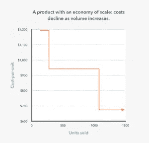
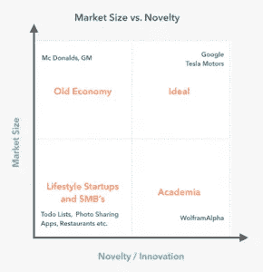
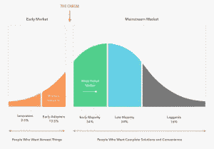

# 在当今瞬息万变的世界里，创业意味着什么

> 原文：<https://medium.com/swlh/what-it-means-to-run-a-start-up-in-todays-ever-changing-world-79cf881c9f0b>

Originally published on [http://www.appsterhq.com](http://www.appsterhq.com/?utm_source=CP&utm_medium=Medium)

## 以及当代初创企业的五个决定性特征

关于初创企业的许多传统观点都基于这样一种观念，即初创企业本质上只是另一种中小型企业。

然而，现实是，21 世纪的初创企业是一种独特的现象。如今的初创企业受到新规则、新目标和新运营方式的约束。

在深入探讨这些当代创业公司的五个特征之前，我想花点时间解释一个基本的区别:

# 创业公司与中小型企业

21 世纪企业家驱动的企业通常可以分为两类。

一方面，有大多数人非常熟悉的传统的中小企业。

中小型企业通常由一个人创办，旨在满足本地和/或有限市场的需求。这些企业通常不需要外部投资。

不同的监管机构使用不同的定义。

例如，澳大利亚的中小企业通常被归类为[员工不超过 15-20 人，年收入不超过 200 万美元。美国](http://asic.gov.au/for-business/your-business/small-business/small-business-overview/small-business-what-is-small-business/)[倾向于使用员工少于 500 人、平均年收入少于 750 万美元的](https://www.sba.gov/contracting/getting-started-contractor/make-sure-you-meet-sba-size-standards/summary-size-standards-industry-sector)标准。

中小型企业在区域或全球范围内扩大规模的能力往往是有限的；创始人往往不关心如此大规模的扩张。

中小型企业的例子包括餐馆、五金店和修理店、小型咨询公司、理发店等等。

另一方面，有**初创企业**——一种在现代社会中越来越受欢迎并对其产生影响的新型企业。

初创公司着眼于*大市场*，完全基于创造*创新产品或服务*，并且经常利用*未经证实的商业模式*。

正如 Investopedia [所指出的](http://www.investopedia.com/ask/answers/12/what-is-a-startup.asp)，“初创公司提供的产品或服务是目前市场上其他地方没有提供的，或者创始人认为是以劣质方式提供的。”

初创公司在有限的时间和资源下运作，明确地关心如何尽快进入并主导一部分市场。

由于创业世界固有的高度不确定性和不可预测性，创业企业家通常会寻求并依赖外部投资。

这些资金给予新公司一些“喘息空间”来进行实验，从错误中反弹，并迅速采取果断行动。

由于科技初创企业是本文的重点，我想继续讨论这些当代初创企业的五个定义特征，并分享从[构建 Appster](http://www.appsterhq.com/?utm_source=CP&utm_medium=Medium) 和帮助我们的初创客户中获得的见解:

# 1.初创企业从根本上关注增长

**可以说**，*现代初创企业最显著的特征是，它们深深致力于实现大幅增长*。

初创公司努力建立具有全球影响力的业务，每年创造数百万甚至数十亿美元的收入。

从某种意义上说，这是一场在特定市场内争夺世界统治地位的游戏。

这些雄心勃勃的目标是在初创企业通常只有有限的资金和时间来取得成功的情况下实现的(或者尽管如此)。

风险投资家、 [Y Combinator](http://www.ycombinator.com/) 的联合创始人保罗·格拉厄姆在[中非常清楚地坚持](http://www.paulgraham.com/growth.html)初创企业从根本上讲就是要做大:

> *“初创公司是一家旨在快速发展的公司……唯一重要的是增长。我们与创业公司相关的其他一切都源于成长……创业公司如此难以创建，你不可能被推到一边并希望获得成功。* ***你要知道，成长是你追求的*** *。”*

Graham 进一步解释说，YC 希望它所资助的初创公司以每周 5-7%的速度扩大每用户的收入。在最好的情况下，这个数字接近 10%。

每周 5%-10%的增长率是相当大的增长:例如，一家每周增长 5%的初创公司在四年内每月可以赚 2500 万美元左右。

那么，这就是今天的初创公司试图实现的大规模高速增长。

创业公司与中小企业的不同之处在于，小企业通常需要尽快产生利润以维持运营，而在创业世界中，新公司通常必须牺牲利润才能实现增长，这是理所当然的。

# 2.初创企业展现出规模经济

为了快速地大幅增长，*初创公司必须展现出* ***的规模经济*** :

> “规模经济是指随着产品产量的增加而产生的成本优势。规模经济的产生是因为产量和单位固定成本之间的反比关系；也就是说，生产的商品数量越多，单位固定成本就越低，因为这些成本分散在更多的商品上”([来源](http://www.investopedia.com/terms/e/economiesofscale.asp))。

## 简单来说，创业公司追求的是这样一种局面:他们拥有的客户越多，他们产品的成本就越便宜。

例如:如果你开发了一个价值 250，000 美元的应用程序，并获得了 10，000 次下载，那么你每次下载的成本是 25 美元。然而，如果你设法将下载量提高 10 倍，让 10 万人下载该应用，那么每次下载的成本仅为 2.50 美元。

重要的是，对于中小企业来说,*不*也是如此。

例如，如果你有一家冰淇淋店，你卖的香蕉奶昔每杯售价 2.50 美元，每杯售价 5.00 美元，那么不管有多少顾客光顾你的店，你都必须为你做的每杯奶昔支付同样的 2.50 美元。

当然，由于你的单店存储商品、制作甜点和服务顾客的能力有限，你必须开更多的店才能成长。

运营一家软件初创公司最吸引人的一个特点是，几乎没有复制成本会阻碍你实现大规模经济(例如，复制 100 个新应用程序和复制 10 万个新应用程序的成本是一样的)。

这也是为什么[科技初创企业往往有很高的前期成本](https://www.fastcompany.com/1841912/true-costs-launching-startup)的另一个原因，随着有可能利用增长，他们会设法收回这些成本:

开始创业时，进行一些基本的计算以确定你的规模经济会是什么样子是至关重要的。这里有三个快速提示:

*   做一些工作来确定你的产品(比如你的应用)的经济模式是否真的可能成功；然后
*   计算出你需要多少资金来推出产品(开发、营销等)。);最后
*   智能地计算产品价格，了解影响人们是否愿意支付该价格(包括竞争对手定价、预计客户数量等)的不同因素，以及如果愿意，会有多少人愿意支付该价格。

# 3.创业公司追求大市场

结合规模经济的坚实产品对现代初创企业的成功至关重要，但这种结合并不是故事的结尾:*21 世纪的初创企业必须追求并有效服务于* ***大型(和/或快速扩张的)市场*** 。

大市场，或相对较小但迅速扩大的市场，有大量消费者对解决紧急问题的需求，是当今世界创业成功的绝对关键。

正如我[最近提到的](http://www.appsterhq.com/blog/4-startup-myths-entrepreneurs-success):

> “即使你是第一个创造出一些有巨大潜力帮助消费者的新玩意或新工艺的人，如果需要几年甚至几十年才能出现一个可以买卖这种发明的市场，那么你的发明基本上是无用的”。

当瞄准一个较小但增长迅速的市场时，时机就是一切。

看到初创企业[失败](http://www.appsterhq.com/blog/premature-scaling)并不罕见，因为他们进入市场太早，在市场本身和对他们产品的需求完全出现之前就烧钱了。

事实是，大多数成功的创业公司都是第一个上市的。[正如我最近指出的](http://www.appsterhq.com/blog/4-startup-myths-entrepreneurs-success):

> “在脸书诞生之前，Myspace 和 Friendster 就已经成立，并拥有许多活跃用户；早在 Groupon 出现的十年前，就有各种各样的团购网站在运营；在特斯拉取得主导地位之前，电动汽车就已经在美国的道路上行驶了。

所有这些市场——社交网络、团购和电动汽车——在今天运营这些市场的大公司首次推出之前就已经稳固地建立起来了。

脸书、Groupon 和 Tesla 通过制造更好更创新的产品赢得了这些市场，而不是在时机成熟前匆忙上市。

今天的科技创业公司还必须根据准确和定期计算的市场规模统计数据来运作。

当[建立一家初创企业的时候](http://www.appsterhq.com/blog/early-stage-entrepreneurs-launch-profitable-startup)时刻意识到你的潜在市场规模到底有多大是很重要的。

例如:

*   如果你向期权交易者出售一个算法交易工具，数据显示全球有 700 万期权交易者，那么你可能会认为 700 万是你的市场
*   但实际上，仔细观察市场会发现，只有 45 万交易者在高频交易
*   因此，45 万——而不是 700 万——是你的实际市场规模。

关于如何计算你的真实市场规模的更详细的解释，包括需要了解“*总可用市场”* (TAM)、“*可用市场”* (SAM)和“*目标市场”* (TM)之间的差异，请参见[此处](http://www.appsterhq.com/blog/build-successful-mobile-app-startup)。

# 4.初创企业在极度不确定的条件下运营

与运营和扩大初创企业相比，运营传统中小企业的不确定性要小得多。

例如，如果你在了解到该地区缺乏对高品质咖啡的强烈需求后，决定在你所在的城市开一家咖啡店，那么执行起来相当简单:

*   咖啡是一种非常常见且备受追捧的商品
*   人们以特定的、可预测的方式消费咖啡(例如，latté、cappuccino、espresso、decaf 等)。)
*   咖啡可以以合理的价格进口，而且没有什么限制，然后在你家附近出售。

与这些动力相反，*现代初创企业的创建包括推出一种* ***创新产品*** *，这种产品以前可能从未被使用过，通常还会伴随着一种* ***尚待验证的商业模式*** 。

在创造、推出和营销创新产品的过程中，可能存在无限多的变量:

*   人们会按照你的意愿/期望使用你的产品吗？如果不是，那么你的公司应该怎么做？
*   产品是否符合消费者的期望和/或愿望？
*   该产品能否有效解决消费者的痛苦，让人们愿意为此付费？

经营一家新的创业公司也有很多财务风险(和商业模式的不确定性)。

如果你盲目进入市场，也就是说，没有进行相关的案例研究，那么你很可能会发现你的数据并不像预期的那样有效，让你拼命地调整你的模型。

事实上，这就是为什么我们 Appster [强烈建议](http://www.appsterhq.com/blog/test-product-idea-real-world-feedback)在完全投入市场之前，通过收集真实消费者的真实反馈来测试你的想法。

通常，缺乏经验的创始人会错误地从传统商业运作的角度考虑他们的创业。

虽然对于一家新的咖啡店来说，围绕着一份基于大量现有市场和相关行业数据的具体商业计划的撰写和遵循是有道理的，但对于一家 21 世纪的初创企业来说，这完全不是这样。

事实上，一家科技初创公司的商业计划通常只不过是一堆希望、假设和幻想——猜测很可能会随着时间的推移而改变。

在当今不稳定的世界中，成功的初创企业的核心属性之一是表现出改变、适应市场条件和接受新的做事方式的能力——即使这意味着彻底改变你迄今为止一直在做的事情。

正如我最近[指出的](http://www.appsterhq.com/blog/4-startup-myths-entrepreneurs-success):

*“insta gram 最初是一个名为 Burbn 的 Foursquare 山寨版；Pinterest 被称为 Tote，开始是一家电子商务初创公司；YouTube 一开始是视频交友网站；Paypal 在选择目前的在线支付服务之前，经历了 5 次不同的转变。如果这些庞大公司的创始人中有任何人仍然坚定不移地执行他们最初的愿景，那么他们很可能早就失败了”。*

# 5.初创企业以非常独特的方式进行营销

我们在 Appster 经常遇到的一个最常见的误解是，错误地认为现代初创公司必须创造具有广泛和主流吸引力的产品，也就是说，这些产品必须进入整个社会的普通大众手中。

这是一个持久而有害的神话，它会阻碍企业家实现其企业的真正潜力。

[我最近打破了这个神话](http://www.appsterhq.com/blog/4-startup-myths-entrepreneurs-success)，我向大家展示了 21 世纪许多最成功的创业公司事实上并没有将他们早期的商业运作建立在那些立即占领主流市场的产品之上:

没有经验的企业家经常不断地修改他们的产品概念，增加额外的功能，希望他们的产品能够进入越来越多的消费者手中。

他们试图通过创造比脸书更大更好的东西来打造下一个脸书，并试图将其投放到大众市场，同时却忘记了马克·扎克伯格和他的同事们实际上从未将任何类型的大众市场作为目标。相反，脸书试图赢得常春藤联盟的学生，即一个利基市场。

*的确，* ***最好的产品往往是那些一开始就专注于赢得一小部分用户的心，然后才扩展到更深领域的产品*** *。*

苹果公司用它的 iPhone 瞄准了科技极客和“飞行爱好者”;特斯拉追逐高净值的科技爱好者；Pinterest 起步很小，以至于在早期它会与大多数用户进行面对面的交流。”

当代初创企业制造和营销产品的方式*不同于中小企业采用的方式*。

中小型企业通常有能力成功推出成熟的服务，并向所有愿意和能够使用它们的人推销这些服务。例如，一家理发店向几乎所有愿意付费的人提供全套的“现成的”理发服务。

另一方面，初创企业通常:

*   为利基市场创造产品
*   从特定消费者那里收集真实世界的反馈，并相应地调整产品
*   获得早期采用者的信心和信任；*然后才是*
*   利用这些建立声誉的动力来更广泛地推销他们的产品。

《跨越鸿沟的 T4》一书的作者杰弗里·摩尔扩展了埃弗雷特·罗杰斯著名的颠覆性技术理论，即不同类型的人以不同的程度和不同的速度接受革命性技术。

摩尔的一个关键论点是，创业游戏的重点是有效地控制早期采用者市场——修复漏洞，回应客户问题，赢得用户的心，并逐步建立品牌声誉——然后试图通过在主流市场寻求成功来“跨越鸿沟”。

鸿沟是将创新者和早期采用者与主流客户区分开来的关键差距:

[正如我之前提到的](http://www.appsterhq.com/blog/4-startup-myths-entrepreneurs-success)，成功的初创企业往往不会向主流消费者营销，因为这些消费者通常:

*“不要相信新技术:他们寻求的是安全、保障和品牌声誉，而大多数初创企业都是漏洞百出、不为人知、相对未经证实的，至少在初创时期是如此”。*

主流客户关心两件事，即已建立的品牌和安全性。

他们通常不会购买新东西，除非其他人已经在使用(并推荐)它们。

另一方面，早期采用者不在乎你的公司/品牌是否闻所未闻，有待证实，或者是否存在与推广新产品相关的风险。

他们实际上是被你的企业所吸引的，这些非常新颖和激进的特质——在设计、推出和营销你的产品时，请记住这一点！

在 21 世纪的商业世界中，初创企业代表着一种根本性的独特现象，这只是其中的又一个例子。

> 最初发表于[http://www.appsterhq.com/](http://www.appsterhq.com/?utm_source=CP&utm_medium=Medium)

