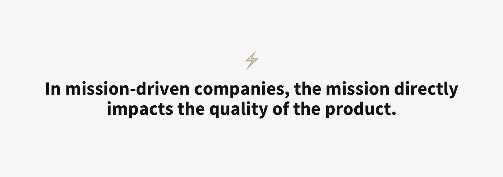
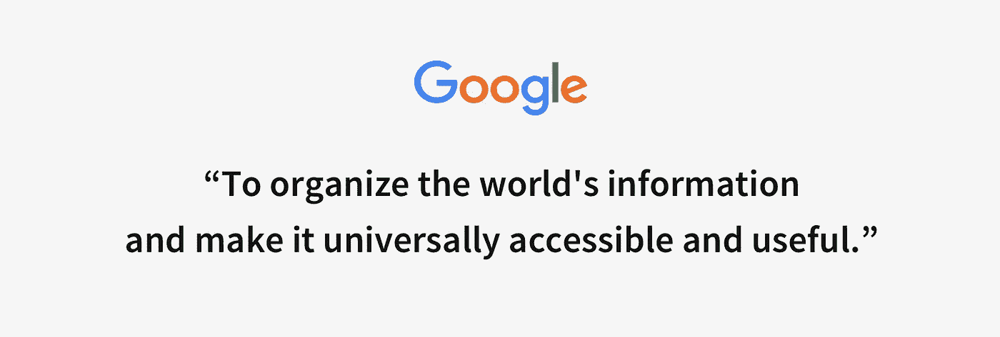
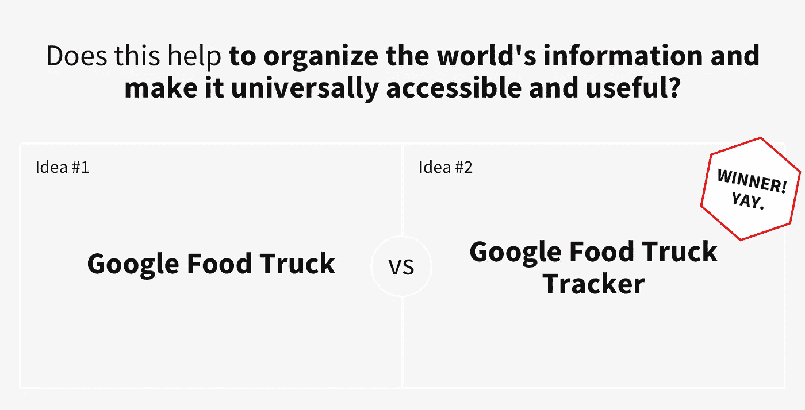

# “使命驱动型”公司的真正含义是什么

> 原文：<https://medium.com/swlh/what-it-really-means-to-be-a-mission-driven-company-549fa98b2fd4>

使命驱动是一个模糊的概念。许多公司声称他们是，很少有人真的相信这是真的，而且对大多数人来说，不清楚这到底意味着什么。

那么“使命驱动”是什么意思呢？仅仅有一个使命宣言并不能成为一个使命驱动的公司。甚至安然公司也有一个使命宣言，但这并不意味着他们是受使命驱动的。

当谈到是什么真正驱动着公司及其决策时，我喜欢将公司分为三类。

## 公司的动力是什么？

1.  **商业机会驱动**
    公司的执行完全是由他们身上的商业机会驱动的。它之所以成立，是因为创始人找到了赚钱的方法，并被赚更多的钱所驱动。当创始人向你介绍他们的公司时，他们会解释一种商业模式。
2.  **由商机驱动，但有额外的使命** 公司的成立是因为创始人找到了赚钱的方法，但增加了相信公司更大目标的理由。由于它是一个附加产品，这通常会成为一些与公司实际生产无关的社会公益。一个很好的例子是汤姆的鞋子，你每买一双，他就把一双送给需要的人。这可能是一件好事，但他们的鞋子并不是更好的鞋子，因为他们赠送了一双。
3.  在使命的驱动下，公司的成立是为了解决以使命为代表的某个问题。创始人被以更大更好的方式解决问题所驱动。使命对公司和产品有直接影响。产品因任务而变得更好**。**

## 被使命驱动不是无聊，而是专注和承诺

理解你的使命有助于你专注地执行，并建立对事业的承诺，而不仅仅是底线。这是整个组织的真实情况，不仅仅是创始人。

## 你的任务帮助你保持正轨

在独立黑客[播客](https://www.indiehackers.com/podcast/064-des-traynor-of-intercom)中，Intercom 的联合创始人 Des Traynor 提到，每当新客户在 Intercom 中看到他们的用户列表时，他们的即时产品反馈是他们希望看到围绕它的一系列分析。然后他争辩说他们还没有建造这个，因为这不是他们计划要做的。

Intercom 的使命是“**让互联网业务个性化**”，这个使命是与你的用户沟通，而不是商业分析。

你的使命不仅能帮助每个人理解公司想做什么，还能帮助每个人理解公司不该做什么。对于以使命为导向的公司来说，能够迅速扼杀创意和机会以保持长期发展是一个巨大的优势。

反过来，如果你没有那颗清晰的北极星来指引你去哪里，你一路上得到的信号将驱动你未来的方向。这就产生了一个巨大的风险，那就是你最终会构建出一个功能弗兰肯斯坦的产品和一个向各个方向前进的团队。

## 剖析一份好的使命陈述

首先:“成为世界第一的 XYZ 软件”不是一个使命，而是一个商业目标。你的使命不是你能达到和完成的，而是驱动你做什么事情的目的。

一个惊人的例子仍然是谷歌的使命宣言:

ahhhh, so good

我相信一份好的使命陈述是可以操作的，你可以**审查反对**的想法。将它作为审查新想法的日常工具，有助于公司通过追求正确的想法持续保持在正确的轨道上。

如果写得准确，你可以简单地把陈述变成一个问题:这有助于*【组织世界信息并使其普遍可用】*？

谷歌会做这两个想法中的哪一个？

## 使命驱动的公司更有弹性

你现在的产品只是对任务的一次执行。你今天建造的可能不是你明天建造的，这完全没关系。产品、技术和行为会改变，但你的使命不会改变。

对于以任务为导向的公司，他们的产品总是会适应变化，因为他们是通过解决问题来驱动的，而不是通过销售产品。产品自然会随着发展而改变，因为他们关注问题。

使命驱动迫使你着眼长远，做出更深思熟虑的决定，而不是简单地抓住下一个好机会。

## 从你的任务开始

斯科特·贝尔斯基在他的(令人惊叹的)书《混乱的中产阶级》中写道:

"*在早期，甚至在产品推出之前开发一个品牌，有助于建立一个强大的价值观驱动的叙事，类似于公司拥有自己的声音。你会发现，当你做出某些影响顾客对你产品体验的决定时，品牌会对你说话。在 Behance 的早期，我们总觉得这个品牌在为我们回答某些问题。*”

在早期进行品牌活动会迫使你问很多问题，否则你可能要到公司生命的后期才能回答这些问题。但是为了找到、提炼和阐明你的使命，这些都是重要的问题。对你来说非常清楚的感觉可能需要一些努力来变得足够精炼，以便对其他人来说清楚。

## 任务就是优势

最终，这个任务不仅仅是无意义的。它是一个工具，可以帮助你打造更好的产品，推动更强大的文化，建立一个有弹性的公司，甚至可能比你活得更久。

玩得开心。

**感谢阅读！**
**在推特上关注我:**[https://twitter.com/leifthunder](https://twitter.com/leifthunder)

如果您有任何问题和建议，请随时联系我们: [leif@tbd.xyz](mailto:leif@tbd.xyz)

你可能也喜欢阅读

*   [信任领导的效率:为什么取消政策是值得的](https://hackernoon.com/the-efficiencies-of-leading-with-trust-1649149ccc83)
*   [反馈漏斗:持续的反馈如何建立更强大的文化](https://hackernoon.com/the-feedback-funnel-how-constant-feedback-builds-a-stronger-culture-a50f2ab1a8fe)
*   [技能云:删除职称](/tbd-xyz/skill-cloud-erasing-the-job-title-40f0f1b5bc4c)
*   [为什么孩子们在高中毕业前应该已经做了 10 份工作](/tbd-xyz/why-kids-should-have-had-10-jobs-before-graduating-high-school-7d361570436b)

呜哇呜。

## 这篇文章发表在 [The Startup](https://medium.com/swlh) 上，这是 Medium 最大的创业刊物，拥有+400，714 名读者。

## 订阅接收[我们的头条新闻在这里](http://growthsupply.com/the-startup-newsletter/)。

