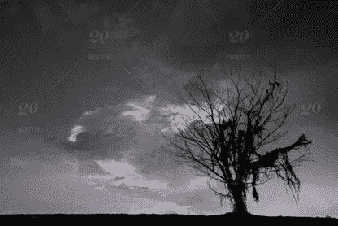

# 成为真正的专家需要什么

> 原文：<https://medium.com/swlh/what-it-takes-to-become-a-true-expert-20d3948b12ad>

请理解掌握任何学科或技能是一个极其漫长和乏味的旅程。成为任何领域的大师都没有捷径可走。如果你在找那个，这不是地方。相反，我将提供一个任何人都能遵循的蓝图，解释如何成为大师。

**人迹罕至的道路。**

*树林里分出两条路，我选择了人迹较少的一条，这让一切都变得不同。*

***——罗伯特·弗罗斯特*** 未走的路

这句话我们以前都听过，其中隐含的主题我们都太熟悉了。明白这条通往精通的道路，真正的精通，往往是孤独的。不一定是这样，但通常是这样。这是因为达到精通所需的坚持和奉献是极其令人厌倦和艰难的。它留给其他东西的空间很小。

在整个旅途中，请记住这一点。

掌握并不是每个人都能做到的。它需要有特殊抱负的特殊个人。这并不是说你不能通过简单的努力而擅长某事，恰恰相反。任何人，通过工作、谨慎和坚持，都可以获得成功。这不是这篇文章的内容。这篇文章与掌握有关。

努力不足以成为大师。坚持不足以成为大师。自律不足以成为大师。天生的聪明不足以成为真正的大师。为了达到精通，一个人需要所有上述特征，以及无数其他特征。此外，你必须愿意为你的愿景牺牲一切。

**掌握基础知识。**

这个简单却必要的掌握要素经常被忽视，这让我感到恶心。我不知道这种疏忽是由完全的无知、冷漠还是其他原因造成的。

俗话说，你必须先学会走，然后才能爬。

虽然微不足道，但前面的引用包含了几乎无与伦比的智慧。要成为任何方面的专家，你必须成为基本面方面的专家。在真正掌握了这些基础知识之后，个人可以开始扩展这个主题或技能。进入更难的材料，同时继续建立在基础知识的基础上。

**对自己的掌握。**

一个人对自己的掌握不会比对自己的掌握更小或更大。

*   ***达芬奇***

列奥纳多·达·芬奇明白成为大师意味着什么。这位意大利文艺复兴时期的人被誉为有史以来最伟大的画家和建筑大师之一。读完这段话，原因就显而易见了。达芬奇明白掌握不仅仅需要天赋，你还必须学会控制自己的情绪和思维方式。

不先掌握自己，期待掌握是没有希望的努力。你必须学会用别人不愿意的方式控制和管理思想。

这并不像看起来那么简单。如果简单一点，我们会有更多的高手。事实是，作为个人和社会，我们经常做一些事后后悔的事情。无论是加班，还是晚餐多吃一块甜点。对思想的掌握让我们摆脱了这些负担。

最后的思考。

这条通往精通的道路漫长而宽广。你必须学会享受旅程。没有对这个过程的欣赏，到达山顶几乎是不可能的。

此外，要明白你会跌倒。这是必然的。重新站起来，继续发展你的技能。每天都要继续进步。

正如伟大的中国哲学家所说。

*只要你不停下来，你走得多慢都没关系。*

***——孔子***

然后，如果该说的都说了，该做的都做了，而你从未到达那座山，那也没关系。你知道你为这个愿景付出了每一盎司的力量和每一根思考的纤维。这是我们都可以自豪和接受的事情。

*如果你喜欢，请留下一个喜欢的掌声！感谢你花时间阅读，我很感激！*

## 这篇文章发表在 [The Startup](https://medium.com/swlh) 上，这是 Medium 最大的创业刊物，有 318，583+人关注。

## 在此订阅接收[我们的头条新闻](http://growthsupply.com/the-startup-newsletter/)。

