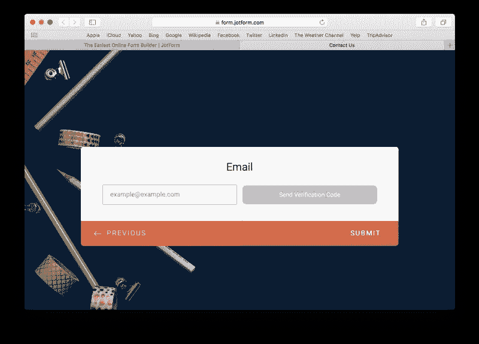

# 花 326 天为 320 万用户发布大型产品是什么感觉

> 原文：<https://medium.com/swlh/what-its-like-to-spend-326-days-on-a-massive-product-release-for-3-2m-users-4df6f9a9bdd7>

Launch day

## 326 天的 JotForm 卡

在 JotForm，我们的用户对我们很重要。很多。

毕竟我们有[320 万其中](https://www.jotform.com/blog/331-How-NOT-following-my-dreams-enabled-me-to-build-a-startup-with-3-2-million-users)。他们每天通过我们创建表格和接收回复。

我们希望让我们的用户体验尽可能轻松愉快。我们如何做到这一点？只要有可能，我们就倾听他们，向他们学习。

这就是为什么我们创建了 [JotForm Cards](https://www.jotform.com/cards/) ，这是我们有史以来最受用户驱动的项目。

当我们制作卡片时，我们的用户指导我们每一步；从研究和设计到开发。

我们的创始人写道[对客户(而不是竞争对手)的关注如何在一年内为我们带来了超过 100 万的新注册用户](https://www.jotform.com/blog/355-How-focusing-on-the-customer-not-the-competition-brought-us-over-1-million-new-signups-in-a-year)。

从概念到发布，这个过程花了我们 326 天完成。

我们是如何着手的？

*事情是这样的…*

# 第一天—想法

在很长一段时间内查看用户反馈或错误报告，我们意识到我们的表单需要更新。

互联网也提醒了我们。

“[听说你的产品丑不容易，](https://www.jotform.com/blog/352-How-to-launch-when-everyone-s-watching)”艾特金写道，

> 当然，互联网上也有一些“仇恨者”和喜欢恶语相向的人，但有时这种负面反馈也有可取之处。
> 
> 2016 年，我知道批评者是对的。JotForm 已经 10 岁了，我们的表格看起来很累。"

我们可以做尽可能多的小调整，但事实是:我们的表单设计和填写表单的体验已经落后于时代了。

我们的表单需要更加美观、用户友好和智能。

因此，我们带着一个目标开始了我们的旅程:**重新发明我们的在线表单**。

Meeting for the 2017 mission

# 第 18 天—黑客周 1:基础知识

JotForm 是这样运作的:每当我们寻找答案、替代方案或突破界限的方法时，我们就会组织一个黑客周。

这要求所有团队放下日常工作，连续五天专注于一项任务。就这样，JotForm 卡片的想法诞生了。

现在我们已经明确了我们的目标——**重塑在线表单**——我们必须问自己:

> "我们究竟怎样才能重塑在线表单？"

这个问题立即引发了其他问题。

> 什么会定义这新一代的形式？我们如何为项目的其余部分打下坚实的基础？

当时，试图找到答案就像盯着一张白纸。我们知道我们努力的方向，但我们不知道如何到达那里。

所以，我们开始分析尽可能多的形式，尽可能多的细节，放大不同的方面，如标签对齐，颜色，动画等等。

我们也开始更深入地分析我们自己的用户表单。为了创造一个产品——不管你在团队中的角色是什么——最常见的策略是进行在线搜索，阅读学术文章，回顾你的竞争对手已经做了什么。

但是，根据我们的经验，这些策略并不总是指向最佳的前进方向。事实上，我们的创始人写道[关注客户(而不是竞争对手)为我们带来了超过 100 万的新注册用户](https://www.jotform.com/blog/355-How-focusing-on-the-customer-not-the-competition-brought-us-over-1-million-new-signups-in-a-year)。

长话短说，我们更愿意把用户的选择作为我们的出发点。

因此，当我们处于转折点时，用户的表单为我们提供了输入和指导。

Example forms from the first hack week

基于我们的分析，我们开始创造原型。在周末，每个团队分享并解释他们的决定，使用他们开发的表单原型陈述他们的想法。

我们看到所有的团队都在为相似的问题而奋斗，并得出相似的评价——但是他们的解决方案通常是不同的。

# 第 39 天——黑客周 2:2027 年的表单会是什么样子？

到第一周结束时，我们已经为这个项目奠定了基础。

现在是时候挑战极限了。黑客周 2 的主题是:

> " 2027 年的形态会是什么样子？"

我们不知道十年后的设计趋势会是什么，也不知道哪些技术会为我们所用。

所以我们让我们的想象力自由驰骋。

> 我们如何推动我们已经拥有的，打破规则，创造一个自由思考的心态？

Example forms from hack week 2

在 hack week 2 期间，我们尝试了画外音、AR 和创造来自太空时代的设计。它是非常有趣的。

# 第 60 天——黑客周 3:给我的表格拉皮条

黑客周 3:是时候尝试完全不同的东西了。每个团队随机选择一个表单，并花一天时间改进其视觉效果和功能，而不是花整整一周的时间来研究一个想法。

我们使用从用户表单中挑选的真实实例。每天结束时，新版本的表单会被发送给最初的所有者以获得反馈。

Before/after versions of a form

只有一天的时间来分析问题和寻找解决方案，我们被迫快速行动。这是一件好事。没有时间纠结于微小的细节或尝试不同的想法。

Before/after versions of a form

这个黑客周帮助我们养成了将大问题分成小块并逐一解决的思维模式。

(ps。我知道我一直在说黑客周。如果你感兴趣，这里有[黑客周如何鼓励创新和创造力](https://www.jotform.com/blog/357-Sprint-without-losing-your-sanity)

# 第 81 天——黑客周 4:发明表单 2.0

在 hack week 4 期间，所有团队尝试了(几乎)所有可能的表单布局。我们需要在我们开发的原型、我们做的分析和我们在过去几周获得的知识的基础上创造出一些令人惊叹的东西。

因此，所有团队都开始创建最终原型，以展示他们认为新一代在线表单应该是什么样子。

Example forms from the hack week 4

是时候开始做出严肃的决定了。所以我们再次征求用户的意见。我们优先考虑用户友好性、趣味性和易用性。

# 第 88 天——第一个原型

在项目的第 88 天， [JotForm Cards](https://www.jotform.com/cards/) 的第一个原型已经准备好行动(此时，它甚至还没有名字)。

Our first prototype

我们的第一个原型已经完成，是时候进入下一个阶段了:开发。

最初，我们试图尽可能独立于 JotForm 的原始基础设施，并专注于创造一些新的东西。但是同样，我们也需要找到一种方法来支持 JotForm 的传统表单布局。

JotForm team at a meeting

我们回顾了我们的遗留代码，看看它是否应该更新或重新用于 JotForm 卡。我们最终决定重用当前的代码库将是一个救命稻草；此外，最好根据我们当前的基础架构设计新的软件架构，而不是更新它。

A member of Untitled Team working hard

现在，是时候做一些繁重的工作，将原型转换成功能完整的产品了。所有的表单域都被重新设计和开发，所有的微动画都被重写，所有我们最初的决定都被重新评估了一遍。

# 第 138 天— A/B 测试开始

经过几个月的努力，我们准备好与世界分享我们的秘密项目。看到用户的反应让我们非常兴奋。

A member of Data Team while working on JotForm Cards stats

我们立即开始密切关注滚滚而来的统计数据。数据团队分析了以下问题的答案:

> 用户喜欢 JotForm 卡吗？他们想切换回经典的表单布局吗？有多少用户在使用 JotForm 卡时保持活跃？添加了多少字段？

# 第 195 天—新用户组

近两个月后，A/B 测试的数字并没有反映出我们的期望:我们需要从头开始。

我们开始集思广益，寻找问题的根源，尝试改变默认颜色，并寻找用户类别和他们喜欢的表单布局之间的相关性。

A brainstorming session

与此同时，我们仍然收到来自真实用户的反馈。因为他们是将要使用产品的人，我们总是优先考虑他们的想法。

他们在说什么？

它大致是这样的:

> 是的，你做了一些新的东西——非常酷——但是仍然需要经典的表单布局。

就这样了！我们的用户再一次为我们指明了方向。

他们很高兴尝试一些新的东西，如 JotForm 卡，但他们也不想失去经典的形式。

*为什么他们不能两者兼得？*

因此，我们开始为一个新的测试小组工作，这个小组可以创建两种类型的表单，并将它们添加到正在进行的 A/B 测试中。

到 A/B 测试更新的时候，JotForm 卡片几乎拥有了我们经典表单的所有主要特征。

更多黑客周的时间到了！

# 第 214 天—黑客周 5:新特性

因此，我们设法让 JotForm 卡达到与经典表单相同的水平，并更新了我们的 A/B 测试。

使用统计数据每天都在增加。是时候让 JotForm 卡更上一层楼了。

在第五个黑客周——也是 [JotForm 历史上的第一次](https://www.jotform.com/)——所有团队在一周内都致力于不同的想法。

我们取得了巨大的进步。

我们的一个产品团队开发了一个“智能嵌入”功能，它可以自动调整 JotForm 卡来模仿它嵌入的页面。

另一个团队开发了“内嵌编辑器”,让用户可以在页面上调整表单的嵌入样式。

Inline Embed Editor

我们还从上到下更新了 JotForm 卡的移动版本，调整了所有布局元素、动画和手势，以在移动设备上提供最佳的用户体验。

JotForm Cards mobile version

# 第 242 天——黑客周 6:场地

在第六个黑客周期间，是时候改进表单域并给它们添加一些很酷的特性了。

所有团队都在不同的表单域上工作，以并行流程的方式制作原型。我们根据字段的使用率和用户反馈来选择目标字段。

一个有问题的字段是输入表。我们通过更新其设计和添加表情滑块等新功能来改善这一领域，从而使最无聊的领域之一变得有趣。

Input Table Emoji Sliders

我们还处理了地址字段，添加了自动完成功能，使其更容易填写。

New address field with the autocomplete feature

我们还开发了多行问题，允许用户在一张卡片上添加多个字段。

Multi-line Question

# 第 262 天——黑客周 7:更多领域

hack week 6 期间的改进对用户反馈产生了很大的影响。因此，我们决定回头来改进最常用的表单字段。

一个团队在支付领域工作，集成了一个购物袋功能，让表单提交者看到他们想购买的产品列表。

New product list and shopping bag

另一个团队对电子邮件字段进行了更新，并添加了验证功能。

Email field with the verification feature

最后，我们更新了长文本输入字段，以添加表情符号、文件或样式。

Long text entry field

# 第 274 天——测试的新组

我们的测试继续进行，当我们分析这些数字时，我们看到第三个测试组取得了巨大的成功。

我们做出了决定:我们的用户应该能够创建两种类型的表单，新的和传统的。

现在，我们想知道，向用户展示这些选项的最佳方式是什么？又是一次 A/B 测试！

我们为每一组准备了三个不同的表格布局选择模型，并用一个控制组对它们进行测试。

A version of the form layout selection modal

# 第 298 天——第 8 周:结束

第 8 周，也是最后一周，是我们对产品进行大胆大改动的最后机会。是时候给出我们从来没有时间去尝试的想法了。

New welcome page

我们在颜色、字体、间距、欢迎页面和所有常规元素上下了功夫。

我们还开发了一个导入工具，改进了嵌入的反馈按钮，并制作了迷你卡片。

# 第 313 天——与世界分享我们的产品

在 10 个月的 8 个星期之后，我们准备好打包 JotForm 卡片并与世界分享。

我们决定给用户两种表单布局选项，并等待测试结果来决定我们使用哪种设计。但是，没有一个测试组能够确定获胜者。

我们再次更新了测试，但这一次，我们所有的新用户都能看到这两个选项。

# 第 327 天–发布！

终于！2 月 6 日，我们宣布 JotForm 卡是我们的最新产品。

326 天来，我们日以继夜地全职工作在这个项目上:钻研大大小小的细节，修复 280 多个 bug，实现 102 个功能请求。唷。

最重要的是，我们成功地制造了一款用户喜爱的产品。

Launch day at Ankara Office

我们希望你和我们一样喜欢 [JotForm 卡](https://www.jotform.com/cards/)，我们迫不及待地想听听你的想法！

【www.jotform.com】最初发表于**。*感谢阅读。*

> *如果你喜欢这篇文章，请随意点击那个按钮👏帮助其他人找到它。*

*.*