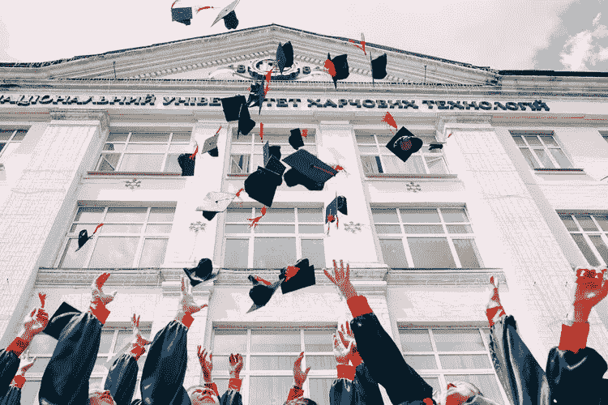

# 在野外一年后我学到了什么

> 原文：<https://medium.com/swlh/what-ive-learned-after-one-year-in-the-wild-1cd9ac5f602e>

Photo by [Vasily Koloda](https://unsplash.com/photos/8CqDvPuo_kI?utm_source=unsplash&utm_medium=referral&utm_content=creditCopyText) on [Unsplash](https://unsplash.com/?utm_source=unsplash&utm_medium=referral&utm_content=creditCopyText)

上周，我沉浸在 2010 年的怀旧情绪中，这真的让我感到，自从我开始职业生涯以来，发生了很多变化。

我于 2017 年毕业于德保罗大学，主修公共关系和广告，辅修传播学。学院为我提供了跨越多种媒介扩展创作世界的途径；在以下环境中调整必要的专业能力…