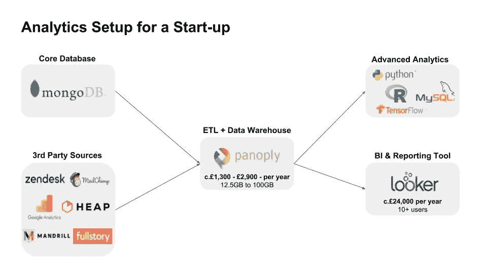

# 我从初创企业的数据分析中学到了什么

> 原文：<https://medium.com/swlh/what-ive-learned-from-setting-up-analytics-at-a-start-up-ee8a55e900b9>

当我最近加入一家初创公司时，我的任务是从头开始建立一个分析功能。随着初创企业的发展，你经常会面临一些你可能没有 100%准备好的任务。虽然我非常喜欢与数据有关的任何东西，但我不是超级技术人员，以前也没有运行过分析功能。以下是我学到的几件事，如果你处在类似的位置，希望对你有用。

**第一步:四处阅读**

有很多建议，有些好，有些不太好。我觉得特别有用的文章是鱼镇分析公司的创始人兼首席执行官[特里斯坦·汉迪](https://medium.com/u/85e0720e39a2?source=post_page-----ee8a55e900b9--------------------------------)写的[创业公司创始人分析指南](https://thinkgrowth.org/the-startup-founders-guide-to-analytics-1d2176f20ac1)。在这篇文章中，Tristan 很好地阐述了在成长的每个阶段你需要做(和不要做)什么。有很多很棒的观点，我已经考虑过了，但我不会在这里重复，所以你可以去看看。

**第二步:理解目标**

随着你理解什么是可能的，什么是合理的，什么是不合理的，目标会不断发展，但是开始形成一个你想要实现的想法是有好处的。

对我来说，关键目标是:

1.  为基本 MI 创建自动化报告(例如，用户、转换、收入)
2.  使业务用户能够回答他们自己的数据问题
3.  为所有数据创建单一来源，实现客户的单一视图
4.  想办法让未来加入该团队的数据科学家的生活变得更轻松
5.  最大限度地缩短技术开发时间&对于一家初创企业来说，以合理的成本实现这一切

我会说，数字 3 和 4 是我最想不到的，因为我见过许多公司无法获得基本的洞察力，因为数据不在那里或没有准备好被使用。或者他们最终浪费了他们的数据科学才能，因为这些高技能的个人正在花费时间清理和汇编数据。

**第三步:研究工具**

花点时间额外研究一下有哪些工具是值得的。你会发现这个领域发生了很大的变化，即使是经验丰富的人也会对新出现的工具感到惊讶。这方面的一个例子是 [Panoply.io](https://panoply.io/) ，这是一个漂亮的工具，可以帮助您从各种来源获取数据(ETL)，并且具有智能数据仓库功能(它是基于 Amazon Redshift 构建的)，可以将您的数据管理时间减少到几乎为零。

**你可以看到我们在下面看到的设置。**我心目中的主要目标是在一个地方整理所有数据( [Panoply.io](https://panoply.io/) )，即使你不想做很多花哨的东西，它也只需每月 150 美元——与它能为你做的相比，这是微不足道的。

如果你不想花很多钱，你可以使用更便宜的工具(例如 Tableau)，开源 BI 工具(例如 [Redash](https://redash.io/) )或者只是使用 SQL/Python 将数据导出到 Google Sheets / Excel，并从那里创建快速报告，让你的数据科学家用 Python 做更高级的事情，因为他们可能已经习惯了。

**第四步:参与业务**

希望这是一个显而易见的观点，但是收集好的业务需求，区分它们的优先级并跟踪它们的交付应该是一个关键的持续过程，以确保你正在做的事情将尽早为业务交付真正的价值。

我们已经整理了 200 多个需求，你可能也会这样做，我的建议是将分析视为任何其他产品开发:编写“用户故事”，区分它们的优先级，估计难度，并以结构化的方式处理积压的工作，在此过程中测试和改进输出。这样每个人都知道正在做什么，你也不会被大量的请求淹没。

**第五步:学习 SQL & Python**

最终，如果不了解 SQL(用于基本的数据操作)和 Python(用于更高级的分析)，运行分析功能将会非常困难。那里有很多课程，edX 和 Coursera 可能是很好的起点。

希望你已经发现这是有用的，我相信随着我们在旅程中的进展，我会学到更多。

## 这篇文章发表在 [The Startup](https://medium.com/swlh) 上，这是 Medium 最大的创业刊物，拥有 309，732+读者。

## 在这里订阅接收[我们的头条新闻](http://growthsupply.com/the-startup-newsletter/)。

