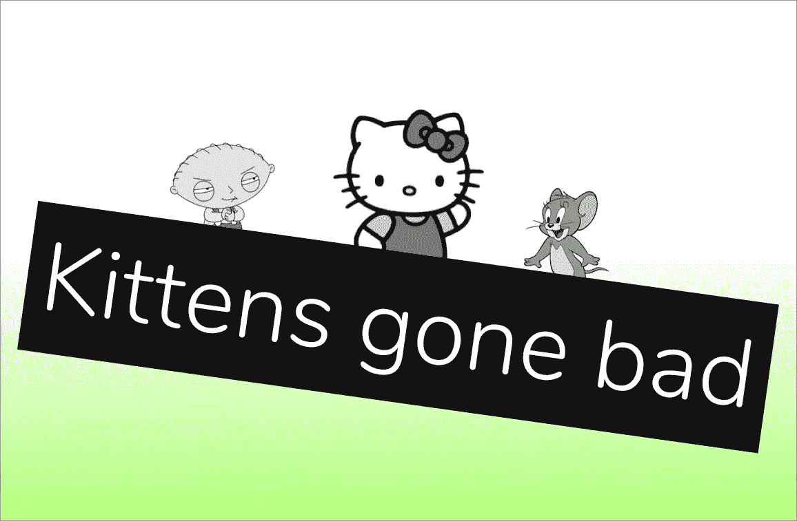
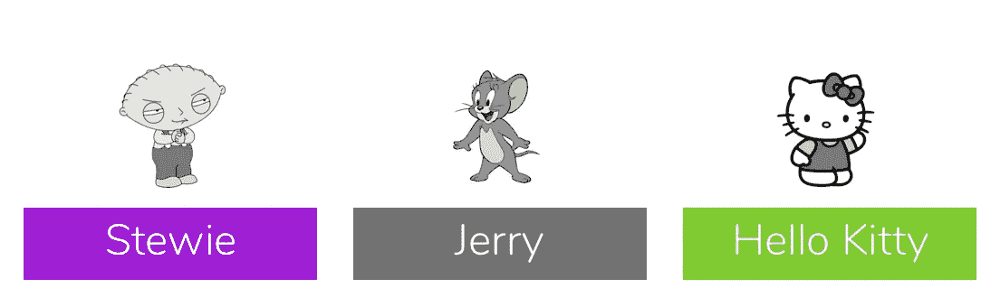
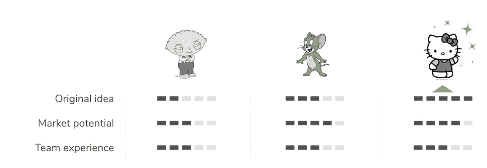
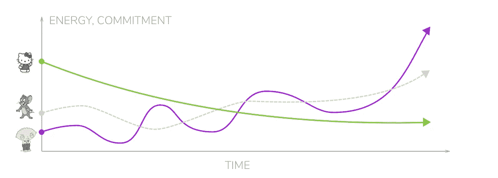
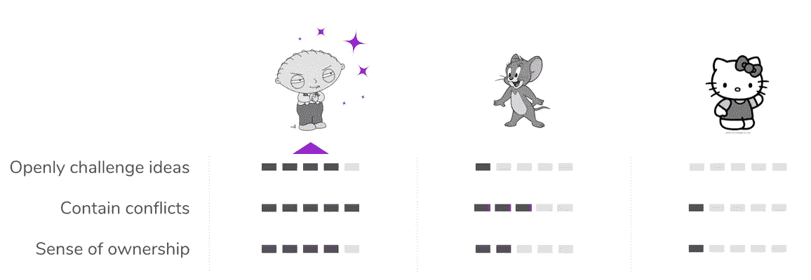
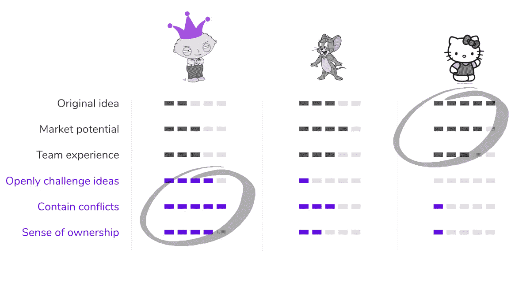

# 是什么扼杀了 Hello Kitty(以及其他绝妙的想法)？

> 原文：<https://medium.com/swlh/what-killed-hello-kitty-and-other-brilliant-ideas-199d4df31add>

我弄错了。很长时间了。

当你最终想出一个解决难题的绝妙办法时，你会有一种多巴胺激增的感觉，我喜欢这种感觉。当你喊“当然！”在一个空房间里。“我们怎么没早点想到这个？”。

我一直在寻找正确的*公式*，最好的*研讨会练习*，以及能够激发最佳想法的*终极白板绝地技巧*。

> **“没有什么比时机成熟的想法更有力量”** *—维克多·雨果*

显然维克多·雨果也弄错了。和一个好公司在一起至少是一种安慰。

思想是神奇的，这也让它变得虚幻而脆弱。

想法越有趣，它产生的期望就越大，失败的感觉就越痛苦。

几年前，我为一家财富 500 强公司从事数字化转型项目。我们的任务是建立一个新的可能产品的管道:识别机会，评估潜力，验证需求，并建立解决方案的原型。

这不仅仅是构思:然后我们挽起袖子，挑选出最有希望的 3 个想法，并着手从每个想法中创建一个 MVP。

将这些小创意从摇篮中拿出来，让它们站起来，制作原型，测试，迭代，最后发布给试点客户。

赌注很高，期望很高，在几个有趣又累人的星期后，我们认为他们的时代已经到来，所以现在没有什么能阻止我们(对吗 Hugo？)

**错了。**

正如你将在下面看到的，事情并没有完全按照我们的预期发展。

但它给我上了重要的一课，让我明白了想法的价值，以及实现想法需要付出的代价，是的，还有一些关于小猫的事情🙀

# **首先，见见参赛队伍:**

为了保护无辜者(也为了更容易分享这个故事)，让我们为我们合作的三个团队使用一些艺名:

进入 **Stewie** (左) **Jerry** (中) **Hello Kitty** (右)。请注意，实际的团队和业务问题非常严重。
十亿美元产业严重。

# 第一幕:找到正确的想法

我们与集结的团队一起努力工作，为他们的行业寻找有前途的游戏规则改变者。

这往往是最令人兴奋的部分，大多数公司、顾问和任何面临巨大挑战的人都要花费大量的时间和精力。

经过几个星期的探索和构思，我们终于找到了它。

然而，并不是所有的想法都是平等的，我这里是他们在这个阶段是如何公平的:

对于我们亲爱的 Kitty 团队来说，事情看起来很有希望，我们都忍不住猜测这将是这里最大的赢家。毕竟，有一个出色的想法，由经过验证的市场潜力和客户的初步反馈支持！

# 第二幕:小猫倒霉的日子

随着项目的进展，我们的小猫实验室的发展状况出现了缓慢但稳定的下降。这种方法似乎没什么问题，市场没变，但有些东西不对劲。没有新的见解出现，没有过程修正，能量水平只是没有满足你对这样一个最初的大承诺的期望:

正如你从上面的*极其科学的图表*中看到的，小猫的情况变得更糟，杰里做得更好，Stewie 完全出乎所有人的意料，经历了艰难的开始和过山车之旅。

事实上，Stewie 团队推出了一款非常棒的产品。大时代。

**刚刚发生了什么？**

当你在短跑和灭火时，很难停下来思考。后来，我们进行了更深入的思考，才聚焦于事后看来导致我们所看到的惊人结果的条件和属性。

# 第三幕:细节决定成败

> “你不能高估几乎所有事情的重要性”
> —约翰·麦克斯韦

世界上最好的条件:一个惊人的想法，获得资源，人才和时间——都无法弥补有问题的心态和文化。

更具体地说，以下是让团队与众不同的真正突出之处:

你可以清楚地看到 Stewie 的闪光点，尤其是与其他两个相比:

*   摆在桌面上的每一个方法和想法都受到了挑战，团队成员表达了他们的担忧，并确保他们被听到。
*   讨论是充满激情的辩论，带着寻找产品最佳解决方案的真诚愿望，很少涉及个人利益。
*   几乎不需要分配工作，因为人们都渴望承担他们认为可以解决的任务。

所有这些在小猫团队中都痛苦地缺失了:集体思考，而不是质疑决策，大多数分歧发生在背后，在团队房间之外，我们基本上不得不乞求人们承担任务。

**这是一个关于文化如何把思想当早餐的宏伟(也是痛苦的)演示:**

# 第四幕:最后的想法

我对此反思得越多，它就越能解释其他公司的其他项目，无论是大公司还是小公司。

> 你不能把伟大的、令人兴奋的想法扔给那些没有机会建立正确的**文化**和正确的**心态**的团队，无论这些想法多么创新、有效、时机多么完美。

它要求我们面对现实，承认:

*   创新不仅仅是由想法推动的，而是由滋养和支持创新的肥沃文化土壤推动的。
*   谈到文化，没有捷径或旁路。
*   文化发展不是短跑，而是马拉松。它也永远不会“完成”，而且还在不断发展。

**令人欣慰的是，至少我们知道是什么驱动着正确的文化:**

*   雇佣能够 ***挑战现状的人***
*   创造 ***一个安全的环境*** 让人们做自己，畅所欲言
*   养成一种" ***不同意&认可*** "的心态
*   提供团队 ***自治*** 和空间 ***尝试*** 和学习
*   ***真正关心团队成员的***&建立他们的*成长道路*
*   ***承认*** 的贡献、努力和成就
*   永不停止 ***聆听***

经过大量艰苦工作后，当这些条件成熟时，奇妙的事情发生了:

> 你开始看到日常的“普通”想法是如何被推进、创造性地发展、集体拥有并优雅地执行的。

这将花费你的时间和精力。
这不会是一帆风顺的，当然也不适合今天在你公司工作的每个人。

但如果你只看未来一两个季度的表现，
如果你真的想建立一家能够创新、适应并保持相关性的公司——***你不能不走这条路。***

我错了，雨果也错了，这差点害死了小猫。

不要让这种事发生在你身上。

在 [isMASSIVE](http://ismassive.com) ，我们正在帮助雄心勃勃的公司朝着这种根本性的文化变革迈出第一步，让他们走上可持续创新的道路，并降低员工参与率。

[访问我们](http://ismassive.com)了解如何从今天开始，请鼓掌，分享，并传播这个词，这样会有更少的小猫死去，更多的 Stewies 得到他们需要的支持💪

## 这个故事发表在 [The Startup](https://medium.com/swlh) 上，这是 Medium 最大的创业刊物，有 339，876+人关注。

## 在这里订阅接收[我们的头条新闻](http://growthsupply.com/the-startup-newsletter/)。

[是什么杀死了 Hello Kitty(和其他绝妙的想法)](https://yanayz.com/blog/what-killed-hello-kitty-and-other-brilliant-ideas/)第一次出现在 [Yanay Zohar 的网站上。](http://yanayz.com)访问了解更多信息。