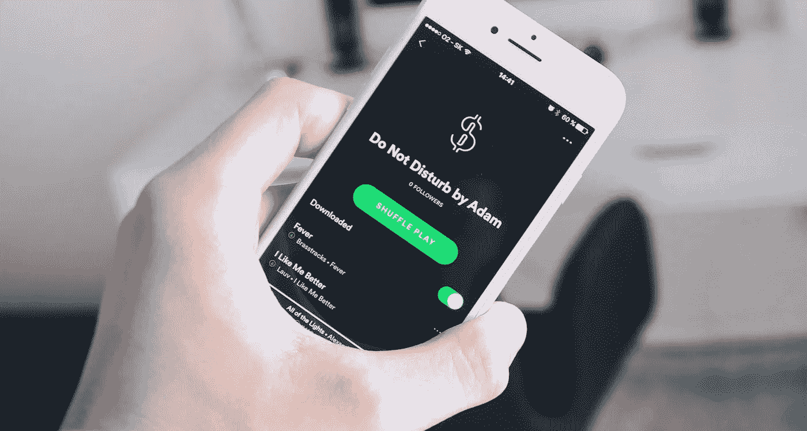

# 是什么造就了一个伟大的应用？

> 原文：<https://medium.com/swlh/what-makes-a-great-app-fbb5319685db>

## 要知道的 10 件事

> “什么是伟大的应用程序？”

这是我在与初创公司和企业家合作时经常被问到的问题。

虽然定义一款优秀应用的因素有很多，从 UX 和用户界面设计，到它的上瘾程度或用户友好程度，但我们从移动专家那里收集了一些见解，并将其提炼为以下几个因素:

# 1.提供用户友好的体验

移动应用前景是一个快速变化的空间——每天都有新的应用推出，新技术正在彻底改变消费者体验。

为了脱颖而出并提高客户忠诚度，应用程序制造商需要专注于做好基础工作。

应用市场和数据洞察公司 App Annie 的一项 [调查](https://www.appannie.com/en/insights/mobile-strategy/app-marketers-developers-survey/)表明，用户友好的体验被评为推动用户留存的首要因素(59%)，高于增值功能(35%)或有针对性的相关内容(29%)。

下面，我将分享一些创建用户友好体验的技巧:

## 尽早快速传达价值主张

App Store 和 Google Play 上有数不清的应用程序，让用户从一开始就明白使用你的移动应用程序的价值至关重要——而且要在很短的时间内。

根据研究公司 Clutch 的[调查](https://clutch.co/app-developers/resources/mobile-app-onboarding-survey-2017)，72%的受访者表示，完成所有入职流程不到一分钟是他们决定继续使用该应用的关键因素。

## 保持入职过程简短而愉快

一项调查显示，用户提供信息的时间越长，他们就越沮丧。

28 百分之三十的受访者对一到两分钟的入职流程感到沮丧，但是当入职时间超过两分钟时，这一数字上升到百分之三十三。

虽然这些时间框架可以作为一个指导方针，但请记住，规范也有例外。

例如，与笔记或健身跟踪应用程序相比，银行应用程序需要更多的个人信息和更长的时间来加载用户。

无论建议的时间框架如何(不到一分钟)，主要目标是使您的入职流程符合您的用户的目的，以及您的移动应用程序的功能和需求。

## 不要强迫一个应用服务于多个目标

给你的应用程序添加太多的功能，它就有成为瑞士军刀的风险——一个执行无数功能的工具，但不可避免地会让用户感到困惑。

Y Media Labs 前市场总监 Robbie Abed 建议:

> *“应用不是网站，需要激光聚焦才能成功。”*

他分享说，在 Y Media Labs，设计、开发和战略团队通过定义两个构建移动应用的核心用例来启动项目。

## 去掉杂乱的东西

三次点击规则可能已经被[作为一个 UX 设计神话](http://uxmyths.com/post/654026581/myth-all-pages-should-be-accessible-in-3-clicks)终结了，但是在设计你的移动应用程序时，这仍然是一个值得考虑的规则，因为它让你重新思考你所包含的所有屏幕和步骤的必要性。

我在下面提供了几个小技巧来指导你创建一个简单、易于导航的设计:

*   测试:在设计的早期阶段，与朋友和家人一起测试你的产品。注意他们在使用你的 app 时卡死的地方，针对这些点进行修正补救。
*   **两次点击法则:**在《快速公司》的一篇文章中，前雅虎 CEO 玛丽莎·梅耶尔阐述了她在应用程序设计中的两次点击法则。迈尔说:“一旦你进入应用程序，是不是只要轻点两下就可以做任何你想做的事情？”如果没有，是时候重新设计应用程序了。“雅虎 Flickr 应用程序说明了这一规则——在主屏幕上，用户只需轻点两下，就可以轻松浏览群组、设置提醒、拍照以及执行其他功能。

# 2.适应竞争环境

随着时间的推移，持续实现用户增长和收入的应用程序能够适应高度竞争环境的变化。您可以采取以下步骤，让您的产品取得长期成功:

## 快速转向以迎合用户需求

“保持灵活性”——这是 Appreneurship Academy 的创始人 Rahul Varshneya 从与不同行业的企业合作中学到的一个重要经验，Appreneurship Academy 是一个为有抱负的应用程序企业家提供的在线研讨会。

何[在一篇有影响的文章中阐述了](https://www.influencive.com/no-bad-idea-just-bad-entrepreneurs):

> *“没有坏的* [*想法*](https://www.appsterhq.com/blog/best-million-dollar-app-ideas/) *，只有坏的企业家——那些不能从自己的错误中吸取教训和支点的人。你总是可以从一个不起作用的产品开始，但你总是可以扭转它。”*

以 Instagram 为例。最初是作为一款名为 Burbn 的签到应用程序创建的，创始人凯文·斯特罗姆和迈克·克里格发现这款应用程序并没有获得太多的关注，大多数用户都在使用这款应用程序拍照。

注意到用户行为，Krieger 和 Systrom 决定专注于一个方面——手机照片——并努力将 Burbn 削减到几个核心功能，如拍照、点赞和评论。

快速旋转是 Instagram 的一个成功之举——在推出当天，该应用就获得了 2.5 万名用户，并迅速成为顶级免费照片分享应用。

## 关注你所在行业的新发展

应用程序制造商需要密切关注行业内发生的变化，否则随着新趋势和竞争对手的出现，他们将面临被淘汰的风险。

andora 就是一个很好的例子:虽然它曾经是互联网广播领域的先驱，但现在它在很多方面都落后于 Spotify 和 Apple Music 等竞争对手。

例如，其基于订阅的付费服务，允许点播音乐流媒体，仅在今年 3 月推出——远远落后于其他提供商，如 Google Play 和亚马逊 Prime Music。

# 3.提供一流的客户支持

一个优秀的应用程序不会仅仅停留在提供用户友好和吸引人的体验上；它还需要提供一流的客户支持，并在应用程序开发完成后继续提供支持。

不幸的是，这是移动应用最容易被忽视的方面之一。

Gartner 的一份关于移动客户服务的报告指出:

> *“移动应用与移动设备上成功的客户服务和支持之间存在巨大差距，这削弱了企业的移动战略……到 2017 年，由于糟糕的客户服务，80%的企业将无法通过其移动战略获得竞争优势。”*

移动应用程序制造商正在忘记，当谈到客户忠诚度时，它是关于获得基本原则的——比如善待你的客户——对吧。

以下是一些有助于改善你的应用的客户支持体验的提示:

## 与您的用户同在

通过实施应用内通信解决方案，例如点击呼叫按钮或实时聊天功能，让您的用户轻松与您联系。

## 让它私人化

与用户进行个性化交流有助于提高参与度，让他们感受到自己的价值，并培养一种联系感。

虽然像 Zappos 这样的品牌甚至会在特殊场合推出自制的卡片或礼物，或者提供个性化的移动购物体验，但简单的步骤——比如用个人姓名而不是“无回复”地址或公司名称来结束回复——同样可以有效地传达这样的信息:你的应用是一个参与真实对话的人类品牌，并在需要时提供可靠的支持。

## 积极寻求并回应客户反馈

由移动客户参与软件 Apptentive 和 Survey Monkey 进行的一项[研究](https://go.apptentive.com/Feedback-Loyalty-On-Mobile-Frontier.html)显示，客户希望公司在移动平台上比在其他渠道上更具沟通性，并要求用户提供反馈。

在喜欢通过应用内渠道留下反馈的客户中，64%的人希望公司直接寻求他们的反馈。

Y et，要求反馈只是等式的一部分。55%通过应用内渠道留下反馈的受访者表示，如果他们的反馈似乎被忽视，他们不太可能继续成为客户。

这表明，对于应用程序开发者来说，承认并及时回应用户的反馈同样重要。

# 4.领先于上升趋势

成功的应用程序能够适应用户需求的变化和不断变化的移动环境。应用程序开发者需要了解新兴趋势，并了解这些趋势如何改变个人在概念化其应用程序时使用移动应用程序的方式。

这里有两个你需要知道的关键趋势:

## 增强现实应用将会改变移动领域的游戏规则

在美国消费者新闻与商业频道的一次采访中，App Annie 的首席执行官 Bertrand Schmitt 分享了 AR 看起来将在行业中创造一个相对巨大的转变。

随着苹果 ARKit 和谷歌 ARCore 的推出，用户可以期待“更好、更高质量的体验，以及更多利用 AR 的应用”。施密特进一步阐述了 AR 的广泛影响，这将跨越“游戏到非游戏…社交，甚至一些实用应用”。

## 机器人是新的应用

在《福布斯》的一篇文章中，撰稿人 Elad Natansan 解释了机器人在未来移动领域日益增长的重要性。

好处是显而易见的:在消息平台的环境中，机器人允许:

*   轻松参与(用户无需离开聊天应用)，
*   轻松安装(无需下载应用程序或注册帐户)，
*   并且永远不会“关闭”(由于机器人继续在后台运行，并且能够识别关键字，因此它们能够响应用户的意图)。

虽然搜索需要用户的意图，但机器人能够推送我们需要的内容。

随着时间的推移，他们可以了解我们寻求和参与的内容类型，并提供越来越符合我们需求的内容。

例如，你可能正在一个聊天群中谈论你的旅行路线。机器人可以识别你对话中与旅行相关的关键词，并据此推荐旅游和活动。

这创造了一种新的动态，并彻底改变了我们浏览和与应用程序交互的方式。

随着我们越来越能够在不离开消息平台的情况下完成这些操作，用户最终将不再需要单独的原生移动应用程序或在浏览器中进行手动搜索。

【www.appsterhq.com】最初发表于**。**

*//*

## *感谢阅读！*

# *如果你喜欢这篇文章，请随意点击下面的按钮👏去帮助别人找到它！*

****

# *对应用程序有想法吗？[我们来聊聊](http://www.appsterhq.com/?utm_source=CP&utm_medium=Medium)。*

*在过去的几年里，我们已经帮助建立了超过 12 个数百万美元的创业公司。[查看我们如何帮助您](http://www.appsterhq.com/?utm_source=CP&utm_medium=Medium)。*

****

## *这个故事发表在 [The Startup](https://medium.com/swlh) 上，这是 Medium 最大的企业家出版物，拥有 277，994+人。*

## *在这里订阅接收[我们的头条新闻](http://growthsupply.com/the-startup-newsletter/)。*

**