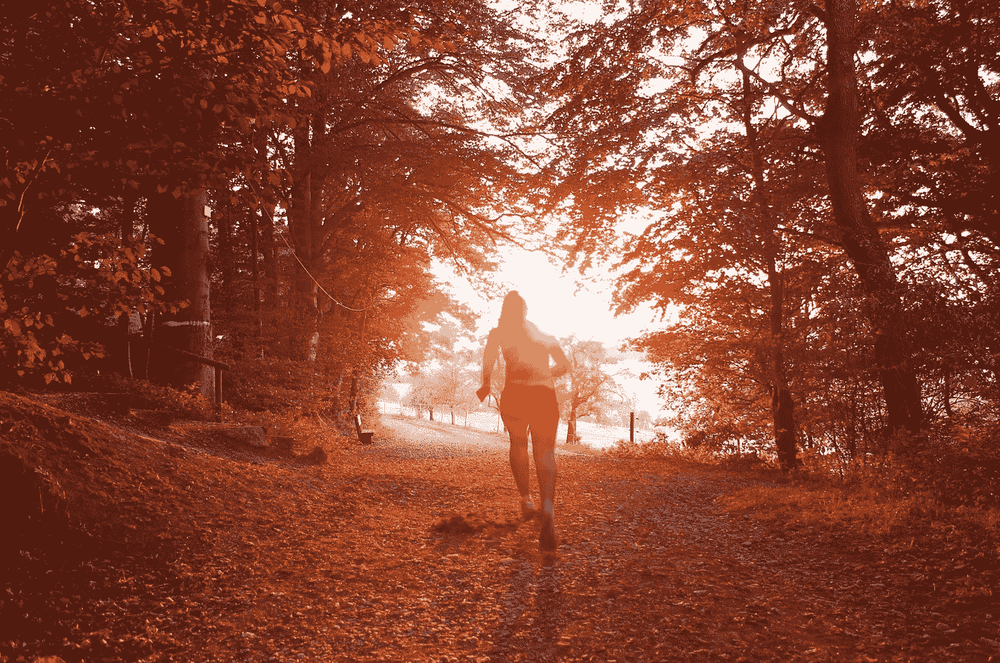

# 我的第一个 5000 米教会了我什么是生活

> 原文：<https://medium.com/swlh/what-my-first-5k-taught-me-about-life-21a62579cd87>

Photo by [Nathalie Désirée Mottet](https://unsplash.com/photos/lRKM2STBj14?utm_source=unsplash&utm_medium=referral&utm_content=creditCopyText) on [Unsplash](https://unsplash.com/search/photos/running?utm_source=unsplash&utm_medium=referral&utm_content=creditCopyText)

我终于做到了！

我今天跑了我的第一个 5 公里。

这不是为了慈善，筹款，或引起人们对某项事业的关注。

我为自己经营的。

我成功了。

谢谢你，[杰夫·巴顿](/search?q=jeff%20barton)激励我并推荐 C25K 帮我训练。开始七个星期后，我获得了一等奖。诚然…