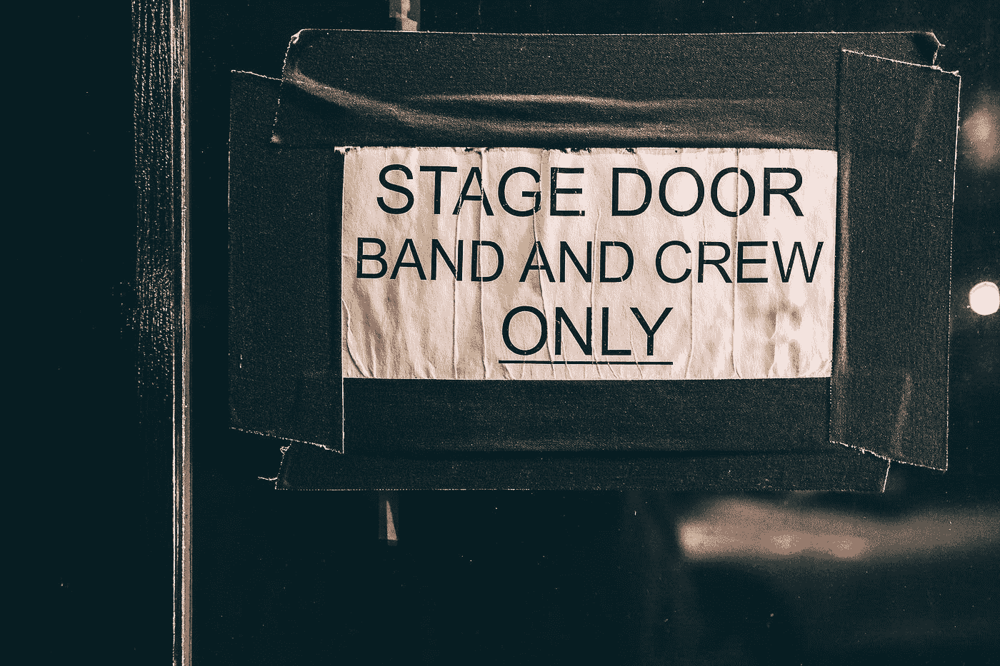
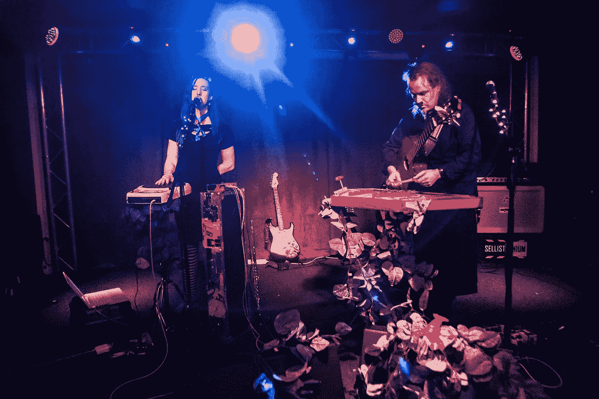

# 组织音乐会教会了我如何经营一家创业公司

> 原文：<https://medium.com/swlh/what-organizing-concerts-taught-me-about-running-a-startup-2962c7fe671b>

Photo by [seabass creatives](https://unsplash.com/@sebbb?utm_source=medium&utm_medium=referral) on [Unsplash](https://unsplash.com?utm_source=medium&utm_medium=referral)

11 月的一个晚上，我注意到我刚好带了 12 个人去听音乐会。没什么奇怪的，但是音乐会在半个国家之外的一个城市举行，除了我没有人听说过这个乐队的名字，更不用说他们的音乐了。在这一点上，我意识到我也可以尝试在我的城市组织一场类似的音乐会。如果我能让 12 个人跟着我去未知的地方(音乐会在łódź举行)，我应该能在当地聚集更多的观众。

这就是 Kompresor 如何诞生的故事。起初，这只是我的想法。然后，它变成了志同道合者的合作，进而成为一个基础。从那以后它就解散了，但是整个冒险教会了我很多关于领导、管理和企业的知识。并不是我学到的所有东西都能立即看得见。当我从一个不同的角度回顾这些事件时，一些智慧在很久以后才出现。这就是为什么这里的一些课程有一个独特的背景故事，而其他的则有点模糊。

注意:我绝不是专家。我只是一个尝试了一些事情并观察了结果的人。但是我经常观察它们，并在它们周围形成一些信念。

# 分享你的想法

我们生活在一个思想经济时代。有些人认为这意味着我们应该保护自己的想法，这样别人就不会从我们这里“偷走”它们。但是你不能偷一个想法。你肯定不能偷走这个想法背后的激情。这种激情是驱使你去执行的动力。当你放下戒备，与周围的人分享你的想法时，你可以观察到迷人的效果。你的想法开始和其他人的想法交叉融合。它们可以长得超乎你的想象。

早些时候，我想出了我想邀请两个乐队，在他们的利基相当有名。我们在谈论另类音乐，当我说另类时，我是认真的。请查看[我们的音云简介](https://soundcloud.com/kompresor)。但是回到叙述！当我意识到我要组织一场音乐会时，我并没有隐瞒。我和我周围的一些人分享了这个概念，尤其是那些在那个决定命运的夜晚和我一起去łódź.的人一天晚上吃饭时，我提到了这场演出的计划，我的一个朋友欣然点头:“是的，**我们将在春天举办这场演出。”等一下！我们突然在一起了吗？**

我不记得具体是怎么发生的，但突然间我不再是一个人在努力了。我们四个人:[埃米莉亚·米库尔斯卡](https://medium.com/u/2e830eb93017?source=post_page-----2962c7fe671b--------------------------------)、[阿德里安·奥斯特罗夫斯基](https://medium.com/u/6d95fcb50d2e?source=post_page-----2962c7fe671b--------------------------------)、[普热米斯拉夫·马耶夫斯基](https://medium.com/u/515da6b4aab9?source=post_page-----2962c7fe671b--------------------------------)和我自己组成了 Kompresor，我们每个人都确保尽自己最大的努力履行自己的职责。

[Controlled Collapse](https://controlled-collapse.bandcamp.com/) by Lucyna Chylińska

# 找到你的导师

找到你的导师，或者更准确地说，找到一个可以握住你的手，分享你的一些经验的人。你可能对经营企业一无所知。这很好，因为你可能会在工作中学习。但是为了减少你需要学习的东西的数量，有人可以指导你是很好的。

我们很高兴在 Kompresor 的日子里有三位导师。第一个是 kr-lik ，我们第一次邀请的两个乐队的音乐家，也是音乐会的组织者。是他在łódź举办了那场导致我们“合并”的音乐会第二个人是 Piotr orowski，我们为那场演出选择的场地的所有者。这个地方和工作人员都很棒，所以我们决定在那里举办我们未来的活动。第三个人是 DJ h_12，我们邀请他在 afterparty 上演奏。这些人中的每一个人都非常了解我们试图进入的行业，他们为我们提供了宝贵的信息。

当然，即使找到了导师，也需要积极主动。不要指望有人会在你没有问的情况下回答你所有的问题。你要知道自己需要什么，要问怎么得到。你需要提前准备好你的困境和问题。只要你能够恰当地与他们交流，导师就会帮助你解决困难。

最后一件事。一个导师并不是一个知道世界上所有问题的最佳解决方案的又老又聪明的人。只是一个你可以向他学习的人。即使是你雇佣的实习生也可以成为你的导师；毕竟，领导别人往往比其他任何事情都更能教会你领导力。

# 网络是关键

和比你更聪明、更有经验的人在一起。你的导师可以是这样的人。但是你也需要有人每天一起工作，如果团队中的每个人都知道该做什么会好得多。理想情况下，他们比你更清楚需要做什么。这样，每个人都可以专注于一个专业领域。

在康普生，我们每个人都有自己的责任，我们几乎不需要就这些进行交流。我们必须定期交换的只是高层次的目标。没有微观管理，我们有足够的动力做到最好。我们仍然举行会议来协调我们的工作，但这些会议有两个基本目的:协调和相互激励。
。
但是人脉不仅仅涉及你自己的公司。要想在任何市场蓬勃发展，你需要与其他各方建立联系。对我们来说，是我们想要邀请的乐队(包括他们的管理层)和我们想要为之演出的观众。因此，当我们试图在另一个城市，比如华沙，举办一场音乐会时，我们需要做的就是询问每一位在华沙演出过的知名艺术家推荐的场地。这样，我们就不需要冷淡地接近主人；我们只是通过一个共同的熟人介绍认识的，他大部分时间都是直接带我们进入正题。在更正式的环境中，这仍然需要一些热身。但在艺术界，大多数时候每个人都很友好——艺术家和所有者都一样。

如果你想了解更多，可以看看[洛伊克·勒梅尔](https://medium.com/u/35bab7b76160?source=post_page-----2962c7fe671b--------------------------------)的《[网络艺术](/@loic/the-art-of-networking-3f73f32b44af)或[凡妮莎·范·爱德华兹](https://medium.com/u/2174516e5915?source=post_page-----2962c7fe671b--------------------------------)》[如何成为网络高手](/@vvanedwards/how-to-become-a-master-at-networking-96f646a4f56b)。

Afterparty by Andrzej Ciarkowski

# 在工作中学习

你知道我们刚开始组织音乐会时知道些什么吗？完全没有。这同样适用于与场地的关系、与乐队的书面协议、技术问题、谈判住宿等等。它阻止我们做我们想做的事了吗？没门儿！

起初，我们咨询了一位经验丰富的活动组织者(也是我们邀请的艺术家之一)如何协调一切。但后来我们只是即兴创作。我们经历了一连串的损失，但这对我们来说也不是什么大事。我们继续前进，确保从每一个失误中尽可能多地吸取教训。最终，我们成功推广了巡回演唱会的一站。我们大部分都是远程完成的。巡演的收益弥补了我们之前的损失。无论如何，我相信 Machinae Supremacy tour 是 Kompresor 最好的一次，因为我们应用了所有我们收集到的知识。

组织演唱会是别人以前做过的事，照本宣科是有可能的。但是如果你正在做一件创新的事情，一件以前没有做过的事情(或者曾经做过，但是你想用不同的方式去做)，就没有办法提前准备或者熟读它。你所拥有的只是你的敏捷和观察力。重要的是你有多适应，而不是你准备了多久。

# 出发前你必须集合你的队伍

你大概可以自己做所有的事情。嗯，不是字面上的**做**每件事，但至少管理和外包所有的事情。这就是[蒂姆·费里斯](https://medium.com/u/56d3bc91794f?source=post_page-----2962c7fe671b--------------------------------)所提倡的，也是一种完全有效的方式。但是，当你召集一群冒险家，每个人都有自己独特的技能时，你会对创业的潜在危险有更好的准备。我们四个人就是这样一个团队，每个人都有自己的工作重点。

除了涵盖多种技能之外，拥有一个团队对激励也很重要。有时事情变得有点艰难，你可能会怀疑这一切是否值得。除非事情看起来客观上是错误的(就像你刚刚达到了你的退出标准，见下文)，否则你不应该放弃。这就是为什么你需要你的团队。志同道合但不同的一群人的其他好处包括头脑风暴(我们接下来应该做什么项目？如何营销？与谁合作？)、共同的主动性和责任(你不能外包)以及庆祝成功的能力。一开始没有胜利也没关系。重要的是你要有目标。

[Dandelion Wine](http://www.dandelionwine.band/) by Andrzej Ciarkowski

# 知道什么时候退出

尽管无论发生什么事情，你都有可能继续创业，但提前建立一些退出标准是个不错的主意。退出标准有几个好处。一是你可以防范沉没成本偏见。当你的期望值太高或太低时，很难做出决定。把线摆正(“一旦我损失了 X 美元，我就结束这一切”)可以防止你以后编造借口。

另一个好处是，当你知道自己对底线的定义时，你会尽一切努力远离它。当面对可能被认为是失败的事情时(虽然不是，看下一部分)，我们的大脑开始寻找避免它的方法。

# 关闭、出售或暂停并不是失败

大多数人在创业时都有一种害怕被评判的心理。通常的想法是这样的:“但如果我辞职、出售或暂停业务，他们会认为我是个失败者。”这个说法的问题是“他们”指的是那些在他们自己的生活中从未尝试过的人。作为一名观众坐在竞技场里，评判下面角斗士的战斗是很容易的。但是旁观者不是角斗士。双方之间没有共识。旁观者可能有广博的理论知识，但如果不把自己置于危险之中，这些知识是没有价值的。

有了自己的事业，人们会根据我们是否让它成长来评判我们。但是，定期领取公司薪水的人也会参与各种项目，这些项目有时会失去吸引力。有趣的是，人们从来不会根据他们的工作表现来评判他们。只有企业家容易受到各种言论的影响，比如“这么说，你放弃了整个生意？”万一我自己的话不足以说服你们，让我引用西奥多·罗斯福的话来结束我的发言:

> 重要的不是批评家；不是指出强者如何跌倒，或者实干家在哪里可以做得更好的人。荣誉属于真正站在竞技场上的人，他的脸上沾满了灰尘、汗水和鲜血；勇敢奋斗的人；谁犯错，谁一次次功亏一篑，因为没有不犯错误和缺点的努力；但是谁真正努力去做这些事情呢？谁知道伟大的热情，伟大的奉献；他把自己奉献给一个有价值的事业；谁最好知道最终高成就的胜利，谁在最坏的情况下，如果他失败了，至少失败而大胆，所以他的位置永远不会与那些冷漠和胆小的灵魂不知道胜利和失败。

[Machinae Supremacy](https://www.machinaesupremacy.com/) by Andrzej Ciarkowski

# 失败不是一个选项；这是一种体验

失败通常是成功的反面。所以你如何看待失败取决于你如何定义你的成功。对于我们的第一场音乐会，我们希望有超过 100 人的观众。我们不太在乎利润。事实证明，观众满足了我们的期望，但更重要的是，每个人都玩得很开心！因此，尽管这次活动是一次经济损失，我们仍然认为这次演出是成功的。

后来，事情有时会变得更糟。观众少，没有余兴节目，经济损失大得多。但是在每次事件之后，我们坐下来做我们的事后分析。我们试图找出什么是对的，什么是错的。我们在可能导致这种结果的事件之间做了什么改变。我们讨论一切，试图把我们的失败变成有价值的信息。毕竟，[纳西姆·尼古拉斯·塔勒布](https://medium.com/u/f138bf5466fe?source=post_page-----2962c7fe671b--------------------------------)写道，失败只不过是关于什么不起作用的信息。这可能比知道什么有效更重要。

当事情不像你计划的那样光明时，很容易气馁。当事情不顺利时，我们也不完全快乐。但是我们知道我们至少还有几个想法要追求，所以我们努力向前，直到这些失败最终被克服的那一天。

# 为在遥远的未来收获利益做好准备

你在任何时候做的事情都是至关重要的，你收集的反馈在任何时候都是宝贵的。但是请记住，你用时间做的每一件事实际上都是一种投资——是对未来利益的投资，而不是今天的成功。

尽管我们已经有几年没有演出了，但去年一个乐队给我发了电子邮件，问我们是否能帮助他们。我礼貌地回答说，我们已经等了一段时间，但问艺术家如何得到我的地址。原来他在波兰找推广人(是个美国乐队)，他看到我们为另一个团做了巡演。他认为这意味着我们必须是好的，并希望与我们合作。

类似的事情可能会发生在你身上，即使你觉得当时缺少客户或者没有什么值得感激的。如果你有自己的事业，你的工作就是你的凭证。人们发现这一点的时间可能比你预期的要晚得多。

Desdemona by Andrzej Ciarkowski

# 控制你的恐惧

不要让恐惧引导或束缚你。想象一下最糟糕的解决方案。试试看。还是那么糟糕吗？这种视觉化是我可能从[蒂姆·费里斯](https://medium.com/u/56d3bc91794f?source=post_page-----2962c7fe671b--------------------------------)那里学到的一个技巧。但这也是我后来在跑酷训练中注意到的。你在跑酷中学到的第一件事就是如何安全失败。如果你知道如何失败，你就不会那么担心。

就我们的情况而言，谷底并没有那么糟糕。我们没有拿我们一生的积蓄冒险。相反，我们预先制定了可支配预算，这样我们就知道我们会损失多少。尽管如此，还是有各种各样的恐惧。对我来说，最大的担忧是口语交流。我负责艺术家和剧目(A&R)，这很棒，因为我可以见到很多有趣的人。或者，如果不是因为我极度缺乏自信和对电话交谈的厌恶，这可能会很棒。

有时候，当我不得不鼓起所有的信心时，我只是试图想象可能发生的最糟糕的情况。最糟糕的事情可能只是礼貌的拒绝。没那么糟！事实证明，我们偶尔会遭到拒绝。这种低拒绝率可能与我们的特殊定位有关:大多数时候乐队都渴望演奏。那毕竟是他们想做的！

# 投资于人

我喜欢开玩笑说我不会去有人力资源的公司工作。与普遍的看法相反，人类不是资源。诚然，你可以安排一个人的时间和工作量，但任何对其他资源的类比都不会比这更进一步。人是有生命有呼吸的生物。你对待他们的方式就是他们回报你的方式。

每次你帮助别人成长，你就种下了可能带给你甜蜜果实的种子。你可以从复利的角度来考虑。帮助人们成长就像把赌注押在那些成功的人身上，并与你分享他们的成功。你能想象这样你能赢多少吗？如果你觉得某人在某方面有所欠缺，试着去了解他们的长处。也许你只是想把一个方钉装进一个圆孔里？现在已经不是微观管理资源的问题了。这是一个为未来回报而投资潜在人才的问题。

# 领导力和激情是必不可少的

这个是我最近才学会的。我把这篇文章的草稿发给了我在 Kompresor 的合作伙伴，看看他们是否有什么要补充的。Adrian Ostrowski 提到:

> 作为领导你做得很好。这篇文章中几乎没有关于领导力的内容，尽管你作为一名领导者做得很好。你经常把我们所有的工作联系在一起，但你也做了更重要的事情。你创造并分享了 Kompresor 未来的愿景。愿景领导是在各种企业中激励人们的一个很好的方法。我们的情况也不例外。

我不知道我对团队有这样的影响，所以这背后还有另一个教训。寻求反馈。

# 不要羞于表达感激之情

换句话说，该表扬就表扬。表扬好的工作，但当事情没有按计划进行时，也要给出诚实的反馈。记住总是关注积极的一面。不要试图改变某人的行为，使之与事实相反。最好的情况:行不通。最坏的情况:事与愿违。相反，试着想想哪些事情进展顺利，如何改进。

既然我们在谈论感恩，我想再次感谢所有从一开始就相信 Kompresor 的人:团队本身，我们邀请的艺术家，接待我们的场地，我们的志愿者，我们的观众，以及所有支持我们的人。这是一个伟大的旅程！

我知道这个清单上可能还有更多，我也知道我们面临的一些问题并不是一些公司面临的“真正问题”。但我向你保证，它们对我们来说是真实的，就像你对你一样。我们相信我们的事业，并尽最大努力向前推进。

希望这些经验教训可以应用到其他项目中。对我来说，它们已经得到了很好的利用。如果他们也能帮助你，我会很高兴。

在 Machinae Supremacy 之后，我们搁置了 Kompresor，因为我们认为我们遵循的公式不再适合我们的目的。但这并不意味着品牌在未来的某个时刻不会回来！

> 如果你喜欢这篇文章，可以考虑订阅我的时事通讯。你会被告知我写的和推荐的所有东西(书籍、文章、工具，可能还有音乐)。

*经作者许可，此处转载 Kompresor 拍摄的所有照片*

## 这篇文章发表在[的《创业](https://medium.com/swlh)，这是 Medium 最大的创业刊物，拥有+393，714 人关注。

## 在这里订阅接收[我们的头条新闻](http://growthsupply.com/the-startup-newsletter/)。

