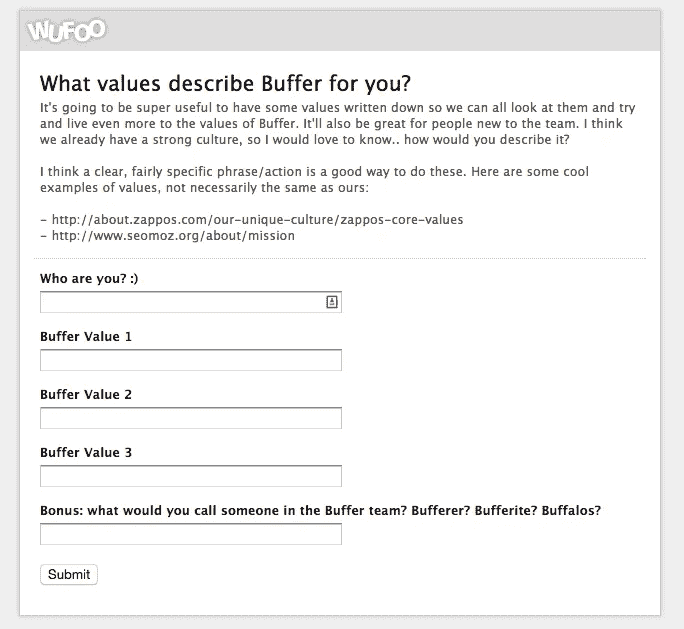
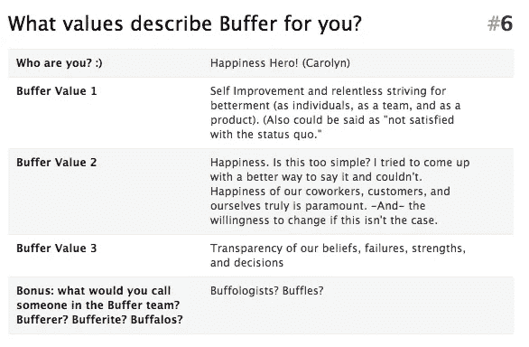
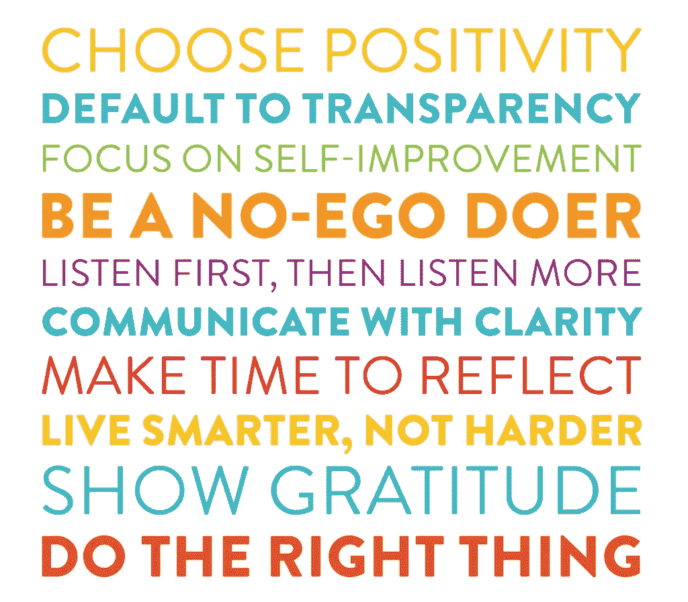
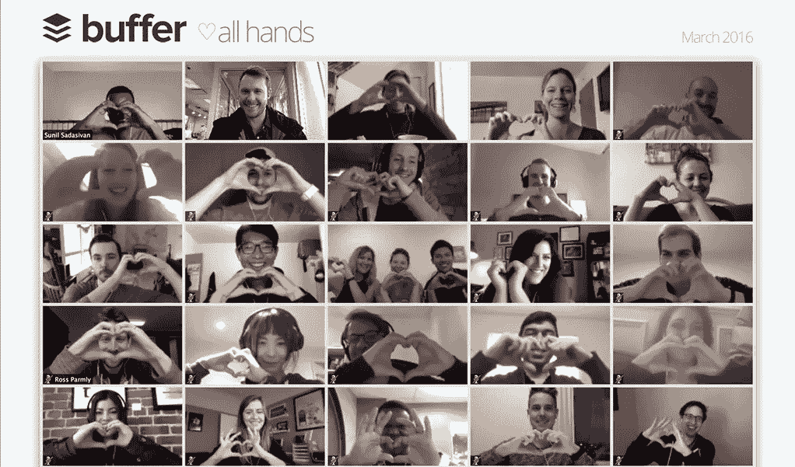
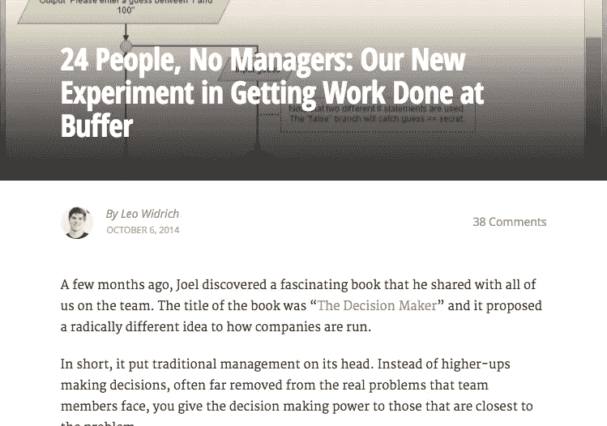
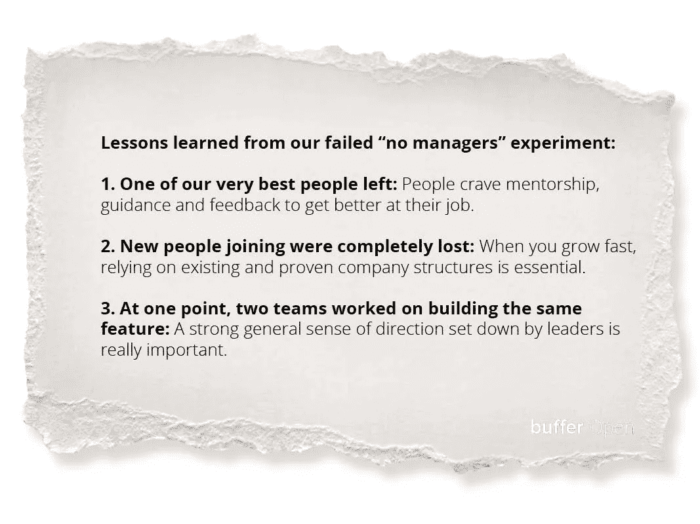

# 关于公司文化，我们三个最大的成功和两个最大的失败教会了我们什么

> 原文：<https://medium.com/swlh/what-our-3-biggest-successes-and-2-biggest-failures-taught-us-about-company-culture-cdaa8907045>

*由* [到*利奥·维德里奇*到](https://medium.com/u/55888232bfe9?source=post_page-----cdaa8907045--------------------------------)

在 Buffer，我们的工作环境看起来有点不同:我们的“水冷却器”是松弛的，[我们利用透明的电子邮件](https://open.buffer.com/buffer-transparent-email/)，[我们提供免费、无限制的 Kindle 书籍](https://open.buffer.com/buffer-perks-startup-perks/)并通过 Zoom 主持每月一次的读书俱乐部。

客户开始越来越关心产品背后的公司。在 Buffer，创造最令人满意的工作环境是我们愿景的一部分。

在过去的五年半时间里，我们从 0 名员工发展到将近 90 名员工，我们尝试了公司文化的许多方面。有些人成功了，有些人就没那么成功了。

你应该什么时候思考你的公司文化？你怎么知道那是什么？以下是我们在识别和拥抱公司文化时学到的一些最重要的经验。

我很荣幸能在今年阿姆斯特丹的下一届网络大会上做这个演讲。跳到最后看一段我的主题演讲录音！

# 什么时候(为什么)公司文化很重要？

如果你刚刚创办一家公司，或者正处于旅程的早期阶段，请放心。这还不是你需要担心的事情。当你是一个在客厅工作的两人团队时，你不需要文化。

这句来自我们的投资者之一克雷格·夏皮罗的名言，比我能说的更有说服力。

公司文化已经成为一个流行的术语，我认为它非常重要。与此同时，你首先需要做一些人们想要的事情，打造一个伟大的产品，并像克雷格所说的那样“取得胜利”。没有什么比这更重要了，文化也帮不了你什么。

一般的经验法则是，当你的公司有 5-10 个人，你已经找到你的[产品和市场的契合度](https://open.buffer.com/measure-productmarket-fit-product-feature/)——这可能是你坐下来思考你的文化的最佳时机。

但是文化为什么重要呢？

为什么是当今社会讨论的生长点？

> 关注你的公司文化和价值观可以让你建立一个伟大的公司。它让你停止按政策操作，开始按原则操作。

如果你们有每个人都认同的共同价值观，并且你们都遵循这些价值观，那么很多事情就变得多余了。

您不需要为过程中的每一步都创建一个策略。而是可以从你的价值观去诱导。

*   我们应该如何设定薪酬？
*   *我们如何处理假期？*
*   *我们如何决定下一步构建哪个特性？*

所有这些东西都应该受到你的价值观的影响，而不是被切割成一个千篇一律的过程。你最好的团队成员想要自由，但是他们也需要指导和一个总的方向。文化和价值观可以让你做到这两点——设定高水平的期望，但不要束缚人们，让他们不明白为什么要遵循这些规则。

# 好的，坏的，丑陋的:我们如何把我们的文化变成文字

文化的好处在于你不必去发明它。

它已经存在。

如果你的产品符合市场需求，并且你有一个 5 人、6 人或 10 人的团队，它就已经存在了。就这样，你就有了公司文化。一开始只是创始人的个性，然后是创始团队的个性和他们隐含的价值观。

一旦存在，我认为这是你公司历史上的一个关键时刻:**你可以掌控自己的文化。**

1.  观察你的文化是什么。
2.  决定塑造未来。
3.  确定你可以如何塑造它。
4.  按照你设计的文化行事。

这是我们做的第一件事:[乔尔](https://medium.com/u/cc7e684f6a25?source=post_page-----cdaa8907045--------------------------------)，我和我的联合创始人对我们的价值观有一个很好的想法。但是我们觉得我们真的想让整个团队都参与进来。

我们创建了一个简单的 Wufoo 表单，并询问我们的团队成员他们认为 Buffer 的值是多少。

下面是我们当时的快乐英雄卡罗琳的回应，她是我们今天的首席快乐官:

有趣的是，尽管我们没有在任何地方写下这些价值观，Caro 觉得她在 Buffer 的经历在这三个价值观中得到最好的描述。这强调了这个练习仅仅是描述正在发生的事情，然后把它们转化为你的价值观。

你不创造文化，你只是说出你已经拥有的。

这是我们想出来的:

## 我们的 10 大价值观

1.  选择积极和快乐
2.  默认为透明
3.  关注自我提升
4.  做一个“无我”的实干家
5.  先听，然后多听
6.  倾向于清晰
7.  腾出时间来反思
8.  活得更聪明，而不是更努力
9.  表示感谢
10.  做正确的事

经过过去几年三到四次的反复，这些是我们在 Buffer 努力生活和工作的价值观。

一旦你到了把一些事情写下来的阶段，它就会变得非常强大。你现在有了可以在全公司分享的东西。

这就是事情变得丑陋的地方。

在大多数人的心目中，文化常常是一个美好、轻松、令人欣慰的术语。但实际上，我认为文化更多的是关于诚实、纪律和正直。如果你完全按照这些特征去做，你必须做出一些非常艰难的决定。

在我们确定了我们的核心价值观之后——在几个月的时间里——我们进行了一些艰难的讨论，我们让一些团队成员离开了。我们从 12 或 13 人增加到 8 或 9 人。真的很难。

在某种程度上，文化和价值观就像一种消毒剂。尤其是一旦你明确了价值观:你就不能再背离真理了，否则你的价值观就会变成贴在墙上的一张纸。

**一旦你明确了一套价值观，按照这些价值观行事就是你能做的最重要的事情。**重要的问题不是“你的价值观是什么？”而是“让你的价值观明确地引发了什么变化，或者它们是在持续的基础上引发的？

重要的是要记住，从长远来看，你正在做的事情会治愈你和你的公司。

# Buffer 最大的三个文化成功案例

## 成功 1:透明度和公开工资

我认为第一批成功的实验之一是我们推动工资透明化。

当我们缩小并反思我们的透明度值时，重要的是要注意到，我们处理这个问题的方式是，我们一开始没有想到[透明的薪水](https://open.buffer.com/transparent-salaries/)、[电子邮件](https://open.bufferapp.com/buffer-transparent-email)、[收入](https://open.bufferapp.com/buffer-public-revenue-dashboard)甚至是[透明的仪表盘](https://buffer.com/transparency)。

相反，当我们制定我们的价值观时，我们只是觉得，在 Buffer 之旅的早期，我们一直对我们的团队和公众非常开放，围绕 Buffer 发生的事情。

我们想，

> *“从根本上说，透明度有助于我们过上更充实、更诚实的生活，并更好地运营公司。”*

所以本质上，我们只是认为透明是一件好事。好的东西，例如围绕我们的一些透明度计划的宣传，是很好的，但它不是驱动力。同样令人惊讶的是，在我们公布工资后的一个月，我们收到了 4000 份申请。许多人被这些价值观所吸引。令人惊讶的是，这引发了如此情绪化的反应。

## 成功之二:远程工作

缓冲是完全分布式的。[我们甚至没有实际的办公地点](https://open.buffer.com/no-office/)。

我们有 85 名团队成员，分布在五大洲，包括斯里兰卡、南非、台湾、新加坡、荷兰、欧洲各地、美国、加拿大等等。

再次成为一家远程公司并不仅仅是因为想要变得远程。它始于价值层面。

我们的价值观之一是“活得更聪明，而不是更辛苦”，在这一价值观下，我们鼓励人们从他们最快乐、最有成就感的地方开始生活和工作。

我们从根本上相信，旅行、探索世界并生活在你最快乐的地方是一个好主意。当我们写下这一点时，我们还决定将这一点扩展到所有加入 Buffer 的人。

我们从远程工作中学到的一些经验:

主要优势:

*   团队成员能够出差
*   不要通勤去办公室
*   可以更轻松地照顾孩子或宠物
*   接近 24/7 全天候覆盖

缺点:

*   远程头脑风暴真的真的很难，所以[面对面的务虚会很重要](https://open.buffer.com/inside-buffer-retreat/)
*   [随着规模的扩大，时区成为一个问题](https://timezone.io/team/buffer)
*   你接近 24/7 的“事情发生”
*   正确的工具很重要:Trello、Slack、Zoom、Dropbox Paper、Discourse

## 成功之三:公开筹款

最近，美国修改了一些法律，这样你就可以公开筹款了。我们立即抓住了这一点。

2014 年，[我们完全透明地筹集了 350 万美元](https://open.bufferapp.com/raising-3-5m-funding-valuation-term-sheet)。

我们的第一个投资者 [Collaborative Fund](http://www.collaborativefund.com/) 承诺为这轮投资提供大约 150 万美元，然后我们说，我们将从任何感兴趣的人那里筹集其余资金。我们写了一篇[博客文章](https://open.bufferapp.com/raising-3-5m-funding-valuation-term-sheet)并公布了条款清单，基本上是说“嘿，还有谁认为 Buffer 是一项不错的投资并想参与其中？”

反响令人难以置信。

我们在 24 小时内付清了剩下的钱，然后继续建造东西。

随着时间的推移，文化会延伸到公司之外。我们非常感激我们的投资者认同我们的价值观，并愿意进行这样的实验。

# 我们学到的两个文化错误

我最近在亚马逊失败的 Fire 手机上读到了杰夫·贝索斯的一篇文章。人们问他是否担心那次失败，他说，“如果你认为那是一次大失败，我们现在正在研究更大的失败。”

当你开始处理大事时，无论是文化还是产品，你都不可避免地会遭遇失败。本着 Buffer 的透明精神，我们认为这些也值得分享。

## 错误 1:没有经理的情况下工作

大约一年半前，我们开始阅读和学习一种迷人的新工作方法。有人称之为大屠杀，有人称之为自我管理。

[我们被它迷住了。](https://open.buffer.com/decision-maker-no-managers-experiment/)

我们认为，允许每个人完全自由地做他们想做的事情，创建一个强大的对等决策框架，避免对老板或经理的需求，这是非常令人着迷的。我们在没有经理的情况下在这个系统中工作了大约八个月，然后我们逐渐开始回到一个更传统的层级结构，这就是我们现在所拥有的。

那么我们学到了什么？

**1。人们真的渴望和想要导师。**尤其是你最优秀的员工。我们团队中最优秀的产品设计师之一离开了，很大程度上是因为他觉得他再也没有得到在加入 Buffer 之初作为个人贡献者帮助他快速成长的指导。

那真的很痛。

我们认为给人们所有的自由会受到欢迎，但相反，人们觉得他们在拖延。

**2。被雇佣的新员工感到失落。我们对他们说，“去寻找你自己，找些事情去做。”**

当你进入一家成熟的公司时，这很难。你觉得你不断地踩在别人的脚趾上，这让人们瘫痪了。对我来说，一个重要的结论是，当你作为一家公司快速成长时，你不应该创建全新的公司结构。相反，要依赖那些经过试验和证明的东西。

**3。最后，我们永远无法获得一个目标和方向的总体感觉。我们曾经有两个团队致力于构建相同的功能。设定使命和愿景的价值，以及团队的意见——但仍然来自公司的创始人或领导人——是如此重要。从那以后，我们又回到了那个结构。**

这些失败是艰难的，尤其是在当下。然而，从长远来看，这就是你变得更好和提高的方式。

## 错误 2:透明的反馈

考虑到我们的透明度价值，我们认为我们可以将它应用到任何事情上。事实证明，这并不完全正确。“公开表扬，私下反馈”这句话被证明是正确的。至少对我们来说是这样。

有一段时间，我们决定如果有人对团队中的其他人有一些反馈，即使是强硬的反馈，也要完全透明。

这是一个论坛式的格式，团队中的每个人都可以阅读它，甚至可以跳出来为给出的反馈辩护或鼓励。

这有点像角斗士的战斗:你可以看到两个人不得不在一群人面前为他们的行为和他们可能说过或没说过的话辩护。事实证明，这种方法触及了我们一些不太高效的人类本能。可以理解的是，人们变得具有防御性，听不到任何预期的反馈。那些给出建议的人觉得他们想给出的每一个小反馈都变成了一件大事。这成了恶性循环。

几个月后，我们关闭了它，决定继续用建设性的反馈帮助彼此，但要私下进行。

当你生活在价值观的边缘，并真正遵守这些价值观的时候，你就会碰到这些失败的界限。我仍然很感激我们尝试了这个实验，我们学到了很多。虽然，如果我可以在这方面提供一些强有力的建议:我认为反馈最好是私下进行。

# 真相:按照价值观经营真的很有趣

所有围绕专注于你的价值观并按照它生活的努力都会有回报。

无论你选择什么样的价值观来生活在你的公司里，都值得努力去真正坚持它们，按照它们行动，并从这些经历中学习。

就个人而言，经历这一切并拥有一群你觉得真正团结的人是很特别的，也很有趣。那里有丰厚的奖励等着你。

当时机对你和你的公司合适时，想想你的文化和价值观。不要害怕让你的价值观影响你接下来的行动。

# 轮到你了

你的公司有一套价值观吗？在你的工作场所，哪些价值观对你最重要？有没有引起共鸣的缓冲值？

## 感谢阅读！如果你觉得这篇文章有用，点击下面的❤会很棒。这也有助于其他人看到这篇文章:)

*本帖原载于 2016 年 6 月 29 日* [*我们的开放博客*](https://open.buffer.com/build-company-culture/) *。*

*照片致谢:*[*Unsplash*](http://www.unsplash.com)

