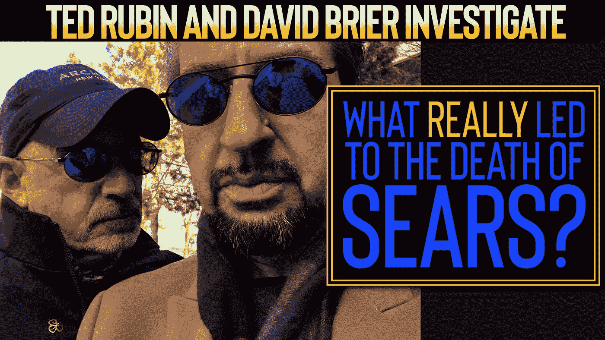
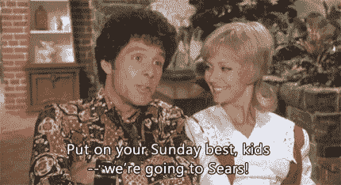

# 到底是什么导致了西尔斯的死亡？

> 原文：<https://medium.com/swlh/what-really-led-to-the-death-of-sears-a4f60d98d144>

## 谁会想到，在作为零售业的一个主要品牌 132 年后，我们会看到西尔斯的死亡？

事实上，这是一项关于零售传奇如何停止做最初使其成功的事情，却被一家新公司击败的研究(在现代数字时代使用相同的商业策略)。

因此，我的好友(也是社会营销策略师)泰德·鲁宾和我在一个工作日去调查了美国购物中心西尔斯百货公司的谋杀之谜，以下是我们的发现:

# 亚马逊如何用自己的商业模式击败西尔斯

西尔斯是如何从*百货店*到*无品牌*的？

任何知情的人都知道这一点:西尔斯改变了美国的购物方式。

西尔斯是最早的百货店。字面上。

当时，全美国的人都住在小城镇，只有几家商店可供选择。西尔斯通过目录改变了这一切。

西尔斯商品目录改变了人们的购物方式，通过引入他们的商品目录，人们可以买到比当地更多的东西。

这是互联网和购物中心激增之前的一个世纪。

# 西尔斯，最初的亚马逊

然后，突然之间，随着互联网和电脑的出现，邮件不再是每个人家里唯一的东西了。

有了这个新事物:互联网。

后来出现了一家公司，它采用了与西尔斯完全相同的模式: ***把购物的世界带到每个人的家里*** 。

亚马逊让购物者在任何时间获得任何东西成为可能，而西尔斯从未抓住这一重大技术转变，为购物者提供便利。

他们也从来没有把他们的商店提升到一个让他们不可或缺的客户体验水平。

西尔斯的死亡显示了任何品牌固有的潜力。

在适当的倡议下，它的消亡是不可想象的。

没有这种主动性，这只是一个时间问题。

## 这篇文章发表在 [The Startup](https://medium.com/swlh) 上，这是 Medium 最大的创业刊物，拥有+383，380 读者。

## 在这里订阅接收[我们的头条新闻](http://growthsupply.com/the-startup-newsletter/)。

