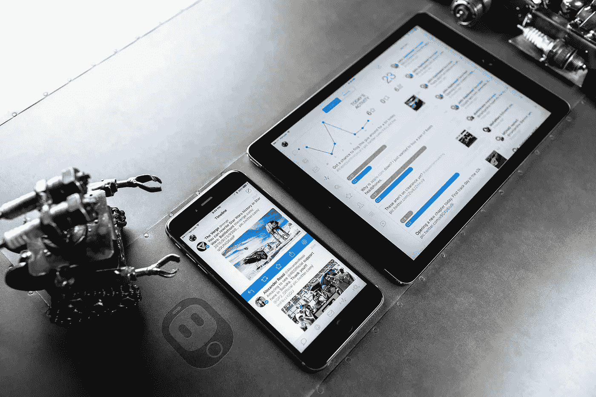
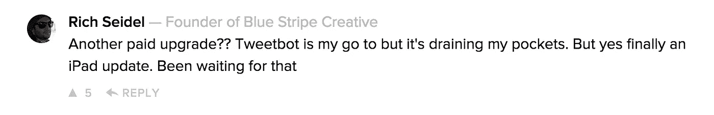

# 什么比付费应用更新更糟糕？

> 原文：<https://medium.com/swlh/what-s-worse-than-paid-app-updates-1d4f8ae22fe6>

Image courtesy of [tapbots.com](http://tapbots.com/tweetbot/)

最近, [Tweetbot 4](http://tapbots.com/tweetbot/) 作为跨平台更新发布，将在 iPad & iPhone 上运行。目前(半价)，这是一个 4.99 美元/ 3.99 美元的应用程序。不管你是最近买了旧的 Tweetbot，还是根本就没买过。

有些人对此非常愤怒:

Image via ProductHunt

接下来，只要在 Twitter 上搜索一下😢

Tapbots 的设计师马克·贾丁(Mark Jardine)很快比较了他的冰咖啡和升级的成本:

我们都见过这种情况，尽管可能被过度用于比较应用价值，但可以肯定地说，这是一个公平的论点。大多数会考虑购买 Tweetbot 的人还会定期花 5 美元买一杯咖啡、一杯精酿啤酒、一顿快餐或更多几乎任何新版本的游戏机游戏。

那么，人们为什么要为此攻击独立开发者呢？

# 让我们客观地看待它。

这个新的更新/升级由一个 3 人团队花费了 **8 个月**的时间。

**场景:**一个现有的客户找你重新设计和构建他们的网站。你为他们的第一个网站工作，他们付钱给你，你得到一小笔费用，刚好可以支付他们现有网站的日常维护费用。你每周还会收到数百封关于当前网站的电子邮件和推文，请求你的支持，而且不需要额外付费。

经过几次会议、电话和来回奔波，你意识到这个项目的规模。你需要再找两个开发者来帮你开发这个东西，这需要 **8 个月**。

好吧，那我们开始工作吧。

一个*轻微的*问题。

客户不想为这项工作付给你钱。

**狗屁。**

他们很乐意继续使用预聘，但你需要免费做一个新的才能继续得到它。

你会怎么做？你会免费工作吗？

*在这个场景中，我使用了网页设计作为比较，但是你同样可以是一个建筑工人、机械师或者任何为客户提供服务的人。*

> 那么，比付费 app 更新更糟糕的是什么呢？
> 
> **抱怨付费 app 更新的人。**

让我们把这一点说清楚——这与贪婪无关。

正如马克明确指出的那样，有免费的替代品。如果它让你如此困扰，那就不要买它。

如果你想深入了解 Tweetbot 4 为你提供了什么，请阅读 MacStories 上的这篇博客文章。

所以下次你想抱怨付费升级的时候，考虑一下背后的人并支持他们，如果你不想，就不要。但没必要叫他们贪婪的混蛋，因为他们不是。

作为这篇文章的结尾，我将留给你这个:

> “当人们希望这将是一个免费的更新时，他们基本上是希望 Tapbots 作为一个公司死去，我们去寻找单独的日常工作。”

马克·贾丁，推特机器人([链接](https://twitter.com/markjardine/status/644309229713559552))的设计师

# 支持独立开发者。

*发表于*[**# SWLH**](https://medium.com/swlh)**(**创业、流浪、生活黑客 **)**

-