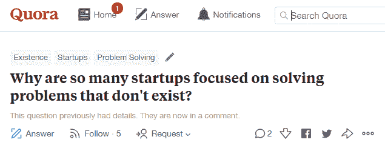
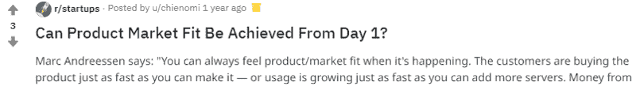
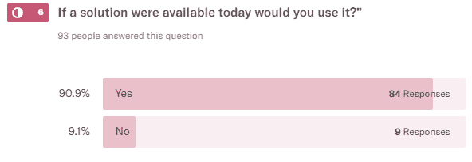

# 你知道你的创业是否值得追求吗？

> 原文：<https://medium.com/swlh/what-should-i-start-a-business-in-feb2109f2297>

## 这是最接近创业水晶球的问题“我正在创业值得追求吗？”。

创业社区最常见的问题之一是“**我如何知道我正在建立的企业是否会成功”。**

这篇文章讲的是我学到的解决这些问题的切实可行的策略。我们将详细讨论应该做什么，如何衡量成功，以及可以使用什么工具来实现成功。我觉得它非常重要，所以我在这里创建了一个关于它的[课程](https://rebrand.ly/medium-a1)。

最后，我将解释我学到的最重要的一课，我称之为创新者之路——如果你从这篇文章中学到了什么，那就是这个。

# 内容

1.  **首先，这是你如何站在客户面前的方法**
2.  **现在，去哪里寻找你的目标市场**
3.  **正确行事，这是成功之路**

这个问题的核心是“我应该从哪里开始创业？”在你的旅程中，在关键时刻与市场沟通是重要的一步，以准确了解他们的需求/问题。

> 对许多企业主来说，事实是你可能实际上不是你理想的目标市场，因此无法提供关于你的产品的准确反馈——更不用说你对业务有严重的偏见和情感投入，以及对其成功的个人投资。

这意味着我们需要从尽可能接近你的想法目标市场的人那里获得公正的反馈，但首先你需要找到他们。

# 在哪里找到你的目标市场

让我们花一分钟思考一下你的目标市场，这里有一些问题可以激发你的创造力。

*   他们在哪里购物
*   他们访问什么网站
*   他们做什么活动
*   他们参加什么活动
*   他们还对什么感兴趣

**这里有一些关于你还可以在哪里**找到你的目标市场的想法:

## 1.(以物理方式/数字方式)在人行道上行走

Asking and answering questions on Quora can be a great way to find people who are trying to solve the exact problem your product solves.

更多有趣的 Quora 问题:

[**有了想法，想做创业，怎么办？**](https://www.quora.com/What-can-I-do-if-I-have-an-idea-and-want-to-do-it-as-startup)[**我现在正在寻找一个完美的商业创意，有哪些选项？**](https://www.quora.com/I-am-now-looking-for-a-perfect-business-idea-what-are-the-options)[**如何判断一个创业公司是否会成功？**](https://www.quora.com/How-do-you-tell-whether-a-startup-will-succeed)

This example is from Reddit, shorter responses are okay on this platform and if you choose your responses wisely you’ll be getting in front of a target group of people with high intent.

其他一些想法:

*   搜索评论和论坛网站
*   参加活动或聚会
*   社交媒体群组/个人资料
*   博客页面

您可以与发布问题或评论的人互动，以获得更深入的见解，或者我们可以指导这些人回答我们的调查，以换取感知价值的激励。

## 2.付费流量

你可以通过付费将定向流量发送到你的原型来使用其他人的网络(OPN)。

*   [谷歌 AdWords](https://adwords.google.com/)
*   针对目标市场的社交媒体付费广告
*   拥有你的目标市场的其他平台

## 3.用户测试

*   人工招聘——使用自由职业者或分类网站，如 [Upwork](https://www.upwork.com/) 或[自由职业者](https://www.freelancer.com/)
*   [**Usertesting.com**](https://www.usertesting.com/)**——通过视频录制获得对应用或网站反馈的简单方法。定位是有限的，但你获得的洞察力是丰富的，因为当人们与你创造的东西互动时，你可以听到他们在想什么。**
*   **[他们的针对性越来越强，所以你可以更接近你的实际目标市场。](http://vlt.me/.2soa8)**

**你可以使用激励措施来鼓励人们协助你的研究，这些激励措施也可以是与你正在创造的产品相关的感知价值，例如，Dropbox 为每个人提供免费空间，免费空间对最终用户的感知价值远远高于公司的实际成本。**

# **这就是你如何走到顾客面前的方法**

**找到你的目标市场只是成功的一半，我们需要一种方法来获得真正的洞察力，我们可以通过创建调查和收集结果来获得洞察力。**

## **以下是您可以使用的工具:**

*   **[**Typeform**](http://referral.typeform.com/mQdTNKp)**——最容易使用和最容易集成的表单之一，这些表单可以根据您的品牌进行定制，并可以轻松嵌入到您需要的地方。这是我调查的首选工具。****
*   ****[仅通过移动设备向来自脸书活动的人显示调查。](https://getsitecontrol.com?ref=704)****
*   ****[**survey monkey**](https://www.surveymonkey.com)**——早期玩家之一，也绝对是最大的玩家之一，他们现在有一个很棒的功能，他们从他们庞大的数据库中为你寻找受访者。看起来有超过 50 种不同的目标选项可供选择(尽管目标越多，找到足够的人来做测试的机会就越少)。******
*   ********纸笔——这是我的最爱，从来不会让我失望，你可以在任何地方打开它，问任何问题，从一个地方记录结果。😉(上当就评论)。********
*   ******[**谷歌表单**](https://www.google.com.au/forms/about/)——可能是所有表单中最简单、最直接的，谷歌表单给你提供了超级基本的样式(只有主题模板和颜色)，并且有你需要的基本问题类型。如果你需要快速的东西，并且不在乎外表(也许只是内在的)，那就用这个吧。******

## ****收集结果****

> ****反馈的价值取决于你从中获得的洞察力。****

****问正确的问题以获得正确的答案是关键，但是你需要一种简单的方法来跟踪结果。幸运的是，任何有价值的工具通常都会有一个结果页面，上面有类似下面的图表和数据。****

********

****An example of how results are shown on Typeform (survey tool)****

****我一直在整理一份[史诗般的创业营销工具清单，在这里](https://rebrand.ly/medium-tools-a1)你可以找到一切，从聊天工具、UX 研究工具、访客跟踪到股票图片、登陆页面创建者和营销自动化工具，这些工具定期更新，是 [**我送给你的礼物。**](https://rebrand.ly/medium-tools-a1)****

********

******What people say they do and what they actually may vary.******

> ****如果你有一个活生生的产品，你就处于一个有利的位置，因为你现在可以用实际行动来表明你是否有一个人们真正想要的产品。****

****我们可以通过分析来查看真实数据:****

*   ******点击率(CTR)** (哪些广告具有最高的点击率，可以被认为最有效地让人们点击你的广告)****
*   ******下载**(你最喜欢的下载内容是什么？)****
*   ******查询**(你收到了几个，在哪一页？)****
*   ******销售额**(给定时间段内你的销售额是多少？)****
*   ******转换率**(在你的销售漏斗中，有百分之多少的人正在经历每个阶段？)****

****您可以通过手动或通过您的分析平台收集您的分析数据、线索和销售数字来获得这些数据，以了解人们是否真正感兴趣。****

> ****ip:有人说他们做的和他们实际做的可能有很大的不同，因为行动总是比语言更响亮。最终的测试是人们是否真的购买你的产品。****

****一旦我们有了建议的解决方案，我们就可以回到目标市场去**确认建议的解决方案是否真正解决了他们的问题，并开始** [**业务目标的设定。**](/swlh/business-goal-setting-2f5a54e97789)****

> ****你可以把它比作把顾客的需求放在第一位，但实际上它是把人们的需求放在第一位，因为在成为某个人的顾客之前，我们都是第一个个体。****

# ****这是外卖****

*   ****找到他们所在的目标市场****
*   ****创建一份调查，开始收集见解****
*   ****问正确的问题****
*   ****当你有了真实的数据，把它和你的洞察力结合起来****

****如果你准备好学习围绕人们真正想要的东西创业的具体步骤，已经有超过 2000 人参加了这个课程****，许多人声称它改变了他们创业旅程的轨迹。********

******感谢阅读。通过鼓掌或推荐来传播信息，帮助他人避免早期创业失败，**按住**👏表示感谢。******

**** [## Lenny Manor ★ |在 LinkedIn 上与我联系

### 在全球最大的职业社区 LinkedIn 上查看 Lenny Manor ★ (4k)的简介。

www.linkedin.com](https://www.linkedin.com/in/lennymanor/) 

## 这篇文章发表在 [The Startup](https://medium.com/swlh) 上，这是 Medium 最大的创业刊物，有+ 382，862 人关注。

## 订阅接收[我们的头条](http://growthsupply.com/the-startup-newsletter/)。

****