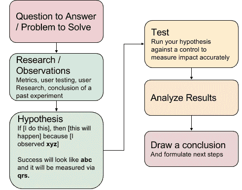

# 下一步我们应该建造什么？

> 原文：<https://medium.com/swlh/what-should-we-build-next-5fc5876afb6>

## 产品创意从何而来，如何对其进行优先排序

这是一个典型的问题——资源是有限的，开发是昂贵的，我们需要快速前进。但是快速走向什么？什么值得我们花费宝贵的时间和精力？我们在哪里可以获得最大的设计和工程收益？我们是继续我们当前的战略还是转向新的战略？

> 任何科技公司的命脉都是不断寻找方法来制造人们*需要的东西*。

在当今的“敏捷”世界中，我们迭代地做这件事——这意味着我们不断地打造从 A 点到 B 点的路径，这是一个基于任意数量的输入(市场和用户反馈、领导的愿景和战略，等等)而变化的移动目标。浪费时间和资源建造错误的东西就像在这条路上拐错了弯。过多的错误转向很容易导致产品与目标市场不匹配，如果不加以控制，最终会导致公司的灭亡。

因此，当我们以极快的速度，沿着一条几乎没有明显标志的道路，朝着一个不断变化且常常模糊不清的目标前进时，我们如何做出日常决定，在哪里放下下一只脚，向前迈出下一步？

> **事实是，大多数产品决策都是聪明人做出的有根据的猜测，这些人了解他们的产品、他们的业务，最重要的是，他们的用户。我们称之为“直觉”。**

# 收集原材料

## 高层次的愿景和战略

优秀的产品领导者不会因为一时兴起而创造产品。优秀的产品是由领导者产生的，他们对一群有问题的人有深刻的了解和同情，有解决问题的想法，并有执行这个想法的专业技能。

因此，毫不奇怪，一个产品持续的指路明灯往往是这些领导者对未来 6 个月、1 年、5 年或更长时间的愿景。

> 当你对产品的愿景符合市场需求时，成功就会发生。

从这个愿景中，我们得出了一个战略，它定义了我们将在哪里比赛，以及我们将如何在那里获胜。你可以这样想:在一个有无限选择和如此多机会展现的世界里，我们要把精力集中在哪里，为什么？这些选择为一个产品定下了基调并定义了成功。通常，他们会设定哪些想法会被采纳，哪些不会被采纳的界限。

> 战略的本质是选择**而不是**去做什么。哈佛大学的迈克尔·波特(重点是我的)

例如，脸书在连接人们的问题空间中运作。很明显，从战略角度来看，他们认为视频在解决这个问题方面发挥了作用——因此最近大力推动 FB Watch。但是追求视频方面的进步无疑意味着他们不得不选择*而不是*来以其他方式追求这一目标，至少目前如此。

制定一个有凝聚力的高层战略，以及战略背后的*为什么*为之后的所有事情奠定基础。

## 从气泡外部获取输入

我有一些好消息！关于你的产品*的所有(好吧，可能是大部分)问题的答案都是存在的。这里有一个问题，它们可能不在你的脑海中某处浮动。*

> 一些关于如何推动你的产品和业务向前发展的最好的想法是在你和你的团队工作的泡泡之外的。

产品团队可能会太快地接近一个问题，或者(上帝不允许！)到具体的解决方案。我们为我们*如何思考*这个世界的运作制定了一个心智模型，并倾向于忽视与此相反的不确定证据。正是为了应对这一现实，精益创业传奇人物史蒂夫·布兰克创造了“滚出大楼”这个短语。

走出大楼，或者我喜欢称之为“泡沫”，可以通过许多方式来实现——所有这些方式都涉及到与你的客户的直接互动。但是，无论您选择收集数据并从中获得洞察力，这里的目标都是识别您的用户所面临的问题，以便您和您的团队可以找到解决这些问题的方法(稍后将详细介绍)。

旁听客户支持电话或电子邮件可以让你很好地了解用户在使用你的产品时每天面临的问题。每周只需花一两个小时听一线的电话，就能让你获得深刻的见解，并带回给团队，激发出让客户体验更好的想法。

**跟踪支持请求**可以让您更定量地了解用户面临的问题。所有票证都应标记其所属的类别，然后可以分解为帕累托分析，以发现导致 80%客户痛苦的 20%问题。

**在用户使用你的产品时与他们聊天**。像 Intercom 这样的工具可以让你在用户想你的时候就在那里。

**征求用户的反馈。有许多工具可以直接向用户征求反馈。最简单和最可信的方法之一是净推介值(或 NPS)。[它有它的缺陷](https://blog.usejournal.com/net-promoter-score-considered-harmful-and-what-ux-professionals-can-do-about-it-fe7a132f4430)它不会给你太多的时间来回答数据背后的原因，但它可以是一个很好的工具来了解客户情绪随着时间的推移而发生的广泛变化。**

养成与用户交谈的习惯。你不必组织大型调查研究，只要向用户提供一些有价值的东西(50 美元或 100 美元的亚马逊礼品卡通常就足够了),让他们花一些时间讨论一些关于使用你的产品或使用你刚刚发布或正在考虑开发的新功能的问题。请务必记录会议，或者想办法让团队的其他成员参与到您从这些对话中收集的见解中来。如果你养成了这样的习惯，并建立了这样的采访渠道，这是从实际使用你的产品的人那里获得定期的、有用的、相对便宜的反馈的好方法。

*两个免责声明:(1)如果一个用户告诉你一些你不同意的事情，这并不意味着他们“不是你的目标用户”，但这也不足以完全改变你的策略。这应该只是一个迹象，表明你需要向更多的用户提出更多的问题，以真正了解这是否只是一个异常现象。(2)不要用定性数据疯跑。你不想构建只有一小部分用户在要求的东西。(参见这篇* [*精彩的内部通信博客文章*](https://blog.intercom.com/rarely-say-yes-to-feature-requests/) *，了解更多关于这一点和其他支持特性的理由。)*

## 你的团队是座金矿

没有人比你的用户更了解你的问题空间，但是没有人比你的团队更了解你的产品和业务。你应该随时听取意见，或者，更好的是，建立直接的渠道，通过这个渠道，你的团队可以表达他们对需要解决的问题或使你的产品更好的想法的意见。

在任何时候，都有一系列企业需要克服的问题。事实上，大多数*想法*可以(也应该)追溯到试图解决的隐含的潜在问题。这些问题是构思的原材料。

> 找到需要解决的问题应该是所有产品团队的 DNA。

**为你的团队创造机制，让他们提出问题和想法**。这可能以定期会议、专用的 Slack 频道或 mad-lib 风格的文档的形式出现。不管确切的机制是什么，这里的目标是为构思提供素材。

在向更多的观众公开之前，在纸上想清楚。我发现让人们把事情写下来很有帮助。写作行为迫使人们进行更深入的思考，并为团队提供更明智的共同愿景做好准备。让您的团队考虑问题、其他潜在解决方案以及他们想法的商业合理性。

**把握业务脉搏**。你可以淹没在度量标准中，有大量的文章描述如何做到这一点。这不是其中之一。决定一些能讲述你的业务故事的指标。避免那些感觉良好但不能说明全部情况的虚荣指标。养成分析变化或偏离期望的习惯，无论是积极的还是消极的，去磨练什么是有效的，什么是无效的。戴夫·麦克卢尔的*海盗创业标准*是一个很好的起点。当通过这五个指标来分析你的业务时:获取、激活、保持、收入和推荐(*啊哈……明白了吗？)*，你可以假设*总会有*需要解决的问题——在不同的行业和产品生命周期的不同阶段有不同的程度。

## 绕回来，加倍下注

迭代地构建产品看起来很像科学方法。我们从观察中得出假设，设计实验，分析结果得出结论。

Image Credit: Alex Davis ([great article about this concept](/startup-grind/product-management-2-0-a-growth-story-49bc486b62d9#.t0a20j5ms))

作为一个产品团队，在任何给定的时间，我们在这个过程的不同阶段都会进行几次实验。在测试完成后，我们必须分析结果并确定下一步。有时候这些实验支持我们的假设，有时候不支持。

> 剧透警告——大多数产品测试既不是彻底的成功，也不是令人沮丧的失败，它们介于两者之间。

我们必须做出艰难的抉择，是应该加倍努力我们正在测试的解决方案，还是尝试用不同的方式解决问题。不管怎样，从我们产品的实验中得出的结论是进一步构思的重要素材。

## 连接这些点——整个发散/汇聚的事情

好了，现在你有了一个坚实的愿景和战略，对你的用户感同身受，以及一些要解决的具体问题——来自与用户的交谈，了解业务面临的挑战，并从测试以前的想法中得出结论。现在怎么办？

> 构建好的、可持续的产品的关键是将你能为用户解决的问题和创造商业价值的方法联系起来。

**召集团队一起出主意。让全公司的团队成员聚在一起是一种很好的方式，可以相互交流，找到解决问题的新方法。向小组提出挑战——如果有人花时间提前写好，这应该很容易——并促进随后的讨论。注意不要让房间里最大的声音占据主导地位。这里的目标是分散思维，尽可能想出许多不同的方法来解决问题，然后团队可以讨论并集中他们认为最有价值的想法。**

对于特别棘手的问题，考虑一个**设计冲刺**，这个过程包括理解问题，构思解决方案，并实际制作原型以获得早期反馈。这不是一个可以一直使用的工具，因为它需要一个大团队在几天内投入难以置信的精力。但是这是一种非常有效的方法，可以让你在问题上快速进步，并且对解决方案更有信心。(【http://www.gv.com/sprint/】T2

# 产品决策的艺术和科学

这需要理解很多输入。那么，如何将它转化为一个连贯的路线图呢？

## **钉钉核心**

嗯，有些取决于你的业务或这种特定产品处于生命周期的哪个阶段。在早期，你的策略应该专注于你可以建立的东西，以测试关于你的业务的一些核心假设——例如，在优步优化用户的等待时间之前，他们首先需要了解人们是否真的会付费与其他人一起乘车。因此，如果对你的核心商业模式仍有疑问，那可能是你应该开始的地方。一旦你确定了这些，你就可以回头花更多的时间在一些你一直想解决的小优化上。

## 一个审视优先顺序的视角

剧透警告 PMs:没有框架、系统或算法可以替你做这些决定。但这是好消息，对吧？否则你会失业的。然而，根据您的团队认为重要的一组标准来分解每个提议的功能至少可以作为对话的起点。这里有一个镜头，我和我的团队发现很有帮助(这个框架的[和以前版本的](https://blog.intercom.com/rice-simple-prioritization-for-product-managers/)和肖恩·埃利斯的信用对讲机)。

**伸手可及。**有多少用户会从这项功能中受益？每个用户在入职时都会遇到吗？只有那些超级用户才能找到它吗？

**冲击。**如果您构建了这个功能，它会对您的业务或您的用户产生什么影响？会增加收入吗？提升用户体验？增加留存？差多少？一点点？很多吗？

**自信。**如果您构建了这一功能，您有多大把握*它会带来上述影响？你认为你和你的团队能够或者已经解决了这个问题吗？是不是只是一个测试，最多可能是 50/50？完全是瞎猜吗？*

**努力(或轻松)。**好的，太好了，你 100%有信心通过这一功能让你的业务翻倍。我持怀疑态度，但对你有好处！现在团队实际交付它需要多少努力？它是如此之小，以至于我们可以在一个闭着眼睛、一只手绑在背后的工程师兼职工作的情况下，在下周发布它吗？这是整个团队接下来 6 个月要做的一项艰巨任务吗？

一旦你和你的团队觉得你对这些问题有了很好的答案，以 RICE 评分为起点，对你的待办事项进行排序，并围绕为什么任何事情都应该从那里转移进行讨论。可能仍然有战略(我们需要这一点来追逐这个市场)或效率(如果我们已经在做这件事，我们也应该做这件事)的考虑，以及任何数量的其他事情可以并且应该促使你考虑调整这些优先事项。

在讨论了你*可以*建造的一切之后，最终必须有人对你*将*建造什么做出最终决定。通常这是产品经理的责任，但每个公司都不一样。

> 无论是谁在做这些最终的产品决策，请仔细听好——这一部分是给你的:你。威尔。不是。是。能干。敬。制造。所有人。开心。

是的，这意味着在某个时候，你会做出一个决定，而你的队友、你的领导、一个直言不讳的客户，或者一个三个月来一直要求他的客户提供宠物功能的销售人员都不会同意。没关系。好消息是，让这些人开心不是你的工作，帮助你的团队做出正确的事情是你的工作，忽视这一点会让整个产品开发很快偏离正轨。

也就是说，你应该**始终**确保做出你能为团队辩护的选择。毕竟，你不想失去他们的信任，或者让他们觉得你忽视了他们的意见。

## **最后，简要说明一下积压工作和路线图**

太好了！你有一些源于客户反馈的好主意，与你的业务一致，并被团队优先考虑。这些是成功路线图的开始。但没那么快。不要太执着。尽管这个计划现在看起来不错，但我倾向于遵循迈克·泰森学派的思想:

> "每个人都有一个计划，直到他们被打了一拳."

不可避免地，你会开始这个计划，运送一些令人敬畏的东西，市场会在你脚下移动，或者用户不会像你预期的那样反应，或者任何数量的坑洞和减速带会扔在你的路上，迫使你重新审视你的完美计划。但是不用担心——现在你已经掌握了足够的知识，可以从容应对了。

非常感谢你的想法和掌声。有太多的东西不适合这里，但在这个帖子上坐了一年后，因为它没有“完成”，我最终决定是时候按原样发布它了。🚢

## 这个故事发表在 [The Startup](https://medium.com/swlh) 上，这是 Medium 最大的企业家出版物，拥有 289，682+人。

## 订阅接收[我们的头条](http://growthsupply.com/the-startup-newsletter/)。

