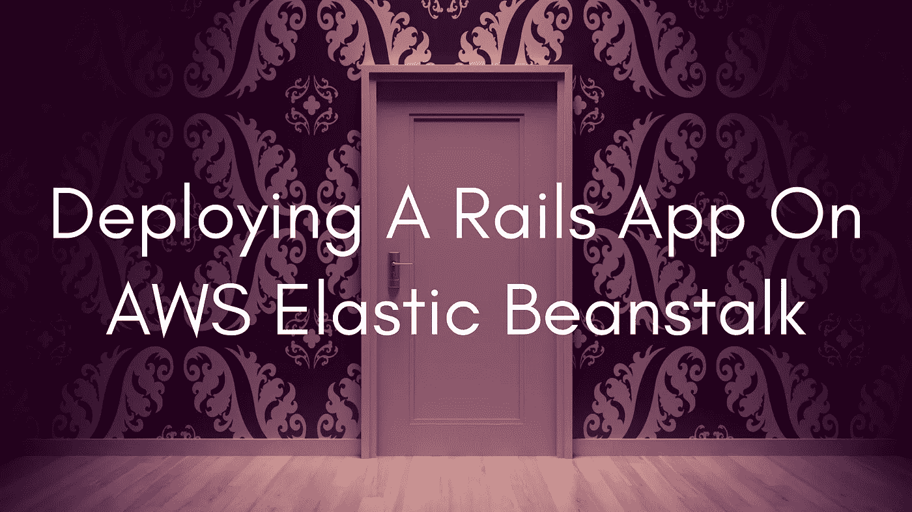
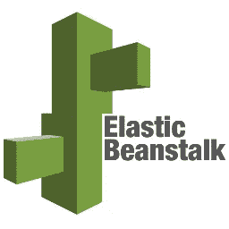

# 关于在 AWS Elastic Beanstalk 上部署 Rails 应用程序，你应该知道什么？

> 原文：<https://medium.com/swlh/what-should-you-know-about-deploying-a-rails-app-on-aws-elastic-beanstalk-fa47b9d834ed>

感觉今天每个人都想构建下一个伟大的可伸缩 web 应用。在部署和扩展我们的 Web 应用程序方面，Amazon Web Services 已经成为领先的云提供商之一。如果你是 AWS 的新手，这可能会让人不知所措。今天，有 40 多种不同的 AWS 服务，在构建应用程序时需要考虑许多概念。然而，AWS 提供了有用的指南、关于其每项服务的优秀文档、白皮书、常见应用的参考架构等等。现在，对于 Rails，采用它的想法并不仅仅是因为它的技术性，而是因为它是一个为初创公司开发的生态系统。由于 Twitter、Groupon 和 Hulu 等大牌用户以及所有宣传 Rails 的敏捷人士，引发了对 Heroku、AWS、New Relic 和 Github 等服务的需求，从而使 Rails 得以扩展。

有更多的提供者，在部署 web 应用程序方面没有 AWS 复杂。然而，部署可扩展的 web 应用程序会带来一些独特的复杂性，依靠巨人的肩膀来完成这项工作会有所帮助。现在，您可能正在通过在 AWS 上构建基础设施来解决这些复杂问题。即便如此，使用 Elastic Beanstalk，您可以获得完全可伸缩的解决方案，而不必自己配置所有组件。

可扩展的 web 应用程序自动提供额外的资源，无需任何人工干预或帮助。在这种类型的自动化编排中，您将需要相当多的基础设施，这需要时间来配置。想象一个基础设施，包括应用服务器、负载平衡器、数据库服务器、防火墙、日志聚合、监控和警报。如果不进行自动化，基础设施的几乎每个组件都需要更新，以使其了解新的资源。现在有了 Elastic Beanstalk，资源的创建和删除是自动处理的，因为它包含了健壮基础设施的所有组件。换句话说，如果您希望尽快扩展，这是理想之选。下面是在 AWS Elastic Beanstalk 上部署 Rails 应用程序的步骤。

# 1)首先，确保应用程序在 Docker 容器中本地运行

请随意将 docker 文件建立在官方 Rails 图像的基础上。如果您习惯使用 Heroku，使用 Herokuish 可以节省您几个小时的时间来确定您的应用程序需要安装哪些依赖项。最终，应该可以使用 Docker 在本地运行您的应用程序，并使用 ENV 变量控制其参数。

# 2)准备虚拟私有云

如果你是 AWS 新手，建立虚拟私有云可能会是一场噩梦。从最简单的设置开始，一步一步来。按照 VPC 创建向导配置一个简单的三个公共子网 VPC。看到了吧，当你启动的时候，没有理由把私有子网的事情复杂化，因为你总是可以使用安全组来限制访问。

# 3)为 Postgres 数据库使用亚马逊关系数据库服务(RDS)

首先，将一个 RDS 实例启动到刚刚创建的 VPC 中。就像最后一点，只要按照向导，你会设法做一个体面的工作。此外，确保在 Elastic Beanstalk 中运行应用程序之前创建数据库并运行迁移。

# 4)准备弹性豆茎环境

如果您不熟悉 Elastic Beanstalk，可以从 UI 向导开始帮助您。说到平台，选择通用部分下的多容器 Docker 选项。该选项将指示 Elastic Beanstalk 使用 ECS (Docker 容器的编排服务)。看，ECS 比常规的 Docker 平台强大得多，它允许您在应用程序中部署多个 Docker 容器。如果您希望包含用于监控或日志聚合的第三方插件，这将证明是非常有用的。如果您计划使用 SSL，请确保将您的 SSL 证书上传到证书管理器或 ACM。稍后，您可以将此证书分配给您的 ELB(负载平衡器)。确保在 security 部分为您的实例分配一个安全组，该组可以访问您刚刚创建的 Postgres 数据库。此外，在“网络”部分，确保您选择了上面创建的 VPC。

# 5)将应用程序的 Docker 图像上传到注册表

您可以使用 AWS ECR，它可以很好地与 Elastic Beanstalk 集成，或者如果您愿意，也可以与 Dockerhub 的私有存储库集成。

# 6)命令行界面(CLI)将允许您部署应用程序

下载 Elastic Beanstalk 的 CLI (eb)。您将需要它来将您的应用程序部署到新创建的环境中。描述如何使用“Dockerrun.aws.json”文件部署 Docker 容器。到目前为止，您已经创建了几乎所有需要的 AWS 资源。继续运行“eb deploy”命令，您的应用程序将部署到新环境中。

# 结论

到目前为止，您应该已经意识到将新的 Rails 应用程序部署到 Elastic Beanstalk 的过程并不像部署到 Heroku 那样简单和简化。因此，建议在小项目中使用 Heroku，如果你在一家初创公司工作，在你的初始阶段。当您的产品增长时，您总是可以迁移到 AWS，并且理想情况下，您有更多的资源来投资设置和管理 AWS 资源。

总之，确保 AWS 适合您的工作负载。如果您保持所有服务器 24/7 在线，并且基本上没有弹性工作负载，那么可以从其他提供商那里寻找专用硬件。当您可以利用 AWS 的能力在需要时加速和减速您的实例时，AWS 是有意义的。

*原载于* [***产品洞察博客***](https://www.cognitiveclouds.com/insights/what-should-you-know-about-deploying-a-rails-app-on-aws-elastic-beanstalk/)**来自 cognitive clouds:Top*[*Ruby on Rails 开发公司*](https://www.cognitiveclouds.com/custom-software-development-services/ruby-on-rails-development-company)*

**

## *这个故事发表在 [The Startup](https://medium.com/swlh) 上，这是 Medium 最大的创业刊物，拥有 295，232+人关注。*

## *在这里订阅接收[我们的头条新闻](http://growthsupply.com/the-startup-newsletter/)。*

**