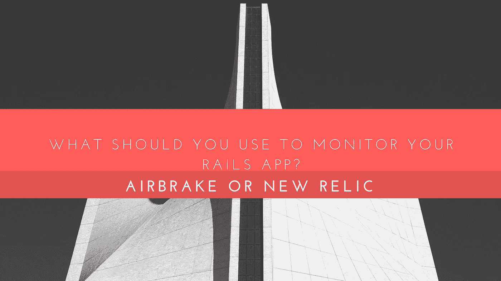
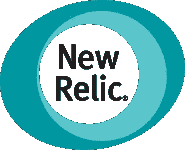

# 你应该用什么来监控你的 Rails 应用:Airbrake 还是 New Relic？

> 原文：<https://medium.com/swlh/what-should-you-use-to-monitor-your-rails-app-airbrake-or-new-relic-836d707954d7>

What Should You Use To Monitor Your Rails App: Airbrake Or New Relic?

在黑暗中按喇叭不会带你走远。如果您对应用程序中发生的事情一无所知，那么世界上所有的自动化和管理都只能帮您这么多。某些工具可以让您深入了解应用程序的工作和状态。有些提供了一个跟踪错误的仪表板，有些会在需要你注意的时候通知你，还有一些会持续测试你的应用。您将找到一些工具来监视您的应用程序，包括运行时间等操作方面的问题，以及异常和错误等开发方面的问题。

# 减速板

Rackspace 的 Airbrake 配备了一个基于网络的[仪表盘](https://www.cognitiveclouds.com/insights/how-to-simplify-dashboard-user-interface-ui-designs-for-mobile-platforms-2/)，用于捕获和跟踪应用程序中的错误和异常。仪表板将让您真正了解已解决和未解决的错误，以及关于每个错误的信息和概览图。每个错误包括发生的环境、第一次发现错误的时间、错误类型等等。

# 优点:

*   它提供了一个[与其他应用](https://www.cognitiveclouds.com/software-product-development-portfolio/api-developers-humanapi)的简单集成，如 Github、Hipchat、Asana 和许多其他服务。如果你有一个想要集成到 Airbrake 中的自定义应用程序，请使用 Airbrake 的公共 API 或他们的 web hooks 功能。
*   Airbrake 配备了一个[出色的用户界面](https://www.cognitiveclouds.com/custom-software-development-services/ui-ux-design-company)，让您可以轻松访问应用洞察和智能错误分组、会话详细信息和回溯等功能。所有这些都可以让你以更快的速度消灭这些虫子。
*   Errbit 恰好是 Airbrake 的一个自托管错误捕捉器。通过使用 Airbrake 的错误跟踪工具将错误日志发送到您自己的基于 ErrBit 的 web 服务，它可以让您将错误从 Airbrake 的服务器上清除。当错误包含敏感的客户端数据时，这非常有用。
*   通过将 Airbrake 的客户端错误跟踪 JS 包含到您的代码中，您不必担心错误会影响您的页面加载时间。因为库是异步加载的，所以不会给网站的访问者带来严重的延迟。

# 缺点:

*   它的设置可能有点困难。
*   与其他工具相比，它的界面不太友好。
*   过滤个人身份信息可能是不可能的，因此安全性可能是一个问题，需要您手动操作。
*   您可能会面临跟踪错误的问题。

# 新遗迹

NewRelic 用于监控应用程序环境和硬件。开箱即用，您可以获得关于性能、方法使用、应用程序停机时间和许多其他有用数据的信息。对于有大量服务器端处理的站点来说，这是一个很好的工具。

# 优点:

*   New Relic 带有一个很棒的界面，可以帮助你调试服务器端的性能问题。当在服务器上运行时，它通过跟踪整个运行时堆栈给出了一个关于问题的详细报告。这个工具将允许您快速查明性能问题，比如哪个查询被调用了太多次，哪个查询花费了太长时间，哪个函数运行了太长时间。所有这些问题对你来说都是显而易见的。
*   您可以获得准确的真实用户页面加载时间，因为应用程序运行在您的服务器上，并作为 javascript 的一部分出现在您的网页上。这比模拟流量更有价值，因为它可以让你确切地看到你的网页在世界各地的表现。真实用户页面性能跟踪让您可以快速了解一些用户是否面临比其他用户更糟糕的体验。
*   新遗物带有免费试用。他们根据你安装服务的主机数量向你收费，让你物有所值。这样，您就不必担心流量比例会影响您的成本。

# 缺点:

*   虽然它的界面比其他一些高性能网站要好，但可能会有点棘手。导航项很多，页面上几乎所有的东西都是可以点击的。很容易在整体趋势和具体线索之间摇摆，而没有意识到这一点。
*   该工具不允许您很好地调试网页上导致页面渲染缓慢的原因。它只是通知你网页渲染缓慢。您获得了网络、DOM 处理、web 应用程序时间和页面呈现时间，但是没有真正的方法来查看到底是什么导致了所有这些问题。
*   New Relic 的工作原理是设置接受阈值，然后向您发送关于不在可接受范围内的请求的详细报告。现在，如果你想查看可接受范围内的详细报告，你不能。这意味着要继续改善你的网站，你必须不断降低你的门槛。

# Bootomline:

没有一种工具能满足您的所有需求。一个监控应用程序中包含了太多的专业内容。然而，一些专门的应用程序可以很好地配合使用，为您的 Rails 应用程序和基础设施提供更好的监控。保持堆栈运行可能会耗费大量时间，监控软件也很复杂。你最不想看到的就是不可靠的软件监控你的应用。你的应用程序越大，就有可能需要集成大量的外部服务、API 和提供者。

> 如果你想要一个一体化的解决方案，请选择 NewRelic。它可能是最贵的，它的异常跟踪能力没有 Airbrake 那么复杂。也就是说，它为运行缓慢的端点、缓慢的 SQL 查询、花在 ruby GC 上的时间等提供了很好的分析。错误跟踪工具是应用程序生命周期的重要组成部分，每种工具都可以向您介绍使用应用程序的不同方式。

*最初发表于 CognitiveClouds 的产品洞察博客:Top* [***Ruby on Rails 开发公司***](https://www.cognitiveclouds.com/custom-software-development-services/ruby-on-rails-development-company)

## 这个故事发表在 [The Startup](https://medium.com/swlh) 上，这是 Medium 最大的企业家出版物，拥有 293，189+人。

## 在此订阅接收[我们的头条新闻](http://growthsupply.com/the-startup-newsletter/)。

