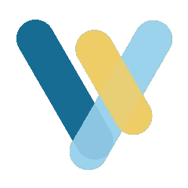
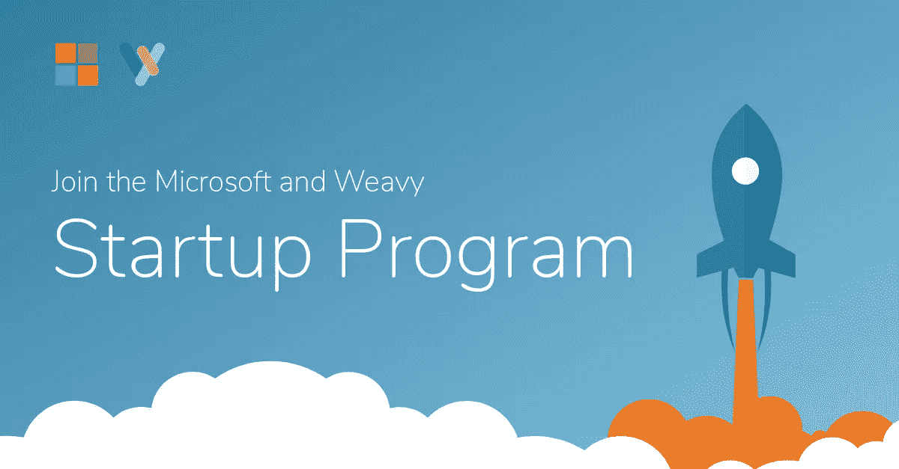

# Slack、Skype 和其他团队协作工具哪里出错了

> 原文：<https://medium.com/swlh/what-slack-skype-and-every-other-team-collaboration-tool-got-wrong-1fe8cf2275f1>

## 为什么“上下文”会成为团队协作工具之战的转折点

Photo by [rawpixel.com](https://unsplash.com/photos/kJAxZT1zRwM?utm_source=unsplash&utm_medium=referral&utm_content=creditCopyText) on [Unsplash](https://unsplash.com/?utm_source=unsplash&utm_medium=referral&utm_content=creditCopyText)

我们犯了个错误。

多年来，我们一直把人们从他们工作的地方拉出来，强迫他们在一个独立的工具上合作。

Slack、HipChat、Skype……虽然都是很棒的工具，却忘记了协作过程中的一个关键部分:**环境。**

> 协作需要发生在你工作的地方。

当你正在解决一个问题，或者试图用新的角度来使用你的应用程序时，你不需要处理上下文切换。

协作应该让你感觉像是在和一个就在你身边的人交谈，一起解决问题，即使他们在世界的另一边。

这就是目标。我们没能达到目的。直到现在。

# 首先，一个熟悉的创业故事

5 年前，我卖掉了我的第一个创业公司——一个在瑞典很受欢迎的 CMS。

出售后，我关注了一个新问题:团队协作。我想到的解决方案是[激励公司](https://www.incentive-inc.com/)，一个独立的一站式团队协作平台，被世界各地的客户使用，包括 Ping、Achieva 和一个我不能说出名字的超级秘密国际政府组织(酷吧？).

我们为帮助企业更好地合作感到自豪。但是我们无法摆脱那种熟悉的、唠叨的创业感觉。

> 是的，我们正在解决一个问题，但是我们解决的是正确的问题吗？

我们开始思考当前所有团队协作工具中缺失的部分，包括我们的。

我们开始思考**的背景。**

# 为什么上下文是团队协作工具中最重要的缺失部分

如果你是一个在 Quickbooks 中工作的会计，你应该能够在 Quickbooks 中进行协作。您不必单击“时差”来向您的团队发送消息。或者使用 Skype 与客户通话。

Quickbooks 只是一个例子，但对于设计师、开发人员、作家和任何其他使用他们选择的工具的专业人士来说也是如此。

> 为什么要把你工作的地方和协作的地方分开？

***这个*** 就是我们知道需要解决的问题。

经过几个月的集思广益和开发，我们认为我们有一个解决方案。我们称之为 [Weavy](https://www.weavy.com/) 。

**Weavy 将协作融入到我们——创始人、开发人员和其他初创企业的活跃分子——每天都在使用的工具中。**

Weavy 的建立是基于这样一种信念，即协作应该是我们构建的每个应用程序的固有特性。不是独立的产品。

你不需要重新发明轮子。你应该专注于开发未来的工具。专注于变革人力资源行业、会计领域，或者任何你正在使用你正在构建的工具的垂直领域。然后添加 Weavy，让你的工具完全协作。

自举。Node.js. PHP。它们都节省你的时间。用同样的方式思考我们。

> 只需一行代码，你就可以将协作带入你的应用。就是这样。

我们卖给你的也不是魔豆。我们很自豪地说，微软是最先看到 Weavy 好处的公司之一。

我们使用 Weavy 框架为他们构建了[Dynamics Connect](https://www.dynamicsconnect.com/)。现在，Microsoft Dynamics 365 上的任何人都可以在平台内使用我们的协作工具。不再需要点击鼠标与您的团队交流。所有的协作都发生在工作发生的地方，就在动态中。

# 用 Weavy 帮助世界各地的创业公司

我很幸运，我创办的每家公司都取得了成功。但我记得艰难时期。我记得深夜的黑客马拉松和清晨的推销。

我记得我四处奔走，寻找我能得到的任何资金，只是为了给我和我的团队购买我们成功所需的工具。我记得所有关于早期创业的事情。那些记忆每天都在驱动着我，我相信它也在驱动着你。

因此，为了纪念这个艰难的时刻，**我们正在启动一个新的创业计划，我们将向任何成立不到两年、年经常性收入不到 5 万美元、由私人持有的创业公司免费提供 Weavy 框架。没有成本。只需将头伸向**[**【Weavy.com】**](https://www.weavy.com/)**并敷上。**

(如果你超过了这个标准，你仍然可以申请，我们会选择一些更大的创业公司)。

这意味着您可以免费为您正在构建的产品添加即时消息、文件共享、文档协作、任务管理等功能。去 weavy.com/startup 填写申请表就行了。

而且要明确的是，这是白标版。我们不会在上面贴一个威威标志。您可以根据自己的意愿使用和整合。将它添加到你的平台上，然后，当你向投资者推销时，你可以向他们展示你现在拥有的额外功能。

正如我所说的，我很幸运地建立了多个成功的创业公司。我理解当你到达另一边时，回馈社会的忙碌和重要性。

下次你有机会，看看你的成功。想想你是从哪里开始的，然后想想你的公司是如何成长的。如果你能回馈创业社区，那就去做吧。我们相互支持得越多，世界从我们创造的技术中受益就越多。

快乐编码。(那是个东西吗？人们会这么说吗？)

# 哦是的。我忘了说微软是我们最大的粉丝之一，他们也想让你加入他们的项目。

Jim Brisimitzis, GM for Startups @ Microsoft

> “人们每天都向我推销他们的想法。在我的职业生涯中，我被数以千计的电梯推销击中。一些好主意。一些坏主意。接下来是一些糟糕的想法。这些才是让你念念不忘的。我迫不及待地想看到这个创业项目产生的所有好主意。”

选择申请并被该计划接受的初创公司，有机会免费使用他们的开发和测试软件，包括 Azure、Windows、Visual Studio、Office 和 SQL Server。此外，您还可以享受数百个免费培训课程和技术内容，为您的旅程提供帮助。

这是微软致力于培育创业公司的一部分。我们会推荐几个参与的创业公司给他们的团队考虑。

# 如果你喜欢这篇文章，请随意点击下面的按钮👏去帮助别人找到它！

## 这个故事发表在 [The Startup](https://medium.com/swlh) 上，这里有 256，400 多人聚集在一起阅读 Medium 关于创业的主要故事。

## 点击这里订阅我们的[时事通讯。](http://growthsupply.com/the-startup-newsletter/)