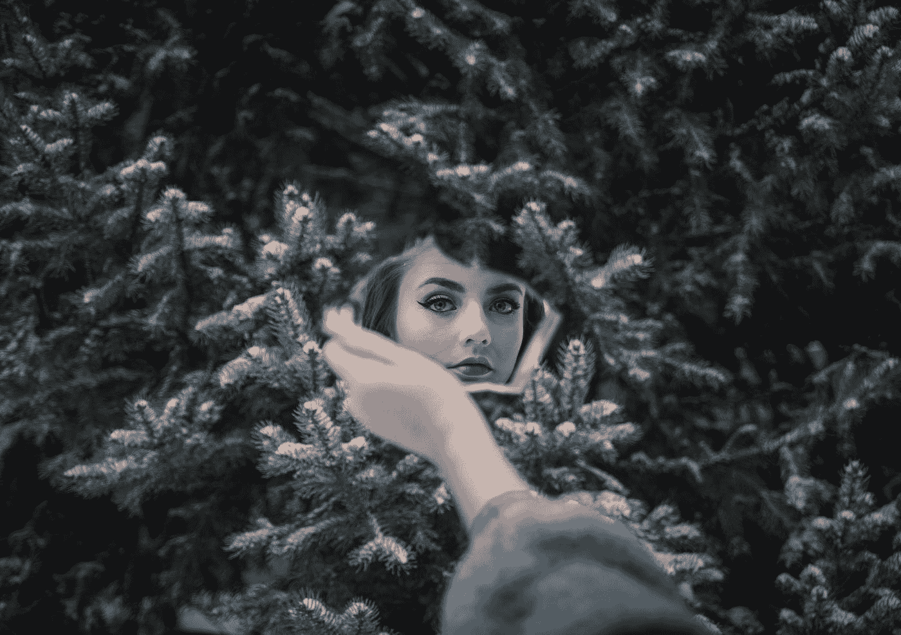

# 创业让我了解了自己

> 原文：<https://medium.com/swlh/what-starting-a-business-taught-me-about-myself-db889c4b3b8a>

Photo by [Seth Macey](https://unsplash.com/@sethmacey?utm_source=medium&utm_medium=referral) on [Unsplash](https://unsplash.com?utm_source=medium&utm_medium=referral)

就像在任何创造性的过程中，当我们朝着自己的事业努力时，我们必须面对自己。当一个人创造一些东西时，不管是什么——一首诗，一件艺术品，实际上是任何东西——他或她都必须审视自己的内心，面对所有的感觉、情感和恐惧。

我一直痴迷于自我发展和个人成长，并认为我在这方面相当成功。我已经接受了自己，学会了以自己的方式爱自己，放下判断，面对恐惧等等。我的朋友们证实了我总是看到事物光明的一面，富有创造力，乐于助人。我对自己和取得的进步感到高兴。

**直到我面对生意。**

为自己工作的愿望一直存在于我内心深处，时不时地冒出来，并以无休止的项目结束，这些项目在几周内开始并放弃。他们中的大多数人甚至不认真，我忽略了不一致的警告信号。我想让你知道，我相信一致性是成功的三大支柱之一。

 [## 成功的三大要素

### 无论你想完成什么，你都需要清楚自己的目标，以及你想如何实现…

medium.com](/@ana.shch/3-essentials-of-success-7d36da2c4226) 

有一天我丢掉了公司的工作。一方面，我松了口气，另一方面，我很害怕，但在那之后的几个星期里，我认为这是一个信号，表明我将永远不再为别人工作。我确实花了几个月的时间休息和无聊，当我最终花光了钱，我开始自由职业。

这刚好够满足我的需求，不过分，但不是绝对基本的——正好让我保持在舒适区。对我来说幸运的是，这不是我看到自己的地方，所以在大约 7 个月的舒适生活后，我决定这是成长的好时机，所以我决定把我的自由职业变成一个小生意，在线营销咨询，如果你想知道的话。

我很幸运地从别人口中获得了我的客户，而增长确实意味着让别人了解你，这就是我不得不面对恐惧的时候。

 [## 如何利用恐惧作为动力的来源

### 即使是我们中最优秀的人也会害怕

medium.com](/@ana.shch/how-to-use-fear-as-the-source-of-motivation-c1df193a4b0c) 

**从我记事起，我就害怕被评判。我会把这归咎于我内向的天性，但我认为这种恐惧远不止于此。当我决定开始我的生意时，我不想只是用钱来换取服务，我想帮助其他人，对我来说，这意味着有自己的观点。**

观点正是人们被评判的依据！我在那里，如此确信我已经超越了恐惧。显然不是，当我决定选择网站设计时，我意识到这要严重得多。

我从未想过我会被对…明亮颜色的恐惧所麻痹。好吧，不是字面上的意思，但我在那个舞台上被困了几天。多汁浓郁的颜色意味着有人会真正注意到，有人会真正注意到！就像在聚光灯下一样！发现这个类比后，我开始思考我的生活——我总是穿中性色的衣服，更喜欢清晰简单的线条等等。

应对压力……正当我以为我已经控制住了压力时，我意识到我正把自己拖进过度思考和毫无理由的自我怀疑的无底洞。嗯，几乎没有。当我应该享受旅程的时候，我想创造一些我想喜欢的东西。

当我阅读关于创业时你可能面临的问题的文章时，我真的没有看到有人提到它的情感和精神方面。我们习惯于将企业家视为某种英雄，他们“**维尼维迪宋含**”——他们来了，看到了，征服了。他们知道如何解决问题，他们知道如何实现，他们从不脆弱。

**但是他们真正的感觉是什么？**

当然，克服所有负面想法和情绪的能力是他们成功的原因，但我确信，有许多有抱负的企业家和企业主感到震惊、害怕和困惑，他们需要知道这没关系，他们可以度过难关。

就像我们所有人一样。

在这里发表我的故事是克服这种对被评判的巨大恐惧的一大步，但这需要时间。我们从经验中学习，实际上收到积极的反馈就是确认我们没有理由担心。我做到了，我强调了这一点，但没有什么不好的事情发生。我可以继续前进。

 [## 害怕，但是要做

### 对许多人来说，自我怀疑是很自然的，因为在我们的一生中，我们学会了质疑自己和我们的…

medium.com](/@ana.shch/be-scared-but-do-it-d0c9b2e9baed) 

与自己合作并发现自己是谁是一个终生的过程，如果你在某个时候觉得你已经学会了一切——相信我，还有更多需要探索。创造性的过程是许多工具中的一种，可以帮助你揭开真实的自我，面对隐藏在内心深处的东西。

## 这篇文章发表在 [The Startup](https://medium.com/swlh) 上，这是 Medium 最大的创业刊物，有+398，714 人关注。

## 在这里订阅接收[我们的头条新闻](http://growthsupply.com/the-startup-newsletter/)。

