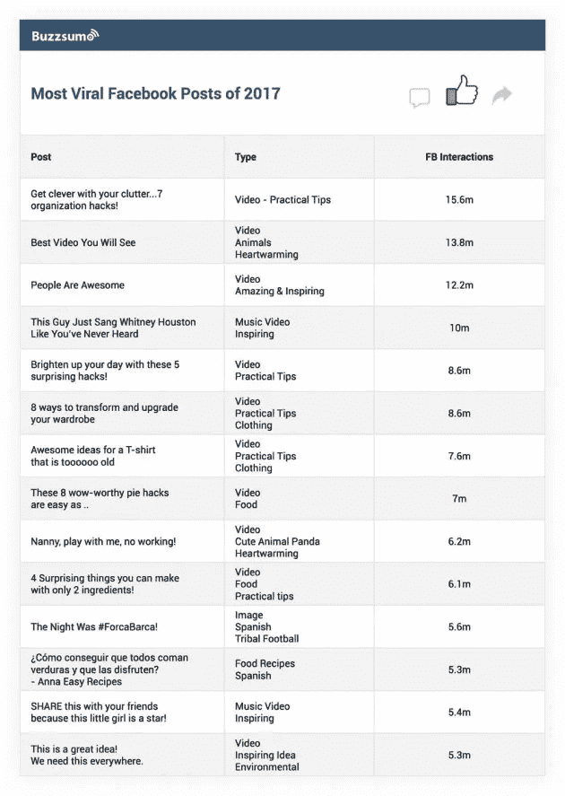

# 关于敬业度，脸书上分享最多的内容能教会你什么

> 原文：<https://medium.com/swlh/what-the-most-shared-content-on-facebook-can-teach-you-about-engagement-b7f6ad305f65>

增加你通过科学传播的几率

当出版商在脸书上发布内容时，目标是在吸引受众的同时尽可能多地吸引正面关注。但是弄清楚如何做到这一点并不总是容易的。幸运的是，最近发布的一些研究可以教你很多关于病毒式内容创作的知识，尤其是在 T2 如何使用视频的时候。

[BuzzSumo](http://buzzsumo.com/blog/the-most-shared-facebook-content-posts-videos/) 的头脑分析了 2017 年脸书上发表的 20 亿篇文章和帖子，向大众发布了他们的发现。以下是一年来热门内容的概述，以及一些可以帮助你[提高《脸书邮报》游戏](https://mobilemonkey.com/blog/2018/02/boost-facebook-video-views)的见解。

# 看看 2017 年脸书上分享最多的内容

对脸书排行榜上分享最多的内容的研究表明，用户通常会迅速传播有趣、感人或鼓舞人心的内容，即使这些文章或视频并非来自该平台。

虽然大多数海报只能梦想在音乐视频的层面上吸引观众，但数据也显示，具有强烈部落元素的内容可能非常强大。

此外，许多人使用脸书来跟踪新闻，但结果可能会有所偏差，因为多个组织通常会报道同一个故事。然而，独家或突破性的内容可以达到独角兽级别的参与度，特别是如果它与大量观众联系在一起。

自从开始在社交媒体上出现以来，小测验就一直很受欢迎，包括那些检查个性类型和特定学科知识水平的测验，但它们没有达到以前的参与水平，可能是由于饱和程度。它们也很少产生反向链接，即使它们被广泛分享，也许是因为这些帖子被视为有趣，但不一定是常青树。

旅游和探险类文章，比如那些讨论热门度假目的地的文章，也能达到史诗般的高度，这通常是因为这些内容本质上是鼓舞人心的，并且这些文章往往使用引人注目的视觉图像，可以作为日常生活的精神逃避。

感人的故事可以获得很大的吸引力，因为大多数人喜欢看到世界上美好的一面，尤其是在悲剧发生后。此外，本质上是支持性的内容，承认一个群体的困难并提供安慰，也可能会得到很多关注。

关于科学发现的研究结果或文章是另一个可以在脸书大放异彩的类别，尤其是如果有一个引人注目的标题。

另一方面，观点帖子在社交媒体上可能会很大，特别是如果它们涉及到每个人心中最重要的事情。

# 2017 年最具病毒的脸书帖子

最热门的脸书帖子上的图片真正凸显了社交媒体上视频的力量，前 20 个帖子中有 17 个采用了这种格式。

同样，音乐视频是重点，以及温暖人心和鼓舞人心的内容，包括多个可爱的动物视频。

实用的黑客技术和与食物相关的视频也经常出现在榜单上。

一些人可能会感到惊讶的一点是，前 20 个帖子中有 4 个是用西班牙语发布的，一个是用法语发布的，这表明那些可能不会说英语(无论是流利还是根本不会说英语)的人在网上是一股强大的力量。

# 这项研究能教会你什么

研究中最重要的一点是，这些帖子是离群值，许多分享内容的页面拥有大量受众。一个页面的关注者越多，就越容易将内容呈现在用户眼前，从而增加了大量分享的潜力。

然而，吸引人的内容是潜在社交媒体成功的关键，因为这是吸引人们到你的页面，带来追随者和喜欢，并产生分享的原因。

研究显示，在脸书，[的视频是巨大的](https://www.inc.com/larry-kim/this-report-will-make-you-rethink-how-you-use-face.html)，占据了绝大多数的热门帖子。这意味着，你需要开始上传视频，如果你还没有的话，特别是因为[图片和链接帖子](https://www.inc.com/larry-kim/this-is-why-facebook-engagement-is-falling-for-bra.html)的参与度一直在快速下降。

此外，脸书喜欢视频内容，包括在脸书直播上制作的内容，这增加了它出现在新闻提要中的几率。由于与脸书算法(似乎总是在变化)的斗争仍在继续，转换到一种更好的格式有助于你取得成功。

拥有一个基于视频的战略意味着你的有机覆盖范围可能会增加，你的[脸书广告](https://www.inc.com/larry-kim/my-top-10-favorite-facebook-advertising-features.html)可能会获得更多的牵引力(如果你的[有机准备已经奄奄一息](https://www.inc.com/larry-kim/4-facebook-algorithm-hacks-to-revive-your-organic-reach.html)，这将非常有帮助)，帮助你最大限度地利用你的广告资金，并与尽可能多的受众建立联系。随着受众的增长，分享你的内容会变得更容易，尤其是如果你专注于高质量的剪辑和引人入胜的内容。

视频不需要太长就能成功，因为 90 秒的短片就能成功。然而，它必须有很高的制作价值，包括引人注目的图像和高质量的声音，否则你的信息不太可能被听到，更不用说分享了。

如果你正在为视频寻找一个角度，专注于娱乐，鼓舞人心，或温暖人心，因为这些可能是最容易融入的。然而，如果实用的技巧与你的产品相匹配，不要忽视这种可能性。

# 做驴海里的独角兽

获取我的最佳独角兽营销和创业成长秘诀:

1. [**报名直接发到你邮箱**](https://mobilemonkey.com/blog-subscription)

**2。** [**通过 Facebook Messenger 注册偶尔的 Facebook Messenger 营销新闻&提示。**](http://m.me/447438332063924?ref=e58448cdd16367419b279793544e132f5388067506f92c92e6)

# **关于作者**

拉里·金是全球最好的 Facebook Messenger 营销平台提供商 MobileMonkey 的首席执行官。他也是 WordStream 的创始人。

你可以在 [Facebook Messenger](http://m.me/447438332063924?ref=e58448cdd16367419b279793544e132f5388067506f92c92e6) 、 [Twitter](https://twitter.com/larrykim) 、 [LinkedIn](https://www.linkedin.com/in/larrykim) 、 [Instagram](https://www.instagram.com/kim_larry/) 上和他联系。

最初发表于[Inc.com](https://www.inc.com/larry-kim/what-most-shared-content-on-facebook-can-teach-you-about-engagement.html)